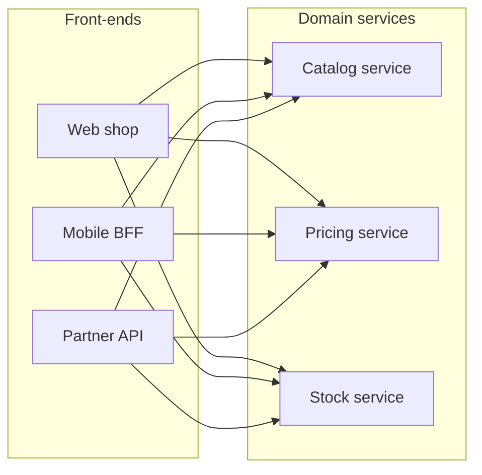

*Figure 2.4: Each front-end calls each domain service directly over HTTP/JSON (FS-1), with no API gateway between them (FS-2). Calls between domain services and calls from the Admin console are not shown.*