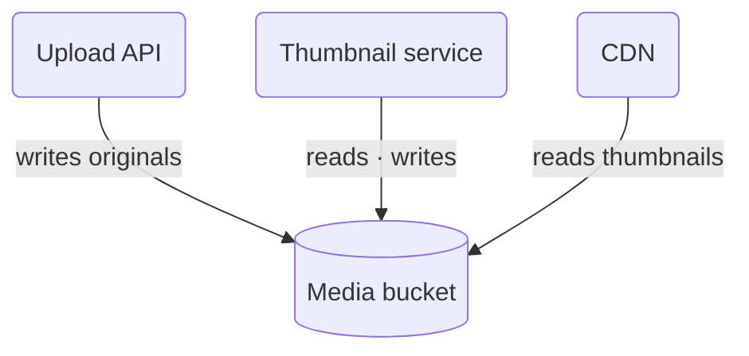

**Figure 1.** Media storage — how the Upload API, the Thumbnail service and the CDN use the Media
bucket.

```mermaid
%%{init: {"layout": "dagre", "look": "classic", "flowchart": {"nodeSpacing": 45, "rankSpacing": 55, "wrappingWidth": 400}}}%%
flowchart TB
  accTitle: Media storage
  accDescr: The Upload API writes originals to the Media bucket, the Thumbnail service reads originals and writes thumbnails, and the CDN reads thumbnails.
  UPL("Upload API") -->|"writes originals"| MB[("Media bucket")]
  THB("Thumbnail service") -->|"reads · writes"| MB
  CDN("CDN") -->|"reads thumbnails"| MB
```
