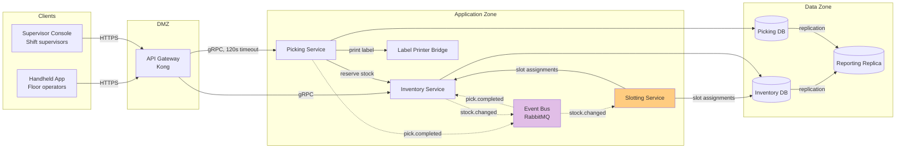

### Container diagram

```mermaid
graph LR
    subgraph Clients
        HH[Handheld App<br/>Floor operators]
        SC[Supervisor Console<br/>Shift supervisors]
    end
    subgraph DMZ
        GW[API Gateway<br/>Kong]
    end
    subgraph APP[Application Zone]
        PICK[Picking Service]
        INV[Inventory Service]
        SLOT[Slotting Service]
        LPB[Label Printer Bridge]
        BUS[Event Bus<br/>RabbitMQ]
    end
    subgraph DATA[Data Zone]
        PDB[(Picking DB)]
        IDB[(Inventory DB)]
        REP[(Reporting Replica)]
    end
    HH -->|HTTPS| GW
    SC -->|HTTPS| GW
    GW -->|gRPC, 120s timeout| PICK
    GW -->|gRPC| INV
    PICK -->|reserve stock| INV
    PICK -->|print label| LPB
    PICK -.->|pick.completed| BUS
    BUS -.->|pick.completed| INV
    INV -.->|stock.changed| BUS
    BUS -.->|stock.changed| SLOT
    SLOT -->|slot assignments| INV
    SLOT -->|slot assignments| IDB
    INV --> IDB
    PICK --> PDB
    IDB -->|replication| REP
    PDB -->|replication| REP
    classDef newService fill:#ffcc80
    classDef messaging fill:#e1bee7
    class SLOT newService
    class BUS messaging
```
