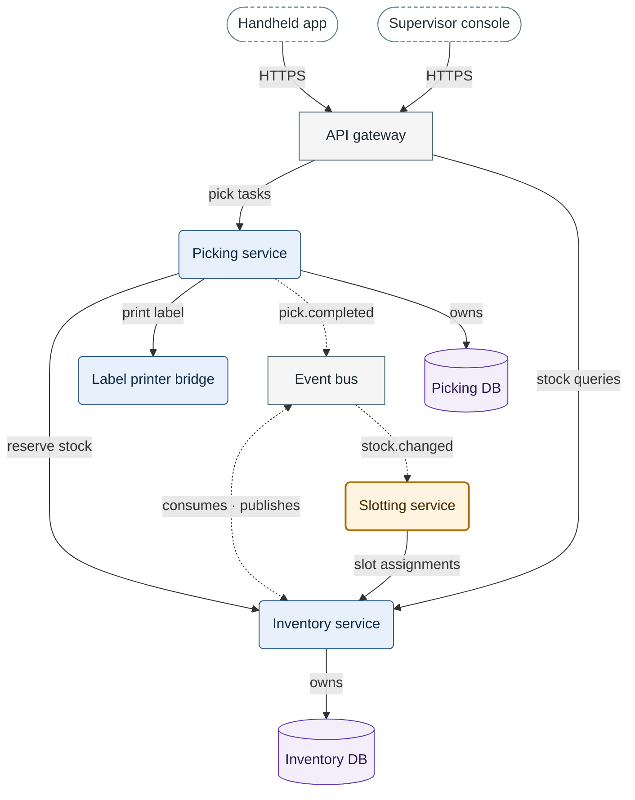

**Figure 1.** Container view — who calls whom in Larkspur WMS, which events pass through the Event
bus, and which service owns which database.

Legend:
- dashed stadium = client app
- grey rectangle = off-the-shelf product
- blue rounded box = service written by the Larkspur team
- orange rounded box with a thick border = service added by this task
- cylinder = database
- solid arrow = a call, from caller to callee; into a cylinder, the database the service owns
- dashed arrow = an event through the Event bus; two heads = the service consumes and publishes
- not drawn: the Inventory DB also streams to the Reporting replica of the data zone
