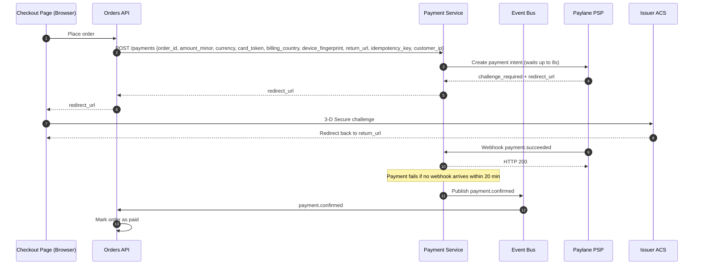

```mermaid
sequenceDiagram
    autonumber
    participant Browser as Checkout Page (Browser)
    participant Orders as Orders API
    participant Payment as Payment Service
    participant Bus as Event Bus
    participant PSP as Paylane PSP
    participant ACS as Issuer ACS

    Browser->>Orders: Place order
    Orders->>Payment: POST /payments {order_id, amount_minor, currency, card_token, billing_country, device_fingerprint, return_url, idempotency_key, customer_ip}
    Payment->>PSP: Create payment intent (waits up to 8s)
    PSP-->>Payment: challenge_required + redirect_url
    Payment-->>Orders: redirect_url
    Orders-->>Browser: redirect_url
    Browser->>ACS: 3-D Secure challenge
    ACS-->>Browser: Redirect back to return_url
    PSP->>Payment: Webhook payment.succeeded
    Payment-->>PSP: HTTP 200
    Note over Payment: Payment fails if no webhook arrives within 20 min
    Payment->>Bus: Publish payment.confirmed
    Bus->>Orders: payment.confirmed
    Orders->>Orders: Mark order as paid
```
