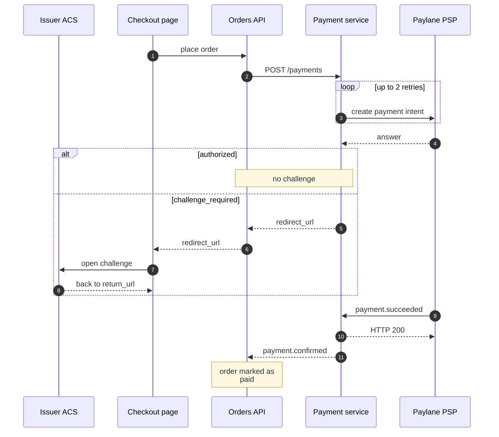

**Figure 1.** Card payment with a 3-D Secure challenge — the eleven steps of one payment in order,
with the retry of the payment intent and the authorized answer that skips the challenge.

Legend:
- solid arrow = a call; the sender waits for the answer
- dashed arrow = an answer, or a message the sender does not wait on
- number = the step of the list in §4.2.1
- `loop` and `alt` frames = the repeat and the choice that the text states
- note box = a fact of the text, on the participant it concerns
