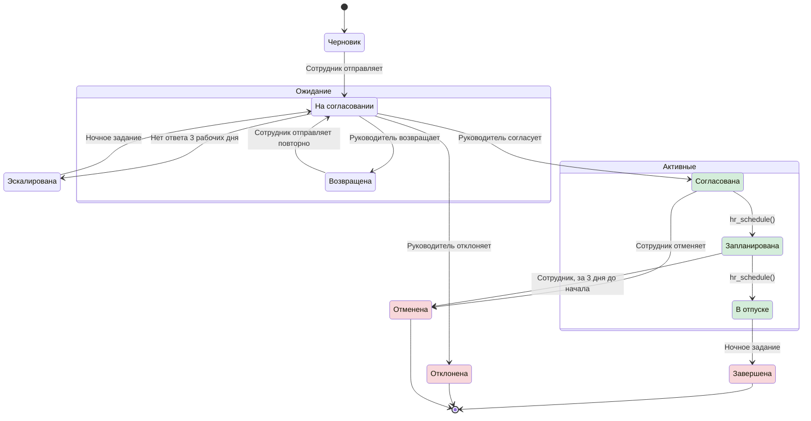

**Диаграмма состояний заявки на отпуск.** Каждый переход подписан исполнителем.

```mermaid
stateDiagram-v2
    state "Черновик" as Draft
    state "Отклонена" as Rejected
    state "Эскалирована" as Escalated
    state "Завершена" as Closed
    state "Отменена" as Cancelled
    state "Ожидание" as Waiting {
        state "На согласовании" as Pending
        state "Возвращена" as Returned
        Pending --> Returned : Руководитель возвращает
        Returned --> Pending : Сотрудник отправляет повторно
    }
    state "Активные" as Active {
        state "Согласована" as Approved
        state "Запланирована" as Scheduled
        state "В отпуске" as OnLeave
        Approved --> Scheduled : hr_schedule()
        Scheduled --> OnLeave : hr_schedule()
    }
    [*] --> Draft
    Draft --> Pending : Сотрудник отправляет
    Pending --> Rejected : Руководитель отклоняет
    Pending --> Escalated : Нет ответа 3 рабочих дня
    Escalated --> Pending : Ночное задание
    Pending --> Approved : Руководитель согласует
    OnLeave --> Closed : Ночное задание
    Approved --> Cancelled : Сотрудник отменяет
    Scheduled --> Cancelled : Сотрудник, за 3 дня до начала
    Closed --> [*]
    Rejected --> [*]
    Cancelled --> [*]
    classDef active fill:#d4edda
    classDef final fill:#f8d7da
    class Approved,Scheduled,OnLeave active
    class Closed,Rejected,Cancelled final
```
