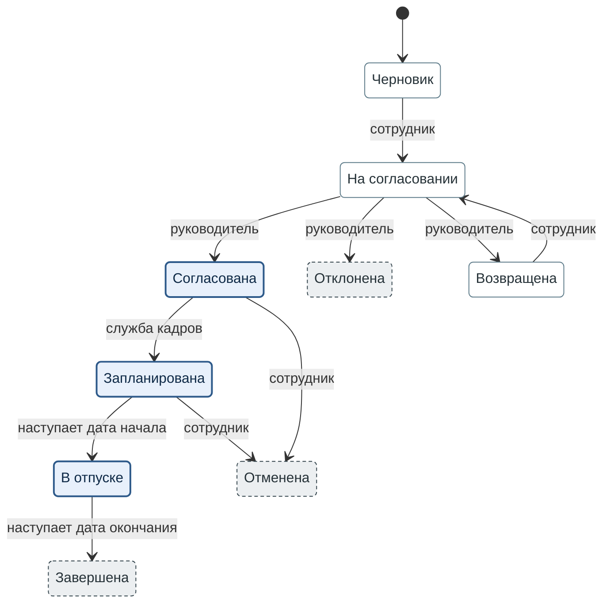

**Рисунок 1.** Жизненный цикл заявки на отпуск — девять состояний и переходы между ними; на переходе
указан исполнитель, а где текст его не называет, — условие.

Условные обозначения:
1. Закрашенный кружок — начало: заявку создаёт сотрудник.
2. Толстая синяя рамка — дни отпуска в резерве («Резерв дней» = да).
3. Тонкая серо-синяя рамка, белая заливка — дни не в резерве, состояние не итоговое.
4. Пунктирная тёмно-серая рамка — итоговое состояние: из него заявка не выходит.
5. Надпись на переходе — исполнитель; «наступает дата начала» и «наступает дата окончания» —
   условия.
