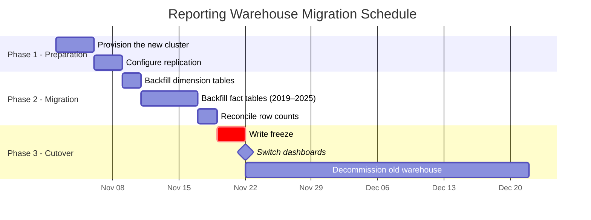

### Migration timeline

```mermaid
gantt
    title Reporting Warehouse Migration Schedule
    dateFormat YYYY-MM-DD
    axisFormat %b %d

    section Phase 1 - Preparation
    Provision the new cluster         :p1, 2026-11-02, 4d
    Configure replication             :p2, after p1, 3d

    section Phase 2 - Migration
    Backfill dimension tables         :d1, after p2, 2d
    Backfill fact tables (2019–2025)  :d2, after d1, 6d
    Reconcile row counts              :q1, after d2, 2d

    section Phase 3 - Cutover
    Write freeze                      :crit, r1, after q1, 3d
    Switch dashboards                 :milestone, r2, after r1, 0d
    Decommission old warehouse        :dec, after r2, 30d
```
