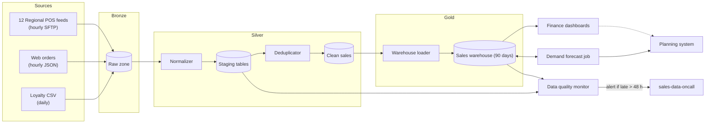

### 5.1 Data flow

The diagram below shows how sales data flows through the Bronze, Silver and Gold layers of the pipeline.

```mermaid
flowchart LR
    subgraph Sources
        POS["12 Regional POS feeds<br/>(hourly SFTP)"]
        WEB["Web orders<br/>(hourly JSON)"]
        LOY["Loyalty CSV<br/>(daily)"]
    end
    subgraph Bronze
        RAW@{ shape: cyl, label: "Raw zone" }
    end
    subgraph Silver
        NORM[Normalizer]
        STG@{ shape: cyl, label: "Staging tables" }
        DEDUP[Deduplicator]
        CLEAN@{ shape: cyl, label: "Clean sales" }
    end
    subgraph Gold
        LOADER[Warehouse loader]
        WH@{ shape: cyl, label: "Sales warehouse (90 days)" }
    end
    POS --> RAW
    WEB --> RAW
    LOY --> RAW
    RAW --> NORM --> STG --> DEDUP --> CLEAN --> LOADER --> WH
    WH --> DASH[Finance dashboards]
    WH <--> FC[Demand forecast job]
    FC --> PLAN[Planning system]
    DASH -.-> PLAN
    STG --> DQ[Data quality monitor]
    WH --> DQ
    DQ -->|"alert if late > 48 h"| ONCALL["sales-data-oncall"]
```
