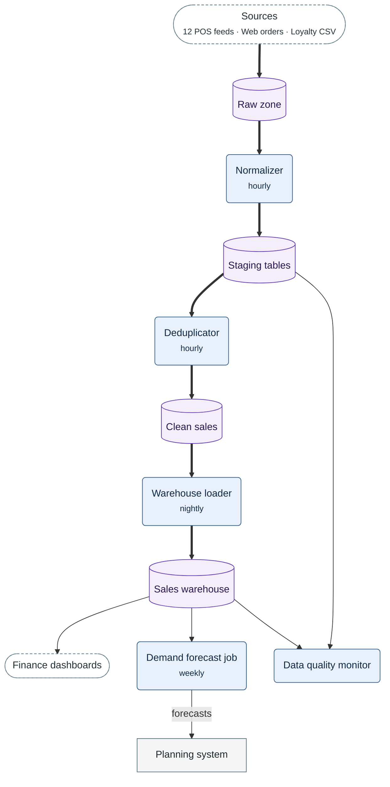

**Figure 1.** Sales data flow — how sales records move from the three sources to the dashboards, the forecast and the quality monitor.

- Thick arrow: the path of a sales record from its source into the warehouse.
- Thin arrow: other data that moves, the way it moves.
- Dashed stadium: a source or a reader outside the pipeline.
- Rounded box: a job of the pipeline.
- Cylinder: a store of sales records.
- Rectangle: an external system.
- Not drawn: the alert of the monitor to `#sales-data-oncall`.
