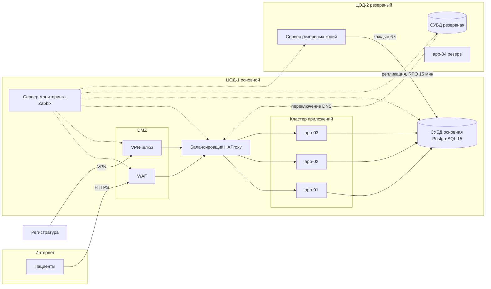

### Схема развёртывания

```mermaid
flowchart LR
    subgraph Internet[Интернет]
        Patients[Пациенты]
    end
    Registry[Регистратура]
    subgraph DC1[ЦОД-1 основной]
        subgraph DMZ
            WAF
            VPN[VPN-шлюз]
        end
        LB[Балансировщик HAProxy]
        subgraph AppCluster[Кластер приложений]
            App1[app-01]
            App2[app-02]
            App3[app-03]
        end
        DB1[(СУБД основная PostgreSQL 15)]
        Mon[Сервер мониторинга Zabbix]
    end
    subgraph DC2[ЦОД-2 резервный]
        DB2[(СУБД резервная)]
        Backup[Сервер резервных копий]
        App4[app-04 резерв]
    end
    Patients -->|HTTPS| WAF
    Registry -->|VPN| VPN
    WAF --> LB
    VPN --> LB
    LB --> App1
    LB --> App2
    LB --> App3
    App1 --> DB1
    App2 --> DB1
    App3 --> DB1
    DC1 -->|репликация, RPO 15 мин| DC2
    Backup -->|каждые 6 ч| DB1
    Mon -.-> WAF
    Mon -.-> VPN
    Mon -.-> LB
    Mon -.-> DB1
    Mon -.-> DB2
    Mon -.-> Backup
    DB2 -.->|переключение DNS| LB
```
