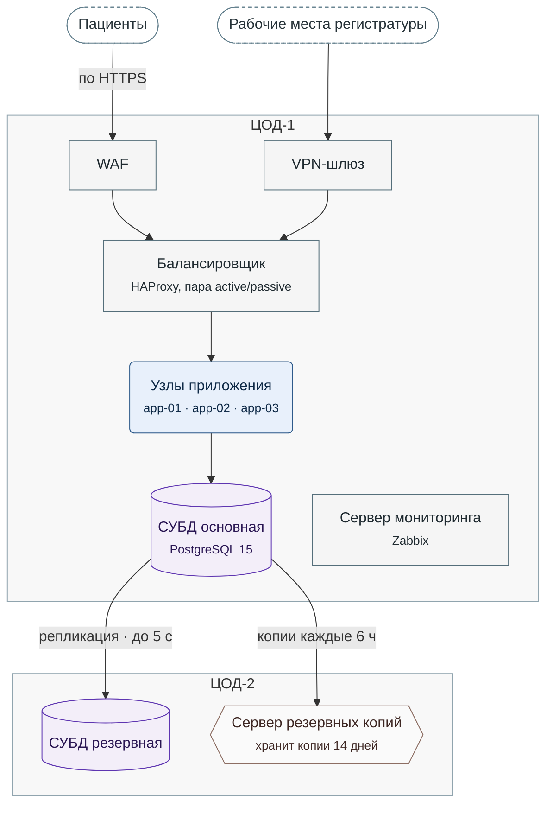

**Рисунок 1.** Развёртывание МедЗаписи — узлы основного ЦОД-1 и резервного ЦОД-2, запросы и потоки данных между ними.

- Пунктирный стадион: пользователи вне системы.
- Прямоугольник: сетевой узел или служебный сервер.
- Скруглённый прямоугольник: узлы приложения.
- Цилиндр: СУБД.
- Шестиугольник: сервер, который снимает копии по расписанию.
- Серая рамка: ЦОД; ЦОД-1 основной, ЦОД-2 резервный.
- Стрелка: запрос или данные, от отправителя к получателю.
- Не нарисованы: опрос всех узлов сервером мониторинга и переключение при отказе ЦОД-1.
