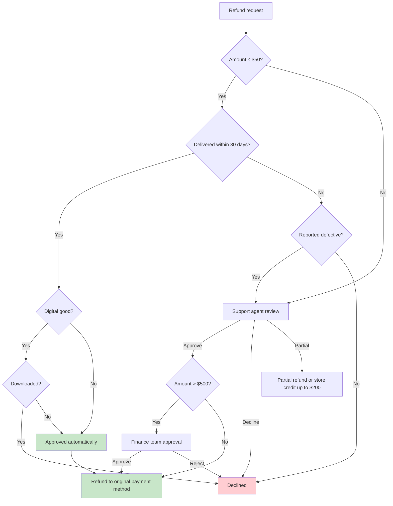

### Refund decision flow

```mermaid
flowchart TD
    A[Refund request] --> B{Amount ≤ $50?}
    B -->|Yes| C{Delivered within 30 days?}
    C -->|Yes| D{Digital good?}
    D -->|Yes| E{Downloaded?}
    E -->|Yes| X[Declined]
    E -->|No| Y[Approved automatically]
    D -->|No| Y
    C -->|No| F{Reported defective?}
    F -->|Yes| G[Support agent review]
    F -->|No| X
    B -->|No| G
    G -->|Approve| H{Amount > $500?}
    G -->|Decline| X
    G -->|Partial| P[Partial refund or store credit up to $200]
    H -->|Yes| I[Finance team approval]
    H -->|No| Z[Refund to original payment method]
    I -->|Approve| Z
    I -->|Reject| X
    Y --> Z
    classDef approve fill:#c8e6c9
    classDef decline fill:#ffcdd2
    class Y,Z approve
    class X decline
```
