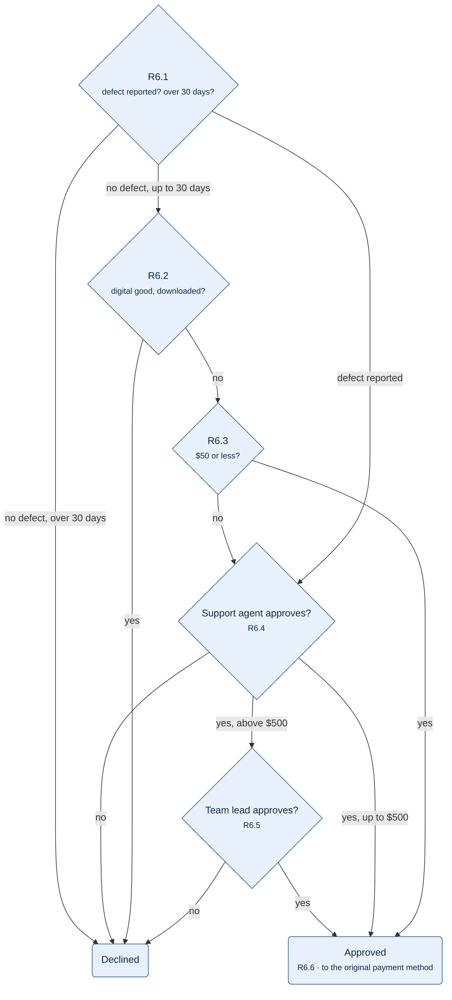

**Figure 1.** Refund decision — how R6.1 to R6.6 approve or decline a refund request.

- Diamond: a check, top to bottom in the order R6.1, R6.2, R6.3; the last two are decisions of a person.
- Rounded box: an outcome.
- Arrow label: the answer that leads to the next box.
