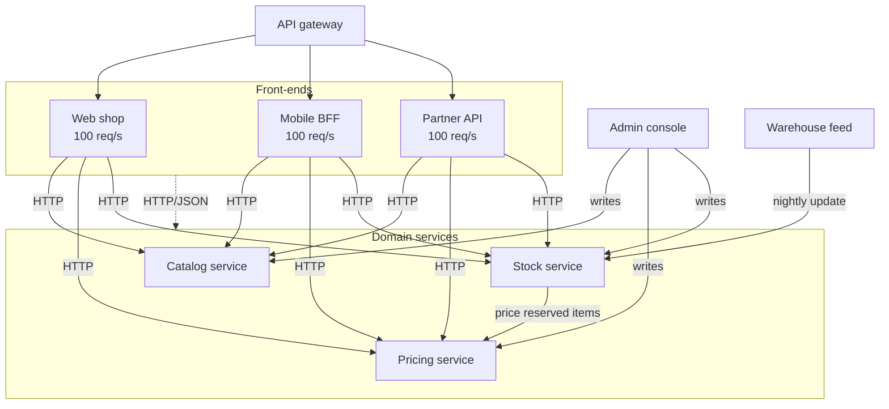

```mermaid
flowchart TB
    GW["API gateway"]
    subgraph FE["Front-ends"]
        WEB["Web shop<br/>100 req/s"]
        BFF["Mobile BFF<br/>100 req/s"]
        PAPI["Partner API<br/>100 req/s"]
    end
    subgraph DS["Domain services"]
        CAT["Catalog service"]
        PRI["Pricing service"]
        STK["Stock service"]
    end
    ADM["Admin console"]
    WF["Warehouse feed"]
    GW --> WEB
    GW --> BFF
    GW --> PAPI
    WEB -->|HTTP| CAT
    WEB -->|HTTP| PRI
    WEB -->|HTTP| STK
    BFF -->|HTTP| CAT
    BFF -->|HTTP| PRI
    BFF -->|HTTP| STK
    PAPI -->|HTTP| CAT
    PAPI -->|HTTP| PRI
    PAPI -->|HTTP| STK
    ADM -->|writes| CAT
    ADM -->|writes| PRI
    ADM -->|writes| STK
    STK -->|price reserved items| PRI
    WF -->|nightly update| STK
    FE -.->|"HTTP/JSON"| DS
```
