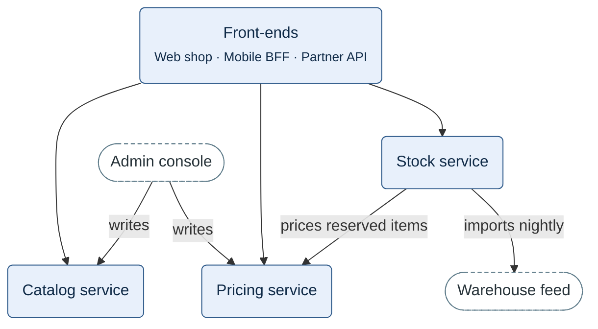

**Figure 1.** Front-ends and domain services — who calls which domain service.

- Blue rounded box: a front-end or a domain service. The Front-ends box stands for Web shop,
  Mobile BFF and Partner API.
- White stadium with a dashed outline: Admin console and Warehouse feed, which are neither
  front-ends nor domain services.
- Arrow: from caller to callee. An unlabelled arrow is a call over HTTP/JSON; an arrow from
  Front-ends is that call from each of the three front-ends.
