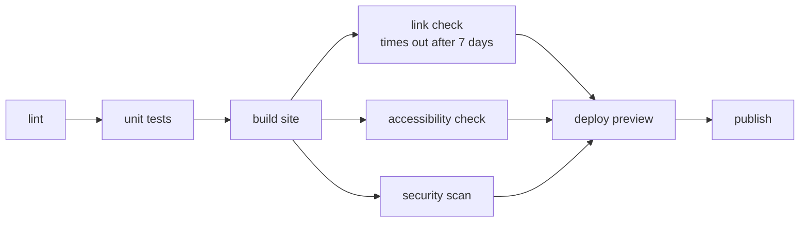

Here is how the pipeline stages connect:

```mermaid
flowchart LR
    A[lint] --> B[unit tests]
    B --> C[build site]
    C --> D[link check<br/>times out after 7 days]
    C --> E[accessibility check]
    C --> F[security scan]
    D --> G[deploy preview]
    E --> G
    F --> G
    G --> H[publish]
```
