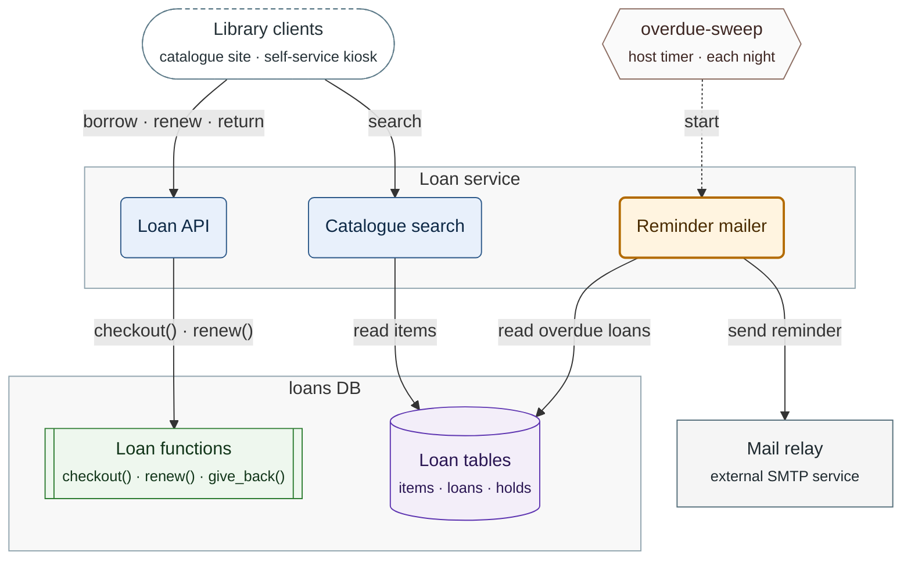
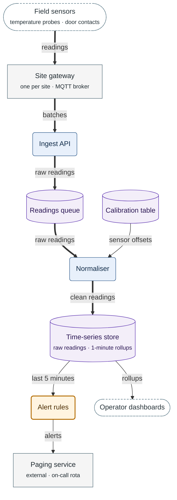
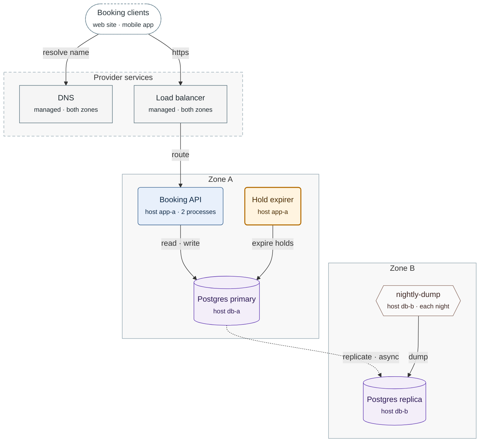
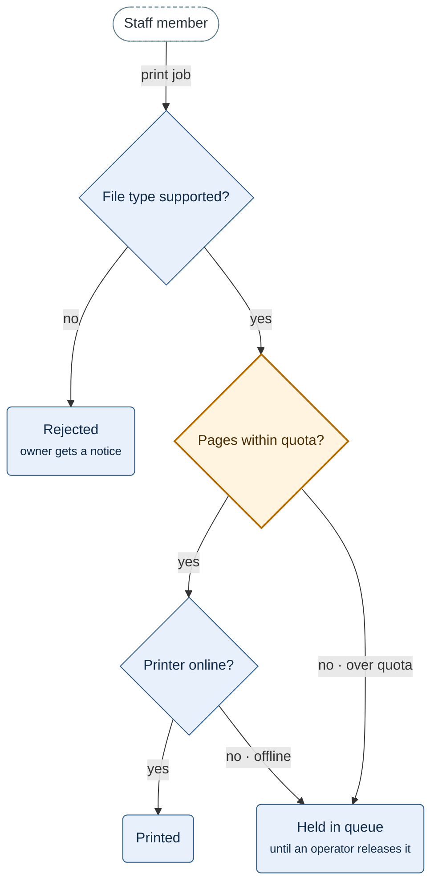

# Flowchart reference

Notation, settings, subgraph rules and four render-checked templates for `flowchart` figures. The
routing table of `SKILL.md` loads this file together with `layout-and-planarity.md` and
`paired-examples.md`. Every limit, setting and style quoted here is copied from
`assets/notation.json`, and a test compares the two. Ratios and widths are measurements of
2026-10-02.

## 1. Notation

Each element type keeps one shape and one class in every figure of a document.

| Element | Shape | Mermaid | Class |
| :--- | :--- | :--- | :--- |
| Client or external actor | stadium | `id(["Name"])` | `ext` |
| Service or workflow the project owns | rounded | `id("Name")` | `wf` |
| The same, added or changed by the current task | rounded, 2 px border | `id("Name")` | `wfNew` |
| Database function | subroutine | `id[["schema.fn()"]]` | `fn` |
| Table, view or queue | cylinder | `id[("schema.table")]` | `db` |
| Sidecar or external service | rectangle | `id["Name"]` | `svc` |
| Host script or timer | hexagon | `id{{"Name"}}` | `infra` |
| Check in a decision flow | diamond | `id{"Question?"}` | `wf`, or `wfNew` for a new check |
| Outcome in a decision flow | rounded | `id("Outcome")` | `wf` |

The styles below are `palette.flowchart`, copied. Each becomes a line `classDef <class> <style>` at
the end of the fence. A figure defines only the classes it applies.

| Class | Style | Text on fill |
| :--- | :--- | :--- |
| `ext` | `fill:#FFFFFF,stroke:#607D8B,color:#263238,stroke-dasharray:4 3` | 13.16:1 |
| `wf` | `fill:#E8F0FB,stroke:#2E5A8A,color:#0F2A47` | 12.68:1 |
| `wfNew` | `fill:#FFF4E0,stroke:#B36B00,color:#4A2C00,stroke-width:2px` | 11.67:1 |
| `fn` | `fill:#EEF7EE,stroke:#2E7D32,color:#12361A` | 12.23:1 |
| `db` | `fill:#F3EEF9,stroke:#5E35B1,color:#2A1653` | 13.76:1 |
| `svc` | `fill:#F5F5F5,stroke:#546E7A,color:#1F2A30` | 13.45:1 |
| `infra` | `fill:#FAFAFA,stroke:#8D6E63,color:#3E2723` | 13.24:1 |

Node ids:

- An id holds letters and digits only: `[A-Za-z0-9]+`.
- `end` is not an id. It is a parse error in 10.9.8 and 11.17.2.

**Why.** Mermaid 12.1 builds an edge id from the two node ids and `_`. The edges `a --> b_c` and
`a_b --> c` then share one id, and the render stops with an error.

## 2. Edges

| Arrow | Meaning | Limit |
| :--- | :--- | :--- |
| `-->` | a call or a write, from caller to callee | the default edge |
| `-.->` | a start, a nudge or a stream the sender does not wait for | — |
| `==>` | the main path | one chain per figure at most |
| `<-.->` | a start and its reply, drawn as one edge | replaces two opposite edges |
| `~~~` | invisible spacing | layout only; it states no relation |

1. A label sits between pipes. It takes quotes when it holds punctuation: `A -->|"read · write"| B`.
2. Never write `A -- text --> B` or `A -. text .-> B`. A `.` or `--` inside that text is a parse
   error in both versions.
3. One edge joins a pair of nodes. Parallel relations share one label: `"claim · finish"`.
4. An arrow means one thing per figure, and the legend states it:
   - a call, in a container or deployment view;
   - data movement, in a data flow;
   - the next step, in a decision flow.
5. `==>` is 3.5 px wide in both versions. A plain edge is 1 px wide in 11.17.2 and 2 px in
   10.9.8, so the main path stands out less in 10.9.8.
6. An invisible link still constrains the layout. Use it to separate two nodes, never to state a
   relation, and mark it with a `%% layout only` comment.
7. No `linkStyle`. Under `linkStyle default`, 10.9.8 skips dotted and thick edges and keeps
   arrowheads black, while 12.1.0 styles every edge.

## 3. Settings line

The first line of every flowchart fence is `settings.flowchart` of `notation.json`, copied rather
than retyped. The four templates of §5 start with it.

| Key | Value | Effect |
| :--- | :--- | :--- |
| `layout` | `"dagre"` | 12.x lays out with ELK by default; GitHub registers no ELK and draws with dagre |
| `look` | `"classic"` | 12.x draws the `neo` look by default, with drop shadows and gradient borders |
| `nodeSpacing`, `rankSpacing` | `45`, `55` | dagre spacing in px; ELK ignores both keys |
| `wrappingWidth` | `400` | 11.x wraps a plain label at 200 px and 12.x at 120 px; at 400 both follow ` ` |
| `theme` | absent | the viewer's theme applies |
| font | absent | the viewer's font applies |

- 10.9.8 has no `layout` and no `look` key. Its directive parser drops both without an error.
- 10.9.8 never wraps a plain label. A 32-character first line over a 40-character second line of
  plain words measured 241 px in both versions, so ` ` sets every line break.
- A malformed line, such as one with a trailing comma, is ignored without an error. The figure
  then falls back to the defaults of each version.

**Why no theme.** GitHub passes `theme: dark` on its dark page and `default` on its light page. A
theme set in the fence overrides it, and light-theme text then lands on `#0d1117`.

**Why no font.** The directive sanitizer blanks a theme value that holds `-`, `_`, `:` or `/`, so
`sans-serif` disappears. A top-level `fontFamily` makes 10.9.8 drop every other theme variable.

## 4. Subgraphs

1. A subgraph encloses a category the text names: a system, a tier, a zone or a host.
2. It holds two or more nodes. The role of a single node goes on its second line instead.
3. Its title is the category name without qualifiers: `Loan service`, not
   `Loan service · app tier · v2`.
4. A boundary takes `style <id> fill:#7F7F7F0D,stroke:#90A4AE` (`palette.cluster`). It sets no
   `color`, so the title takes the theme's text colour, which is light on a dark page.
5. A cross-cutting band takes `style <id> fill:#7F7F7F0D,stroke:#90A4AE,stroke-dasharray:6 4`
   (`palette.cluster_band`). A band groups members that serve several other groups, such as
   provider services used by both zones. The legend names the dashed border.
6. No edge starts or ends at a subgraph id, so no edge joins two boxes. Draw the node-to-node edges
   the text states, and put a sentence such as "every service reaches the store" in the legend.
7. No edge from outside enters the node under the title's centre. Use these levers in order, and
   re-render after each:
   - give the box's top row two nodes, so the centre falls between them;
   - change the order of the edge lines, or of the node declarations, that place the top row. An
     order change moves a node in some figures and not in others (`layout-and-planarity.md` §4.1);
   - shorten the title. A short title clears the edge only in the font of the render.
8. No `direction` inside a subgraph. A title that holds `direction` followed by `TB`, `TD`, `BT`,
   `LR` or `RL` is a parse error.
9. No `classDef default`. In 10.9.8 a subgraph carries that class, and its rules override
   `style <id>`.

**Why.** The title sits centred at the top of the box. An edge into the node below the centre
crosses the title text in 10.9.8 and in 11.17.2. Mermaid draws an edge to a subgraph id from the
box border, and the reader takes it for a relation of the member nearest its end. A `direction`
inside a subgraph is ignored once a member links outside it.

## 5. Templates

Each template was rendered on 2026-10-02 in 11.17.2, 10.9.8 and a dark 11.17.2, and measured:

| Figure | Width, 11.17.2 / 10.9.8 | Crossings | Edges through nodes or titles | Effective font |
| :--- | :--- | :--- | :--- | :--- |
| 1 Container view | 810 / 757 px | 0 | 0 | 16 / 16 px |
| 2 Data flow | 406 / 400 px | 0 | 0 | 16 / 16 px |
| 3 Deployment view | 997 / 908 px | 0 | 0 | 14.4 / 15.9 px |
| 4 Decision flow | 498 / 465 px | 0 | 0 | 16 / 16 px |

- Effective font = font size × min(1, 900 / width), for a 900 px column (`column_px`). The floor
  is 10 px (`min_effective_font_px`).
- The dark render gave the same geometry. A forward render in 12.1.0 passed as well.

To reuse a template, keep its settings line. Copy the `classDef` lines of §1 for the classes the
new figure applies, and the `style` lines of §4. Replace names, nodes and edges with the facts of
the text (SKILL.md Step 2). Keep the caption directly above the fence and the legend directly
below it.

### 5.1 Container view

- `flowchart TB`. Callers sit on top: clients and host timers. Services the project owns sit in the
  middle. Data and external services sit at the bottom.
- A group of like members is one node: the group name on the first line, the members on the
  `<small>` line.
- A boundary that an outside edge enters has two or more nodes in its top row.

**Figure 1.** Loan system containers — who calls whom, from the clients down to the stores.

Legend:
- dashed stadium = clients; hexagon = host timer
- rounded box = part of the loan service; orange with a thick border = added by this task
- subroutine box = database functions; cylinder = tables; rectangle = external service
- solid arrow = a call or a write; dashed arrow = a start without waiting
- grey box = system boundary
- not drawn: the log writes of each service to the host journal

### 5.2 Data flow

- Arrows point the way data moves. Labels name the data, not the operation.
- `==>` marks the main path of one record, from its source to its store.
- A queue or a table between two stages is a cylinder node, never an edge label.

**Figure 2.** Telemetry data flow — where a reading goes, and what reads the store.

Legend:
- every arrow points the way the data moves
- thick arrow = the main path of a reading; thin arrow = other data
- dashed stadium = source or reader outside the pipeline; rectangle = external service
- rounded box = pipeline stage; orange with a thick border = added by this task
- cylinder = queue or table

### 5.3 Deployment view

- A zone or a host is a subgraph. A host inside a zone goes on the node's second line, so no box
  holds a single node.
- Replication is one dashed edge from the database node that sends to the node that receives. It
  never joins two boxes.
- Services that span the zones sit in a band.

**Figure 3.** Booking deployment — the zones, the shared provider services and the database
replication.

Legend:
- solid grey box = zone; dashed grey box = provider services that both zones use
- rectangle = managed service; rounded box = booking process; orange with a thick border = added
  by this task
- cylinder = database; hexagon = host script; dashed stadium = clients
- solid arrow = a call or a write; dashed arrow = asynchronous replication; each from sender to
  receiver

### 5.4 Decision flow

- Checks run top to bottom in the order the text states them. No check moves to shorten an edge.
- Each outcome is one node. Every branch that ends the same way points at that node.
- A branch label is `yes`, `no` or a short condition such as `no · over quota`. The edge limit of
  §6 applies.
- A procedure over the soft budget of SKILL.md Step 3 splits, or becomes a table of check,
  condition and outcome.

**Figure 4.** Print job admission — the three checks in the order the server runs them, and the
three outcomes.

Legend:
- diamond = a check, top to bottom in the order the server runs them; orange with a thick border =
  added by this task
- rounded box = an outcome; dashed stadium = the person who submits the job
- arrow label = the answer that leads to the next box

## 6. Labels

| Label | Limit, `notation.json` `labels` | Writing guidance |
| :--- | :--- | :--- |
| Node, first line | 32 characters, `node_line1_chars_max` | about 4 words; the name as the text writes it |
| Node, `<small>` second line | 40 characters, `node_second_line_chars_max` | members, role or host, joined by `·` |
| Edge | 24 characters, `edge_label_chars_max` | about 3 words, lowercase in cased scripts |

- The lint counts characters per line, so the limits hold in any script.
- A node label holds at most 2 lines (`node_label_lines_max`): the name and one `<small>` line. An
  edge label holds one line. The lint allows two (`edge_label_lines_max`) for the two writers of
  a state transition (`state.md` §4).
- A line breaks at ` ` only. 10.9.8 never wraps a `<small>` line, so its length sets the width
  of the node.
- Quote every node label and edge label that holds punctuation: any character other than a letter,
  a digit or a space. The templates quote every label.
- Unquoted `( )`, `[ ]`, a leading `/` or a `"` is a parse error in both versions.
- Five characters are written as entity codes:

| Character | Entity | Without the entity |
| :--- | :--- | :--- |
| `"` | `#quot;` | a parse error in both versions; a quoted last word, `"say "renew""`, loses its quotes with no error |
| `#` | `#35;` | `#1;` reads as a character code: `"step #1; done"` renders as `step  done` |
| `;` | `#59;` | the same code reading; a raw `;` ends a sequence message with a parse error |
| `<` | `#lt;` | `"List<T>"` renders as `List`: `<T>` reads as an HTML tag |
| `>` | `#gt;` | the same tag reading |

**Why.** A raw `#` or `;` renders in a flowchart label unless the two form a code such as `#1;`.
One rule for every figure kind keeps a label valid when it moves into a sequence or state figure.

## 7. Categories and contrast

1. Colour never carries a category alone. Each class differs from every other class by shape or by
   stroke style. `wf` and `wfNew` share the rounded shape and differ by a 2 px border; every other
   class has its own shape.
2. The legend names every shape, border and arrow type the figure uses.
3. Text on each class fill measures 11.67:1 to 13.76:1 (WCAG 2.2 relative luminance). The floor is
   4.5:1 (`contrast_min`). §1 lists the ratio per class.
4. In the dark render, class fills stay light and their text stays dark. Edges, edge labels and
   titles take the dark theme's colours. All four templates of §5 are legible there.
5. On `#0d1117` the strokes of `wf` (2.65:1) and `db` (2.36:1) fall below the 3:1 of WCAG 1.4.11.
   Each class fill measures 16.48:1 or more against that page, so every node outline stays visible.
6. The dark render shows the `ext` dashes as a thin line beside a white fill. The stadium shape
   carries `ext` there.
7. No emoji marks a category, and no colour appears without a legend item.

## 8. Checklist

- [ ] The first line is `settings.flowchart`, copied; the fence sets no `theme` and no font.
- [ ] `flowchart TB` when the figure holds more than 6 nodes (`structure.lr_max_nodes`).
- [ ] Each class comes from `palette.flowchart`; unused classes are left out.
- [ ] Each category differs by shape or stroke style, and the legend names it.
- [ ] Ids are letters and digits; a label with punctuation is quoted; `"`, `#`, `;`, `<` and `>`
  are entities.
- [ ] Label lines stay within 32, 40 and 24 characters.
- [ ] One edge per node pair; no edge to a subgraph id; no single-node subgraph.
- [ ] No outside edge enters the node under a title's centre.
- [ ] At most one `==>` chain; `~~~` only for spacing.
- [ ] Caption directly above the fence; `accTitle` and `accDescr` inside.
- [ ] Legend directly below the fence when the figure uses two or more encodings.
- [ ] Lint: 0 `error`. Render check: exit 0, or `not rendered: <reason>` in the hand-off.
