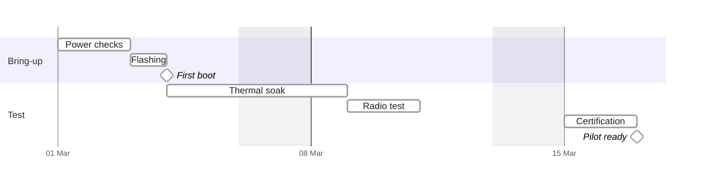

# Gantt: the plan chart and the calendar schedule

A `gantt` figure takes one of two forms. The text decides which.

| The text states | Form | Written by |
| :--- | :--- | :--- |
| tasks with hour estimates and dependencies, no dates | plan chart, §1 | `scripts/plan_gantt.py` |
| a plan of fewer than 8 such tasks | no plan chart: the task list carries the order | — |
| a start date with durations in days, or dates | calendar schedule, §2 | the author, by §2 |

Both forms open with the `gantt` settings line of `assets/notation.json`. §3 covers colour and the
dark page, §4 width, §5 the examples and §6 the checklist.

## 1. The plan chart

### 1.1 When a plan gets one

- The planner writes the schedule block of §1.3 in every plan.
- A plan of 8 or more tasks also gets the generated chart.
- A plan of fewer tasks gets no chart. `--write` leaves the region between the markers empty, and
  `--check` passes on that empty region.
- A plan over the hard budget of 60 bars gets one chart per stage group (§1.6).

**Why.** Under 8 tasks, a reader finds the critical path in the task list.

### 1.2 Encoding

The chart is an early-start schedule without a calendar. A bar starts when the last of its
dependencies ends and lasts its estimate. `plan_gantt.py` computes every start, so the fence holds
no `after`.

| Element | Encoding | Reason |
| :--- | :--- | :--- |
| time | 1 estimate hour = 1 ms: `dateFormat x`, durations `Nms` | estimates are whole hours; the chart has no dates |
| bar start | the early start in hours, written as a number | `after` drops a dependency declared below (G1) |
| axis | `axisFormat %Q`: hours from the plan's start | `%L` restarts at 1000 (G5) |
| today line | `todayMarker off` | the default line moves with the render date (C5) |
| section | one contiguous section per stage | a repeated section labels the rows of another (G6) |
| status | `done` for done, `active` for in progress, no tag otherwise | the settings line colours these three fills |
| critical path | `crit` on the tasks the script computes | the red border keeps the status fill visible (G8) |
| label | the task id and title, sanitized by the script | a colon cuts the label and the task id (G3) |

The critical path is the longest chain of dependent estimates. Its length equals the span of the
whole plan. The schedule assumes unlimited parallel work.

**Why.** Bar positions come from estimates and dependencies only. A caption that names a date or a
delivery time states what the chart does not show.

### 1.3 Input: the schedule block

`plan_gantt.py` reads one of two inputs:

- a JSON file of schema `plan-schedule/v1`;
- a Markdown plan with exactly one fenced JSON block after the anchor `<!-- contract:schedule -->`.

Both inputs take the same fields.

| Field | Value | Rule |
| :--- | :--- | :--- |
| `id` | string | unique in the plan; the id rules follow the table |
| `title` | string | `<id> <title>` is the bar label, at most 32 characters in all |
| `stage` | string | the section title; a long one wraps (below the table) |
| `est` | integer | the estimate in hours, at least 1 |
| `deps` | list of ids | each id names a task of the plan |
| `status` | `done`, `in-progress` or `not-started` | optional; a task without it has not started |

An `id` matches `^[A-Za-z0-9][A-Za-z0-9._-]*$`. It is not a gantt keyword such as `section`, and
it does not start with `gantt`, `topAxis` or `inclusiveEndDates` followed by `.` or `-`. Keywords
match in any letter case. An id does not start with a date of the form `YYYY-MM-DD`. Two ids
collide when they are equal with each `.`, `-` and `_` read as `x`, such as `1.1`, `1-1` and
`1x1`.

The script wraps a stage name into at most 2 lines of 32 characters and widens the left padding
to fit, up to 300 px. A longer name is shortened, with a warning.

A longer bar label is shortened, with a warning. The id stays whole. A label whose id leaves no
room shows no title, and the warning says to shorten the id.

A schedule block in a plan:

````markdown
<!-- contract:schedule -->

```json
{"schema": "plan-schedule/v1", "tasks": [
  {"id": "S1", "title": "Hold record schema", "stage": "Service", "est": 3, "deps": []},
  {"id": "S2", "title": "Loan service stubs", "stage": "Service", "est": 2, "deps": []},
  {"id": "S3", "title": "Hold queue logic", "stage": "Service", "est": 4, "deps": ["S1", "S2"]}
]}
```
````

- The framework's plan template writes `"status": "not-started"` for every task, and the develop
  workflows set `in-progress` and `done` (`skill-planning-format` §2.2). Its chart draws done and
  active bars from them and marks the critical path.
- The script never reads the plan's prose. A translated plan with the same block yields the same
  chart.
- An invalid plan exits 1, and the message names the defect. Examples:
  - a cycle, an unknown dependency or a duplicate id;
  - an id that the rules above refuse;
  - an estimate that is not a whole number of at least 1;
  - an unknown status;
  - a title or stage with no visible character once `#`, control and zero-width characters are
    dropped;
  - two stages with one section title;
  - no schedule block.

**Why.** Headings and field labels are prose that projects translate. A parser keyed on them fails
on the first translated plan.

### 1.4 Commands

Run the commands from the project root.

```bash
python3 .agent/skills/mermaid-authoring-guidelines/scripts/plan_gantt.py docs/PLAN.md --write docs/PLAN.md
python3 .agent/skills/mermaid-authoring-guidelines/scripts/plan_gantt.py docs/PLAN.md --check docs/PLAN.md
python3 .agent/skills/mermaid-authoring-guidelines/scripts/plan_gantt.py docs/PLAN.md --stages Service,Web --stages Ops --write docs/PLAN.md
```

| Option | Effect |
| :--- | :--- |
| `--write DOC` | replaces the region between the two markers of DOC; a plan of fewer than 8 tasks empties it |
| `--check DOC` | exits 1 when the region of DOC differs from what `--write` puts there; writes nothing |
| `--stages A,B` | draws the named stages in one chart; one option per chart, every stage in one group |
| `--strict` | exits 1 when a chart exceeds the hard budget |

`--write` stores the stage groups in the region. A later `--write` or `--check` without `--stages`
keeps the split. Without `--write` and `--check`, the script prints the chart with its markers.

| Exit | Meaning |
| :--- | :--- |
| 0 | ok |
| 1 | the region is stale, or the plan is invalid; the message names which |
| 2 | the script failed internally, or `notation.json` holds a setting that mermaid drops |
| 3 | usage error, `--write` together with `--check` included |

The markers are `<!-- generated:plan-gantt-start -->` and `<!-- generated:plan-gantt-end -->`.
DOC holds both before the first `--write`; missing markers exit 1, and so do two start markers
with one end marker. A region that holds a heading, an HTML comment other than the stored stage
groups, or a fence other than `mermaid` exits 1 and stays unchanged: a marker is lost or
misplaced.

The planner's procedure:

1. Write the schedule block under `<!-- contract:schedule -->`.
2. Place both markers where the chart goes.
3. Run `--write`. Postcondition: exit 0, and the block, or nothing for a small plan, sits between
   the markers.
4. Run `--check`. Postcondition: exit 0.
5. After an edit of the schedule block, run `--write` again.

### 1.5 The generated block

Between the markers, in this order:

1. the caption;
2. the `mermaid` fence;
3. the legend;
4. the ready list: tasks that are not done and whose dependencies are all done;
5. the critical-path line: the critical tasks in order.

A region split with `--stages` opens with the stored stage groups,
`<!-- plan-gantt-groups: [["Service", "Web"], ["Ops"]] -->`, and holds items 1 to 3 once per
group.

The fence opens with the settings line of `notation.json`. The script adds `leftPadding` and
`rightPadding` to its `gantt` object, and `topAxis` above 30 bars. The two paddings keep every
label inside or right of its bar; a label that still lacks room is shortened.

Edit the schedule block, never the generated block. `--check` reports a hand edit as stale.

### 1.6 Budget and split

| Budget | Soft | Hard |
| :--- | :--- | :--- |
| bars per chart, `budgets.gantt.bars` | 40 | 60 |

- Over the soft budget, keep one chart only when it passes the render check.
- Over the hard budget, draw stage groups with `--stages`, each stage in exactly one group. The
  plain `--check` of §1.4 then passes on the split region.
- Every split chart keeps absolute hours: a bar sits at the same hour in each chart.
- A line that starts with `plan_gantt: warning:` does not change the exit code. It still needs an
  answer: a split, a render check, or a shorter title, id or stage name.
- Under `--strict`, a chart over the hard budget exits 1.

**Why.** The script schedules the whole plan first and then draws the named stages. An `after`
cannot name a task that another chart draws.

### 1.7 Renderer facts behind the rules

Measured on 2026-10-02 in mermaid 11.17.2 and 10.9.8. Both versions gave the same result.

| Id | Input | Result | Rule |
| :--- | :--- | :--- | :--- |
| G1 | `after a b`, with `b` declared below the task | the bar starts at the end of `a` | numeric starts |
| G2 | a dotted id: `after 1.1` | ticks run from 1.6e11 to 1.7e12; every bar is 0 px wide | no dotted id in `after` |
| G3 | `T2 Loans: logic :t2, 3, 4ms` | label `T2 Loans`; task id `logic :t2` | no colon in a label |
| G4 | the `topAxis` statement | no render: `yy.TopAxis is not a function` | never write it |
| G5 | `axisFormat %L` past 1000 ms | ticks read 000, 200, 400, 600, 800, 000 | `axisFormat %Q` |
| G6 | `section S1` again after `section S2` | the `S1` title sits on the `S2` row | each section once |
| G7 | a bare number as the end under `dateFormat x` | read as an end time; the bar is 0 px wide | write the unit: `3ms` |
| G8 | no settings line | a waiting `crit` bar is filled `#FF0000` | settings line first |

The renders of G1, G2, G3 and G7 exit 0. In G1 the geometry shows no defect either. Only bar
starts compared with the computed schedule reveal it (§5.3).

## 2. The calendar schedule

Write it by hand when the text gives a start date with durations, or dates.

### 2.1 Rules

1. Line 1 is the `gantt` settings line of `notation.json`. No `title` line: the caption names the
   figure.
2. `dateFormat YYYY-MM-DD`. Write a date only where the text states one.
3. Durations in days: `3d`. Dependencies: `after a b`. Where the text names a task's last day,
   count its working days and write them as `Nd` (C4, C8).
4. Declare each task below every task its `after` names (G1).
5. When the text counts working days, add `excludes weekends`.
6. Add `todayMarker off`.
7. `axisFormat %d %b`. Add `tickInterval 1day` for a span of up to two weeks. Past that, add
   `tickInterval 1week` and `weekday monday`.
8. A milestone: `Name :milestone, m1, after a1, 0d`. Its name holds three characters or more. A
   two-character name is drawn on the diamond and runs 3.2 px past it, which fails the render
   check; from three characters it is drawn beside the diamond (measured 2026-10-03).
9. Sections: the groups the text names, each once (G6), titles of at most 8 characters (§2.3).
10. Labels: at most 32 characters; no colon, `#` or `;`.
11. Task ids: letters and digits only (G2).
12. `done`, `active` and `crit` only where the text states the status or the critical path.
13. No `vert`, no `until`, no `topAxis` statement.
14. Under `excludes weekends`, a bar whose last working day is a Friday holds a label shorter
    than the bar (C9).

Check every start, end and milestone the chart draws against a line of the text.

### 2.2 Calendar facts

Measured on 2026-10-02 in 11.17.2 and 10.9.8 with `excludes weekends`. Both versions gave the
same result.

| Id | Input | Result |
| :--- | :--- | :--- |
| C1 | `4d` from Wednesday 13 January 2027 | covers 13, 14, 15 and 18 January; `after` it starts on the 19th |
| C2 | `after` a task that ends on a Friday | starts on the next Monday |
| C3 | `2027-01-13, until a3`, with `a3` from 19 January | ends on 21 January, 2 days past the start of `a3` |
| C4 | an end date: `2027-01-13, 2027-01-19` | ends at the start of 19 January; weekends do not extend it |
| C5 | no `todayMarker` statement | a red line at the date of the render |
| C6 | `vert` | 10.9.8 does not render; 11.17.2 draws the line |
| C7 | `axisFormat %d %b` over 3 days, no `tickInterval` | four ticks print the same date |
| C8 | `2d` after a task whose end date is Saturday 16 January | covers 16, 17 and 18 January: one working day |
| C9 | `2d` from Thursday 4 March 2027, a 112 px label on the 83 px bar | the label's centre sits 5 px right of the bar's end: half the label on the bar |

Write durations and `after`. Write no end date and no `until`.

**Why.** Under `excludes weekends`, a duration counts working days (C1, C2). An end date is
exclusive and is not extended (C4), so the next task can start on a Saturday. mermaid never checks
the start day against `excludes`, so that task loses a working day (C8). An `until` end overshoots
its target by the excluded days (C3).

**Why C9.** mermaid places a label by the visible end of its bar, here the end of Friday. It
decides inside or outside by the end after the weekend, here the end of Sunday. A label wider than
the visible bar and narrower than the bar with its weekend gets the inside class at the outside
position. The render check reports it as a clipped label, 60.8 px past the bar, in 10.9.8, 11.17.2
and 12.1.0.

### 2.3 Section titles

mermaid draws a section title from x = 10 px without wrapping. The plot starts at x = 75 px.

- Measured at 12 px: 8-character titles end at 54–64 px, Latin and Cyrillic.
- 10-character titles end at 67–78 px; `Management` crosses into the plot.

A section title of a hand-written schedule holds at most 8 characters. The plan chart is exempt:
`plan_gantt.py` sets the left padding from its widest stage name (§1.3).

## 3. Colours and the dark page

The colours of the settings line reach the bars:

| Bar | Fill | Border |
| :--- | :--- | :--- |
| no tag | `#FFFFFF` | `#9E9E9E` |
| `done` | `#C8E6C9` | `#2E7D32` |
| `active` | `#FFF3C4` | `#F9A825` |
| `crit` | the fill of its status | `#C62828` |

- A label inside a bar is `#212121`.
- Axis ticks, section titles, section bands and most labels outside a bar take the viewer's
  theme. GitHub's dark page renders theme `dark` on `#0d1117`, so this text turns light there.
- mermaid draws the label outside an `active` bar in `taskTextDarkColor`, `#212121`, in every
  position. 10.9.8 does the same for a `done` bar.
- The `themeCSS` rule of the settings line redraws a label outside a `done` or `active` bar, on
  either side, in white with `mix-blend-mode: difference`. The label then takes the inverse of the
  colour behind it: dark on the light page, light on the dark page.
- The same rule draws the grid lines at stroke opacity 0.25.

`classDef` is a parse error in a gantt, in 11.17.2 and 10.9.8. The tags `done`, `active` and
`crit` select the palette.

Contrast was measured on 2026-10-02 at 900 px, from the pixels of 2x screenshots. The inputs:

- the plan chart of §5.1 and the calendar schedule of §5.2;
- a probe with each tag, its label on each side of its bar.

A value is the lowest over the page, the section bands and the bars.

| Text | Light, 10.9.8 and 11.17.2 | Dark, 11.17.2 | Dark, 10.9.8 |
| :--- | :--- | :--- | :--- |
| axis ticks | 6.79:1 | 7.76:1 | 7.76:1 |
| section titles | 11.2:1 | 13.34:1 | 13.34:1 |
| a label inside a bar | 11.98:1 | 11.98:1 | 11.98:1 |
| a label right of a bar with no tag or `crit` | 18.61:1 | 9.01:1 | 9.01:1 |
| a label outside a `done` or `active` bar, either side | 17.1:1 | 8.8:1 | 8.8:1 |
| a label left of a bar with no tag | 21:1 | 12.0:1 | 12.0:1 |
| a label outside a bar, over a weekend band | 16.08:1 | 1.91:1 | 1.91:1 |

- A label sits outside its bar when the bar is shorter than the label: right of the bar when the
  chart has room, else left of it.
- Keep a label that sits outside a bar off a weekend band.
- Open the dark PNG and read every label.

**Why.**

- mermaid draws a label outside an `active` bar, and in 10.9.8 outside a `done` bar, in
  `taskTextDarkColor`, `#212121`: 1.12:1 to 1.2:1 on the dark page. The rule names both sides
  of the bar. With the right side alone, the render check failed a left label on `contrast`.
- The render check measures the labels on either side at 17.09:1 light and 8.64:1 dark, in
  10.9.8 and 11.17.2 (2026-10-03, against the band colour behind the text).
- A viewer that ignores `themeCSS` draws these labels in `#212121`: 1.12:1 to 1.2:1 on the dark
  page, measured with the rule removed.
- In theme `dark`, an excluded day is filled `#9F9758` at full opacity. The light label text of
  the dark theme measures 1.91:1 on it.

## 4. Width

Without `useWidth`, a gantt has no width of its own: it fills its container.

- mermaid-cli draws it 16 px narrower than the page: 1784 px at `-w 1800`.
- GitHub sets `gantt.useWidth` to 1200 in its renderer bundle (read on 2026-10-02).

The settings line sets `useWidth` 900. Measured on 2026-10-02:

- the chart is 900 px wide in 10.9.8, 11.17.2 and 12.1.0, at a page width of 916 px and of
  1800 px;
- with a site configuration of `useWidth` 1200, as GitHub sets, the chart stays 900 px wide in
  10.9.8 and 11.17.2; without the settings line it is 1200 px wide.

Labels are 12 px and axis ticks 10 px at the drawn width.

| Drawn width | Labels in a 900 px column | Ticks in a 900 px column |
| :--- | :--- | :--- |
| 900 px, the settings line | 12 px | 10 px |
| 1200 px, GitHub without the settings line | 9 px | 7.5 px |
| 1784 px | 6.1 px | 5.0 px |

The legibility threshold of `notation.json` is 10 px in a 900 px column.

A label moves inside or outside its bar with the drawn width. In §5.1 at 900 px, 2 labels sit
outside their bars, both right of a `done` bar.

## 5. Examples

### 5.1 Plan chart

An illustration of the block `plan_gantt.py` writes for the schedule below. The generator also
adds `leftPadding` and `rightPadding` to the settings line (§1.5); this copy keeps the line of
`notation.json` unchanged.

Input, a JSON file with statuses:

```json
{"schema": "plan-schedule/v1", "tasks": [
  {"id": "S1", "title": "Hold record schema", "stage": "Service", "est": 3, "deps": [], "status": "done"},
  {"id": "S2", "title": "Loan service stubs", "stage": "Service", "est": 2, "deps": [], "status": "done"},
  {"id": "S3", "title": "Hold queue logic", "stage": "Service", "est": 4, "deps": ["S1", "S2"],
   "status": "in-progress"},
  {"id": "S4", "title": "Due-date reminders", "stage": "Service", "est": 3, "deps": ["S3", "O2"]},
  {"id": "W1", "title": "Catalogue page shell", "stage": "Web", "est": 2, "deps": ["S2"], "status": "done"},
  {"id": "W2", "title": "Place-hold form", "stage": "Web", "est": 4, "deps": ["W1", "S3"]},
  {"id": "W3", "title": "My holds page", "stage": "Web", "est": 3, "deps": ["W2"]},
  {"id": "O1", "title": "Test environment", "stage": "Ops", "est": 4, "deps": ["S2"]},
  {"id": "O2", "title": "Mail sender setup", "stage": "Ops", "est": 3, "deps": ["O1"]},
  {"id": "O3", "title": "Release check", "stage": "Ops", "est": 4, "deps": ["S4", "W3", "O1"]}
]}
```

The block:

**Plan chart.** Each bar starts when its last dependency ends and lasts its estimate; the axis
counts estimate hours from the start, not dates.

```mermaid
%%{init: {"look": "classic", "themeVariables": {"doneTaskBkgColor": "#C8E6C9", "doneTaskBorderColor": "#2E7D32", "activeTaskBkgColor": "#FFF3C4", "activeTaskBorderColor": "#F9A825", "taskBkgColor": "#FFFFFF", "taskBorderColor": "#9E9E9E", "critBkgColor": "#FFFFFF", "critBorderColor": "#C62828", "taskTextColor": "#212121", "taskTextDarkColor": "#212121"}, "gantt": {"barHeight": 16, "barGap": 4, "topPadding": 50, "fontSize": 12, "sectionFontSize": 12, "numberSectionStyles": 2, "useWidth": 900}, "themeCSS": ".grid .tick line { stroke-opacity: 0.25; } .activeText0.taskTextOutsideRight, .activeText1.taskTextOutsideRight, .activeText2.taskTextOutsideRight, .activeText3.taskTextOutsideRight, .activeCritText0.taskTextOutsideRight, .activeCritText1.taskTextOutsideRight, .activeCritText2.taskTextOutsideRight, .activeCritText3.taskTextOutsideRight, .doneText0.taskTextOutsideRight, .doneText1.taskTextOutsideRight, .doneText2.taskTextOutsideRight, .doneText3.taskTextOutsideRight, .doneCritText0.taskTextOutsideRight, .doneCritText1.taskTextOutsideRight, .doneCritText2.taskTextOutsideRight, .doneCritText3.taskTextOutsideRight, .activeText0.taskTextOutsideLeft, .activeText1.taskTextOutsideLeft, .activeText2.taskTextOutsideLeft, .activeText3.taskTextOutsideLeft, .activeCritText0.taskTextOutsideLeft, .activeCritText1.taskTextOutsideLeft, .activeCritText2.taskTextOutsideLeft, .activeCritText3.taskTextOutsideLeft, .doneText0.taskTextOutsideLeft, .doneText1.taskTextOutsideLeft, .doneText2.taskTextOutsideLeft, .doneText3.taskTextOutsideLeft, .doneCritText0.taskTextOutsideLeft, .doneCritText1.taskTextOutsideLeft, .doneCritText2.taskTextOutsideLeft, .doneCritText3.taskTextOutsideLeft { fill: #ffffff !important; mix-blend-mode: difference; }"}}%%
gantt
  accTitle: Plan chart
  accDescr: Each bar starts when its last dependency ends and lasts its estimate, the axis counts estimate hours from the start, not dates.
  dateFormat x
  axisFormat %Q
  tickInterval 2millisecond
  todayMarker off
  section Service
    S1 Hold record schema:done, crit, tS1, 0, 3ms
    S2 Loan service stubs:done, tS2, 0, 2ms
    S3 Hold queue logic:active, crit, tS3, 3, 4ms
    S4 Due-date reminders:tS4, 9, 3ms
  section Web
    W1 Catalogue page shell:done, tW1, 2, 2ms
    W2 Place-hold form:crit, tW2, 7, 4ms
    W3 My holds page:crit, tW3, 11, 3ms
  section Ops
    O1 Test environment:tO1, 2, 4ms
    O2 Mail sender setup:tO2, 6, 3ms
    O3 Release check:crit, tO3, 14, 4ms
```



Legend: green fill — done · amber fill — in progress · white fill — not started · red border —
critical path.

Ready to start — every dependency done:

- **S3** Hold queue logic — 4 h, critical path, in progress
- **O1** Test environment — 4 h, slack 2 h

Critical path — 18 h by estimates, 1 of 5 tasks done, 15 h remaining: S1 → S3 → W2 → W3 → O3.

Render evidence, 2026-10-02: 10.9.8 and 11.17.2, light and dark, and 12.1.0 light.

- Each render is 900 × 300 px; labels show at 12 px in the column.
- Each bar starts at its computed early start, 41.67 px per estimate hour.
- No label runs past the chart edge or onto another bar.
- The labels of `S2` and `W1` sit right of their `done` bars. They read at 9.05:1 or more in both
  dark renders, and every text reads at 6.79:1 or more.

### 5.2 Calendar schedule

The source lines:

1. Board revision C arrives in the lab on Monday 1 March 2027.
2. The lab is closed on Saturdays and Sundays, and every duration below counts lab days.
3. The bring-up phase runs power checks for 2 days, then firmware flashing for 1 day.
4. The milestone "first boot" closes the bring-up phase.
5. The test phase starts at first boot: a thermal soak of 3 days, then a radio test of 2 days.
6. The test phase ends with certification, booked for 2 days from Monday 15 March 2027.
7. The milestone "pilot ready" follows certification.

**Figure 1.** Board revision C bring-up — two phases in lab days from 1 March 2027, with two
milestones.



- Bar: a task, from its first lab day to the end of its last.
- Diamond: a milestone.
- Shaded columns: Saturdays and Sundays, outside every duration.

Measured dates, the same in 10.9.8 and 11.17.2:

| Task | Drawn as |
| :--- | :--- |
| power checks | 1–2 March |
| flashing | 3 March |
| first boot | the start of 4 March |
| thermal soak | 4, 5 and 8 March; the bar spans the weekend |
| radio test | 9–10 March |
| certification | 15–16 March |
| pilot ready | the start of 17 March |

Every label sits inside its bar, or beside its milestone off a weekend band. Every text reads at
6.79:1 or more in the light renders and 7.76:1 or more in the dark ones.

### 5.3 NEGATIVE: a plan chart written by hand with `after`

**NEGATIVE.** This figure breaks G1 on purpose. Never copy it. Its last line names the lint rule it
fails.

```mermaid
%%{init: {"look": "classic", "themeVariables": {"doneTaskBkgColor": "#C8E6C9", "doneTaskBorderColor": "#2E7D32", "activeTaskBkgColor": "#FFF3C4", "activeTaskBorderColor": "#F9A825", "taskBkgColor": "#FFFFFF", "taskBorderColor": "#9E9E9E", "critBkgColor": "#FFFFFF", "critBorderColor": "#C62828", "taskTextColor": "#212121", "taskTextDarkColor": "#212121"}, "gantt": {"barHeight": 16, "barGap": 4, "topPadding": 50, "fontSize": 12, "sectionFontSize": 12, "numberSectionStyles": 2, "useWidth": 900}, "themeCSS": ".grid .tick line { stroke-opacity: 0.25; } .activeText0.taskTextOutsideRight, .activeText1.taskTextOutsideRight, .activeText2.taskTextOutsideRight, .activeText3.taskTextOutsideRight, .activeCritText0.taskTextOutsideRight, .activeCritText1.taskTextOutsideRight, .activeCritText2.taskTextOutsideRight, .activeCritText3.taskTextOutsideRight, .doneText0.taskTextOutsideRight, .doneText1.taskTextOutsideRight, .doneText2.taskTextOutsideRight, .doneText3.taskTextOutsideRight, .doneCritText0.taskTextOutsideRight, .doneCritText1.taskTextOutsideRight, .doneCritText2.taskTextOutsideRight, .doneCritText3.taskTextOutsideRight, .activeText0.taskTextOutsideLeft, .activeText1.taskTextOutsideLeft, .activeText2.taskTextOutsideLeft, .activeText3.taskTextOutsideLeft, .activeCritText0.taskTextOutsideLeft, .activeCritText1.taskTextOutsideLeft, .activeCritText2.taskTextOutsideLeft, .activeCritText3.taskTextOutsideLeft, .doneText0.taskTextOutsideLeft, .doneText1.taskTextOutsideLeft, .doneText2.taskTextOutsideLeft, .doneText3.taskTextOutsideLeft, .doneCritText0.taskTextOutsideLeft, .doneCritText1.taskTextOutsideLeft, .doneCritText2.taskTextOutsideLeft, .doneCritText3.taskTextOutsideLeft { fill: #ffffff !important; mix-blend-mode: difference; }"}}%%
gantt
  dateFormat x
  axisFormat %Q
  todayMarker off
  section Service
    S1 Hold record schema :crit, S1, 0, 3ms
    S2 Loan service stubs :S2, 0, 2ms
    S3 Hold queue logic :crit, S3, after S1 S2, 4ms
    S4 Due-date reminders :S4, after S3 O2, 3ms
  section Web
    W1 Catalogue page shell :W1, after S2, 2ms
    W2 Place-hold form :crit, W2, after W1 S3, 4ms
    W3 My holds page :crit, W3, after W2, 3ms
  section Ops
    O1 Test environment :O1, after S2, 4ms
    O2 Mail sender setup :O2, after O1, 3ms
    O3 Release check :crit, O3, after S4 W3 O1, 4ms
  %% negative: MA-GANTT-01
```



The defect: `S4` waits for `O2`, which is declared below it. In 11.17.2 and 10.9.8, `S4` starts
at hour 7, while `O2` ends at hour 9. Both renders exit 0, and no geometry check fails. The lint
reports `MA-GANTT-01` on the `S4` line. The fix is §5.1: the generator writes `S4` at its computed
start, hour 9.

## 6. Checklist

**Both forms**

- [ ] The fence opens with the `gantt` settings line of `notation.json`: unchanged in a calendar
      schedule, and with the computed `leftPadding`, `rightPadding` and `topAxis` in a plan chart
      (§1.5).
- [ ] No `theme`, no font, no `title` line, no `topAxis` statement, no `vert`.
- [ ] `todayMarker off`.
- [ ] Each section appears once. In a calendar schedule its title holds at most 8 characters;
      the plan chart is exempt (§2.3).
- [ ] Each label holds at most 32 characters, with no colon, `#` or `;`.
- [ ] Tags `done`, `active` and `crit` appear only where the plan or the text states them.
- [ ] A caption sits directly above the fence; a legend that names each fill and shape sits
      directly below it.
- [ ] The lint reports 0 `error`. The render check exits 0, or the hand-off says
      `not rendered: <reason>`.
- [ ] In the dark PNG, every label reads. No label outside a bar sits on a weekend band.

**Plan chart**

- [ ] The plan holds 8 or more tasks; a smaller plan has an empty region between the markers.
- [ ] The schedule block follows `<!-- contract:schedule -->` and passes `plan_gantt.py`.
- [ ] The chart sits between `<!-- generated:plan-gantt-start -->` and
      `<!-- generated:plan-gantt-end -->`.
- [ ] `plan_gantt.py PLAN.md --check PLAN.md` exits 0.
- [ ] Each chart holds at most 60 bars; a larger plan is split with `--stages`.
- [ ] The caption names estimate hours and no date.

**Calendar schedule**

- [ ] `dateFormat YYYY-MM-DD`; a date appears only where the text states one.
- [ ] Durations in days; `excludes weekends` when the text counts working days.
- [ ] Each `after` names tasks declared above it.
- [ ] No end date and no `until`; a last day the text names becomes a duration `Nd`.
- [ ] `axisFormat %d %b`, and a `tickInterval` that prints each date once.
- [ ] A milestone is `:milestone, <id>, after <id>, 0d`.
- [ ] A bar whose last working day is a Friday holds a label shorter than the bar.
- [ ] Every drawn date matches a date computed from the text.
