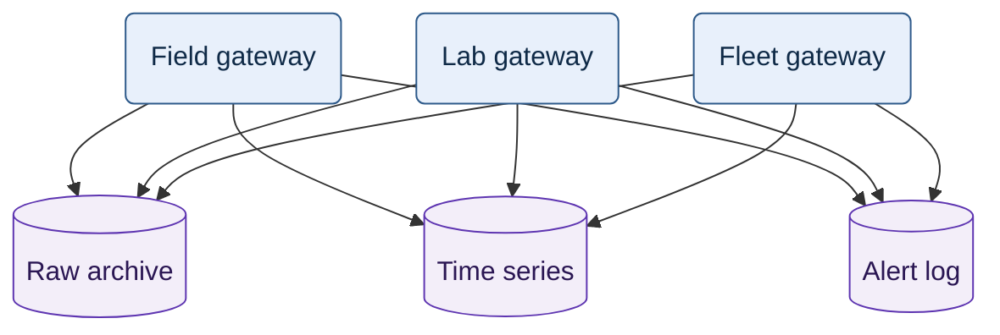
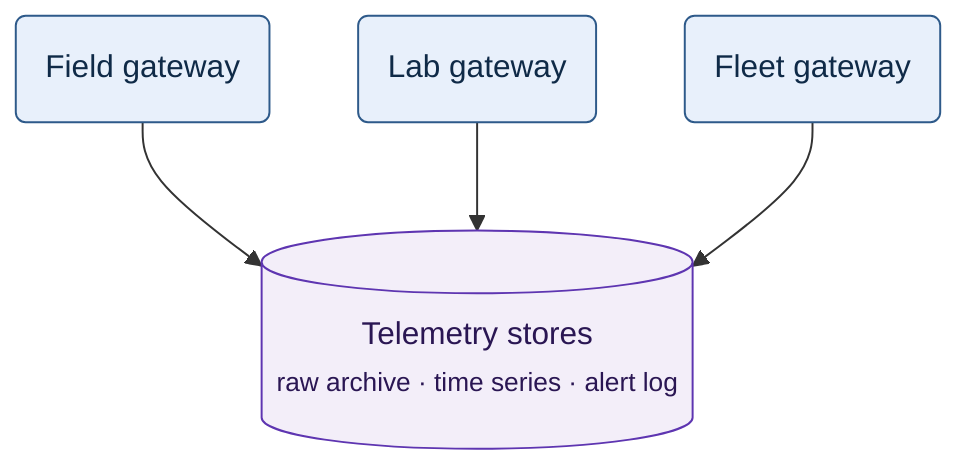
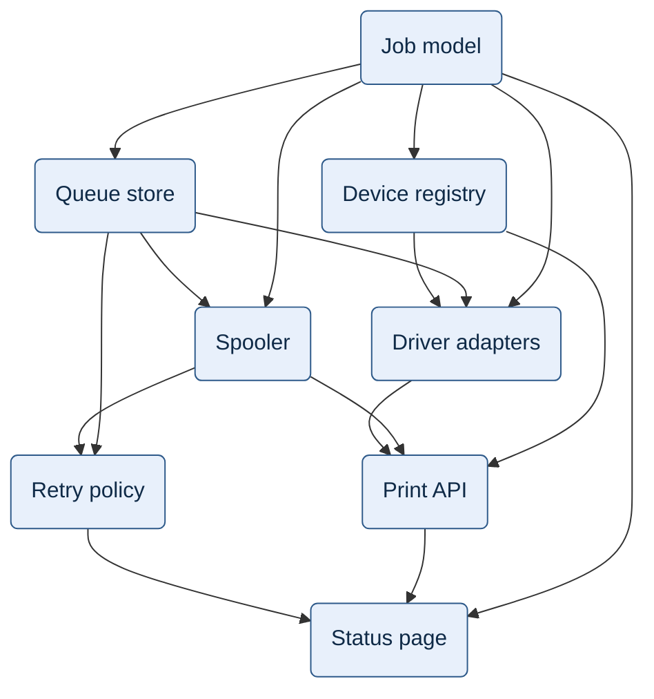
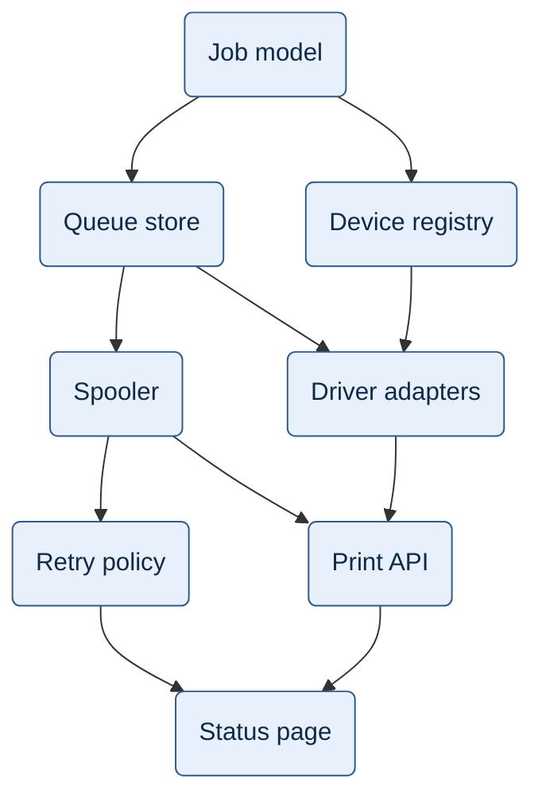

# Layout and planarity

This reference holds the layout knowledge behind SKILL.md Step 4. The routing table loads it with
`references/flowchart.md` for every flowchart.

Every number below was measured on 2026-10-02 in mermaid 11.17.2 and 10.9.8, with the flowchart
settings line of `assets/notation.json`. A pair of numbers reads "11.17.2 / 10.9.8". Thresholds
live in `assets/notation.json`; this file quotes them and sets none.

## 1. Layout engines

### 1.1 dagre in 11.17.2 and 10.9.8

Mermaid passes a flowchart to dagre with the direction and the two spacings of the settings line.
dagre follows the Sugiyama framework (Sugiyama et al. 1981; Gansner et al. 1993).

| Phase | What dagre does | What the author sees |
| :--- | :--- | :--- |
| Cycle removal | reverses each edge that a depth-first search finds closing a cycle | each cycle draws one edge against the flow |
| Ranks | network simplex; an edge over several ranks becomes a chain of dummy nodes | edges set the ranks; a long edge holds a slot in each rank |
| Order in a rank | a depth-first initial order, then barycenter sweeps down and up | a crossing that another order avoids can remain |
| Coordinates | Brandes–Köpf placement; `basis` curves through the dummy nodes | `nodeSpacing` and `rankSpacing` set the gaps |

- The sweeps keep the order with the fewest crossings. They stop after four rounds without gain.
- Finding the fewest crossings is NP-complete even for two ranks (Garey and Johnson 1983; Eades and
  Wormald 1994). The barycenter of dagre and the median of Graphviz `dot` are heuristics.
- No heuristic removes a crossing that the graph forces (§2).
- Mermaid lays out a subgraph without outside edges as a graph of its own (§4.3).

### 1.2 ELK in 12.x, and the check pair

Mermaid 12.0.0 made ELK Layered the default flowchart layout. ELK reduces crossings with a layer
sweep and a greedy switch pass. It draws orthogonal edges. It ignores `curve`, `nodeSpacing`,
`rankSpacing` and extra-length links.

| Figure | dagre: 11.17.2 / 10.9.8 | ELK: 12.1.0 defaults |
| :--- | :--- | :--- |
| a database that five edges enter (§3, row 2) | 2 / 2 | 0 |
| Figure 3: a build order with implied edges | 5 / 5 | 1 |
| a long audit edge (§3, row 5) | 1 / 1 | 0 |
| Figure 1: K3,3 | 7 and 2 edges through a node / 9 | 9 |

The check pair is 11.17.2 and 10.9.8:

- GitHub renders with 11.17.2 and registers no ELK. JetBrains IDEs 2024.3–2026.1 render with
  10.9.3. The viewer table is in `references/renderer-facts.md`.
- Both versions lay out flowcharts with dagre. They still differ in node size, wrapping and
  subgraph handling, and Figure 1 measures differently in each.
- `render_check.py --forward` adds 12.1.0. Under the settings line it uses dagre. It matched
  11.17.2 on Figures 2 to 4 and on the database of §3, row 2.

**Why.** A check under the 12.x defaults reports the ELK drawing: 0 crossings where a GitHub reader
sees 2.

## 2. Planarity

**Why.** Of the aesthetics Purchase (1997) tested, crossings had the largest effect on
understanding. Some graphs cross in every drawing.

### 2.1 Graphs that cross in every drawing

A graph is planar when some drawing of it in the plane has no crossing.

- Kuratowski (1930): a graph is planar if and only if it contains no subdivision of K5 or K3,3.
- Wagner (1937): equivalently, the graph has no K5 or K3,3 minor.
- K5 is five nodes, each linked to the other four. K3,3 is three nodes, each linked to the same
  three other nodes.

A simple planar graph with V ≥ 3 nodes has E ≤ 3V − 6 edges, and E ≤ 2V − 4 when it has no
triangle. The bounds are necessary, not sufficient.

| Graph | V | E | 3V − 6 | 2V − 4 | Triangle | Planar | Found by |
| :--- | ---: | ---: | ---: | ---: | :--- | :--- | :--- |
| K5 | 5 | 10 | 9 | — | yes | no | first bound |
| K3,3, Figure 1 | 6 | 9 | 12 | 8 | no | no | second bound |
| K3,3 with one edge through a relay node | 7 | 10 | 15 | 10 | no | no | exact test only |
| Figure 3 | 8 | 15 | 18 | — | yes | no | exact test only |
| Figure 4 | 8 | 10 | 18 | 12 | no | yes | — |

- The relay node keeps K3,3 non-planar and passes both bounds. It drew 7 crossings in each version.
- In Figure 3, three implied edges complete a subdivision of K3,3.

`lint_mermaid.py` checks both bounds and then runs an exact planarity test. It tests the undirected
simple graph of each flowchart within the hard budget of 18 nodes and 18 edges.

### 2.2 Ranks add crossings

A layered drawing fixes each node to a rank. Only the order inside a rank can change, so a planar
graph can still cross.

- K3,3 has one crossing in its best plane drawing.
- On two ranks, every pair of sources crosses every pair of targets: C(3,2) × C(3,2) = 9. K2,2
  gives 1 crossing the same way, measured 1 / 1.
- A caterpillar is a tree whose non-leaf nodes form one path. A connected bipartite block between
  two ranks avoids every crossing only when it is a caterpillar (Wood 2022).
- The database figure of §3, row 2, is planar and still drew 2 / 2 crossings.

The lint finds a graph that every drawing crosses. `render_check.py` counts the crossings of the
drawing the reader gets.

### 2.3 The fix is another figure

No edge order, direction or engine removes the crossing of a non-planar figure. Change the figure:

1. Aggregate one side into one node and list its members on the second line (Figure 2).
2. Split by concern, or draw one element with its direct neighbours.
3. Move a many-to-many relation into a table.
4. In a dependency graph, drop the edges that a longer path implies (Figure 4).

**Figure 1 (negative).** Gateways and stores — each of three gateways writes to each of three
stores.

Measured: 7 crossings and 2 edges through "Lab gateway" in 11.17.2, 9 crossings in 10.9.8. The
graph is K3,3, so no layout removes every crossing.

**Figure 2.** Gateways and stores — the three stores drawn as one node.

- Rounded box: a gateway.
- Cylinder: stores; the second line lists the stores the node stands for.
- Arrow: the gateway writes to every store on the list.

Measured: 0 crossings in both versions.

## 3. Techniques with measured effects

SKILL.md Step 4 allows at most 2 crossings and aims at 0. Each row changes one thing in the source.
Values read before → after.

| # | Technique | Nodes / edges | 11.17.2 crossings | 10.9.8 crossings | Other measured effect |
| :--- | :--- | :--- | :--- | :--- | :--- |
| 1 | Drop the edges a longer path implies (Figures 3 → 4) | 8 / 15 → 8 / 10 | 5 → 0 | 5 → 0 | width −28 % in both |
| 2 | One legend sentence instead of five edges into a database | 9 / 12 → 8 / 7 | 2 → 0 | 2 → 0 | largest fan-in 5 → 1 |
| 3 | Draw that database twice instead | 9 / 12 → 10 / 12 | 2 → 1 | 2 → 1 | one database drawn as two nodes |
| 4 | Merge two parallel edges, and a start with its reply | 3 / 5 → 3 / 3 | 0 → 0 | 0 → 0 | edges against the flow 1 → 0 |
| 5 | Move a long audit edge onto the source's second line | 7 / 8 → 7 / 7 | 1 → 0 | 1 → 0 | — |
| 6 | Mark a category across the flow by class, not by subgraph | 8 / 7 → 8 / 7 | 0 → 0 | 0 → 0 | title crossings 1 → 0; area −57 % / −61 % |
| 7 | Aggregate one side of K3,3 (Figures 1 → 2) | 6 / 9 → 4 / 3 | 7 → 0 | 9 → 0 | edges through a node 2 → 0 in 11.17.2 |
| 8 | Write the edge lines in reading order, same graph | 12 / 11 → 12 / 11 | 1 → 0 | 1 → 0 | edges through a node 1 → 0 in both |

**Row 1.** In an order relation, A before B and B before C already give A before C. Each node
still reaches the same nodes after the reduction. A graph without cycles has one reduction (Aho,
Garey and Ullman 1972). An edge that the text states for another reason, such as a contract, is a
second relation. It goes into its own figure or into the legend.

**Rows 2 and 3.** Name the omitted relations in one legend sentence, such as "Sign-in, Loan API,
Loans, Holds and Notice worker write to Library DB". Draw a node twice only when the sentence and
aggregation both fail.

**Why.** The sentence removed both crossings. Duplication removed one and drew one database as two
nodes. Henry, Bezerianos and Fekete (2008) measured that node duplication helps some reading tasks
and hinders others.

**Row 4.** `Spool -->|"claim · finish"| Jobs` replaces two parallel edges.
`Sched <-.->|"start · nudge"| Spool` replaces a start and its reply; the start had run upward.
The two-headed edge serves only a pair the text describes, and the legend names it.

**Row 5.** An edge over several ranks becomes a chain of dummy nodes. Audit, logging, metrics and
authentication touch many nodes. State such a relation once: on the second line of its source, or
in the legend.

**Row 6.** Use a subgraph for a category that follows the flow, such as a system boundary or a tier.
Mark every other category by class. SKILL.md Step 5 adds the shape or stroke rule.

**Why.** dagre keeps the members of a subgraph together. Two subgraphs across the flow made the
figure 696 × 621 / 636 × 551 px against 364 × 511 / 308 × 441 px. An outside edge crossed the
title "Public services" in both versions. The class version kept every node position of the figure
without groups.

**Figure 3 (negative).** Build order of the print service — every order drawn, implied ones
included.

Measured: 5 crossings in each version. The graph is not planar (§2.1).

**Figure 4.** Build order of the print service — each package with the packages built directly
after it.

- Rounded box: a package.
- Arrow: the source package is built before the target package.
- Not drawn: an order that a longer path already implies.

Measured: 0 crossings in both versions. Width 342 / 312 px against 475 / 433 px for Figure 3.

## 4. Rank and order control

### 4.1 Edge order and declaration order

To move a node, change the structure first: fewer edges, a shorter title, another grouping (§2.3,
§5.1). Write the edge lines in reading order: one path at a time, top to bottom, left branch
first. Declare the nodes in the same order. Re-render after each order change.

**Why.** dagre builds an initial order by a depth-first search, then runs the barycenter sweeps.
The search takes the nodes rank by rank, each rank in the order of the nodes' first lines, a
declaration or an edge. It follows the edges of each node in the order of the edge lines. The
sweeps break ties by that initial order, so an order change moves a node only where the sweeps
leave a tie.

| Probe, both versions | Result |
| :--- | :--- |
| printers declared C, B, A; edges written to A, B, C | drawn A, B, C |
| printers declared A, B, C; edges written to C, B, A | drawn C, B, A |
| two sources declared Y, X; edges written from X, then from Y | drawn X, Y |
| the database figure of §3, row 2, every line reversed | crossings 2 → 1 |
| a 12-node container view, booking path before staff path | 1 crossing and 1 edge through a node → none |
| P4 of `paired-examples.md`: the edge of Error handler written before the edge into ConversationApi | Error handler moves under the title; title crossings 1 → 0 |
| P4: Error handler declared before ConversationApi, edges unchanged | no node moves; 1 title crossing stays |
| P1 of `paired-examples.md`: Error handler declared before ConversationApi, edges unchanged | the two swap places; the nearest client edge passes 89 / 86 px from the title, not 4 / 9 px |

Declaration order moved no node in the first three probes and in P4. In P1 it moved two nodes. ELK
in 12.1.0 drew the first two probes in the same order.

### 4.2 Extra-length links and invisible links

| Construct | dagre: 11.17.2 and 10.9.8 | ELK: 12.1.0 |
| :--- | :--- | :--- |
| `A ---> B`, one extra dash | B moved one rank down | no effect |
| `A ~~~ B`, an invisible link | B moved below A | B moved below A |

- Both constructs are layout instructions, not relations. Use them to choose between two correct
  drawings, never to hide a crossing that the graph forces.
- An invisible link draws nothing, and the render check leaves it out of the geometry. dagre still
  orders it with the visible edges.
- The legend names no invisible link. `references/flowchart.md` §2 asks for a `%% layout only`
  comment beside it.

### 4.3 Subgraph direction

- An outside edge into a member node made both versions ignore `direction LR` in the subgraph. The
  subgraph took the figure's direction, and the edge crossed the subgraph title.
  `references/flowchart.md` §4 forbids `direction` in a subgraph.
- A subgraph whose members have no outside edge is laid out on its own. In a top-to-bottom figure
  its members run left to right, and in a left-to-right figure top to bottom (§5.2).
- A subgraph title that holds the word "direction" and a direction keyword fails to parse in both
  versions.

## 5. Titles and boundaries

### 5.1 An edge into the node under a title's centre

Mermaid centres a subgraph title at the top of the box, and dagre centres a single top node under
it. An edge from above enters that node at its top centre, through the title text.

| Case | Title crossings |
| :--- | :--- |
| one top node, a title of 30 characters | 1 / 1 |
| one top node, the title "Plant" | 1 / 1 |
| two top nodes, edge into one of them, a title of 30 characters | 1 / 1 |
| two top nodes, edge into one of them, the title "Plant" | 0 / 0 |
| a subgraph around one node | 1 / 1 |
| the same node with its role on the second line, no subgraph | 0 / 0 |

Fixes, in this order:

1. Remove a subgraph that holds one node. Put the role on the node's second line.
2. Give the top rank two or more nodes. Order the edge lines or the declarations so that the
   outside edge enters a side node, and re-render after each change (§4.1).
3. Shorten the title so that it ends before the entering edge. A short title alone does not clear
   an edge into the centre node.

Judge titles on the render. The title width depends on the font, and the headless renderer can use
another font than the reader's browser.

### 5.2 Edges to and from a subgraph

An edge to a subgraph id states a relation that no named node has. SKILL.md Step 4.5 forbids it.

- Measured with an edge from the subgraph "Plant" to the subgraph "Cloud": both versions drew it
  from border to border. In 10.9.8 its arrowhead touched the title "Cloud".
- Neither subgraph had a member with an outside edge. Both versions laid out each subgraph left to
  right inside the top-to-bottom figure.
- Draw the node-to-node edges that the text states. Put "every X reaches Y" in the legend.

## 6. Width and legibility

Effective font = font × min(1, 900 / width). The width is the natural width from the SVG `viewBox`,
never the PNG size. A figure passes when its smallest text keeps at least 10 px in a 900 px column
(`min_effective_font_px`, `column_px`).

- The settings line sets no font size. The default and dark themes draw labels at 16 px in both
  versions.
- 1440 px = 900 × 16 / 10: the widest figure whose 16 px labels keep 10 px.
- A `<small>` second line renders at 13.3 px. It keeps 10 px up to 1200 px = 900 × 13.3 / 10.

One 12-node container view with edges in reading order, drawn both ways:

| Direction | 11.17.2: width → font | 10.9.8: width → font |
| :--- | :--- | :--- |
| TB | 890 px → 16.0 px | 847 px → 16.0 px |
| LR | 1398 px → 10.3 px | 1320 px → 10.9 px |

- In LR each rank adds a node width, and each edge label adds its width between ranks. In TB both
  add height. Nodes here measured 106–197 px wide and 53–105 px high.
- One second line of 71 characters in the same view: TB 1107 / 1087 px, 13.0 / 13.2 px. LR
  1631 / 1584 px, 8.8 / 9.1 px, under the floor in both versions.
- SKILL.md Step 4.6 states the rule: structure of more than 6 nodes runs top to bottom.

Wrapping differs between the versions:

- 10.9.8 never wraps a plain label line.
- 11.17.2 wraps a line at `wrappingWidth`, which the settings line sets to 400 px.
- 12.x wraps at 120 px when no settings line raises the width.

| Line, at the default 16 px | Characters | Width |
| :--- | ---: | :--- |
| edge label at its limit | 24 | 175 px |
| node first line at its limit | 32 | 234 px |
| `<small>` second line at its limit | 40 | 249 px |
| `<small>` second line over its limit | 78 | 472 px in 10.9.8; wrapped at 400 px in 11.17.2 |

The limits keep every line under the 400 px wrap, so both versions draw the same lines.

## Sources

- Aho, Garey, Ullman 1972, SIAM J. Comput. 1(2): transitive reduction.
- Brandes, Köpf 2001, Graph Drawing: coordinate assignment.
- Eades, Wormald 1994, Algorithmica 11: crossings in two-layer drawings.
- Gansner, Koutsofios, North, Vo 1993, IEEE TSE 19(3): drawing directed graphs.
- Garey, Johnson 1983, SIAM J. Algebraic Discrete Methods 4(3): crossing number.
- Henry, Bezerianos, Fekete 2008, IEEE TVCG 14(6): node duplication.
- Kuratowski 1930, Fund. Math. 15; Wagner 1937, Math. Ann. 114: planarity.
- Purchase 1997, Graph Drawing: aesthetics and understanding.
- Sugiyama, Tagawa, Toda 1981, IEEE Trans. SMC 11(2): layered drawing.
- Wood 2022, arXiv 2207.06656: two-layer drawings.
- ELK Layered reference: `eclipse.dev/elk/reference/algorithms/org-eclipse-elk-layered.html`.
