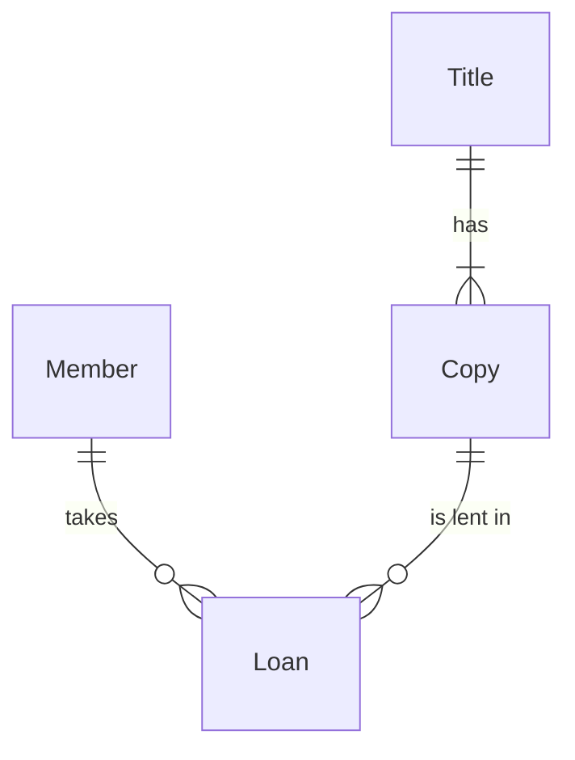
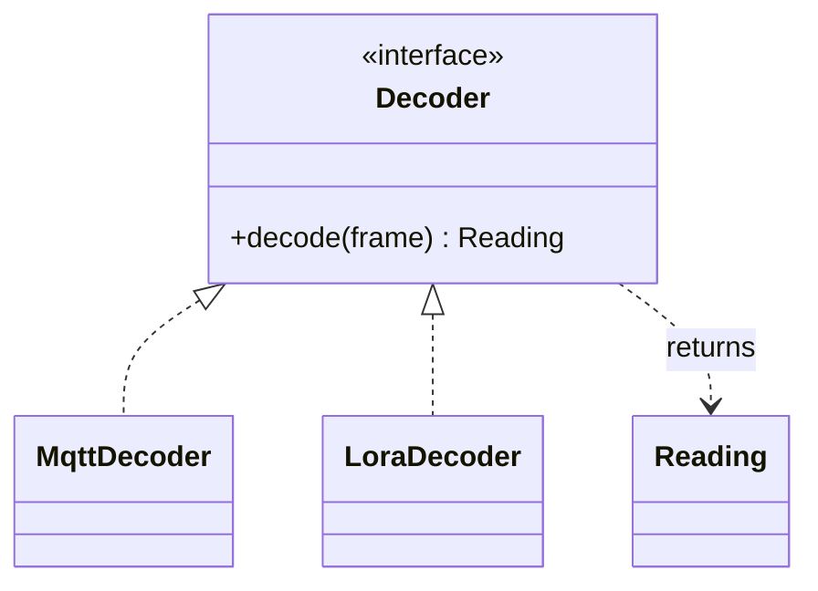
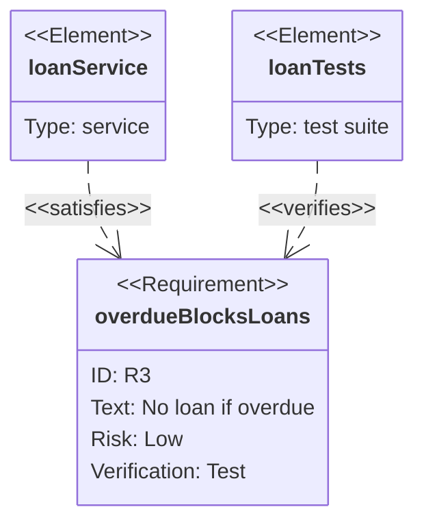
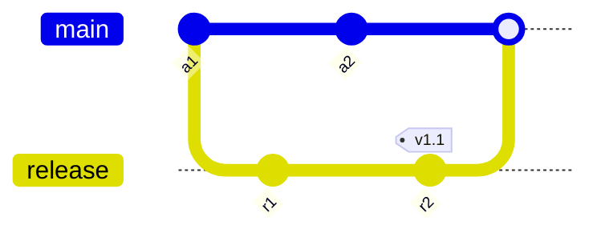
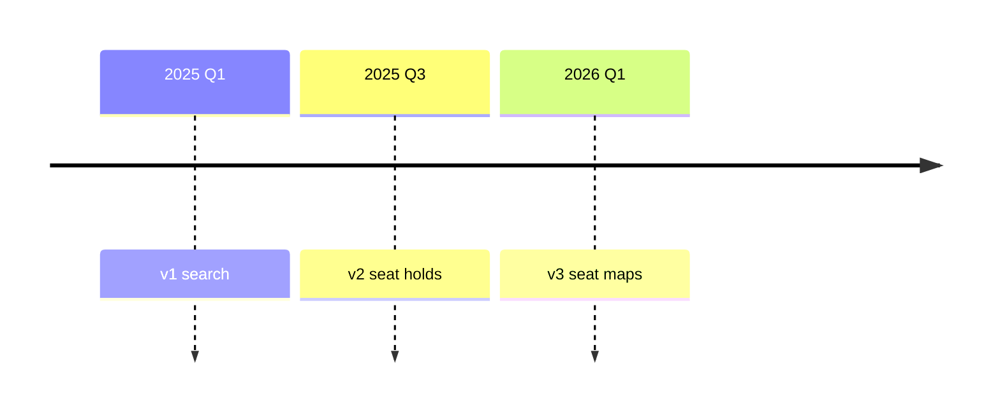
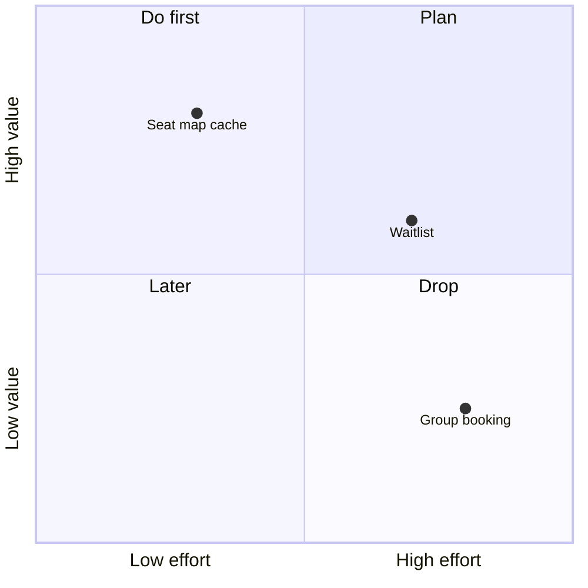
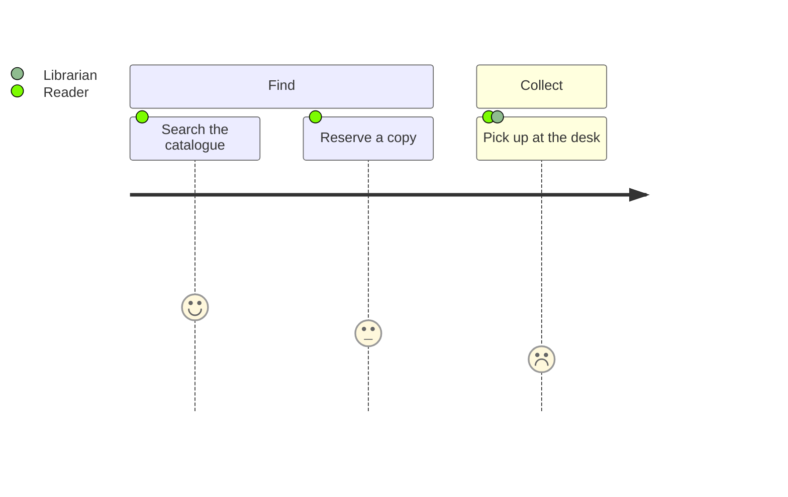
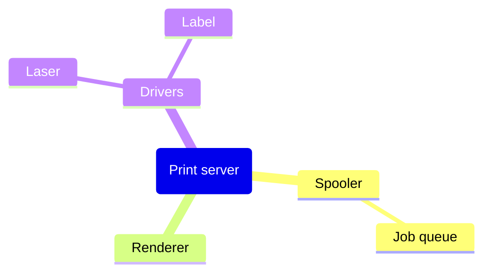

# Other figure kinds

Load this file when the routing table of `SKILL.md` names `other`. It covers every kind of
`assets/notation.json` outside `flowchart`, `sequenceDiagram`, `stateDiagram-v2` and `gantt`:

- `erDiagram`, a preferred kind;
- the seven allowed kinds;
- the kinds to avoid, each with its reason.

Every example below was rendered on 2026-10-02 in mermaid 11.17.2 and 10.9.8, and in 11.17.2
with theme `dark` on `#0d1117`. Mermaid 12.1.0 ran as a forward check. §14 lists what was measured.
Budgets come from `budgets` of `notation.json`.

## 1. Rules for every kind in this file

1. Run Step 0 of `SKILL.md` first. An attribute set, a full schema, a traceability matrix and a
   numeric series are tables.
2. `erDiagram` starts with `settings.er` of `notation.json`:
   `%%{init: {"layout": "dagre", "look": "classic"}}%%`.
3. `classDiagram` starts with `settings.class`, and `requirementDiagram` with
   `settings.requirement`. Both lines hold the same two keys as `settings.er`:
   `%%{init: {"layout": "dagre", "look": "classic"}}%%`.
4. The chart kinds take no settings line: `timeline`, `mindmap`, `quadrantChart`, `journey`,
   `gitGraph`.
5. Write no `theme`, no `classDef` and no `style`, and assign no style class with `:::`. These
   kinds draw in the viewer's theme colours.
6. A box name holds at most 32 characters. A relation label holds at most 24 characters,
   lowercase in cased scripts.
7. Caption and legend follow Step 7 of `SKILL.md`. When a kind colours its parts by position, the
   legend states that the colours mark no category.
8. Write `accTitle` and `accDescr` only where §2 shows that the kind supports them.
9. Write a table instead of a `pie`, an `xychart-beta` or a `sankey-beta`: all three are kinds to
   avoid (§13). The lint reports each as MA-SYN-04. Each passes the render check, and its PNG
   shows fills that merge into the light or the dark page (§14).

**Why.** Mermaid 12.1.0 lays out class and requirement diagrams with ELK and the `neo` look,
unless the line pins `dagre` and `classic`. It draws the chart kinds as 11.17.2 does: their SVG
output matched in structure and fills. Mermaid 10.9.8 rejects `classDef` in ER, class and
requirement diagrams with a parse error. The chart kinds have no class syntax. GitHub draws the
`default` theme on a light page and `dark` on a dark page. A colour the author does not set
therefore marks no category.

## 2. Choosing a kind

| Kind | Fits in an engineering document | Floor | Budget, soft / hard | Prefer |
| :--- | :--- | :--- | :--- | :--- |
| `erDiagram` | a few entities and their cardinalities | before 9.0 | 8 / 10 entities | a table for attributes and a full schema |
| `classDiagram` | an interface and its implementations; a small domain model | before 9.0 | 8 / 10 classes | a flowchart for who calls whom |
| `requirementDiagram` | one requirement and the elements that satisfy or verify it | before 9.0 | none; the 10.9 box width, §5 | a traceability table |
| `gitGraph` | a branching strategy | 9.0.0 | 15 / 20 commits | a list of branch rules |
| `timeline` | dated events, a few per period | 9.4.0 | 5 / 5 periods | a table with a date column |
| `quadrantChart` | items placed by two scores that the text states | 10.2.0 | none; no two point labels overlap | a table of scores |
| `journey` | the tasks of one user goal, scored by a study | before 9.0 | 4 / 5 tasks | a numbered list |
| `mindmap` | brainstorming notes the operator asks for as a mind map | 9.2.0 | 12 / 18 nodes | an ASCII tree or a nested list |

The budgets are `budgets.er.entities`, `budgets.class.classes`, `budgets.gitgraph.commits`,
`budgets.timeline.periods`, `budgets.journey.tasks` and `budgets.mindmap.nodes`. Over the soft
budget, aggregate or split, unless the figure passes the render check (`SKILL.md` Step 3). Over
the hard budget, split.

"Floor" is the release that added the kind; for `gitGraph`, the release that made it stable. Every
kind of the table renders in 10.9.8 and 11.17.2.

| Kind | `accTitle` and `accDescr` |
| :--- | :--- |
| ER, class, requirement, `gitGraph`, `quadrantChart`, `journey` | written into the SVG as `<title>` and `<desc>` |
| `timeline` | accepted, and written nowhere in the SVG |
| `mindmap` | render error in 10.9.8, 11.17.2 and 12.1.0: the parser reads the line as a second root |

## 3. `erDiagram`

**Fits.** A few entities and how many of one relate to how many of the other.

- The ER budget is 8 entities soft and 10 hard (`budgets.er.entities`).
- Draw entities and relationships only. Attributes, types and keys go in a table under the
  figure, one row per attribute.
- A full schema is a table.
- An ER figure in Mermaid replaces the PlantUML ER diagram. GitHub does not render PlantUML.
- Each relationship carries a quoted label of at most 24 characters.
- No `classDef`: mermaid 10.9.8 rejects it.

**Cardinality.** Each line end carries one mark per side.

| Left end | Right end | Meaning |
| :--- | :--- | :--- |
| `\|o` | `o\|` | zero or one |
| `\|\|` | `\|\|` | exactly one |
| `}o` | `o{` | zero or more |
| `}\|` | `\|{` | one or more |

`--` draws a solid line, an identifying relationship. `..` draws a dashed line, a
non-identifying relationship.

**Figure 1.** Library loans — members, copies and titles, with the cardinality of each relation.



Legend: at a line end, two bars mean exactly one, a bar and a fork mean one or more, and a circle
and a fork mean zero or more.

A relationship label sits on a half-transparent box in 10.9.8 and 11.17.2. The line shows through
the label text. Mermaid 12.1.0 gives each entity a different fill of the `redux-color` theme.

## 4. `classDiagram`

**Fits.** An interface and the classes that implement it, or a small domain model that the text
defines.

- Budget: 8 classes soft and 10 hard (`budgets.class.classes`).
- Draw only the members the text names. A member line follows the label limits of §1.
- No `classDef`: mermaid 10.9.8 rejects it.

| Source | Drawn as | Meaning |
| :--- | :--- | :--- |
| `A <\|.. B` | dashed line, hollow triangle at `A` | `B` implements `A` |
| `A <\|-- B` | solid line, hollow triangle at `A` | `B` extends `A` |
| `A ..> B` | dashed arrow | `A` depends on `B` |
| `A --> B` | solid arrow | `A` holds a reference to `B` |

**Figure 2.** Reading decoders — two classes implement `Decoder`, which returns a `Reading`.



Legend: a dashed line with a hollow triangle means implements; a dashed arrow means depends on.

## 5. `requirementDiagram`

**Fits.** One requirement with the elements that satisfy it and the tests that verify it. A
traceability matrix of many requirements is a table (Step 0).

- Mermaid 10.9.8 draws every box at one fixed width and wraps no body line by width.
  `Text: No loan if overdue` fits inside the box; `Text: No loan when overdue` runs past its
  border. A longer text is cut mid-word.
- Mermaid 10.9.8 adds the line `Doc Ref: None` to every element without a `docref`.
- Names follow the id shape `[A-Za-z0-9]+`: write `loanService`, not `loan_service`.
- No `classDef`: mermaid 10.9.8 rejects it.

**Figure 3.** Requirement R3 — the loan service satisfies it and the loan tests verify it.



## 6. `gitGraph`

**Fits.** A branching strategy: which branches exist, where they fork and where they merge.

- Budget: 15 commits soft and 20 hard (`budgets.gitgraph.commits`). Commit labels are 10 px.
  Drawn left to right, 16 commits measured 904 px, and the labels fell below 10 px in the 900 px
  column. Drawn `TB`, the figure measured 76 px wide at 15, 20, 25 and 30 commits in 10.9.8 and
  11.17.2, and the labels stayed at 10 px. The hard budget of 20 stands for this reason.
- Over 15 commits, write `gitGraph TB:` or split.
- Give every commit an `id:`. Without it, each render draws a different random id.
- Write `LR` or `TB` orientation only. Mermaid 10.9.8 rejects `BT`.

**Figure 4.** Release branch — two commits on `release`, a tag, and a merge back into `main`.



Legend: each lane is one branch, named at its left end; a filled dot is a commit, a ringed dot is
a merge.

In the dark render, the `main` label measures 3.35:1 against its fill, below the 4.5:1 of
`contrast_min`.

## 7. `timeline`

**Fits.** Dated events where the order of the periods carries the point. A table with a date
column holds the same facts.

- Budget: 5 periods, soft and hard (`budgets.timeline.periods`). In a 900 px column, mermaid
  11.17.2 draws 5 periods with 10.4 px text and 6 periods with 9.1 px text.
- Write `timeline` alone on its line. Mermaid 10.9.8 draws any text after it as a first period:
  `timeline TD` and `timeline LR` each drew a period named `TD` or `LR`. 11.17.2 reads `TD` as a
  direction and draws the figure top to bottom. The lint reports the text as MA-SYN-09, an error.
- Write no `title`: the caption carries it. Add a `section` only for a group the text defines.
- Write no `accTitle` or `accDescr`: the SVG keeps neither.
- In the light render, the first group draws white text on light blue: 3.06:1 on the period and
  2.32:1 on its events. Both are below the 4.5:1 of `contrast_min`.

**Figure 5.** Booking API releases — one release per period, oldest first.



Legend: the colours repeat by position and mark no category.

## 8. `quadrantChart`

**Fits.** Items placed by two scores that the text states for every item. An item the text does
not score is not drawn.

- The chart is a fixed square of 500 px. Point labels are 12 px.
- Place no two points so close that their labels overlap in the render.
- `quadrant-1` is top right, `quadrant-2` top left, `quadrant-3` bottom left, `quadrant-4` bottom
  right.

**Figure 6.** Booking backlog — three items placed by the effort and value scores of the text.



## 9. `journey`

**Fits.** The tasks of one user goal, each with a score from 1 to 5 that a study in the text
reports. It belongs in a UX document more often than in a specification.

- Budget: 4 tasks soft and 5 hard (`budgets.journey.tasks`). Task text is 16 px, and each task
  adds 200 px of width. Measured on 2026-10-03 in 10.9.8 and 11.17.2: five tasks measure 1300 px
  and draw the text at 11.1 px in a 900 px column. Six tasks measure 1500 px and draw it at 9.6 px,
  and the render check fails them on `legibility`.
- The SVG also holds a 14 px copy of each task text, inside a `<switch>`. A browser draws the
  16 px text and not the copy.
- Every score and every actor comes from the text.

**Figure 7.** Borrowing a book — three tasks of a reader, scored by the usability study.



Legend: a face shows the score of its task, higher and happier for a higher score; the dots on a
task mark its actors.

## 10. `mindmap`

**Fits.** Brainstorming notes that the operator asks to see as a mind map. It rarely belongs in a
specification.

- A position in a mind map means nothing, and the layout differs between versions. Mermaid
  10.9.8 and 11.17.2 place the nodes of Figure 8 on different sides of the root.
- A mind map shows a hierarchy without a relation type. Step 0 draws a tree of at most 8 elements
  as ASCII; a larger one becomes a nested list. `ascii.md` §5.3 draws the hierarchy of Figure 8 as
  a tree.
- Budget: 12 nodes soft and 18 hard (`budgets.mindmap.nodes`). A mind map of 19 nodes rendered
  745 px wide with 16 px text in 11.17.2.
- `accTitle` and `accDescr` break the figure (§2).
- In the light render, the white text of the purple branch measures 2.58:1. In the dark render,
  the root measures 3.35:1.

**Figure 8.** Print server — its parts as a mind map.



Legend: the colours repeat by branch and mark no category.

## 11. `pie`

**Avoid.** `notation.json` lists `pie` as a kind to avoid (§13). A table states the shares of one
whole as values.

- A pie renders in both versions and fails the dark render. Against `#0d1117` the slice fills
  measure 1.07:1 to 1.71:1, so the largest slice merges into the page.
- Mermaid 10.9.8 orders the slices by value, and 11.17.2 keeps the source order.

The reproduction below is a listing, not a figure. A fence that shows a defect on purpose ends
with `%% negative: <checks>`. The marker counts only in this skill's `references/` and
`scripts/tests/fixtures/`. Each instrument checks its own names. The lint requires one of the
lint rules the marker names to fire. The render check requires one of the render checks it names
to fail, and no render check it does not name may fail. A marker that names only lint rules has
its renders graded as a positive figure. No check reports the defect of this pie. The render
check measures text, and every text of the pie reads. The lint reports only the kind, as
MA-SYN-04.

```text
pie
  accTitle: Print jobs by paper size
  accDescr: A4, Letter and A3 shares of last month's jobs.
  "A4" : 70
  "Letter" : 20
  "A3" : 10
```

The same facts as a table:

| Paper size | Share of last month's jobs |
| :--- | :--- |
| A4 | 70 % |
| Letter | 20 % |
| A3 | 10 % |

## 12. `xychart-beta` and `sankey-beta`

**Avoid.** `notation.json` lists both as kinds to avoid (§13). Exact values go in a table. A
measured series goes in a chart built from its data file, so the figure cannot drift from the data.

- Mermaid 10.9.8 renders `xychart-beta` and `sankey-beta`, and rejects `xychart` and `sankey`.
- `sankey-beta` takes CSV lines `source,target,value`. An `accTitle` or `accDescr` line in it is a
  parse error in 10.9.8, 11.17.2 and 12.1.0.
- The bar chart below fails the light render. Its series fills the bars with `#ECECFF`, which
  measures 1.17:1 against the white page.
- The flow chart below fails the dark render. Its flows are drawn at half opacity with
  `mix-blend-mode: multiply`, which darkens them to the colour of the page.
- Both reproductions are listings, for the reason §11 gives: no check reports their defect, and
  the lint reports only the kind.

The bar chart:

```text
xychart-beta
  accTitle: Readings per weekday
  accDescr: Thousands of sensor readings received on each weekday.
  x-axis [Mon, Tue, Wed, Thu, Fri]
  y-axis "Readings, thousands" 0 --> 50
  bar [12, 30, 28, 41, 35]
```

The same facts as a table:

| Weekday | Mon | Tue | Wed | Thu | Fri |
| :--- | :--- | :--- | :--- | :--- | :--- |
| Readings, thousands | 12 | 30 | 28 | 41 | 35 |

The flow chart:

```text
sankey-beta
gateway,decoder,120
decoder,store,100
decoder,dead letters,20
```

## 13. Kinds to avoid

`notation.json` lists these kinds under `kinds.avoid`.

| Kind | Reason |
| :--- | :--- |
| `architecture-beta` | 10.9.8 rejects it; the kind arrived in 11.1.0 |
| `block-beta` | beta; the author places every block in columns by hand; GitLab self-managed 16.11–18.10 runs 10.7.0, which lacks it |
| `block` | 10.9.8 rejects the keyword without `-beta` |
| `C4Context`, `C4Container`, `C4Component`, `C4Dynamic`, `C4Deployment` | Mermaid marks C4 experimental; 10.9.8 and 11.17.2 draw different stereotype labels |
| `kanban` | 10.9.8 rejects it; the kind arrived in 11.4.0 |
| `packet-beta`, `packet` | 10.9.8 rejects both; the kind arrived in 11.0.0 |
| `radar-beta` | 10.9.8 rejects it; the kind arrived in 11.6.0 |
| `treemap-beta` | 10.9.8 rejects it; the kind arrived in 11.8.0 |
| `pie` | its slice fills merge into the dark page (§11); a table states the shares |
| `xychart-beta`, `sankey-beta` | their fills merge into the light or the dark page (§12); a table states the values |
| `xychart`, `sankey` | 10.9.8 rejects both keywords without `-beta` |
| `venn-beta`, `ishikawa-beta` | 10.9.8 rejects both; the kinds arrived in 11.13.0 |
| `stateDiagram` | a viewer's `state.defaultRenderer` setting can switch it to the legacy renderer |

Draw a C4 container view as a flowchart with `references/flowchart.md`. Write `stateDiagram-v2`
for every state figure.

**Why.** Every rejection above is `UnknownDiagramError: No diagram type detected` in 10.9.8,
measured on 2026-10-02. JetBrains IDEs 2024.3–2026.1 render with 10.9.3. Mermaid's C4 page
states: "This is an experimental diagram for now. The syntax and properties can change in future
releases." In 10.9.8 and 11.17.2 the bare `stateDiagram` keyword selects the v2 renderer only
while `state.defaultRenderer` is `dagre-wrapper`; `stateDiagram-v2` selects it always.

## 14. Measurements

Measured on 2026-10-02. Width is the SVG `viewBox` width. Text is the smallest font drawn,
scaled to a 900 px column. Figures 1–4 have 0 crossings and 0 edges through nodes. SVG geometry
measured Figure 2 in both versions, and Figures 1 and 3 in 11.17.2; the PNGs show the rest. The
render check reports a figure of a kind it does not model as `pass, geometry not checked`. The last
three rows are the listings of §11 and §12, rendered from their source.

| Figure or listing | Width, 11.17.2 / 10.9.8 | Text, 11.17.2 / 10.9.8 | Dark render | Result |
| :--- | :--- | :--- | :--- | :--- |
| 1, ER | 356 / 340 px | 14 / 12 px | legible | pass, geometry not checked |
| 2, class | 438 / 411 px | 16 / 16 px | legible | pass |
| 3, requirement | 311 / 520 px | 16 / 16 px | legible | pass, geometry not checked |
| 4, gitGraph | 371 / 371 px | 10 / 10 px | legible; `main` label 3.35:1 | pass, geometry not checked |
| 5, timeline | 990 / 790 px | 14.5 / 16 px | legible | pass, geometry not checked; light render 3.06:1 and 2.32:1 |
| 6, quadrant | 500 / 500 px | 12 / 12 px | legible | pass, geometry not checked |
| 7, journey | 900 / 900 px | 16 / 16 px | legible | pass, geometry not checked |
| 8, mindmap | 563 / 403 px | 16 / 16 px | legible; root 3.35:1 | pass, geometry not checked; light render 2.58:1; layouts differ |
| pie, §11 | 559 / 559 px | 17 / 17 px | slices 1.07:1 to 1.71:1 | fail in the PNG; the render check passes |
| `xychart-beta`, §12 | 700 / 700 px | 14 / 14 px | legible | fail in the PNG: light bars 1.17:1; the render check passes |
| `sankey-beta`, §12 | 600 / 600 px | 14 / 14 px | flows not visible | fail in the PNG; the render check passes |

Mermaid 12.1.0 rendered the eight figures and the three listings without error.
