# Paired examples

**Provenance.** Each negative below was found while redesigning the figures of one production
architecture document. Each positive is its fix. Every positive met the render thresholds in both
pinned versions and passed a check of each element against the source lines.

The source document describes how the steps of a conversation job are admitted and run. Workflows
of the automation tool n8n do the work. The Postgres schema `cvj` holds the step queue.

## How to read a pair

1. Each section opens with the source lines its figures illustrate: S1, S2 and on. The pairs of a
   section share its lines. Every element of a positive figure cites one of them.
2. A negative figure shows a defect on purpose. Its fence ends with the comment line
   `%% negative: <names>`. The names, separated by commas, are the lint rule ids (`MA-FLOW-02`) and
   the render checks (`title_crossings`) the figure fails. The lint and the render check report
   these findings as expected. Each instrument checks its own names. The lint requires one of the
   lint rules the marker names to fire. The render check requires one of the render checks it
   names to fail, and no render check it does not name may fail. A marker that names only lint
   rules has its renders graded as a positive figure. The marker counts only in this skill's
   `references/` and `scripts/tests/fixtures/`. The paragraph under the fence gives the measured
   numbers.
3. A negative carries the settings line of its kind, except N8, which is shown as found. The
   settings line is then no part of the defect.
4. A positive figure starts with the settings line of its kind from `assets/notation.json` and uses
   the palette of its kind. Its caption sits directly above the fence. Its legend sits directly
   below the fence, because each positive uses two or more encodings.
5. Numbers come from renders in mermaid 10.9.8 and 11.17.2 in a 900 px column, on 2026-10-02.
   Every positive was also rendered dark: 11.17.2, theme `dark`, background `#0d1117`. Every label
   stays legible there.
6. A **Rework** note follows each positive that failed as drafted. It states what failed, what
   changed, and the numbers before and after per version.

A check is named by its lint rule id or its render check. The effective font is the label size
times the scale of the figure in the column.

## 1. Container view: N1 to N6

**Source lines.**

- S1. The clients are CRM, the dashboard, MMA and MacWhisper.
- S2. A client submits a job to an intake workflow: Submit or the MMA adapter.
- S3. A client lists, cancels and deletes jobs through ConversationApi.
- S4. Six workflows nudge ConversationDispatch: Submit, the MMA adapter, TranscribeWorker,
  ConversationApi, the runner and the error handler.
- S5. A nudge and a start are unwaited calls.
- S6. ConversationDispatch is a new workflow. It runs each minute and on each nudge. The design
  changes every other workflow of this section.
- S7. ConversationDispatch runs one pass of `cvj.dispatch()`. It starts the runner and
  TranscribeWorker.
- S8. The runner is the workflow ConversationOrchestrator. It claims a step with
  `cvj.step_claim()` and finishes it with `cvj.step_finish()`.
- S9. The step children are GenerateProtocol, ProtocolReviewLoop and ScoreConversation.
- S10. The runner waits for GenerateProtocol and ScoreConversation. GenerateProtocol waits for
  ProtocolReviewLoop.
- S11. The step children call skills-executor over HTTP (`llm-call`). skills-executor is a sidecar
  and the LLM gate.
- S12. ConversationOrchestratorErrorHandler is the error workflow of the runner.
- S13. The schema `cvj` holds the step, settings and `host_*` tables. Its admission functions are
  the only writers of the admission columns.
- S14. The host script `disk-report.sh` runs each minute. It writes disk usage and process starts
  to the `host_*` tables.
- S15. Every workflow reaches Postgres through its own Postgres nodes.
- S16. All workflows run in the container n8n-worker.

### N1 → P1. One figure for structure and dynamics

**Negative N1.** One flowchart carries structure and dynamics: 16 nodes and 22 edges, 6 of them
into the database. It has no group and no legend. A timer appears as a node, and one relation is
invented (N2).

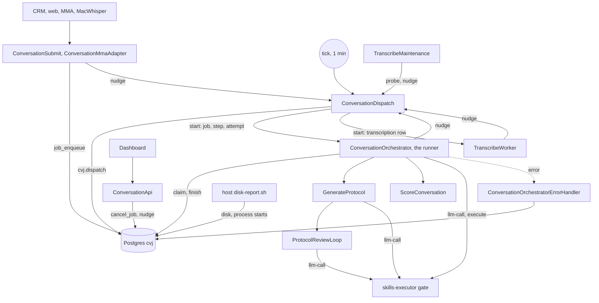

Fails: MA-BUDGET-02, 22 edges against a hard budget of 18. Render: 4 crossings in each version.
In 11.17.2 one edge runs through a node. In both versions an edge runs through the label
`llm-call, execute`. Effective font: 9.5 px (10.9.8) and 8.1 px (11.17.2).

**Positive P1.** Three figures replace N1: the container view below, the life of one step (P7)
and the audio job (P11). The container view holds 12 nodes and 12 edges. It aggregates groups the
source lines name, groups nodes by system and draws only the relations the source lines state.

**Figure P1.** Container view — the workflows that nudge ConversationDispatch, the two it starts,
and the database, sidecar and host script around them.

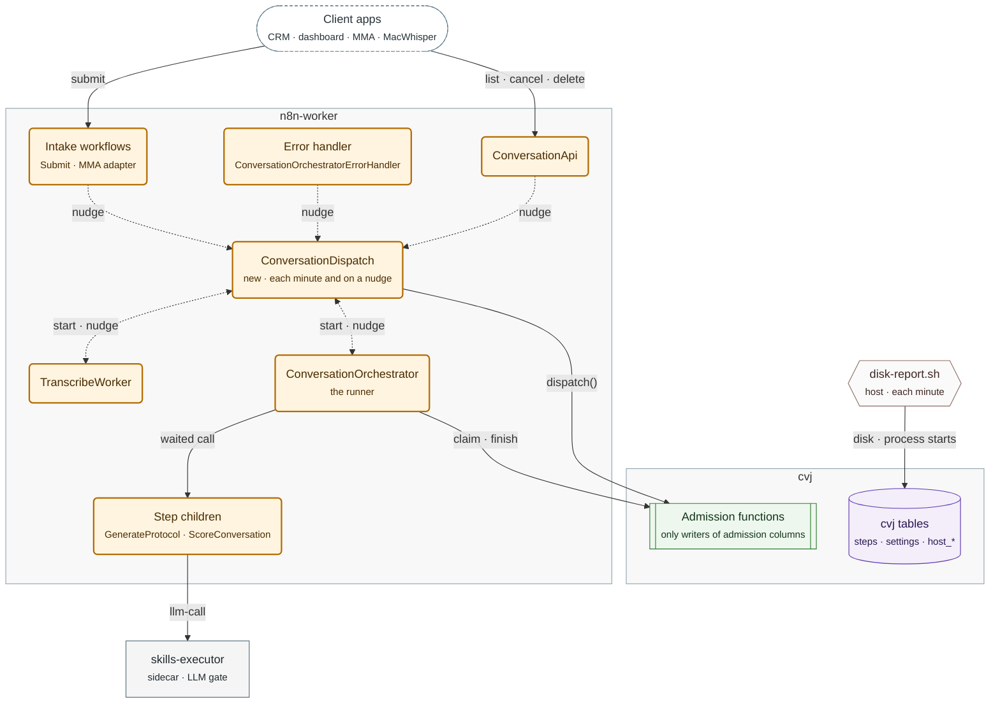

Legend:
- stadium, dashed border = client apps; amber rounded box = workflow added or changed by this
  design;
- subroutine = Postgres functions; cylinder = tables; rectangle = sidecar; hexagon = host script;
- grey frame = the container or schema of the nodes inside it;
- solid arrow = call or write; dashed arrow = nudge or unwaited start; double arrow = start one
  way, nudge back.

Every workflow reaches Postgres through its own Postgres nodes; the figure draws only the
dispatcher's and the runner's calls. Step children also holds ProtocolReviewLoop, which
GenerateProtocol waits for.

**Rework.**

- Failed as drafted: effective font 8.7 px in 10.9.8 (1456 px wide) and 9.8 px in 11.17.2
  (1292 px). The settings line set a `theme` and a font family that mermaid blanks. One boundary
  held a single node (Clients). Three second lines held 43, 57 and 72 characters.
- Changed: the settings line and palette of `notation.json`; no Clients boundary; every second
  line at most 40 characters; the error handler declared between the two client targets (P4).
- After: 1337 × 828 px and 10.8 px in 10.9.8; 1372 × 973 px and 10.5 px in 11.17.2. Both versions:
  0 crossings, 0 edges through nodes, 0 title crossings, 0 label overlaps. The dark render is
  legible.

### N2 → P2. An invented relation

**Negative N2.** N1 draws `TM[TranscribeMaintenance] -->|probe, nudge| DSP`. S4 names six
nudgers, and TranscribeMaintenance is not one of them. N1 also omits the nudge of the error
handler, which S4 states. Check: fidelity, an inventory row with no supporting line.

**Positive P2.** Each edge is traced to a line before it is drawn. The table holds the edge rows of
the inventory of P1 (`lint_mermaid.py --inventory`), with the support column filled.

| Edge | Label | Support |
| :--- | :--- | :--- |
| Client apps → Intake workflows | submit | S1, S2 |
| Intake workflows → ConversationDispatch | nudge | S4, S5 |
| Error handler → ConversationDispatch | nudge | S4, S12 |
| Client apps → ConversationApi | list · cancel · delete | S3 |
| ConversationApi → ConversationDispatch | nudge | S4 |
| ConversationDispatch ↔ TranscribeWorker | start · nudge | S4, S5, S7 |
| ConversationDispatch ↔ ConversationOrchestrator | start · nudge | S4, S7, S8 |
| ConversationOrchestrator → Step children | waited call | S10 |
| ConversationDispatch → Admission functions | dispatch() | S7, S13 |
| ConversationOrchestrator → Admission functions | claim · finish | S8, S13 |
| Step children → skills-executor | llm-call | S11 |
| disk-report.sh → cvj tables | disk · process starts | S14 |

The verifier of `references/review-checklist.md` rejects an element without a line.

### N3 → P3. Edges between boundaries

**Negative N3.** Two edges start at the subgraph id `N8N`.

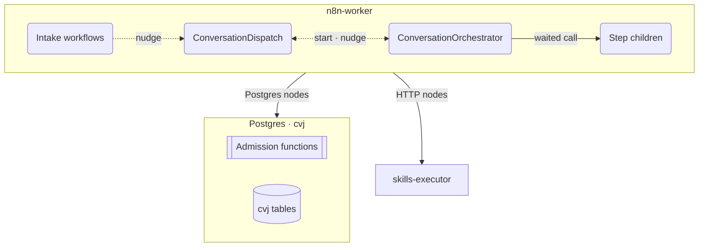

Fails: MA-FLOW-02, 2 edges with a subgraph id as an end. Render: no threshold fails. In both
versions:

- the content of the boundary turns into one left-to-right row;
- both edges leave the box under ConversationDispatch and ConversationOrchestrator, so they read
  as edges of those two;
- the arrow into Postgres stops 4 to 5 px above the group title.

**Positive P3.** P1 draws the edges the source lines state: `DSP -->|"dispatch()"| FN`,
`RUN -->|"claim · finish"| FN` and `CH -->|"llm-call"| SE`. Its legend states the rest in one
sentence, from S15.

### N4 → P4. An edge through a group title

**Negative N4.** The edge into ConversationApi enters the node under the title of its group.

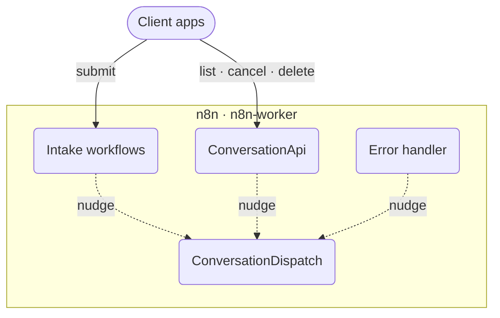

Fails: title_crossings, 1 in each version. The edge runs 17 px (10.9.8) and 22 px (11.17.2)
inside the title box.

**Positive P4.** The node under the title has no edge from outside the group.

**Figure P4.** Clients and the n8n-worker group — the client edges enter the intake workflows and
ConversationApi, and no client edge enters the error handler.

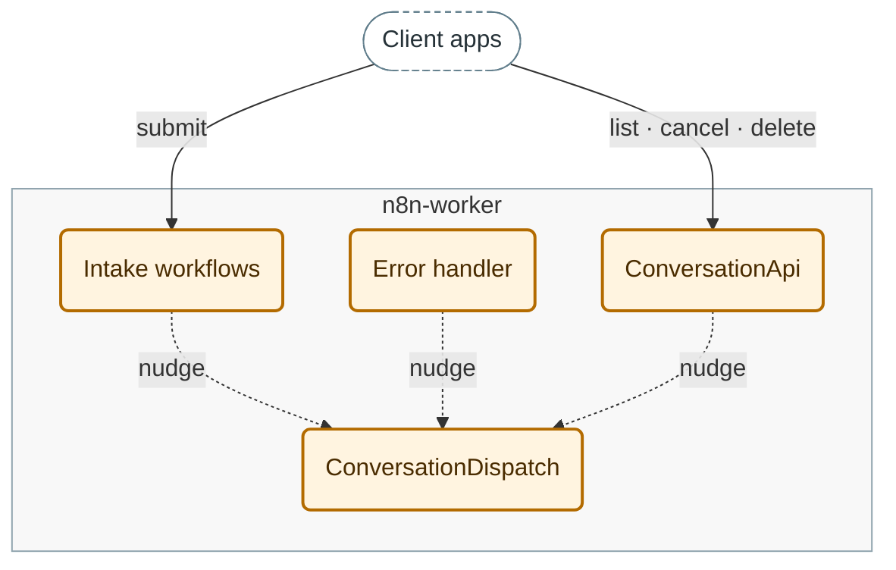

Legend:
- stadium, dashed border = client apps; amber rounded box = workflow; grey frame = container;
- solid arrow = call; dashed arrow = nudge.

**Rework.**

- Failed as drafted: the draft shortened the title to `n8n-worker`. ConversationApi stays under
  the title, and the edge crosses it: 1 title crossing in each version, 17 px and 22 px inside.
- Changed: the nudge of the error handler is written before the client edge to ConversationApi.
  The error handler then sits under the title in both versions. Declaring the error handler
  before ConversationApi, with the edges unchanged, moved no node.
- After: 0 title crossings. The nearest client edge passes 74 px (10.9.8) and 80 px (11.17.2)
  from the title.
- In P1 that edge order left ConversationApi under the title. Its client edge passed 9 px (10.9.8)
  and 4 px (11.17.2) from the title. Declaring the error handler between the intake workflows and
  ConversationApi moved the error handler there, in both versions. The nearest client edge then
  passes 86 px and 89 px from the title.

**Why.** A shorter title clears the edge only in the font it was measured with. A title above a
node that no external edge enters stays clear in every font. The edge order moved a node in P4 and
not in P1; the declaration order moved one in P1 and not in P4. Re-render after each order change
(`layout-and-planarity.md` §4.1).

### N5 → P5. A boundary around one node

**Negative N5.** The sidecar sits alone in a `Sidecars` boundary.

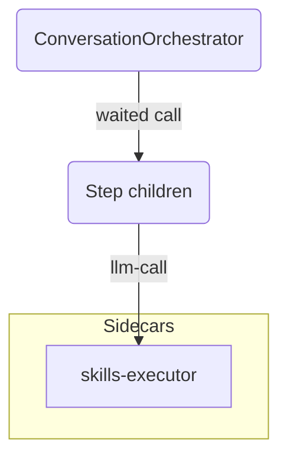

Fails: MA-FLOW-03, a subgraph of one node. Render: title_crossings, 1 in each version. The only
edge enters at the top centre and runs 17 px (10.9.8) and 22 px (11.17.2) inside the title
"Sidecars".

**Positive P5.** No boundary. The role moves to the second line of the node.

**Figure P5.** Step children and the sidecar — the runner waits for the step children, which call
skills-executor.

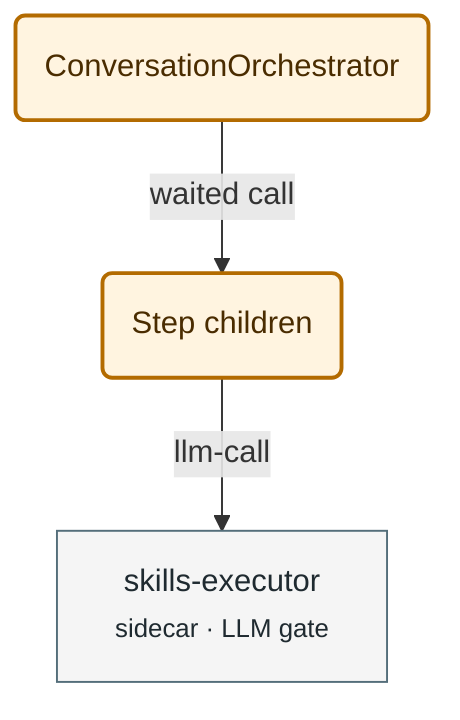

Legend: amber rounded box = workflow · grey rectangle = sidecar · solid arrow = call.

### N6 → P6. A wide left-to-right view

**Negative N6.** P1 drawn left to right. N6 keeps the group title P1 had as drafted,
`Postgres · cvj`.

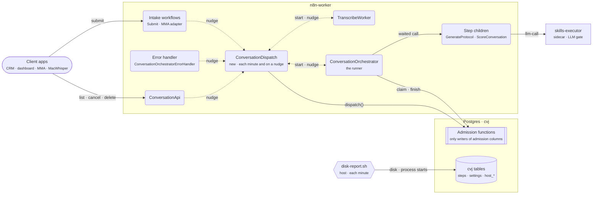

Fails: MA-FLOW-06, 12 nodes against a limit of 6. Render: legibility, 2133 × 637 px and 6.8 px in
10.9.8; 2241 × 735 px and 6.4 px in 11.17.2. title_crossings: in each version one edge crosses the
title "Postgres · cvj".

**Positive P6.** P1 itself, top to bottom: clients on top, workflows in the middle, data and
services below. Effective font: 10.8 px (10.9.8) and 10.5 px (11.17.2).

## 2. The life of one step: N7, N8

**Source lines.** S1 to S16 apply, and:

- S17. A client posts a job to Submit. Submit queues the first step with `cvj.job_enqueue()` and
  nudges the dispatcher.
- S18. A nudge carries a reason and no job data: `{reason}`.
- S19. A queued step waits as rows; no execution exists for it.
- S20. The dispatcher is the workflow ConversationDispatch together with `cvj.dispatch()`.
- S21. One pass of `cvj.dispatch()` admits steps and returns the launches to start.
- S22. The dispatcher starts the runner, unwaited, with `{job_id, step_id, attempt}`.
- S23. A launch is one execution of the runner. It claims its step with `cvj.step_claim()`, which
  returns `claimed`.
- S24. When `claimed` is false, the launch exits and writes nothing.
- S25. The runner calls a step child, GenerateProtocol or ScoreConversation, and waits for its
  result.
- S26. That call carries `step_id`, `attempt` and further fields. The call table of the source
  lists them all.
- S27. The runner records the outcome with `cvj.step_finish()`, nudges the dispatcher and exits.

### N7 → P7. A long message label

**Negative N7.** One message carries the payload of the call.

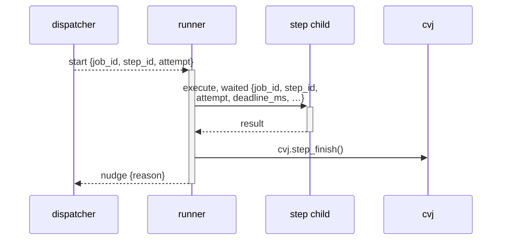

Fails: MA-LABEL-04, messages of 32 and 58 characters against a limit of 24 per line. Render:
`lifeline_through_label`. `wrap` breaks the 58-character message into 2 lines and keeps every gap
at 200 px. In both versions, the lifelines at both ends of each long message run through its
first line.

**Positive P7.** `R->>+C: waited call<br/>{step_id, attempt}` in Figure P7. The full input list
stays in the call table (S26).

### N8 → P8. A note wider than its box

**Negative N8.** A note over two participants holds a whole sentence.

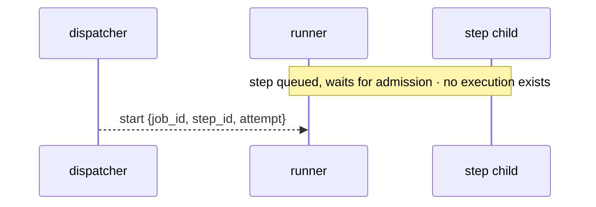

Fails: MA-LABEL-05, a note of 54 characters against a limit of 48. Render, as found without a
settings line: clipped_labels. The note text is 390 px wide in a box of 283 px, in both versions.
Under the settings line, `wrap` breaks it into 2 lines, and the first line fills 248 px of its
250 px box.

**Positive P8.** `Note over R,C: the step waits<br/>no execution exists` and
`Note over R: the launch exits<br/>writes nothing` in Figure P7. The `<br/>` sets each line break;
`wrap` alone broke the second note after its `·`.

**Figure P7.** The life of one step — intake, one admission pass and one launch of the runner,
with a bar on each lifeline while an execution exists.

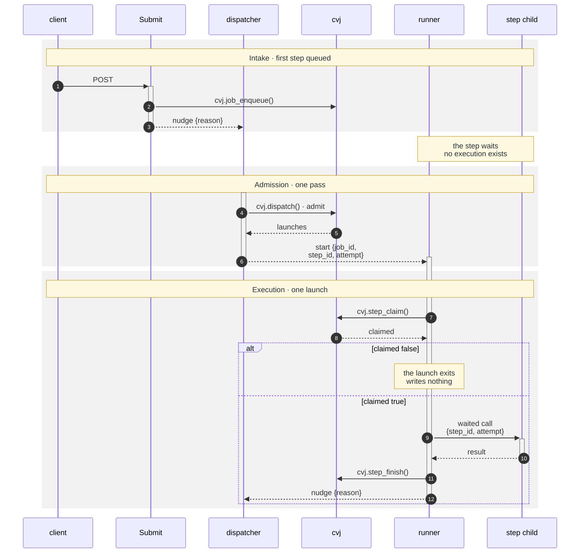

Legend:
- solid arrow = call; dashed arrow = unwaited start, nudge or reply; numbers = order;
- bar = a running execution; grey band = phase;
- `alt` = the claim matches no row, or it matches.

**Rework.** The source figure of P7 and P8:

- Failed as drafted: effective font 10.1 px in both versions, 1420 px wide. A lifeline crossed 4
  message labels, because `cvj` stood at the right end.
- Activation gap: a `deactivate` in one `alt` branch and an `activate` in the next drew a gap in
  the bar of the runner. The gap reads as "no execution" in the branch where the launch runs.
- Changed: the settings line and the participant order client, Submit, dispatcher, cvj, runner,
  step child. Participants take the names of S20 and S8. One bar per launch ends after the `alt`
  block. The messages of P7 and the notes of P8 break with `<br/>`, at most 24 characters per
  message line.
- After: 1250 px and 11.5 px in both versions. A lifeline crosses 3 message labels. No participant
  order gives fewer for these messages.
- Under `"wrap": true` a participant name wider than its 150 px box breaks inside the word, in both
  versions: `ConversationDispatc-h`. The short names of the source, at most 18 characters each
  (`participant_chars_max`), avoid the break.

## 3. An audio job: N11, N12, P15

**Source lines.** S1 to S27 apply, and:

- S28. A pass of `cvj.dispatch()` admits a transcribe step in SQL. No runner launch exists for that
  step.
- S29. The dispatcher then starts TranscribeWorker. It transcribes at Whisper once a pool grants
  the row, then nudges the dispatcher.
- S30. A later pass closes the transcribe step, the sweep, and admits the diarize step. The
  dispatcher starts the runner.
- S31. A diarize launch makes one diarizer call. The first call waits up to 240 s; each later call
  waits 30 s.
- S32. A later call sends the same request as the first.
- S33. A poll, busy or retry outcome ends the launch with outcome `sleep`; `wake_at` is now + 150 s.
- S34. While the step sleeps, no execution exists. The step keeps its place and its counters.
- S35. The tick runs a pass each minute. A pass wakes every sleeping step whose `wake_at` has
  passed.
- S36. `cvj.step_claim()` returns the counters of the step, `diar_counts`.
- S37. Any other outcome ends the step `done`.
- S38. The diarizer node of the runner times out at 300 s. The lease of a diarize launch covers
  that timeout.

### N11 → P11. A number on the wrong subject

**Negative N11.** `Note over DZ: timeout 300 s` after the first diarizer call. The 300 s belongs to
the node timeout of S38, not to the wait of S31. The 30 s of the later calls is missing. Check:
fidelity, a number on a subject its line does not name.

**Positive P11.** `R->>DZ: call · waits up to 240 s`, and in the loop
`R->>DZ: call · waits 30 s<br/>same request`.

### N12 → P12. An arrow that reads backwards

**Negative N12.** `R->>DB: cvj.step_claim() · diar_counts` reads as the runner sending the
counters. S36 states that the claim returns them. Check: fidelity, a returned value drawn on the
call.

**Positive P12.** `R->>DB: cvj.step_claim()`, then the reply `DB-->>R: counters (diar_counts)`.

### P15. Activation bars that carry the message

The bar of the runner stops at the `cvj.step_finish()` that records `sleep` (message 9) and
restarts at the next `start` (message 11). The figure itself shows that no execution exists while
the diarization sleeps (S34). Both versions draw the gap.

**Figure P11.** An audio job — the transcription admitted in SQL with no runner launch, and the
diarization asleep as a row between its calls.

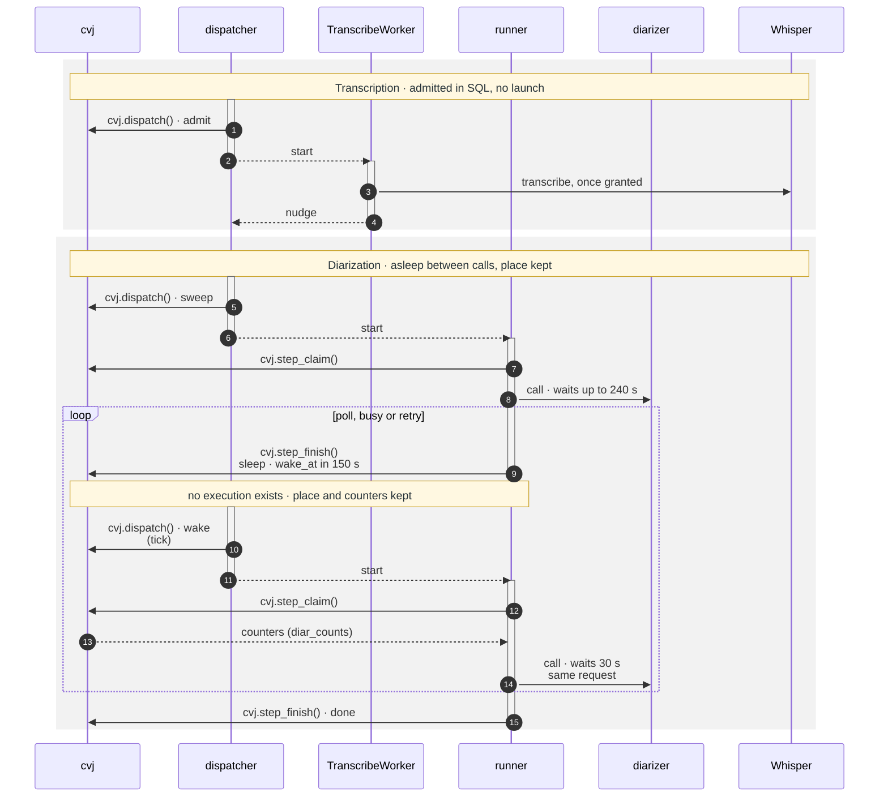

Legend:
- solid arrow = call; dashed arrow = unwaited start, nudge or reply; numbers = order;
- bar = a running execution; no bar on the runner between calls = no execution while the step
  sleeps;
- `loop` = repeats while the diarizer answers poll, busy or retry; grey band = phase.

**Rework.** The source figure of P11, P12 and P15:

- Failed as drafted: effective font 9.4 px in both versions, 1530 px wide. The 47-character label
  `cvj.step_finish() · sleep, wake_at = now + 150 s` set one gap to 398 px against a median of
  220 px. A lifeline crossed 7 message labels.
- Changed: the settings line; the order cvj, dispatcher, TranscribeWorker, runner, diarizer,
  Whisper; no system boxes; long labels broken with `<br/>`, at most 24 characters per line.
- After: 1255 px and 11.5 px in both versions; gaps of 200 to 205 px. A lifeline crosses 2
  message labels. No participant order gives fewer.
- A box border runs between two adjacent participants of different boxes. In both versions it
  crossed the label of every message between them.

## 4. Step states: N9, N10, N13

**Source lines.**

- S39. A new step is blocked.
- S40. A step holds a place from its admission to its end. admitted, running, sleeping, woken, at
  Whisper and stopping hold a place. blocked, queued and deferred hold none. ended is final.
- S41. blocked → queued: `cvj.job_enqueue()` for the first step of a job, `cvj.step_finish()` for
  the next.
- S42. deferred → queued: no writer. The step counts as queued again once `not_before` or its
  deferral budget has passed.
- S43. queued → admitted and queued → at Whisper: `cvj.dispatch()`.
- S44. admitted → running and woken → running: `cvj.step_claim()`.
- S45. running → ended, deferred or sleeping: `cvj.step_finish()`.
- S46. running → queued: the reap in `cvj.dispatch()`, when the run lease expires or the restart
  rule applies.
- S47. sleeping → woken: `cvj.dispatch()`. at Whisper → ended: the sweep in `cvj.dispatch()`.
- S48. running → stopping: `cvj.cancel_job()`. A stopping step keeps its place until its launch
  ends.
- S49. stopping → ended: the `cvj.step_finish()` of the stale launch, or the reap.
- S50. The start lease returns an admitted step to queued and wakes a woken step again in its
  place. A cancel ends every other open state at once.

### N9 → P9. Composite states

**Negative N9.** Two composite states, with transitions into and out of them.

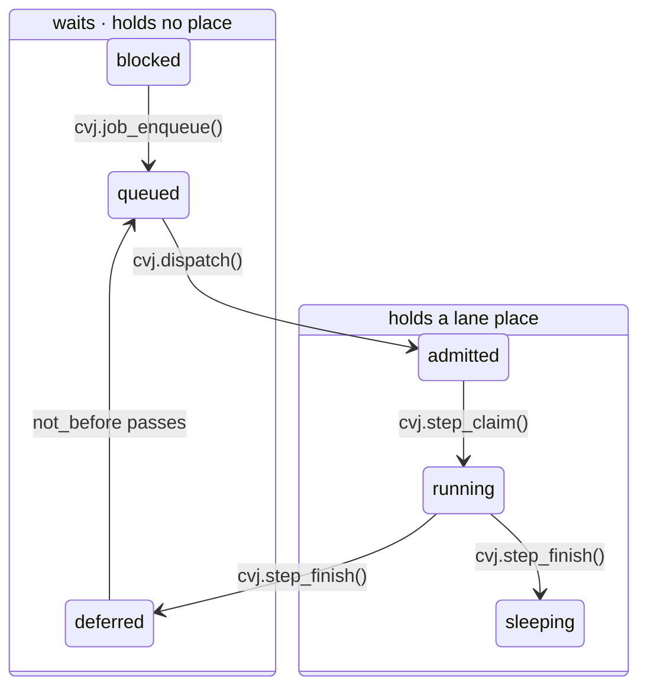

Fails: MA-STATE-01, 2 transitions between inner states of different composites. Render: no
threshold fails. In both versions the two transitions run as diagonals across both composite
borders. In 11.17.2 the label `cvj.step_finish()` sits on the borders.

**Positive P9.** A flat graph. The categories of S40 become classes that differ by fill and by
border, and the legend names them.

**Figure P9.** The states of a step — each transition labelled with its writer, or with its
condition where the source names no writer.

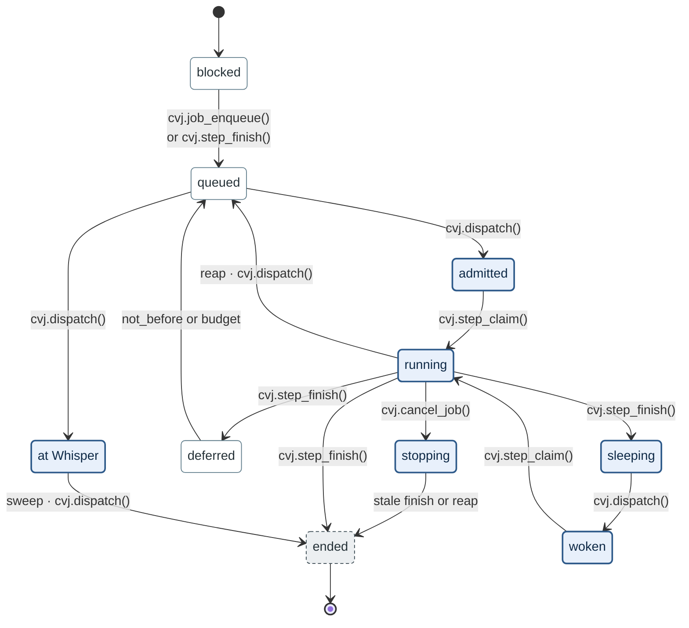

Legend:
- blue box, thick border = holds a lane place;
- white box, thin border = waits, holds no place;
- grey box, dashed border = final.

Three transitions are not drawn (S50). The start lease returns an admitted step to queued and wakes
a woken step again in its place. A cancel ends every other open state at once.

**Rework.**

- Failed as drafted: in 11.17.2 two labels `cvj.step_finish()` overlap by 78 px². Each version
  has 2 crossings. The three categories differed by colour alone (WCAG 2.2 SC 1.4.1).
- Fidelity: one label left out the budget of S42, and another named one of the two writers of S41.
- Changed: the settings line and the state palette (`hold`, `wait`, `final`). The transitions are
  written path by path, from the main path to the end of each branch. The labels name both writers
  and both conditions.
- After: 0 crossings and 0 label overlaps in both versions; 878 × 712 px (10.9.8) and
  880 × 778 px (11.17.2), text at 16 px.

### N10 → P10. A group the source does not define

**Negative N10.** A nested composite groups the launches:

```
state "launch starting or alive" as Launch {
    admitted --> running : cvj.step_claim()
    woken --> running : cvj.step_claim()
}
```

No source line defines this group. stopping also has a launch, the stale one, yet it sat outside
the box. Check: fidelity, a group without a supporting line.

**Positive P10.** Groups come only from a category of the source: the places of S40. P9 shows them
as classes.

### N13 → P13. A caption that claims too much

**Negative N13.** The draft caption of P9: "The states of a step and the writer of each
transition." The figure labels deferred → queued with a condition, because S42 names no writer.
Check: fidelity of the caption.

**Positive P13.** The caption of Figure P9: "each transition labelled with its writer, or with its
condition where the source names no writer."

## 5. Legend form: N14

**Negative N14.** The legend of P1 written as one chain of `shape = meaning` pairs:

```
Legend: stadium, dashed border = client apps · amber rounded box = workflow added or changed by this design · subroutine = Postgres functions · cylinder = tables · rectangle = sidecar · hexagon = host script · grey frame = the container or schema of the nodes inside it · solid arrow = call or write · dashed arrow = nudge or unwaited start (double arrow: start one way, nudge back).
```

`scan_register.py` counts one sentence of 72 words; its limit is 35. Check: the register scan of
the document.

**Positive P14.** The legend of P1: a list with one line per group of symbols, then one sentence
for what is not drawn.

## 6. Summary

| Pair | Defect class | Rule in SKILL.md | Check that catches it |
| :--- | :--- | :--- | :--- |
| N1 → P1 | structure and dynamics in one figure | Step 1; Step 3 | `MA-BUDGET-02`; `crossings`, `edges_through_nodes`, `edges_through_labels`, `legibility` |
| N2 → P2 | a relation no source line states | Step 2; Step 6.1 | inventory support column; fidelity verifier |
| N3 → P3 | an edge to or from a subgraph id | Step 4.5 | `MA-FLOW-02` |
| N4 → P4 | an external edge into the node under a title | Step 4.5 | `title_crossings` |
| N5 → P5 | a boundary around one node | Step 4.5 | `MA-FLOW-03`; `title_crossings` |
| N6 → P6 | left-to-right structure of more than 6 nodes | Step 4.6 | `MA-FLOW-06`; `legibility`, `title_crossings` |
| N7 → P7 | the payload of a call on a message | Rationalization Table; Step 5.3 | `MA-LABEL-04`; `lifeline_through_label` |
| N8 → P8 | a note wider than its box | Step 5.3; Step 8.3 | `MA-LABEL-05`; `clipped_labels` |
| N9 → P9 | transitions into inner composite states | Step 5.5 | `MA-STATE-01` |
| N10 → P10 | a group no source line defines | Step 6.2 | fidelity verifier |
| N11 → P11 | a number on a subject its line does not name | Step 6.5 | inventory support column; fidelity verifier |
| N12 → P12 | a returned value drawn on the call | Step 6.4 | fidelity verifier |
| N13 → P13 | a caption that claims more than the figure | Step 7 | fidelity verifier on the caption |
| N14 → P14 | a legend written as one chain | Step 7 | `scan_register.py` sentence length |
| P15 | a bar gap that shows no execution | Step 2 | render in both versions, looked at |
