# Renderer facts

The measured renderer behaviour that the rules of `SKILL.md` rest on. Each fact names the versions
measured, a reproduction, the observed behaviour and the author rule. Load this file to check a
rule, or when a render shows something no other reference explains.

**Measured.** 2026-10-02, on macOS, with `chrome-headless-shell` 131 and 150.

| Tag | mermaid | mermaid-cli | Used by |
| :--- | :--- | :--- | :--- |
| 10.9.3 | 10.9.3 | 10.9.1 | JetBrains IDEs 2024.3 to 2026.1 |
| 10.9.8 | 10.9.8 | 10.9.1 | the check pair, as its floor |
| 11.17.2 | 11.17.2 | 11.17.0 | the check pair; GitHub |
| 12.1.0 | 12.1.0 | 12.0.0 | the forward check |

- Renders in 10.9.x and 11.17.2 used `-w 1800`; renders in 12.1.0 used `--size 1800x1200`. A gantt
  with the gantt settings line was also rendered at `-w 916`, the width of the render check.
- A dark render passes `-t dark -b "#0d1117"`: GitHub's dark page. It is a render of 11.17.2
  unless the fact names 10.9.x as well.
- Sizes are CSS px of the SVG `viewBox` (RF-15).
- Geometry comes from the SVG: crossings, edges through nodes and titles, the effective font.
- Contrast is the WCAG ratio of a text's pixel colour to the colour behind it, read from 2x
  screenshots. Small anti-aliased glyphs read lower than their CSS colour.
- The same day, after the settings lines of `notation.json` changed, every reproduction was
  rendered again in 10.9.8, 11.17.2 and 12.1.0. 627 of 630 renders gave the stored result and
  `viewBox`. The other 3 are the `gitGraph` without commit ids of RF-19.

**Negative reproduction.** A paragraph that starts with these words labels a fence that breaks the
rules of `SKILL.md` on purpose. Never copy such a fence. Its last line, `%% negative: <checks>`,
names the lint rules, lint families and render checks that fail on it.

- The lint and the render check report the findings of the named checks as expected. Every other
  finding of the fence counts.
- A failure of a render check that the marker does not name fails the fence, as it fails a
  positive figure, and the render check exits 1. A marker that names only lint rules or families
  has its renders graded as a positive figure.
- A fence that fails none of its named checks is an error. The lint reports MA-NEG-01 when no named
  lint check fires; the render check exits 1 when no named render check fails.
- A parse or render error in 11.17.2 or 10.9.8 counts, unless the marker names a `PARSE` or `SYN`
  rule or family.
- The marker counts only in this skill's `references/` and `scripts/tests/fixtures/`. In any other
  file the lint reports it as the error MA-NEG-03, and both checks grade the fence as a figure.

Figures 1 and 2 (RF-12) are the only fences here that follow every rule.

**10.9.3 against 10.9.8.** Each fact whose Versions line names 10.9.3 gave the same result in both
versions: the same error, an equal SVG tree, or a pixel-equal PNG. RF-15, RF-16 and RF-17 name no
10.9.3 render and were not compared.

- 10.9.8 writes `classDef` colours as `rgb()` where 10.9.3 writes hex. The PNGs are pixel-equal.
- A `gitGraph` commit without an `id` differs between any two renders (RF-19).

**Why.** JetBrains IDEs ship 10.9.3, and the check pair renders 10.9.8 (TASK R5).

## 1. Viewers and their mermaid versions

Read on 2026-10-02.

| Viewer | Mermaid | Evidence |
| :--- | :--- | :--- |
| GitHub | 11.17.2 | the renderer bundle on `viewscreen.githubusercontent.com` |
| GitLab.com | 11.16.1 | `package.json` on `master` |
| GitLab self-managed 16.11 to 18.10 | 10.7.0 | `package.json` of each stable branch |
| VS Code 1.140, built-in preview | 11.17.0 | the lockfile of the built-in Mermaid extension |
| JetBrains IDEs 2024.3 to 2026.1 | 10.9.3 | `mermaid.js` inside the Mermaid plugin |
| Obsidian 1.13 | 11.13.0 | the application archive |
| Docusaurus 3.10 | 12.1.0 on a fresh install | the theme requires `mermaid >=11.6.0`; npm `latest` is 12.1.0 |

**Reproduction.** A fence that holds only the line `info` prints the version of the viewer that
draws it. The four installs printed v10.9.3, v10.9.8, v11.17.2 and v12.1.0.

- GitHub initializes theme `dark` on its dark page and `default` on its light page (RF-10).
- GitHub registers the layouts `dagre`, `cose-bilkent` and `swimlane`. It registers no ELK.
- GitLab self-managed 16.11 to 18.10 runs 10.7.0, below the 10.9 floor. The skill does not
  support it.

**Conclusion.** The check pair is 11.17.2 and 10.9.8. 12.1.0 is a forward check: of the viewers
above, only a fresh Docusaurus install renders with 12.x.

**Why.** GitHub and VS Code run 11.17, and JetBrains IDEs run 10.9 (TASK D3).

## 2. The operator draft's renderer facts, corrected

| Draft fact | Claim | Verdict | Fact |
| :--- | :--- | :--- | :--- |
| 1 | 12.x routes edges orthogonally and ignores `curve` | corrected: 12.0 made ELK and `neo` the defaults | RF-01 |
| 2 | an edge into the node under a title crosses it | confirmed; the shorter-title fix depends on font and layout | RF-02 |
| 3 | edges between subgraphs are unreliable | confirmed: both ends sit on box borders | RF-03 |
| 4 | composite states break in 10.9 | confirmed in 10.9, 11.17 and 12.1 | RF-04 |
| 5 | declaration order does not fix layout | corrected: edge order placed the siblings; declaration order moved nodes in P1 only | RF-05 |
| 6 | one long sequence label widens the figure | confirmed: 477 px against 200 px | RF-06 |
| 7 | headless renders fall back to serif | corrected: the sanitizer blanks the font value | RF-07 |

### RF-01 — 12.x defaults to the ELK layout and the `neo` look

**Versions.** 10.9.3, 10.9.8, 11.17.2, 12.1.0.

**Negative reproduction.** No settings line, so each version applies its own defaults.

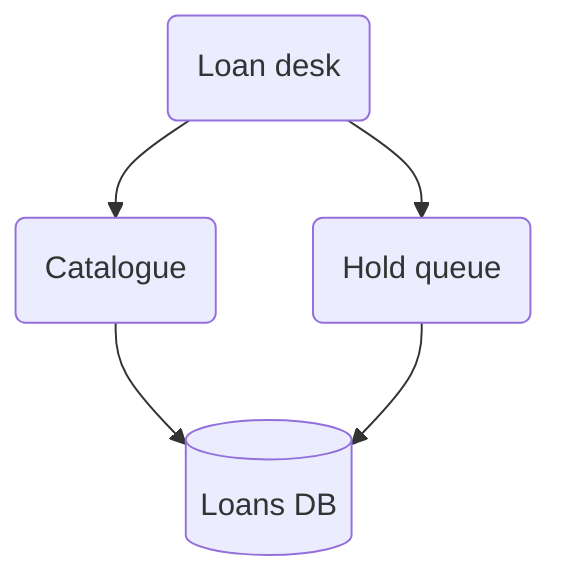

**Observed.**

- 12.1.0 lays the figure out with ELK. Edges run orthogonally with rounded corners. Nodes carry
  drop shadows: the `neo` look.
- Under ELK the spacing and curve keys have no effect. The curves `linear` and `stepAfter` gave
  equal SVGs. Node and rank spacing of 20 px and of 120 px both gave 356 × 283 px.
- With `"layout": "dagre", "look": "classic"`, 12.1.0 draws curves without shadows. The spacing
  keys then apply: 336 × 233 px at 20, 436 × 433 px at 120.
- 11.17.2 lays out with dagre and the `classic` look by default. The two keys leave its SVG equal.
- 10.9.3 and 10.9.8 have neither key. Both drop the keys without an error, and the SVG stays equal.

**Rule.** Copy the settings line of `assets/notation.json` as the first line. It pins both keys.

### RF-02 — an edge into the node under a title crosses the title

**Versions.** 10.9.3, 10.9.8, 11.17.2, 12.1.0.

**Negative reproduction.** The group's only member sits under the centred title.

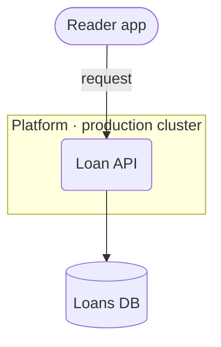

**Observed.**

- Every version draws the `request` edge through the title, 15 to 20 px inside the title box. The
  render check reports `title_crossings` in 10.9.x, 11.17.2 and 12.1.0.
- The draft fixes its pair N4 by a shorter title (P4, a 12-node container view). The result
  depends on font and layout. Measured in 12.1.0 under ELK, against the painted title text:

| Title and font | Edge to title text |
| :--- | :--- |
| `n8n-worker`, serif fallback of the blanked font (RF-07) | 4.2 px outside |
| `n8n-worker`, the default stack, `"trebuchet ms"` first | 1.8 px inside |
| `n8n-worker`, `Helvetica, Arial` | 2.6 px inside |
| `n8n · n8n-worker`, serif fallback | 10.3 px inside |

- Under dagre the edge passed no title, with either title: 10.9.x, 11.17.2, and 12.1.0 with the
  settings line.

**Rule.** No edge from outside enters the node under a title's centre (`SKILL.md` Step 4.5). A pass
by a few px is a near miss: `svg_geometry.py` reports it as `title_near_miss`.

**Why.** The clearance changed sign between two fonts. Viewers draw with different fonts.

### RF-03 — an edge to a subgraph id ends on the box border

**Versions.** 10.9.3, 10.9.8, 11.17.2, 12.1.0.

**Negative reproduction.** Both edges start at a subgraph id.

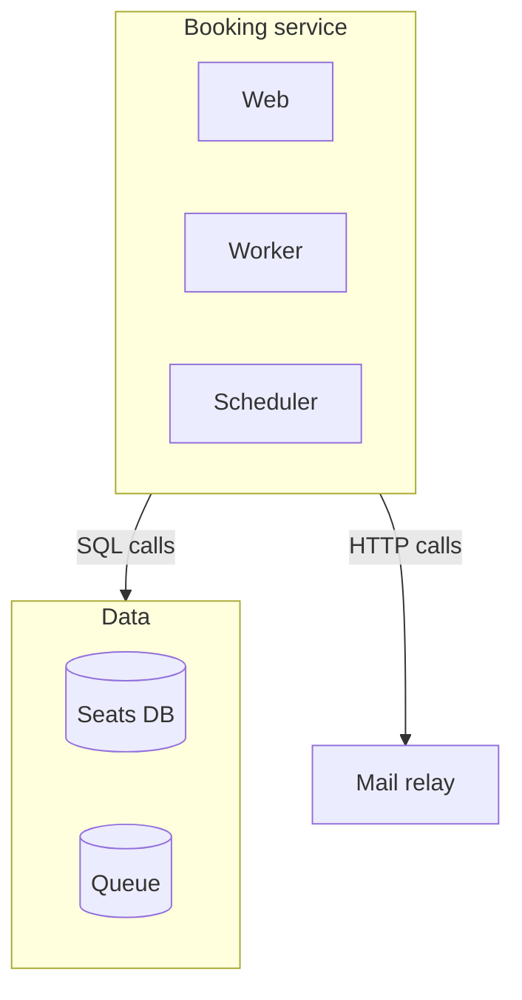

**Observed.**

- In every version both edges start on the border of `Booking service`, 35–40 px from the
  nearest member.
- The `SQL calls` edge ends on the border of `Data`, 39–58 px from either member.
- Under dagre the starts sit below `Scheduler`, the bottom member. Under ELK they sit below `Web`.
- No label touched a box in this reproduction.

**Rule.** Draw only the node-to-node edges the text states (`SKILL.md` Step 4.5). A legend
sentence states "every member reaches the store".

**Why.** A reader takes an edge for a relation of the member next to its start.

### RF-04 — a transition into an inner state of a composite

**Versions.** 10.9.3, 10.9.8, 11.17.2, 12.1.0.

**Negative reproduction.** Two transitions join states of different composites.

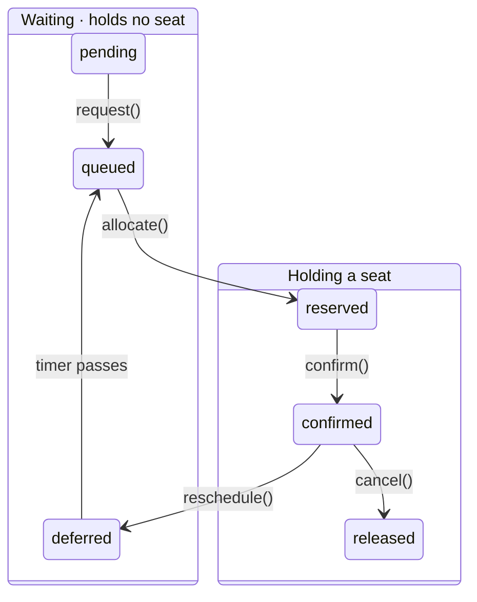

**Observed.**

- 10.9.x and 11.17.2 place the composites side by side. `allocate()` and `reschedule()` each cross
  both composite borders, 181–202 px sideways over 76–110 px down.
- 12.1.0 with the settings line draws the same two diagonals.
- 12.1.0 under ELK stacks the composites. `allocate()` enters the lower composite through its
  title text `Holding a seat`, and `reschedule()` runs 508 px upward through the same title band.
- A transition that starts or ends at a composite itself crossed nothing in any version. Tested:
  `Idle --> Active` and `Active --> Done` around a composite `Active`.
- 10.9.x draws a transition label on a box at opacity 0.5, and 11.17.2 at 80 % opacity. A line
  under a label shows through it.

**Rule.** Draw a flat graph and mark categories with classes. Use a composite only when every
transition starts or ends at the composite itself (`SKILL.md` Step 5.5).

### RF-05 — edge order places siblings; declaration order did so in P1 only

**Versions.** 10.9.3, 10.9.8, 11.17.2, 12.1.0 under ELK and under dagre.

**Negative reproduction.** The nodes are declared C, B, A; the edges name A, B, C.

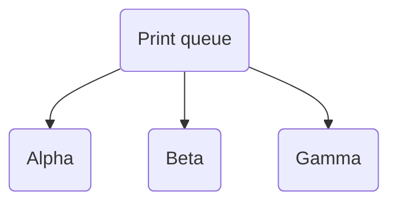

**Observed.**

- Every version places the siblings A, B, C from left to right.
- Declared A, B, C with the edges in the order C, B, A, they come out C, B, A.
- Node declaration order moved no node in either reproduction.
- In P1 of `paired-examples.md`, declaration order moved two nodes (`layout-and-planarity.md`
  §4.1).

**Rule.** Change the structure first (`SKILL.md` Step 4.7). Then move the first edge line that
names the node, or its declaration, and re-render after each change.

### RF-06 — a long message label

**Versions.** 10.9.3, 10.9.8, 11.17.2, 12.1.0.

**Negative reproduction.** One message carries its payload.

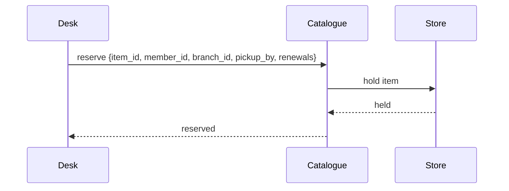

**Observed.**

- Without `wrap`, the Desk–Catalogue gap grows to 477 px, and the other gap stays 200 px. The
  figure is 927 px wide; with the label `reserve item` it is 650 px. All four versions agree.
- With the settings line, `"wrap": true` keeps both gaps at 200 px and breaks the label into
  2 lines. They measure 216 and 232 px in 10.9.x and 11.17.2, and 235 and 256 px in 12.1.0. Both
  lifelines cross each line.
- Between neighbours, in 10.9.x and 11.17.2 with `wrap`: a message of 24 characters measured 184
  to 188 px and cleared both lifelines. At 26 characters one lifeline touched it. From 27 to 32
  characters it stayed on one line, 208 to 245 px wide, and both lifelines crossed it.
- `wrap` broke a message only past about 250 px. The first line of a 34- to 40-character message
  measured 200 px and met one lifeline.
- In 12.1.0 both lifelines crossed every message from 24 characters on.
- A message that skips a participant is crossed by that participant's lifeline in every version.
- Without `wrap`, a 61-character note passes each border of its 300 px box by 68 px. In 12.1.0 it
  passes by 93 px.
- With `wrap`, the same note fits its 250 px box in 2 lines. In 12.1.0 it passes each border by
  4 px.

**Rule.** A message between neighbours names its operation in about 3 words: at most 24
characters per line (`labels.sequence_message_chars_max`), in at most 2 lines. The payload stays in
the text's table.

**Why.** With `wrap`, at the 200 px gap, a message of 26 characters or more meets a lifeline in
10.9.x and 11.17.2.

### RF-07 — the directive sanitizer blanks a font value

**Versions.** 10.9.3, 10.9.8, 11.17.2, 12.1.0.

**Negative reproduction.** The draft's font value.

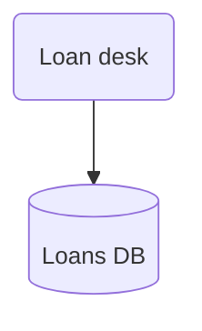

**Observed.**

- The SVG's root rule holds `font-size:14px` and no `font-family`, in all four versions.
- The text then takes the font of the page. The page of mermaid-cli defaults to Times, so the
  draft's renders were serif.
- A `themeVariables` value is kept only when it matches `^[\d "#%(),.;A-Za-z]+$`. One `-`, `_`,
  `:` or `/` blanks the whole value.
- Blanked: `sans-serif`, `Helvetica_Neue`, `Helvetica:Neue`, `Helvetica/Arial`. The same value in
  YAML frontmatter was blanked too.
- Kept: `Helvetica, Arial`, as `font-family:Helvetica,Arial`. A comma does not blank a value.
- A top-level `"fontFamily"` is kept. 10.9.3 and 10.9.8 then drop every other theme variable.
  The font size fell back from 14px to 16px. The node fill fell back from `#E8F0FB` to `#fff4dd`.
  11.17.2 and 12.1.0 kept both.
- A font override passed to mermaid-cli as CSS (`-C`) cut labels in 10.9.x and 11.17.2.
  `Circulation desk` showed as `Circulation`: a 115 px box held 154 px of Courier text.
- 12.1.0 sized the same labels for the override and cut none.

**Rule.** A settings line sets no font and no theme value with `-`, `_`, `:` or `/` (TASK D15).

**Why.** 10.9.x and 11.17.2 size each label before the CSS override applies.

## 3. More layout facts

### RF-08 — dagre draws an edge through an unrelated node

**Versions.** 10.9.3, 10.9.8, 11.17.2, 12.1.0.

**Negative reproduction.** Reduced by line removal until the defect remained. `prep` and `packer`
appear only in edges.

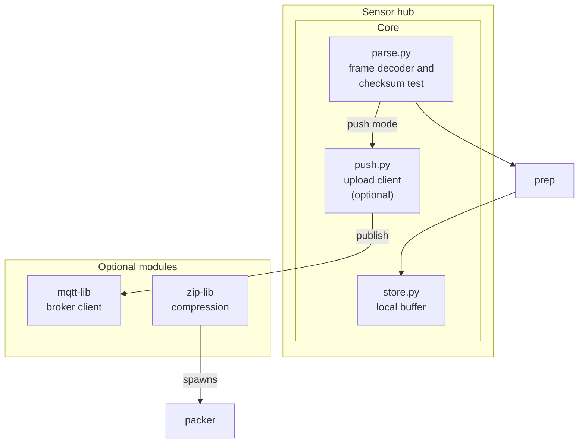

**Observed.**

- 10.9.x draws the `publish` edge 74 px through `zip-lib`, and 11.17.2 draws it 140 px through
  it, as `edges_through_nodes` of the render check measures. The line reads as an edge from
  `zip-lib` to `mqtt-lib`.
- 12.1.0 under ELK draws no edge through a node.
- Every version places `prep` and `packer` outside both subgraphs.

**Rule.** Look for lines through boxes in the 10.9.8 and 11.17.2 PNGs. `notation.json` allows 0
(`thresholds.max_edges_through_nodes`). Declare every node inside the subgraph it belongs to.

### RF-09 — label wrapping differs by version

**Versions.** 10.9.3, 10.9.8, 11.17.2, 12.1.0.

**Negative reproduction.** A plain 76-character label and no settings line.

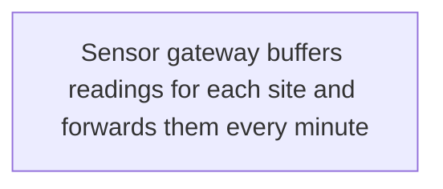

**Observed.**

| Label | 10.9.x | 11.17.2 | 12.1.0 |
| :--- | :--- | :--- | :--- |
| plain, no settings line | 1 line, node 581 px wide | wrapped at 200 px, 4 lines | wrapped at 120 px, 6 lines |
| plain, `wrappingWidth` 400 | 1 line, node 581 px wide | wrapped at 400 px, 2 lines | wrapped at 400 px, 2 lines |
| markdown string, no settings line | wrapped at 200 px | wrapped at 200 px | wrapped at 120 px |
| markdown string, `wrappingWidth` 400 | wrapped at 400 px | wrapped at 400 px | wrapped at 400 px |
| `<small>` line of 39 characters, no settings line | 1 line | wrapped at 200 px | wrapped at 120 px |

- With the settings line, a 32-character first line over a 40-character `<small>` line stayed on
  2 lines in every version. The wider line measured at most 248 px in Latin, 278 px in Cyrillic.
- 10.9.x never wraps a plain label or a `<small>` line. Their length sets the node's width.

**Rule.** The flowchart settings line sets `wrappingWidth` 400. Break lines with ` `, within
`labels.node_line1_chars_max` 32 and `labels.node_second_line_chars_max` 40.

### RF-20 — sequence width, participant names and note colours

**Versions.** 10.9.3, 10.9.8, 11.17.2, 12.1.0; dark renders in 10.9.3, 10.9.8 and 11.17.2.

**Negative reproduction.** Seven participants, one message between each pair of neighbours.

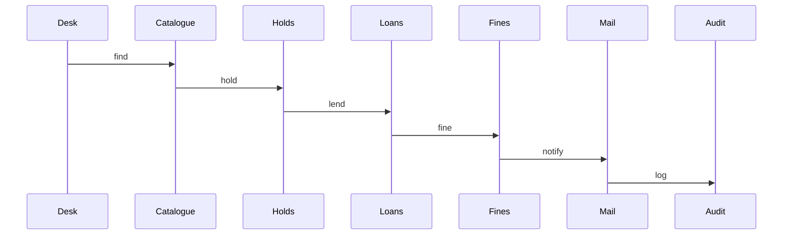

**Observed.**

- Each participant takes a 200 px column. Six participants measure 1250 px: 11.5 px text in a
  900 px column. Seven measure 1450 px: 9.9 px. All four versions agree.
- A name stays on one line while it fits its 150 px box. `Settlement service`, 18 characters,
  measured 134.9 px in 10.9.x and 11.17.2. In 12.1.0 it measured 153.6 px, 1.8 px past the box.
- With `wrap`, a wider name breaks into lines, and a word wider than the box breaks inside the
  word: `Reconciliationservice` drew as `Reconciliationservic-` over `e` in all four versions.
- In the dark theme's own colours, note text measures 4.44:1 from its CSS colours, `#B8B6B6` on
  `#484949`, and 4.49:1 from the pixels, in 10.9.x and 11.17.2. With the note colours of the
  settings line, `#263238` on `#FFF8E1`, it measures 12.39:1 in the light and the dark renders.

**Rule.** Stay within 6 participants, the soft and the hard budget
(`budgets.sequence.participants`). A name holds at most 18 characters
(`labels.participant_chars_max`). Keep the note colours of the sequence settings line
(`sequence.md` §1, §2).

## 4. Dark mode

### RF-10 — GitHub's theme and the diagram's theme

**Versions.** GitHub's bundle, read on 2026-10-02; renders in 10.9.3, 10.9.8 and 11.17.2.

**Negative reproduction.** A fixed `theme: base`, drawn on GitHub's dark page.

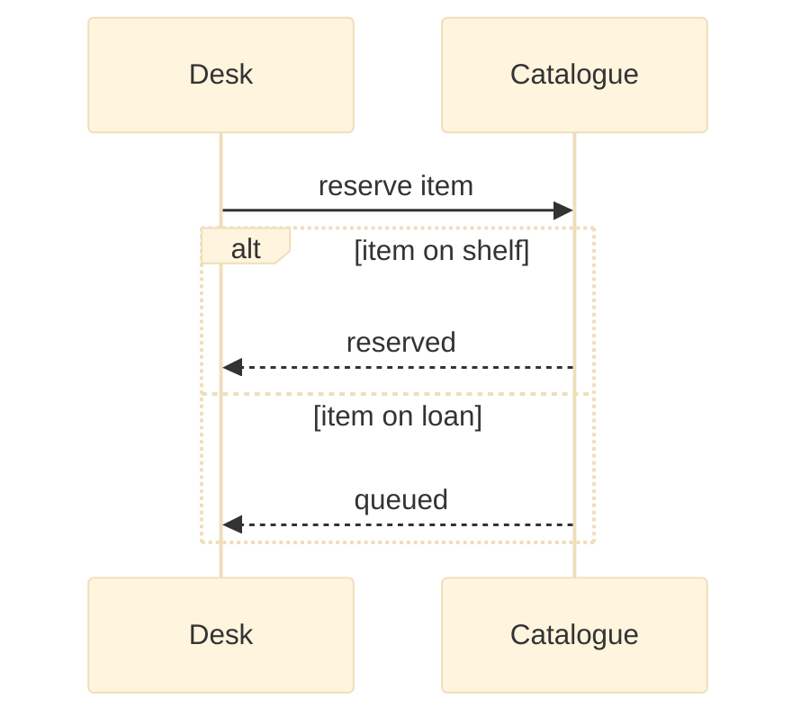

**Observed.**

- GitHub calls `initialize` with theme `dark` on its dark page and `default` on its light page.
  Its dark page is `#0d1117`.
- A `theme` in the fence overrides that call in every version measured.
- The reproduction draws its messages and `alt` guards as `#333333` on `#0d1117`: 1.5:1.

**Rule.** A settings line holds no `theme` key (`SKILL.md` Step 5.1).

### RF-11 — what breaks on the dark page

**Versions.** 10.9.8 and 11.17.2, dark renders. 10.9.3 gave the 10.9.8 values.

| Input | Text on background, dark | 11.17.2 | 10.9.8 |
| :--- | :--- | :--- | :--- |
| `theme: base`, messages and guards | `#333333` on `#0d1117` | 1.5:1 | 1.5:1 |
| `theme: base`, gantt axis ticks | `#2B2C2D` on `#0d1117` | 1.35:1 | 1.35:1 |
| no theme, messages in `rect rgb(250,250,250)` | `#D3D3D3` on `#FAFAFA` | 1.43:1 | 1.43:1 |
| no theme, title of `box rgb(232,240,251)` | `#CCCCCC` on `#E8F0FB` in 11.17.2 | 1.4:1 | 17.46:1 |
| no theme and no colour, lowest text | `#D3D3D3` on `#1F2020` | 10.91:1 | 10.91:1 |
| a sequence note in the dark theme's note colours, CSS colours | `#B8B6B6` on `#484949` | 4.44:1 | 4.44:1 |
| gantt line without `themeCSS`: a label right of an `active` bar | `#212121` on `#2E2F2A` | 1.19:1 | 1.19:1 |
| gantt line without `themeCSS`: a label right of a `done` bar | `#D3D3D3` or `#212121` on `#2E2F2A` | 9.01:1 | 1.19:1 |
| gantt line without `themeCSS`: a label left of an `active` bar | `#212121` on `#14171C` | 1.12:1 | 1.12:1 |
| gantt line: a label outside a bar, over a weekend band | `#D3D3D3` on `#A39A5E` | 1.91:1 | 1.91:1 |

In the light renders, the same texts measured 6.79:1 or more. The gantt rows used the gantt
settings line of `notation.json`, with its `themeCSS` removed where the row says so.

**Rule.** No fixed light colour sits behind text that the theme draws. A `box` and a `rect` take
the translucent colours of `palette.sequence`. A note takes the note colours of the sequence
settings line. A gantt chart keeps the `themeCSS` of its settings line, and no gantt label outside a
bar sits on a weekend band.

**Why.** On the dark page the theme draws light text. A fixed light area then holds light text.

### RF-12 — the theme-following recipe, measured

**Versions.** 10.9.3, 10.9.8, 11.17.2 and 12.1.0, light; 10.9.8 and 11.17.2, dark.

1. The settings line sets no `theme` and no font.
2. A node class sets `fill`, `stroke` and `color` together: `palette.flowchart`, `palette.state`.
3. A group takes the translucent `palette.cluster` and sets no text colour.
4. A sequence `box` takes `rgba(127,127,127,0.08)`; a phase `rect` takes `rgba(127,127,127,0.10)`.
   The sequence settings line fixes the note colours: `#263238` on `#FFF8E1` (RF-20).
5. The gantt settings line colours the bars. Its `themeCSS` redraws a label outside a `done` or
   `active` bar, on either side, so that it reads on both pages (`gantt.md` §3).

Figures 1 and 2 follow every rule of `SKILL.md`. Both render in all four versions, under 900 px
wide, with 16 px text in 10.9.x and 11.17.2.

- Figure 1 has 0 crossings, 0 edges through nodes and 0 edges through titles in every version.
- In Figure 2 no lifeline crosses a message.

**Figure 1.** Telemetry pipeline — five relations between six components, drawn with the palette.

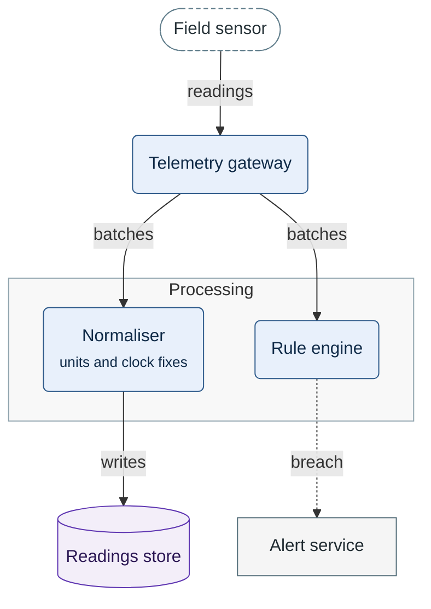

Legend:
- dashed stadium = a device outside the system; blue rounded box = a component of the system;
- cylinder = a store; grey rectangle = a service; grey box = a processing group;
- solid arrow = data sent; dotted arrow = an alert raised.

**Figure 2.** Seat hold — one call and its reply inside a phase, between two participants of one
system.

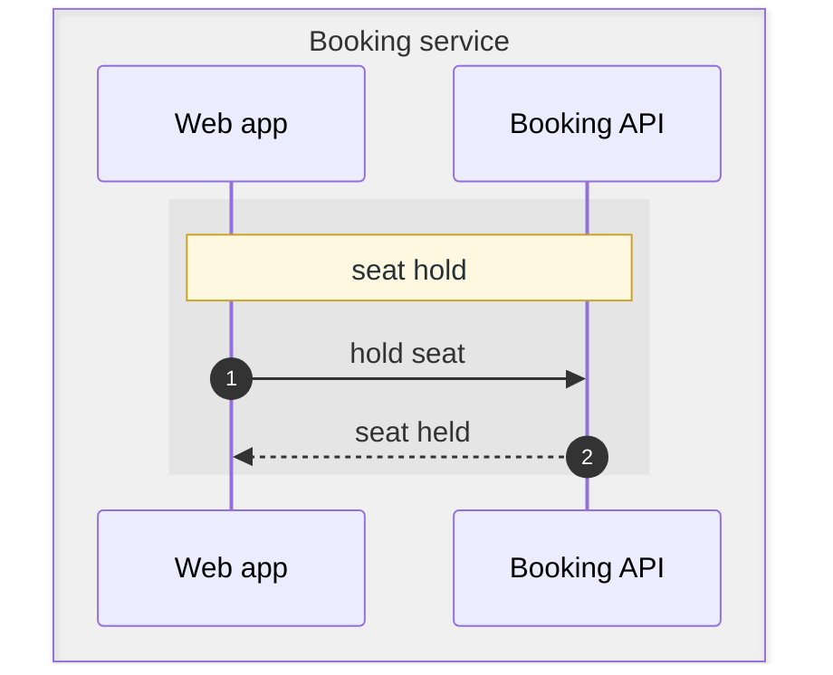

Legend:
- grey band = the participants of one system; lighter area = one phase, named by its first note;
- solid arrow = a call; dashed arrow = its reply; numbers = message order.

**Observed.** The lowest contrast per text group:

| Text | 11.17.2 light | 11.17.2 dark | 10.9.8 dark |
| :--- | :--- | :--- | :--- |
| Figure 1, node text on a class fill | 12.68:1 | 12.68:1 | 12.68:1 |
| Figure 1, group title | 11.9:1 | 17.96:1 | 17.96:1 |
| Figure 1, edge labels | 10.6:1 | 4.43:1 | 4.43:1 |
| Figure 2, messages and box title | 10.03:1 | 8.97:1 | 10.55:1 |
| a 4-state probe with the `palette.state` classes | 10.79:1 | 4.43:1 | 11.1:1 |
| a 5-bar plan chart with the gantt settings line | 6.79:1 | 7.76:1 | 7.76:1 |

- The 4.43:1 values are the dark theme's own label colours: `#CCCCCC` on `#585858`. They are
  under `contrast_min` 4.5 of `notation.json`.
- The theme draws edge labels and transition labels this way in every figure on the dark page.
- Three other kinds draw theme text under 4.5:1 on the light page as well: the default timeline
  palette at 3.05:1, the default mindmap palette at 2.56:1, a gitGraph branch label at 3.35:1.
- The render check reports theme text as information, never as a failure (`contrast_scope`
  `author_set`, TASK 108 D26). Contrast it fails is contrast the fence set.

**Rule.** Keep the recipe. Set no text colour inside a figure beyond the palette and the settings
lines.

**Why.** A text colour set in the fence holds on both pages. It reads on both only over a fill the
fence sets as well: a class fill, a note box, a gantt bar. Over the page it matches one theme only
(RF-11).

## 5. Parse hazards and changes with no error

### RF-13 — inputs that fail, or that change the figure with no error

**Versions.** 10.9.3, 10.9.8, 11.17.2, 12.1.0. Every input below is a negative reproduction.

Flowchart:

| Input | 10.9.x | 11.17.2 | 12.1.0 | Write instead |
| :--- | :--- | :--- | :--- | :--- |
| `Api[Loan API (gateway)]` | parse error | parse error | parse error | `Api["Loan API (gateway)"]` |
| `Items[Items[]]` | parse error | parse error | parse error | a quoted label |
| `Route[/api/loans]` | lexical error | lexical error | lexical error | a quoted label |
| `Note[say "renew" now]` | parse error | parse error | parse error | `#quot;` in a quoted label |
| `Note["say "renew" now"]` | parse error | parse error | parse error | `#quot;` |
| `Note["say "renew""]` | shows `say renew` | shows `say renew` | shows `say renew` | `#quot;` |
| `A["List<Item> of loans"]` | shows `List of loans` | shows `List of loans` | shows `List of loans` | `#lt;Item#gt;` |
| `A["renew item\nfor a week"]` | breaks the line | breaks the line | breaks the line | ` ` |
| `start --> end` | parse error | parse error | parse error | another id; `End` renders |
| `a --> b_c` and `a_b --> c` | renders | renders | no render: `TypeError` | ids of `[A-Za-z0-9]+` |
| `A---ops["Operations"]` | circle end on a node `ps` | the same | the same | `A --- ops` |
| `A---xray["Scanner"]` | cross end on a node `ray` | the same | the same | `A --- xray` |
| subgraph title `direction LR here` | parse error | parse error | parse error | a title without `direction` |
| `classDef default` and `style G` | the class sets the group's fill | `style G` holds | `style G` holds | no `classDef default` |
| init with a trailing comma | ignored, no error | ignored, no error | ignored, no error | strict JSON |

Sequence:

| Input | 10.9.x | 11.17.2 | 12.1.0 | Write instead |
| :--- | :--- | :--- | :--- | :--- |
| `D->>C: renew; return` | parse error | parse error | parse error | `#59;` |
| `D->>C: list &lt;all&gt; items` | parse error | parse error | parse error | plain words, or `#lt;` and `#gt;` |
| `D->>C: renew item #2 today` | shows `renew item` | the same | the same | `#35;` |
| `Note over D,C: shelf #4 is full` | shows `shelf` | the same | the same | `#35;` |
| `D->>C: renew item\nfor a week` | prints `\n` | prints `\n` | prints `\n` | ` ` |
| `V--xFO: error log`, a typo | adds a participant `FO` | the same | the same | declare every participant |

State:

| Input | 10.9.x | 11.17.2 | 12.1.0 | Write instead |
| :--- | :--- | :--- | :--- | :--- |
| `onLoan --> overdue : due: today` | parse error | renders | renders | a label without `:` |
| `onLoan --> returned : renew; return` | stray states `;` and `return` | the same | the same | a label without `;` |
| `onLoan --> returned : renew\nfor a week` | breaks the line | prints `\n` | prints `\n` | ` ` for a second writer; else one line |
| `style printing fill:#E8F0FB` | stray states `style` and `fill` | applies the fill | applies the fill | `classDef` and `class` |
| `style printing fill:#E8F0FB,stroke:#2E5A8A` | parse error | applies the style | applies the style | `classDef` and `class` |

- 11.17.2 and 12.1.0 join the two node ids with `_` into an edge id. Both edges get `L_a_b_c_0`.
  11.17.2 renders them; 12.1.0 stops with a `TypeError`.
- A malformed init leaves the figure at each version's defaults. The reproduction set a rank
  spacing of 150 px; 10.9.x drew the figure 134 px tall instead of 234 px.

**Rule.** Quote every label that holds punctuation. Write the entity forms of the last column.
The lint parses the settings line as JSON, because mermaid does not report a malformed one.

## 6. Syntax above the 10.9 floor

### RF-14 — constructs that 10.9 rejects

**Versions.** 10.9.3, 10.9.8, 11.17.2, 12.1.0. "Since" is the release that added the construct,
from the mermaid release notes. Every input is a negative reproduction.

| Construct | Since | 10.9.x | 11.17.2 | 12.1.0 |
| :--- | :--- | :--- | :--- | :--- |
| `B@{ shape: cyl, label: "Loans DB" }` | 11.3.0 | lexical error | renders | renders |
| an edge id: `A e1@--> B` | 11.5.0 | parse error | renders | renders |
| gantt `vert` task | 11.7.0 | `TypeError` | renders | renders |
| `participant S@{ "type": "database" }` | 11.11.0 | lexical error | renders | renders |
| `classDef` in a `sequenceDiagram` | — | parse error | parse error | parse error |
| `architecture-beta` | 11.1.0 | unknown kind | renders | renders |
| `packet-beta`; `packet` | 11.0.0; 11.9.0 | unknown kind | renders | renders |
| `kanban` | 11.4.0 | unknown kind | renders | renders |
| `radar-beta` | 11.6.0 | unknown kind | renders | renders |
| `treemap-beta` | 11.8.0 | unknown kind | renders | renders |
| `xychart`, `sankey`, `block` without `-beta` | 11.10.0 | unknown kind | renders | renders |
| `venn-beta`, `ishikawa-beta` | 11.13.0 | unknown kind | renders | renders |
| `usecase-beta`, `agentflow-beta` | 12.0.0 | unknown kind | unknown kind | renders |

"Unknown kind" is mermaid's `UnknownDiagramError`.

These kinds rendered in all four versions:

- preferred: `flowchart`, `graph`, `sequenceDiagram`, `stateDiagram-v2`, `gantt`, `erDiagram`;
- allowed: `classDiagram`, `timeline`, `mindmap`, `quadrantChart`, `journey`, `gitGraph`,
  `requirementDiagram`;
- listed under `avoid` in `notation.json`: `block-beta`, `C4Context`, `stateDiagram`, `pie`,
  `xychart-beta`, `sankey-beta`.

**Rule.** Use the `preferred` and `allowed` kinds of `notation.json` only (`SKILL.md` Step 5.5).

### Safe in 10.9.3, 10.9.8, 11.17.2 and 12.1.0

Each item rendered with no error and as written in all four versions.

- Settings: an `%%{init}%%` line in strict JSON; theme values within the sanitizer's characters;
  `"layout": "dagre"` and `"look": "classic"`; `flowchart.wrappingWidth`; `sequence.wrap`;
  `gantt.useWidth`; the `themeCSS` rule of the gantt settings line.
- Flowchart shapes: `("…")`, `(["…"])`, `[["…"]]`, `[("…")]`, `["…"]`, `{{"…"}}`.
- Flowchart edges: `-->`, `-.->`, `==>`, `<-.->`, `~~~`, and labels as `-->|"…"|`.
- Label markup: ` `, `<small>`, and the entities `#quot;`, `#35;`, `#59;`, `#lt;`, `#gt;`.
- Classes and groups: a named `classDef` with `class`, and `style` on a subgraph id.
- Sequence: aliases, `autonumber`, `box rgba(…)`, `rect rgba(…)`, `+` and `-` activations, `alt`,
  `loop`, `opt`, `par`, `critical`, `break`, `Note over`, `create` and `destroy`.
- State: `state "…" as id`, `[*]`, `<<choice>>`, `<<fork>>`, `<<join>>`, `classDef` with `class`,
  `direction TB`.
- Gantt: `dateFormat x`, durations with a unit, `axisFormat %Q`, `tickInterval`,
  `todayMarker off`, numeric starts, the tags `done`, `active`, `crit` and `milestone`.
- `accTitle` and `accDescr` in flowchart, sequence, state and gantt.

### Avoid

| Construct | Fact |
| :--- | :--- |
| a fence without the settings line of its kind | RF-01 |
| a `theme` key; a fixed light colour behind theme text | RF-10, RF-11 |
| a theme value with `-`, `_`, `:` or `/`; a top-level `fontFamily`; a CSS font override | RF-07 |
| an edge to a subgraph id; an outside edge into the node under a title | RF-02, RF-03 |
| a transition into an inner state of a composite | RF-04 |
| unquoted punctuation in a label; `end` as an id; `_` in an id; `---o` or `---x` with no space | RF-13 |
| `;`, `#` or `&lt;` in sequence text; `:` or `;` in state labels; `\n` in sequence or state text | RF-13 |
| `style` in a state diagram; `classDef` in a sequence; `classDef default` | RF-13, RF-14 |
| a malformed settings line | RF-13 |
| the constructs and kinds of the RF-14 table | RF-14 |
| gantt `after`, `topAxis` as a statement, `axisFormat %L`, a repeated section | §8 |
| a gantt line without its `themeCSS`; a gantt label outside a bar over a weekend band | RF-11 |

## 7. Measuring a render

### RF-15 — size comes from the SVG `viewBox`, not from PNG pixels

**Versions.** mermaid-cli 10.9.1, 11.17.0 and 12.0.0.

- mermaid-cli 10.9.1 and 11.17.0 with `-w 1800` write the PNG at the figure's own size. RF-01's
  figure gave 279 × 293 px in 11.17.2.
- mermaid-cli 12.0.0 scales the PNG to 1800 px on its longer side. The same figure, 356 × 283 px
  in 12.1.0, gave an 1800 × 1432 px PNG. The `x1200` of `--size 1800x1200` had no effect.
- mermaid-cli 12.0.0 writes `max-width: 1800px` into every SVG, whatever the figure's size.

**Rule.** Read width and font size from the SVG's `viewBox` and root rule. The effective font is
the font size × min(1, `column_px` 900 / width); its floor is `min_effective_font_px` 10.

### RF-16 — mermaid-cli 12 draws 12.1.0 in its own theme and font

**Versions.** 10.9.8, 11.17.2, 12.1.0.

- mermaid-cli 12.0.0 passes no theme unless `-t` is given. 12.1.0 then draws a flowchart in its
  per-kind theme `redux-color`, with `"Recursive Variable"` at 14 px.
- It embeds four fonts, and an SVG grows to about 200 KB. With `-t default`, the SVG is 15 KB.
- With `-t default`, 12.1.0 draws `"trebuchet ms"` at 16 px, as 11.17.2 and 10.9.8 do.

**Rule.** A forward render in 12.1.0 passes `-t default`, the theme GitHub's light page passes.

### RF-17 — one call renders every fence of a document

**Versions.** 10.9.8, 11.17.2, 12.1.0.

- `mmdc -i doc.md -o out.md -e svg` writes `out-1.svg`, `out-2.svg` and on, in fence order.
- Three fences took 0.50 s in one 11.17.2 call, and 1.18 s in three calls.
- Each batch SVG had the `viewBox` of its single render.

**Rule.** Render the figures of one document in one call per version.

### RF-18 — a gantt takes the width of its container, unless `useWidth` fixes it

**Versions.** 10.9.3, 10.9.8, 11.17.2, 12.1.0.

- Without a settings line, at `-w 1800`, a gantt's `viewBox` is 1784 px wide in 10.9.x and
  11.17.2. At `--size 1800x1200`, it is 1800 px wide in 12.1.0.
- With a site configuration of `gantt.useWidth` 1200, as GitHub's renderer bundle sets, the same
  gantt is 1200 px wide.
- The gantt settings line of `notation.json` sets `useWidth` 900. The chart is then 900 px wide at
  a page width of 916 px and of 1800 px, and over the site value of 1200.

**Rule.** Keep the gantt settings line; it fixes the chart at the column width (`gantt.md` §4).

### RF-19 — a `gitGraph` commit without an id differs between renders

**Versions.** 10.9.3, 10.9.8, 11.17.2, 12.1.0.

- A `commit` without `id:` gets a random id on each render, such as `0-8627416`.
- Two renders of one source in 10.9.8 differed in 830 pixels.
- With `commit id: "init"`, the SVGs of 10.9.3 and 10.9.8 were equal.

**Rule.** Give every `gitGraph` commit an `id`.

### RF-21 — mermaid-cli serves local files to the page

**Versions.** mermaid-cli 11.14.0 to 12.0.0. This project runs 11.17.0 (the check pair) and 12.0.0
(`--forward`, the latest release on 2026-10-05); 11.12.0 and earlier have no such filter.

**Observed.** The request filter of mermaid-cli inverts its allowlist. A page can load a local
`.css`, `.js`, `.mjs` or `.woff2` file by its path.

**Rule.** Render a figure, never a page that someone else wrote. Strict mode keeps a figure from
running script, and the browser resolves no host, so a loaded file cannot leave the machine.
Further detail went to the maintainers in a private report on 2026-10-05 (WI-30) and stays out of
this file until a public advisory describes it (`security-audit` §6.1).

### RF-22 — the floor renderer runs on the puppeteer of v11

**Versions.** mermaid 10.9.8 with mermaid-cli 10.9.1, measured 2026-10-05.

**Observed.** mermaid-cli 10.9.1 asks for puppeteer `^19.0.0`. Puppeteer 19.11.1 pins
`extract-zip` 2.0.1, `tar-fs` 2.1.1 and `ws` 8.13.0: 6 high advisories, and `extract-zip` has no
release with a fix. The v10 lockfile overrides puppeteer with 25.12.0, the version of v11. npm
audit then reports no advisory, and the lockfile holds 135 entries instead of 190. Every mermaid
fence of `references/` rendered in 10.9.8 with the same metrics as under 19.11.1, in the same
browser build. The setup selects headless mode `shell` for puppeteer 22 or newer, as for v11.

**Rule.** Keep the override while v10 renders with mermaid-cli 10.9.1. Render every reference in
10.9.8 again after any change of the v10 lockfile.

## 8. Gantt facts

`gantt.md` holds the rules; its ids are in the last column. Each row was reproduced in 10.9.3,
10.9.8, 11.17.2 and 12.1.0 with one result, unless the row names a version.

| Input | Result | `gantt.md` |
| :--- | :--- | :--- |
| `after a b`, with `b` declared below the task | the bar starts at hour 3, the end of `a`, not at hour 6 | G1 |
| `after b a`, the later-declared id first | the bar starts at hour 6 | G1 |
| a dotted id: `after 1.1` | every bar is 0 px wide | G2 |
| `T2 Orders: logic :t2, 3, 4ms` | label `T2 Orders`; task id `logic :t2` | G3 |
| the `topAxis` statement | no render: `yy.TopAxis is not a function` | G4 |
| the key `"gantt": {"topAxis": true}` | an axis above and below the bars | G4 |
| `axisFormat %-L` past 1000 ms | ticks 0, 200, 400, 600, 800, 0, 200 | G5 |
| `axisFormat %Q` over the same span | ticks 0 to 1200 | G5 |
| `section S1` again after `section S2` | the titles `S1` and `S2` mark the wrong rows | G6 |
| a bare number as the end under `dateFormat x` | the bar is 0 px wide | G7 |
| no settings line | a `crit` bar filled red; `leftPadding` 75, bars 20 px, text 11 px | G8 |
| no settings line, 5 sections | the band styles repeat after 4 | — |
| a label wider than its bar | inside if it fits, else right of the bar, else left of it | §3, §4 |
| a section title | drawn from x = 10 px with no wrap; ` ` splits it | §2.3 |
| section bands | drawn at `opacity: 0.2` | — |
| grid lines | each tick line carries `stroke="currentColor"`, so `gridColor` does not reach it | §3 |
| a top padding of 40 px | axis labels start 1.9 px above the last bar's bottom; 50 px leaves 8 px | — |
| no `todayMarker` statement | a line at the date of the render | C5 |
| `gantt.useWidth` 900 in the settings line | 900 px wide at any page width and over a site value | §4 |
| the `themeCSS` rule of the settings line | a label outside a `done` or `active` bar reads 8.8:1 or more on the dark page | §3 |
| `excludes weekends`, a 2-day bar ending on a Friday, a label wider than the bar | label placed by the visible end, classed by the end after the weekend | C9 |

- The renders of G1, G2, G3 and G7 exit 0. Only the bar starts and the labels show the defect.
- An 86-task plan drawn with `after` showed 5 bars 7–12 h early, alike in all four versions.

**Rule.** Never write the plan chart by hand. `plan_gantt.py` writes numeric starts from the
schedule block (`SKILL.md`, Plan charts).

## 9. Claims that did not reproduce

| Claim | Measured instead |
| :--- | :--- |
| draft fact 3: a subgraph edge attaches to an arbitrary node | both ends sit on box borders (RF-03) |
| draft fact 3: in 10.9 the labels collide with the next box | no collision in RF-03's reproduction |
| draft fact 7: the headless renderer causes the serif text | the blanked font value causes it (RF-07) |
| research: only 10.9 draws edges through unrelated nodes | 11.17.2 does it too (RF-08) |
| research: a comma blanks a font value | `Helvetica, Arial` is kept (RF-07) |
| research: a raw `"` in a quoted label is dropped | a quoted last word loses its quotes; a lone trailing `"` or one before more text fails (RF-13) |
| research: `style` in a state diagram is a parse error in 10.9 | one property draws stray states (RF-13) |

Not rendered: GitLab's 10.7.0, VS Code's theme taken from the editor, and Notion.
