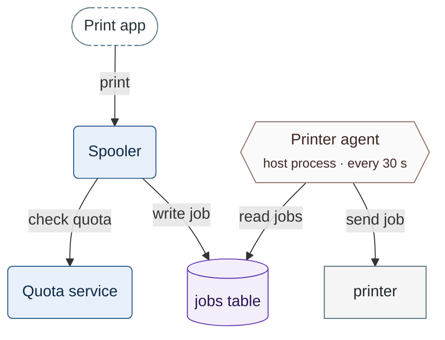

# Figure review checklist

**Purpose.** This file holds the binary checks for one figure, the evidence that answers each
check, the severity of a failed check, and the adversarial fidelity verifier. The author applies
it before the hand-off of SKILL.md Step 8. A read-only reviewer applies it to the evidence the
caller supplies. An orchestrator uses section 5 to spawn the verifier.

Every command below runs from the project root.

## 1. Who runs what

| Who | Runs | Reads |
| :--- | :--- | :--- |
| Author: architect, planner or any authoring agent | the lint, `--inventory`, the render check | its own PNGs |
| Orchestrator | the same commands, before it spawns a reviewer or the verifier | the outputs it passes on |
| Read-only reviewer | no figure command | the supplied outputs, the document, the listed PNGs |
| `code-reviewer` | the lint, when the brief carries no lint output | as a read-only reviewer |
| Adversarial verifier | no command | the four inputs of section 5.1 |

The read-only reviewers are `architecture-reviewer`, `plan-reviewer` and `task-reviewer`. For the
figure rows they run no command: no lint, no render check, no `plan_gantt.py`. They read the output
the caller supplies and open the listed PNGs with their read tool. `code-reviewer` holds Bash. When
its brief carries no lint output, it runs the lint itself, which needs no approval; it runs no
render check.

**Why.** Three of the four reviewers hold read tools only. The render check needs node and a
browser outside the repository, and it asks for approval on every run. A checklist row cannot
show that a command ran; pasted output can.

## 2. Evidence and its states

| Evidence | Produced by | Status | Answers |
| :--- | :--- | :--- | :--- |
| Lint output | `python3 .agent/skills/mermaid-authoring-guidelines/scripts/lint_mermaid.py <doc.md>`, exit 0 or 1 | required | rows marked lint |
| Inventory | `lint_mermaid.py <fig.mmd> --inventory`, `support` filled by the author | expected | fidelity rows |
| Render evidence | `python3 .agent/skills/mermaid-authoring-guidelines/scripts/render_check.py <file> --json --out <dir>`: `evidence.json` and PNGs | optional | rows marked render or PNG |
| Not-rendered line | render check exit 2, which prints `not rendered: <reason>` | replaces render evidence | render rows |
| Plan check | `python3 .agent/skills/mermaid-authoring-guidelines/scripts/plan_gantt.py <PLAN.md> --check <PLAN.md>` | expected for a plan chart | FIG-26 |
| Numbered section | the caller cuts the section from the document | required by the verifier | fidelity rows |

States (TASK 108 D24):

1. Lint output is required. Without it, the figure is `not verified`.
2. Lint exit 2 or 3 counts as no lint output.
3. A `not verified` figure passes no row. The review names the missing output. A defect found by
   reading still enters the review.
4. The review does not return APPROVED while any figure is `not verified`, and it sets
   `has_critical_issues` to true (TASK 108 UC-4 A1). The next round carries the lint output.
5. Render evidence is optional. Without it, each render row reads
   `not rendered: no render evidence supplied`.
6. The line `not rendered: <reason>` is a distinct state. The review may return any verdict with
   it, APPROVED included. It never passes a render row.
7. Only a render that `evidence.json` names as 11.17.2 or 10.9.8 answers a render row. A 12.1.0
   render from `--forward` is information only.
8. Without an inventory, the reviewer or the verifier lists the elements from the source.
9. A hand-off line is a summary, not evidence. A line without the output it summarises counts as
   absent output.

A row verdict is `pass`, `fail`, `not rendered`, or `n/a` for a row the figure kind lacks. A
`fail` carries the severity of section 4.

**Why.** A project without renderers could otherwise never pass a review that holds a figure. The
lint needs Python only, so every caller can supply it.

## 3. The checklist

Answer each row yes or no for each figure. A no is `fail`. The review notes list, per figure, each
failed row with its severity and each `not rendered` or `not verified` state with its reason.

Evidence labels:

- **lint**: a rule family of `lint_mermaid.py`; each finding line names its rule id. A finding
  listed as `expected` comes from a check that a negative fence names. Such a fence lies in this
  skill's `references/` or `scripts/tests/fixtures/`, and its last line is
  `%% negative: <checks>`. Each instrument checks its own names. The lint requires one of the
  lint rules the marker names to fire. The render check requires one of the render checks it
  names to fail, and no render check it does not name may fail. An `expected` finding fails no
  row. Every other finding counts, MA-NEG-01, MA-NEG-02 and MA-NEG-03 included. In any
  other file the lint reports the marker as the error MA-NEG-03, the render check grades the
  fence as a figure, and the marker fails FIG-25.
- **render `<check>`**: no render entry of `evidence.json` holds a `fail` finding of that check.
  The metric of the same name gives the value. In a negative fence, a `fail` of a render check
  that the marker names is expected. A `fail` of a render check that it does not name fails the
  fence. A marker that names only lint rules has its renders graded as a positive figure.
- **PNG**: the reviewer opens the 11.17.2, 10.9.8 and dark PNGs.
- **inventory**: the `--inventory` rows with their support lines.
- **verifier**: the tables of section 5.
- **reading**: the reviewer reads the text and the figure source.

### 3.1 Form and scope

| Row | Yes when | Evidence | Severity of a no |
| :--- | :--- | :--- | :--- |
| FIG-1 | The text states relations a reader holds in memory, and the figure is the first Step 0 form that carries them | reading, Step 0 table | MINOR |
| FIG-2 | A Mermaid figure sits in a medium that renders Mermaid; `n/a` for an ASCII figure | reading | MINOR |
| FIG-3 | The figure carries one concern in one kind | reading; lint: numbered flowchart edges | MINOR |
| FIG-4 | The figure is within the soft budget, or within the hard budget with a passing render | lint: budgets; render | MINOR |

Over the soft budget, FIG-4 needs render evidence. Without it, FIG-4 reads `not rendered`.

### 3.2 Render and layout

Open every PNG before these rows. Read the size from `smallest_effective_font_px`, the smallest text
a reader must read (`effective_font_px` is the most common size), never from PNG pixels.

| Row | Yes when | Evidence | Severity of a no |
| :--- | :--- | :--- | :--- |
| FIG-5 | The source renders without error in 11.17.2 and in 10.9.8 | render: each entry rendered; lint: parse rules; PNG | MAJOR |
| FIG-6 | No edge passes through a node | render `edges_through_nodes`; PNG | MAJOR |
| FIG-7 | Each render has at most 2 crossings | render `crossings`; lint: planarity; PNG | MINOR |
| FIG-8 | At most one edge joins any pair of nodes | lint: duplicate edges; render `duplicate_edges` | MINOR |
| FIG-9 | No edge passes through a group title or an edge label | render `title_crossings`, `edges_through_labels`, `label_overlaps`; lint: subgraph rules | MINOR |
| FIG-10 | No text is cut, and no note is wider than its box | render `clipped_labels`, `gantt_overflow`; lint: message and note lengths | MINOR |
| FIG-11 | Text measures at least 10 px in a 900 px column | render `legibility`; lint: label lengths, `LR` structure | MINOR |
| FIG-12 | Every text reads on the dark page `#0d1117` | render `contrast`; dark PNG; lint: `theme` key | MINOR |

Notes per kind:

- A `title_near_miss` warning does not fail FIG-9.
- `clipped_labels` needs the browser text measurement. With `measured` false, answer FIG-10 from
  the PNG.
- Sequence: FIG-6, FIG-7 and FIG-8 are `n/a`. FIG-9 also covers a message label that a lifeline
  crosses, reported as `lifeline_through_label`. A lifeline of the message's own end fails the
  figure; a skipped participant's lifeline is a warning, and the PNG confirms it. The forward
  render in 12.1.0 reports an own-end crossing from 24 characters as information. A
  `lifeline_gap` warning names a label that widens the figure.
- A figure the render check reports as `pass, geometry not checked` answers FIG-6, FIG-7 and FIG-9
  from the PNG: quadrantChart, timeline, journey, mindmap, gitGraph, and an ER or requirement
  figure read in part. Its `label_overlaps` covers texts over texts only.
- Plan chart: FIG-6 to FIG-9 are `n/a`, and `gantt_overflow` answers FIG-10.
- ASCII figure: every render row is `n/a`. The lint rules for `text figure` fences answer its
  layout.
- `contrast` fails a text whose colour or background the figure sets. A text in the viewer's
  theme colours is reported as `info`, and FIG-12 reads it in the dark PNG.

### 3.3 Fidelity

| Row | Yes when | Evidence | Severity of a no |
| :--- | :--- | :--- | :--- |
| FIG-13 | Every node, edge, label, note, number, group, message, block and bar has a supporting line | inventory; verifier | MAJOR |
| FIG-14 | The figure holds no relation, group, number or writer that the text does not state | inventory; verifier | MAJOR |
| FIG-15 | Each number has the text's value and unit, on the subject the text gives it | inventory; verifier | MAJOR |
| FIG-16 | Each arrow points from caller to callee, and a returned value is a reply arrow | inventory; verifier | MAJOR |
| FIG-17 | Each name is spelled as the text spells it | inventory; verifier | MINOR |
| FIG-18 | Each fact the figure's purpose needs is drawn, or the legend states that it is not drawn | verifier; reading | MAJOR |

### 3.4 Notation, caption and legend

| Row | Yes when | Evidence | Severity of a no |
| :--- | :--- | :--- | :--- |
| FIG-19 | The document's figures share one settings line per kind and one class block | lint: settings consistency | MINOR |
| FIG-20 | Classes come from the palette, and categories differ by shape or stroke as well as colour | lint: class contrast, undefined classes; reading | MINOR |
| FIG-21 | Group titles, participant names and aliases match across the document's figures | reading | MINOR |
| FIG-22 | The caption sits directly above the fence; the legend sits directly below it when two or more encodings appear | lint: MA-DOC-01, MA-DOC-02, MA-DOC-05 | MINOR |
| FIG-23 | Caption and legend state only what the figure shows, numbers included | verifier; reading | MAJOR |
| FIG-24 | `accTitle` and `accDescr` repeat the title and the sentence of the caption | reading | MINOR |

SKILL.md Step 7 writes the caption above the fence and the legend below it (TASK 108 R3.7). A
caption below the fence fails FIG-22, and a heading above the fence is not a caption.

### 3.5 Document checks

| Row | Yes when | Evidence | Severity of a no |
| :--- | :--- | :--- | :--- |
| FIG-25 | The lint over the whole document reports 0 `error`, MA-NEG-03 included | lint output | MAJOR |
| FIG-26 | A plan chart sits between the generated markers, and `plan_gantt.py --check` exits 0 | plan check | MAJOR on exit 1; MINOR outside the markers |
| FIG-27 | The document's own checks pass on caption and legend: register scan, reference resolver | their outputs | MINOR |
| FIG-28 | The hand-off line has the form of section 6 and agrees with the evidence | reading | MINOR |

The generated markers are `<!-- generated:plan-gantt-start -->` and
`<!-- generated:plan-gantt-end -->`. The schedule they render sits under
`<!-- contract:schedule -->`.

## 4. Severity

The figure rows use two named values of the reviewer's criticality protocol: MAJOR and MINOR.

| Finding | Severity |
| :--- | :--- |
| The figure contradicts its text: an invented or reversed relation, a wrong number, an invented group or writer | MAJOR |
| The caption or the legend states something the figure does not show | MAJOR |
| The figure does not render, or does not parse, in 11.17.2 or in 10.9.8 | MAJOR |
| An edge passes through a node | MAJOR |
| A fact the figure's purpose needs is missing, and the legend does not name it | MAJOR |
| A budget, legend or caption gap | MINOR; MAJOR when it hides a fact |
| A form, layout, legibility or notation finding | MINOR; MAJOR when it hides a fact |
| No lint output | the figure is `not verified`: no APPROVED, and `has_critical_issues` is true (§2) |
| `not rendered: <reason>` | none: the render rows read `not rendered` |

A finding raised to MAJOR names the fact it hides and the line that states that fact.

**Why.**

- A reader takes a figure as a statement of the design. The next implementer builds the invented
  relation.
- An edge through a node reads as a path through that node. In the 456 flowcharts measured on
  2026-10-02, mermaid 10.9.8 drew such an edge in 9 %.
- A figure that does not render in a version of the check pair is absent for every reader of that
  viewer. GitHub runs 11.17.2; JetBrains IDEs 2024.3 to 2026.1 run 10.9.3.

## 5. The adversarial fidelity verifier

### 5.1 The prompt

Pass the three blocks verbatim and in this order, followed by the four inputs.

```markdown
You verify one figure of a Markdown document against its text. Assume each element is wrong
until a line of the text states it. Default to fail when in doubt. Run no command; open files
only to read them.

Inputs:
- SECTION: the document lines the figure illustrates, with their line numbers, including the
  caption and the legend next to the fence.
- FIGURE: the figure source.
- INVENTORY: the rows of `lint_mermaid.py --inventory` for this figure, or `none`.
- RENDER: the path of `evidence.json` and the PNG paths it lists, or the line
  `not rendered: <reason>`.
```

```markdown
Steps:
1. List every element of FIGURE: node, edge with its label, group, note, number, participant,
   message, block, activation bar, state, transition, task bar. Cover every INVENTORY row.
2. For each element, quote the SECTION line that states it, with its line number.
3. Give each element one verdict:
   - supported: a line states it, with this direction, this value and this name;
   - unsupported: no line states it;
   - contradicted: a line states otherwise, such as the reverse direction or another number;
   - renamed: a line states it under another name.
4. List each fact the figure's purpose needs that FIGURE leaves out, unless the legend names it
   as not drawn. Mark each one missing.
5. Test each claim of the caption and of the legend against the elements. A claim the elements
   do not show is contradicted.
6. Open every PNG. Report crossings beyond 2, edges through nodes, edges through group titles,
   label overlaps, cut text, and text under 10 px in a 900 px column. Count a message label that
   a lifeline crosses as a label overlap. Read the size from `smallest_effective_font_px` in
   RENDER, never from PNG pixels. With `not rendered: <reason>`, copy that line and open no PNG.
```

```markdown
Output only:
1. Table Elements with the columns # | Kind | Element | Support | Verdict.
   Support is `L<n>: "<quote>"` or `none`.
2. Table Render with the columns Render | Crossings | Through nodes | Through titles |
   Label overlaps | Cut text | Width px | Font px | Verdict, one row per render.
3. Two lines:
   Fidelity: <pass|fail> · unsupported <n> · contradicted <n> · renamed <n> · missing <n>
   Render: <pass|fail|not rendered: <reason>>
Fidelity passes only with 0 unsupported, 0 contradicted and 0 missing.
An element you doubt is unsupported.
A PNG that does not open makes the Render line `not rendered: <path> does not open`.
```

### 5.2 Spawning the verifier

The orchestrator runs these steps. Renders go to a scratch directory outside the repository.

1. Freeze the section until the verifier returns; prepare any change in a scratch file.
   Postcondition: the line numbers the verifier quotes stay valid.
2. Run `python3 .agent/skills/mermaid-authoring-guidelines/scripts/lint_mermaid.py <doc.md>` and
   `python3 .agent/skills/mermaid-authoring-guidelines/scripts/lint_mermaid.py <fig.mmd> --inventory`.
   Postcondition: exit 0 or 1; exit 2 or 3 makes the figure `not verified` and INVENTORY `none`.
3. Run
   `python3 .agent/skills/mermaid-authoring-guidelines/scripts/render_check.py <fig.mmd> --json --out <scratch dir>`.
   The scratch directory is your own, such as one `mktemp -d` makes; a directory others may write
   to is refused.
   Postcondition: exit 0 or 1 leaves `evidence.json` and the PNGs; exit 2 gives the RENDER line
   `not rendered: <reason>`.
4. Cut SECTION with `cat -n <doc.md> | sed -n '<first>,<last>p'`, caption and legend included.
   Postcondition: every line the figure illustrates is in SECTION, with its number.
5. State the number of verifiers, then spawn one per figure with the spawn primitive of the
   runtime: `skill-parallel-orchestration` §1.1 names it, and Claude Code uses the `Agent` tool.
   Grant read tools only. Several figures get their verifiers in one message.
   Postcondition: each verifier returns two tables and two lines.
6. Copy each result into the review notes with its label of section 5.3.
   Postcondition: the notes hold one `Fidelity:` line per figure.
7. On `Fidelity: fail`, return the failing rows to the author, then repeat from step 2.
   Postcondition: the next round reads the fixed figure.

### 5.3 Labelling the verdict

1. Record the result in the review notes as `Fidelity: <pass|fail> · <label>`.
2. A verifier on the author's model gets the label `corroborated`. Its verdict is not independent
   confirmation (`CLAUDE.md` review-dispatch rule; `vdd-multi` Phase 2 rule 3).
3. Two or more verifiers on one model that agree keep the label `corroborated`.
4. A verifier on another tier of the same vendor gets `tier-diverse`. That label is not independent
   confirmation either.
5. Run one verifier per figure. A larger harness needs an operator request, per the same rule.

**Why.** `vdd-multi` records about 60 % shared error between two critics on one model. Their
agreement adds less independence than a vote count suggests.

## 6. Hand-off line

The author ends the hand-off with one of the lines of SKILL.md Step 8, character for character:

- `Figures: N · lint 0 error · rendered 11.17.2 + 10.9.8 + dark: pass`
- `Figures: N · lint 0 error · rendered 11.17.2 + 10.9.8 + dark: pass, geometry not checked`
- `Figures: N · lint 0 error · not rendered: <reason>`
- `Figures: N · lint 0 error · render n/a: ASCII only`

1. N counts the figures the hand-off covers.
2. `not rendered: <reason>` takes the place of the render part. It never reads as a pass.
   `render n/a: ASCII only` holds only when no figure of the hand-off is Mermaid.
   `pass, geometry not checked` holds when the render check gives that status to any figure of
   the hand-off. It sends FIG-6, FIG-7 and FIG-9 of that figure to the PNG.
3. No other form counts. A line in another form fails FIG-28.
4. A render check that exits 1 yields no hand-off line. The author fixes the figure first (Step 8,
   item 4).
5. The caller passes the lint output and the render evidence with the line (section 2).

## 7. Worked example

The section and both figures are invented for this file. The example shows defects that only the
verifier finds. The lint reads the source and never the text; the render check measures geometry.

**Input: SECTION.** Lines 51 to 77 hold the fence; their source is the FIGURE input below.

```markdown
40  ### Print path
41
42  The print path has two services: the Spooler and the Quota service.
43  A user prints from the Print app, a client that calls the Spooler.
44  The Spooler asks the Quota service whether the user has pages left.
45  The Spooler writes each job to the jobs table.
46  The Printer agent, a host process, reads the jobs table every 30 s.
47  It sends each job to the printer, an external device.
48
49  **Figure 1.** Print path — every interaction that this section states.
50
51-77  (the mermaid fence)
78
79  Legend:
80  - dashed stadium = client
81  - rounded box = service
82  - hexagon = host process
83  - rectangle = external device
84  - cylinder = table
85  - arrow = an interaction, from its actor to its target
```

**Input: FIGURE.** The source of the fence, lines 52 to 76.

- It renders clean in 11.17.2, 10.9.8 and the dark 11.17.2, and the lint reports nothing on it.
- It fails FIG-13 to FIG-16, FIG-18 and FIG-23, which only the verifier answers.
- This file shows it as a listing. A fence that shows a defect on purpose ends with
  `%% negative: <checks>`. The marker counts only in this skill's `references/` and
  `scripts/tests/fixtures/`. Each instrument checks its own names. The lint requires one of the
  lint rules the marker names to fire. The render check requires one of the render checks it
  names to fail, and no render check it does not name may fail. No lint rule and no render check
  fails here.

```text
%%{init: {"layout": "dagre", "look": "classic", "flowchart": {"nodeSpacing": 45, "rankSpacing": 55, "wrappingWidth": 400}}}%%
flowchart TB
  accTitle: Print path
  accDescr: Every interaction that this section states.
  APP(["Print app"])
  SPOOL("Spooler")
  QUOTA("Quota service")
  JOBS[("jobs table")]
  AGENT{{"Printer agent<br/><small>host process · every 60 s</small>"}}
  PRN["printer"]
  APP -->|print| SPOOL
  QUOTA -->|"read jobs"| JOBS
  SPOOL -->|"write job"| JOBS
  AGENT -->|"read jobs"| JOBS
  PRN -->|"send job"| AGENT
  class APP ext
  class SPOOL,QUOTA wf
  class JOBS db
  class AGENT infra
  class PRN svc
  classDef ext fill:#FFFFFF,stroke:#607D8B,color:#263238,stroke-dasharray:4 3
  classDef wf fill:#E8F0FB,stroke:#2E5A8A,color:#0F2A47
  classDef db fill:#F3EEF9,stroke:#5E35B1,color:#2A1653
  classDef svc fill:#F5F5F5,stroke:#546E7A,color:#1F2A30
  classDef infra fill:#FAFAFA,stroke:#8D6E63,color:#3E2723
```

**Output: the verifier's tables.**

| # | Kind | Element | Support | Verdict |
| :--- | :--- | :--- | :--- | :--- |
| 1 | node | Print app | L43: "the Print app, a client" | supported |
| 2 | node | Spooler | L42: "two services: the Spooler and the Quota service" | supported |
| 3 | node | Quota service | L42: "two services: the Spooler and the Quota service" | supported |
| 4 | node | jobs table | L45: "writes each job to the jobs table" | supported |
| 5 | node | Printer agent, host process | L46: "The Printer agent, a host process" | supported |
| 6 | number | every 60 s | L46: "every 30 s" | contradicted: another number |
| 7 | node | printer | L47: "the printer, an external device" | supported |
| 8 | edge | Print app → Spooler, "print" | L43: "a client that calls the Spooler" | supported |
| 9 | edge | Quota service → jobs table, "read jobs" | none | unsupported |
| 10 | edge | Spooler → jobs table, "write job" | L45: "writes each job to the jobs table" | supported |
| 11 | edge | Printer agent → jobs table, "read jobs" | L46: "reads the jobs table" | supported |
| 12 | edge | printer → Printer agent, "send job" | L47: "It sends each job to the printer" | contradicted: reversed |
| 13 | edge | Spooler → Quota service | L44: "asks the Quota service" | missing |
| 14 | caption | "every interaction that this section states" | L49; rows 9 and 13 | contradicted: claims the full set |
| 15 | legend | L79 to L85, six items | L42 to L47 | supported |

| Render | Crossings | Through nodes | Through titles | Label overlaps | Cut text | Width px | Font px | Verdict |
| :--- | ---: | ---: | ---: | ---: | ---: | ---: | ---: | :--- |
| 11.17.2 light | 0 | 0 | 0 | 0 | 0 | 511 | 16 | pass |
| 10.9.8 light | 0 | 0 | 0 | 0 | 0 | 476 | 16 | pass |
| 11.17.2 dark | 0 | 0 | 0 | 0 | 0 | 511 | 16 | pass |

```markdown
Fidelity: fail · unsupported 1 · contradicted 3 · renamed 0 · missing 1
Render: pass
```

The orchestrator records `Fidelity: fail · corroborated` and returns rows 6, 9, 12, 13 and 14 to
the author. Each of them is MAJOR (section 4).

**The fix.** The figure below passes the same verifier. Each element has a line, nothing is
missing, and the caption is true. Measured on 2026-10-02: 0 crossings, 0 edges through nodes,
0 title crossings, 0 label overlaps and 0 cut labels in 11.17.2, 10.9.8 and the dark 11.17.2.
Width is 460 px in 11.17.2 and 434 px in 10.9.8; effective text is 16 px.

**Figure 1.** Print path — every interaction that this section states.



Legend:
- dashed stadium = client
- rounded box = service
- hexagon = host process
- rectangle = external device
- cylinder = table
- arrow = an interaction, from its actor to its target
