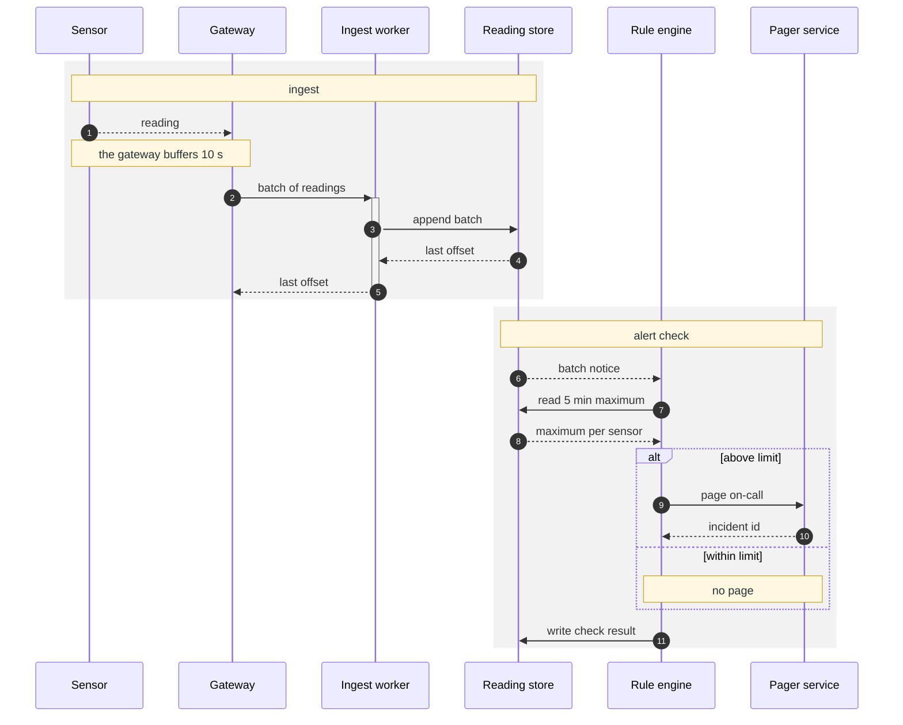

# Sequence figures (`sequenceDiagram`)

A sequence figure shows one scenario in time: who sends which message to whom, and in what order
(`SKILL.md` Step 1). Settings, palette, budgets and limits below are copied from
`assets/notation.json`. Measurements come from renders made on 2026-10-02 in mermaid 10.9.8 and
11.17.2, light, and in 11.17.2 dark: theme `dark` on `#0d1117`. Sizes are CSS px of the SVG
`viewBox`. Text sizes hold for the 900 px column.

## 1. Settings line

1. The fence's first line is `settings.sequence` of `notation.json`:
   `%%{init: {"look": "classic", "themeVariables": {"noteBkgColor": "#FFF8E1", "noteTextColor": "#263238", "noteBorderColor": "#C9A227"}, "sequence": {"wrap": true}}}%%`.
2. The second line is `sequenceDiagram`. `accTitle`, `accDescr` and `autonumber` follow.
3. Add no `theme`, no font and no `layout` key.

**Why.**

- `"look": "classic"` keeps mermaid 12.1.0 from drawing the `neo` look with drop shadows. 10.9.8
  ignores the key.
- `"wrap": true` breaks a long message, note or participant name into lines.
- Without `wrap`, one long message sets the gap between its two lifelines for the whole figure.
  On pair N7 of `paired-examples.md`, that gap measured 453 px against 200 px for every other pair.
- The three note colours give every note dark text on a light fill on both pages: `#263238` on
  `#FFF8E1` measured 12.39:1 in the light and the dark render. The dark theme's own note colours
  measure 4.44:1, under the 4.5:1 of `contrast_min` (§8).
- Mermaid 12.0.0 made ELK the default layout of graph kinds. Its release notes do not list
  sequences, so a sequence figure takes no `layout` key.
- Section 8 gives the reason for no `theme`. `SKILL.md` Step 5 gives the reason for no font.

## 2. Participants

1. Declare every participant before the first message: `participant IW as Ingest worker`. The id
   matches `[A-Za-z0-9]+`. The name is written as the text writes it.
2. A participant name holds at most 18 characters (`labels.participant_chars_max`).
3. Put the participant that starts the scenario leftmost. Order the others by their first message.
4. Place side by side the pairs that exchange the most messages, the most frequent pair first.
5. Compare two orders by the lifelines their messages skip. A message skips `|i − j| − 1`
   lifelines; `i` and `j` are the positions of its two ends. Keep the order with the smaller sum.
6. Stay within `budgets.sequence.participants`: at most 6 participants, a hard limit. A seventh
   participant takes the text under 10 px; aggregate or split instead.
7. Draw a `box` only for a system the text names, when the figure needs that boundary:
   `box rgba(127,127,127,0.08) <system>` … `end`. The colour is `palette.sequence.box`.
8. Keep the messages across a box border few. The border runs through or beside each label.
9. Write a `box` or `rect` colour as `rgb(…)` or `rgba(…)`, never as a hex value.

**Why.**

- An undeclared name in a message adds a lifeline in both versions, with no error. A typo in a
  message therefore draws a participant the text never names.
- Each participant takes a 200 px column, and the text is 16 px. Six participants measure 1250 px,
  so the text shows at 11.5 px. Seven measure 1450 px: 9.9 px, under the 10 px of
  `min_effective_font_px`. 10.9.8, 11.17.2 and 12.1.0 gave the same widths.
- A name stays on one line while it fits its 150 px box. An 18-character name, `Settlement
  service`, measured 134.9 px in 10.9.8 and 11.17.2.
- `wrap` breaks a wider name into lines, and a word wider than the box inside the word:
  `Reconciliationservice` drew as `Reconciliationservic-` over `e` in 10.9.8, 11.17.2 and 12.1.0.
- A message that skips exactly one participant has its label centred on that participant's
  lifeline. The centre measured within 3 px of the lifeline in 10.9.8, 11.17.2 and 12.1.0.
- A box border runs within 30 px of the label centre of each message that crosses it: 26 and
  29 px in 10.9.8, 6 and 9 px in 11.17.2. It passes through every such label wider than 60 px.
- In a `box` or `rect` line, `#` starts a comment. `box #E8F0FB Site` draws a transparent box
  without its title. In 10.9.8, `rect #E8F0FB` draws a black rect over its messages.

## 3. Messages

| Arrow | Meaning |
| :--- | :--- |
| `->>` | a call: the sender waits for the result |
| `-->>` | a reply, or a message the sender does not wait on: a start or a wake-up signal |

1. `autonumber` numbers the messages. The text and the legend cite a message by its number.
2. A message names the operation in about 3 words.
3. A message line holds at most 24 characters (`labels.sequence_message_chars_max`). A message
   holds at most 2 lines (`labels.sequence_message_lines_max`), broken with ` `.
4. Parameters and payloads stay in the text's table (pair N7 → P7).
5. A value the callee returns is a reply: `-->>` from the callee, labelled with the value (pair
   N12 → P12). Draw a reply only when the text names the value.
6. Each message joins two neighbouring participants (§2). A message that still skips a lifeline
   gets the shortest label the text allows.
7. Stay within `budgets.sequence.messages`: 18 messages, hard limit 24.

| Construct | 10.9.8 | 11.17.2 | Write instead |
| :--- | :--- | :--- | :--- |
| `;` in a message or note | parse error | parse error | `#59;` |
| `#` in a message or note | the text from `#` on is lost, no error | the same | `#35;` |
| `\n` in a message | printed as `\n` | the same | ` ` |
| `classDef`, `class` or `style` | parse error | parse error | `box` and `rect` colours |
| `participant X@{ "type": "database" }` | lexical error | renders | `participant X as Name` |
| `A<<->>B` | draws a participant named `A<<` | renders | two messages |
| a hex colour after `box` | a transparent box without title | the same | `palette.sequence.box` |
| a hex colour after `rect` | a black rect over the messages | a theme colour | `palette.sequence.phase` |

**Why.**

- A message label has no background, so a lifeline under the label runs through its text.
- The lifelines of two neighbours stand 200 px apart. Measured in 10.9.8 and 11.17.2 between
  neighbours:

| Message | Drawn as | Lifelines through the text |
| :--- | :--- | :--- |
| 24 characters | one line, 188 px | none |
| 26 characters | one line, 200 px | one |
| 27 to 32 characters | one line, 208 to 245 px | both |
| 34 to 40 characters | two lines; the first 200 px | one |
| two lines of 16 and 19 characters with ` ` | 122 px and 138 px | none |

- `wrap` breaks a message only past about 250 px, wider than the gap between two neighbours.
- The render check reports `lifeline_through_label` in two severities. A lifeline of the message's
  own end through its label is a `fail`: the label is wider than the gap, and a shorter line
  avoids it. A skipped participant's lifeline through a label is a `warn`: it runs through the
  label centre in every version, so only the participant order or a shorter label reduces it. A
  self-message's own lifeline is not counted: its label sits centred on it in 10.9.8 and 11.17.2.
- In 12.1.0 both lifelines crossed every message from 24 characters on. The forward render reports
  that crossing as information; it sets no exit code.
- In 28 sequence figures of real documents, 152 of 371 messages (41 %) skipped at least one
  lifeline.

## 4. Activations

1. A bar on a lifeline states that an execution exists (pair P15). Draw bars only on a process
   participant whose run the text states: its start, its wait for a reply, its end.
2. Write `activate X` and `deactivate X`, or `+` and `-` on the arrows: `GW->>+IW` and
   `IW-->>-GW`. Each `+` has its `-`.
3. A caller that waits for a reply stays active while it waits.
4. A gap in the bar states that nothing runs, for example while a job sleeps. End the bar where
   the text ends the execution.
5. Keep the bar state equal in every branch of an `alt`. End the bar after `end`.

**Why.**

- A `deactivate` in one `alt` branch and an `activate` in the next draw a gap between the
  branches, in both versions. A reader takes the gap for the end of the execution.
- An `alt` block whose leftmost participant has a bar draws its `alt` tab over that bar, in both
  versions.

## 5. Notes

1. `Note over A,B: <text>` states a wait or a fact of the text. `Note over A: <text>` covers one
   participant.
2. A note line holds at most 48 characters (`labels.note_chars_max`). A note holds at most 3 lines
   (`labels.note_lines_max`).
3. The note text stays inside its box: 150 px wide over one participant, 250 px over two
   neighbours. Read each note in the PNGs.
4. A note whose text touches its border gets a ` `, or spans one more participant.
5. A repeat is a `loop` block, never a note.

**Why.** A note box spans its participants and never widens the figure, so a long line runs past
its border (pair N8). `wrap` keeps a line whole while it is a few px wider than the box. Measured
in both versions: a 255 px line stayed whole in a 250 px box and passed each border by 2.5 px. A
` ` in the same note kept both lines inside.

## 6. Phases

1. Wrap each phase in `rect rgba(127,127,127,0.10)` … `end`. The colour is
   `palette.sequence.phase`.
2. The first line inside the `rect` is the phase title: `Note over <first>,<last>: <phase name>`.
   The name comes from the text.
3. Stay within `budgets.sequence.phase_blocks`: 3 phase blocks, hard limit 4.

**Why.** A `rect` has no border and a `box` has one, so a phase and a system differ by stroke as
well as by colour. Where the two overlap, their fills add up. Message text there measured 10.42:1
in the dark render and 10.40:1 in the light one.

## 7. Blocks: `alt`, `opt`, `loop`, `par`

1. Draw a block only for a branch, an option, a repeat or a parallel step that the text states.
2. A guard names the condition of the text: `alt above limit` … `else within limit`.
3. A `loop` label names its condition or its bound:
   `loop until the store accepts · at most 3 tries`.
4. Keep a guard to a few words. Put in a block only the messages of its branches.

**Why.** Mermaid centres the guard over the block. Over three participants, the middle lifeline
crosses the guard in both versions. Over two neighbours, the guard sits between their lifelines.

## 8. Dark mode

1. Set no `theme`. GitHub then renders theme `dark` on its dark page and `default` on its light
   page.
2. Fill a `box` or `rect` only with the translucent `rgba` values of `notation.json`.
3. Never fill a `box` or `rect` with an opaque light colour, around part of the messages or
   around all of them.
4. Keep the note colours of the settings line. They are the only text colours a sequence figure
   sets.

| Text on | Render | Contrast |
| :--- | :--- | :--- |
| the page `#0d1117` | dark | 12.64:1 |
| a box fill `rgba(127,127,127,0.08)` | dark | 11.69:1 |
| a phase fill `rgba(127,127,127,0.10)` | dark | 11.42:1 |
| an opaque `rgb(250,250,250)` rect | dark | 1.43:1 |
| an opaque white rect around all messages | dark | 1.50:1 |
| the page, under a pinned light theme with `#37474F` text | dark | 1.96:1 |
| a note, in the note colours of the settings line | dark / light | 12.39:1 / 12.39:1 |
| a note, in the dark theme's own note colours | dark | 4.44:1 |

**Why.**

- A `theme` in the settings line overrides the viewer's theme. A pinned light theme keeps its
  dark text on GitHub's dark page.
- No text colour reaches 4.5:1 on both white and `#0d1117`. The highest value a grey reaches on
  both is 4.35:1. One fixed text colour therefore fails on one of the two pages.
- The dark theme draws message text in light grey. A translucent fill lets the page colour
  through, so the text keeps its contrast on either page.
- An opaque light fill puts that light grey text on near-white. An outer white `rect` serves only
  a pinned light theme, which the settings line excludes.
- A note brings its own fill, so its text colour holds on both pages. The settings line sets both:
  `#263238` on `#FFF8E1`. The dark theme's own pair, `#B8B6B6` on a dark grey fill, measures
  4.44:1, under the 4.5:1 of `contrast_min`.

## 9. Template

Six participants, 11 messages, two phases, an `alt` and one bar. The figure draws no `box`: its
text names no system that holds two of the participants.

### 9.1 Source text

| # | Line of the text | Drawn as |
| :--- | :--- | :--- |
| 1 | The sensor sends each reading to the gateway and does not wait for a reply. | message 1 |
| 2 | The gateway buffers readings for 10 s, then calls the ingest worker with the batch. | the note, message 2 |
| 3 | The ingest worker runs once per batch. | the bar on `Ingest worker` |
| 4 | The worker appends the batch to the reading store, which returns the last offset. | messages 3 and 4 |
| 5 | The worker replies to the gateway with the last offset and exits. | message 5, the bar's end |
| 6 | For each appended batch, the reading store sends a notice to the rule engine. | message 6 |
| 7 | The rule engine reads the maximum of the last 5 min per sensor from the store. | messages 7 and 8 |
| 8 | Above the sensor's limit, the engine pages the on-call engineer through the pager service. | `alt`, message 9 |
| 9 | The pager service returns an incident id. | message 10 |
| 10 | Within the limit, the engine sends no page. | `else`, the note `no page` |
| 11 | In both cases, the engine writes the check result to the reading store. | message 11 |
| 12 | A batch passes two phases: ingest, then alert check. | the two phase titles |

### 9.2 Figure

**Figure 1.** Telemetry batch — one batch of readings from the sensor to the alert check, with a
bar while the ingest worker runs.

- `->>` call; `-->>` reply or unwaited message; the numbers give the message order.
- Shaded block: one phase, named by its first note. The other notes state a wait or an outcome.
- Bar on a lifeline: an execution exists. The ingest worker runs from message 2 to message 5 only.
- `alt`: the 5-minute maximum is above the sensor's limit, or within it.

### 9.3 Render results

Rendered on 2026-10-02 in 10.9.8 and 11.17.2, light and dark, and in 12.1.0 as a forward check.

- Each render measures 1250 × 1011 px, so the text shows at 11.5 px in the column.
- Every message joins neighbours, and no lifeline passes through a message label.
- No note passes its border, and no lifeline crosses a guard.
- Messages read at 11.43:1 or more in the dark render of 11.17.2. Every note reads at 12.39:1 in
  every render.
- The longest message holds 18 characters and the longest name 13.

## 10. Checklist

- [ ] The first line is `settings.sequence`, copied unchanged; then `sequenceDiagram`,
  `accTitle`, `accDescr` and `autonumber`.
- [ ] Every participant is declared, with an id of letters and digits and the text's name.
- [ ] Each participant name holds at most 18 characters.
- [ ] The starting participant is leftmost, and each frequent pair stands side by side.
- [ ] Each message joins neighbours, or no lifeline crosses its label in the PNGs.
- [ ] At most 6 participants, 18 messages and 3 phases; never more than 6, 24 and 4.
- [ ] Text measures at least 10 px in the 900 px column.
- [ ] Each message line holds at most 24 characters, in at most 2 lines broken with ` `.
- [ ] Each note line holds at most 48 characters, in at most 3 lines.
- [ ] No raw `;` or `#`, and no `\n`, in a message or note; no `classDef`, `class`, `style`, hex
  colour or `<<->>`.
- [ ] `->>` marks a call and `-->>` a reply or an unwaited message, and the legend says so.
- [ ] Each returned value the text names is a reply from the callee; payloads stay in the text.
- [ ] Bars mark only executions the text states; each `+` has its `-`; `alt` branches share one
  bar state.
- [ ] A box marks a system the text names, filled `rgba(127,127,127,0.08)`; few messages cross
  its border.
- [ ] Each phase is a `rect rgba(127,127,127,0.10)` that opens with a title note from the text.
- [ ] Each `alt`, `opt`, `loop` and `par` matches a line of the text; a `loop` names its condition.
- [ ] Notes and guards stay clear of borders and lifelines in the 10.9.8, 11.17.2 and dark PNGs.
- [ ] A caption sits directly above the fence and a legend directly below it.
- [ ] Lint: 0 `error`. Render check: exit 0, or `not rendered: <reason>` in the hand-off.
