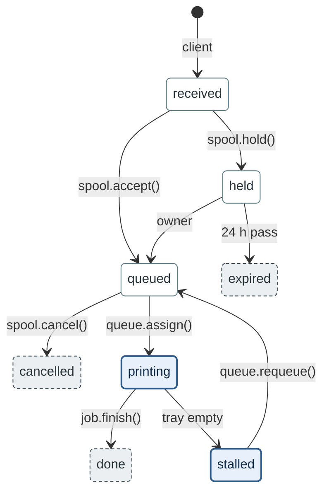

# State figures (`stateDiagram-v2`)

A state figure shows one lifecycle: the states a record can be in, the transitions between them,
and the writer of each transition (`SKILL.md` Step 1). Settings, palette, budgets and limits below
are copied from `assets/notation.json`.

## 1. Settings line and direction

1. The fence's first line is the state settings line of `notation.json`:
   `%%{init: {"layout": "dagre", "look": "classic"}}%%`.
2. The second line is `stateDiagram-v2`. `stateDiagram` is on the avoid list of `notation.json`.
3. `accTitle` and `accDescr` follow, then `direction TB`.
4. Add no `theme` and no font (`SKILL.md` Step 5).

**Why.** With these two keys, 12.x lays out the figure as 11.17 does; 10.9 ignores both keys.
Top to bottom places the start at the top and the final states below it.

## 2. A flat graph; categories as classes

1. Draw every state at the top level of the figure.
2. Give `hold` and `wait` only to categories the text defines. Give `final` to each state that no
   stated transition leaves.
3. Use the three state classes with these meanings:

| Class | Look | Meaning |
| :--- | :--- | :--- |
| `hold` | thick blue border, pale blue fill | the record holds a resource or a place the text names |
| `wait` | thin grey-blue border, white fill | the record waits and holds none |
| `final` | dashed dark-grey border, pale grey fill | no transition leaves the state |

4. A category with another meaning gets no class; the text carries it. Copy the `classDef` lines
   from `notation.json` unchanged, and keep only the classes the figure uses.
5. Put the `classDef` lines after the transitions, then one `class` line per class.
6. The legend names each class by its border and its colour, with the meaning in the text's words.
7. The soft budget is 12 states and the hard budget 16 (`SKILL.md` Step 3).

**Why.** The legend of pair P9 as drafted named its categories by colour only:
`white = waits · grey = final`. WCAG 2.2 SC 1.4.1 forbids colour as the only carrier of a
category. Each class here also has its own border: thick, thin or dashed. The three borders stay
distinct in the dark render of the template (§9).

## 3. Composite states

Draw a composite state only when both conditions hold:

1. The text defines the group and names its members.
2. Every transition across the composite's border starts or ends at the composite itself. Inside,
   the composite starts at its own `[*]`.

A lifecycle with a transition into or out of an inner state is drawn flat. The group becomes a
class when §2 gives its meaning a class.

**Why.** Measured in 10.9.8 and 11.17.2, and in 12.1.0 with the settings line: a transition into
an inner state runs as a long diagonal between the composites. Under the default ELK layout of
12.1.0, the same transition runs through the composite's title. Transitions that start or end at
the composite itself rendered with no crossing and no edge through the title in both pinned
versions. Pair N9 → P9 of `paired-examples.md` shows the defect and the flat figure.

## 4. Transition labels: the writer or the condition

1. A label names the writer the text names: a function (`queue.assign()`) or a role (`owner`).
2. Where the text names no writer, the label names the condition (`tray empty`, `24 h pass`).
3. Never invent a writer. A transition caused by a date, a timer or a device carries its
   condition, unless the text names the job or the role that performs it.
4. Two writers of one transition share one label, joined by ` · ` (`owner · operator`). When the
   pair runs past 24 characters, the second writer takes a second line, after ` `, that
   starts with `or` (P9 of `paired-examples.md`).
5. A label holds about 3 words and at most 24 characters per line, lowercase in cased scripts. It
   holds one line, or two under rule 4 (`edge_label_lines_max`).
6. A state name holds about 4 words and at most 32 characters.
7. Ids match `[A-Za-z0-9]+`. A name with spaces is declared once: `state "on hold" as onhold`.
8. One label convention per document: the writer, or the condition where no writer is named.
9. When any label is a condition, the caption says so (pair N13 → P13).

**Why.** A reader takes a function on an arrow as the code that performs the transition. An
invented writer sends the next implementer to code that does not perform it.

## 5. Start, end, choice, fork and join

1. One `[*] --> first` transition starts the figure.
2. Mermaid draws one end node for the top level. Every `--> [*]` there ends on that node.
3. A lifecycle with one final state draws `--> [*]` from it.
4. A lifecycle with several final states draws no `--> [*]`. The `final` class marks those
   states, and the legend names the class.

**Why.** dagre places the end node in the last rank. Each final state joined to it moves down,
and its entering transitions get longer. Measured on the template (§9) with `--> [*]` from its
three final states: one transition order gave one crossing in both versions, another gave none.
Without them, both orders gave none. In the template's order, the figure was 27 % narrower.

- `state c <<choice>>` draws an unnamed diamond. Use it only for a decision the text states. The
  transition into it names the writer; each transition out of it names the condition the text
  gives.
- `<<fork>>` and `<<join>>` draw bars for states that hold at the same time. Use them only for a
  concurrency the text states.
- Choice, fork and join render in 10.9.8 and 11.17.2, and in the dark render.

## 6. Constructs to avoid

| Construct | 10.9.8 | 11.17.2 | Write instead |
| :--- | :--- | :--- | :--- |
| `style s fill:…`, one property | stray states `style` and `fill`, the second shown as its colour; no error | applies the fill | `classDef` and `class` lines |
| `style s fill:…,stroke:…`, two or more | parse error | applies the style | `classDef` and `class` lines |
| `:` in a label (`retry: 3 times`) | parse error | renders | a label with no colon |
| `;` in a label (`start; warm`) | stray states `;` and `warm`, no error | same | a label with no semicolon |
| `#1;` in a label | read as an entity, the text is lost | same | a number with no `#` |
| `\n` in a label | breaks the line | prints `\n` | ` ` for a second writer (§4 rule 4); else one line |
| quotes around a label (`"spool.hold()"`) | prints the quotes | same | the label with no quotes |
| `note left of s` | drawn above and to the right | same | the fact in the text or the legend |

A transition label takes no quotes, punctuation included. Notes are avoided. `note right of s` is
drawn below and to the left in 10.9.8. Each note also takes a place in the layout, and dagre
routes the transitions next to it around it.

## 7. Legibility

1. 0 edges through a state; at most 2 crossings, aim at 0; no edge through a title or a label.
2. An effective font of at least 10 px in a 900 px column.
3. To move a state, change the structure first: draw a repeated transition once (§8), or drop a
   `--> [*]` (§5). Then change the order of the transition lines that reach the state. Re-render
   after each order change.

**Why.** 10.9.8 draws each transition label on a lavender box at opacity 0.5. 11.17.2 draws it on
a grey box at 80 % opacity. A line under a label shows through its text: visibly in 10.9.8,
faintly in 11.17.2. This holds for the transition's own line and for a line that crosses the
label. A reader can take a crossing line for the label's own transition.

Measured on the template (§9): with `queued --> cancelled` listed before `queued --> printing`,
`cancelled` sits left of `printing`. In the reverse order it sits right of it. Swapping the two
transitions out of `received` moved no state. An order change moves a state in some figures and
not in others.

## 8. What the figure does not draw

1. A transition the text states from several states into one target is drawn from one of them.
2. The legend names the other sources in one sentence.
3. Drawing one keeps an entering transition on the target state.
4. No transition is left out without that sentence.

**Why.** Measured on the template (§9) with `spool.cancel()` drawn from all three sources. Two
transition orders gave two crossings and one crossing, in both versions. The first order also
overlapped two labels in 11.17.2. With one drawn and the legend sentence, no version had a
crossing.

## 9. Template

### 9.1 Source text

The lines a specification states, with the element each line supports:

| # | Line of the text | Drawn as |
| :--- | :--- | :--- |
| 1 | A client submits a job, and the job is `received`. | `[*] --> received`, label `client` |
| 2 | `spool.accept()` moves a received job to `queued`. | label `spool.accept()` |
| 3 | `spool.hold()` moves a received secure job to `held`. | label `spool.hold()` |
| 4 | The owner releases a held job at a printer, and it is `queued`. | label `owner` |
| 5 | A held job that nobody releases within 24 h is `expired`. | condition `24 h pass` |
| 6 | `queue.assign()` gives a queued job a printer, and it is `printing`. | label `queue.assign()` |
| 7 | An empty tray stops a printing job: it is `stalled` and keeps the printer. | condition `tray empty` |
| 8 | `queue.requeue()` returns a stalled job to `queued` and frees the printer. | label `queue.requeue()` |
| 9 | `job.finish()` moves a printing job to `done`. | label `job.finish()` |
| 10 | `spool.cancel()` moves a received, held or queued job to `cancelled`. | the arrow from `queued` and legend item 6 |
| 11 | A `printing` or `stalled` job holds a printer. | class `hold` |
| 12 | A `received`, `held` or `queued` job holds no printer. | class `wait` |
| 13 | `done`, `expired` and `cancelled` are final. | class `final` |

### 9.2 Figure, caption and legend

**Figure 1.** Print job states — each transition labelled with its writer, or with its condition
where the text names no writer.

1. Filled dot: the start.
2. Thick blue border: the job holds a printer.
3. Thin grey-blue border, white fill: the job holds no printer.
4. Dashed dark-grey border: a final state.
5. Label: the writer the text names; `24 h pass` and `tray empty` are conditions.
6. Not drawn: `spool.cancel()` also moves a received or a held job to cancelled.

### 9.3 Render evidence

Rendered on 2026-10-02 in 10.9.8 and 11.17.2, light, and in 11.17.2 dark. The dark render uses
theme `dark` on background `#0d1117`. No render has a crossing, an edge through a state or a
label, or a clipped label. Each is narrower than the 900 px column. In 12.1.0 with the settings
line, the layout is the same.

## 10. Checklist

- [ ] The first line is the state settings line; then `stateDiagram-v2`, `accTitle`, `accDescr`
  and `direction TB`.
- [ ] Every state is at the top level, or in a composite whose transitions all start or end at
  the composite.
- [ ] Each class marks a category the text defines, or a final state; the legend names its border
  and colour.
- [ ] Each label names the writer the text names, or the condition where it names none.
- [ ] Labels hold at most 24 characters per line, on one line unless two writers share it; state
  names hold at most 32 characters, on one line.
- [ ] No `style` and no note; a label holds no quotes, `:`, `;`, `#` or `\n`.
- [ ] One `[*] -->`; `--> [*]` only from a single final state.
- [ ] Choice, fork and join appear only for a decision or a concurrency the text states.
- [ ] A transition repeated from several states is drawn once; the legend names the rest.
- [ ] The caption sits directly above the fence and claims no more than the labels show.
- [ ] The legend sits directly below the fence when the figure uses two or more encodings.
- [ ] Lint: 0 `error`. Render check: exit 0 in 11.17.2, 10.9.8 and dark, or
  `not rendered: <reason>`.
