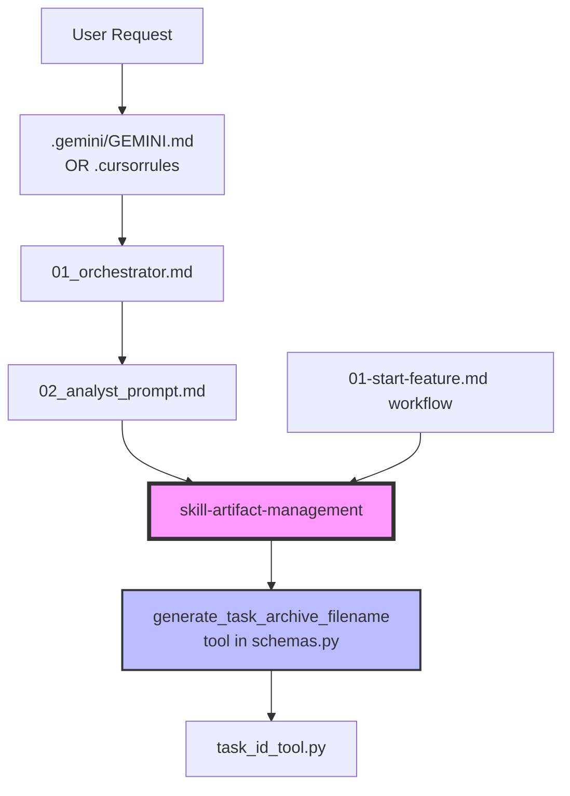

# Анализ и рекомендации по доработке фреймворка Agentic-development (v3.2.6+)

> **Статус:** Детальный анализ завершён 2025-01-18
> **Последнее обновление:** С учётом анализа task archiving инкапсуляции

---

## 📊 Результаты анализа: Инкапсуляция Task Archiving

### Текущее состояние (Проблема: Дублирование)

Логика архивации TASK.md **дублируется в 6+ местах**:

| Файл | Строки | Что содержит |
|------|--------|--------------|
| `.gemini/GEMINI.md` | 56-58 | Полное описание протокола + вызов tool |
| `.cursorrules` | 36-38 | Сокращённое описание + вызов tool |
| `artifact-management/SKILL.md` | 33-55 | **Полный протокол** (источник истины) |
| `02_analyst_prompt.md` | 24-35 | CRITICAL PRE-FLIGHT CHECKLIST |
| `01_orchestrator.md` | 57-69 | DECISION LOGIC для нового vs refinement |
| `01-start-feature.md` workflow | 6-10 | Archiving (CRITICAL) секция |

### Зависимости между файлами



### Вывод: ДА, возможна полная инкапсуляция

**Рекомендация:** Создать **`skill-archive-task`** как самодостаточный skill, который:

1. **Содержит полный протокол** (сейчас в `artifact-management`, строки 33-55)
2. **Включает вызов tool** (`generate_task_archive_filename`)
3. **Определяет Safe Commands** (сейчас дублированы в 4 файлах)

После создания skill-archive-task можно **упростить остальные файлы**:

| Файл | Текущее | После инкапсуляции |
|------|---------|-------------------|
| `.gemini/GEMINI.md` | 12 строк протокола | `Use skill-archive-task` (1 строка) |
| `.cursorrules` | 4 строки | `Load Skills: skill-archive-task` (1 строка) |
| `02_analyst_prompt.md` | 11 строк PRE-FLIGHT | `See skill-archive-task` (1 строка) |
| `01_orchestrator.md` | 8 строк | Reference to skill (2 строки) |
| `artifact-management/SKILL.md` | 22 строки | Import from skill-archive-task OR keep as subsection |

---

## ✅ Скорректированные приоритеты (после анализа)

### Приоритет №1: skill-archive-task (ВЫСШИЙ ПРИОРИТЕТ)

**Обоснование:** Устраняет дублирование в 6 файлах, улучшает maintainability.

> [!CAUTION]
> **Известные проблемы:** Ранее TASK.md не всегда корректно архивировался в разных режимах работы.
> Требуется **детальное тестирование** всех сценариев.

**Рекомендуемый Workflow:** `/vdd-enhanced` (Stub-First + Adversarial)

#### Тестовые сценарии (ОБЯЗАТЕЛЬНЫЕ)

| # | Сценарий | Режим запуска | Ожидаемый результат |
|---|----------|---------------|---------------------|
| 1 | Новая задача, TASK.md существует | Прямой промпт | TASK.md → docs/tasks/, новый TASK.md создан |
| 2 | Новая задача, TASK.md существует | `/01-start-feature` | То же самое |
| 3 | Новая задача, TASK.md существует | `/base-stub-first` | То же самое |
| 4 | Новая задача, TASK.md существует | `/vdd-enhanced` | То же самое |
| 5 | Новая задача, TASK.md НЕ существует | Любой режим | Новый TASK.md создан, архивация пропущена |
| 6 | Уточнение текущей задачи | Прямой промпт | TASK.md перезаписан, НЕ архивирован |
| 7 | Завершение задачи | Orchestrator Completion | TASK.md → docs/tasks/ |
| 8 | Конфликт ID (файл уже существует) | Любой режим | Tool возвращает corrected ID |

#### Acceptance Criteria для тестов

```markdown
- [ ] Все 8 сценариев проходят
- [ ] Tool `generate_task_archive_filename` вызывается корректно
- [ ] Meta Information (Task ID, Slug) обновляется перед архивацией
- [ ] Файл перемещён (не скопирован)
- [ ] Валидация: старый путь не существует, новый существует
- [ ] Логирование: действие записывается в status.md или консоль
```

**Структура нового skill:**
```
.agent/skills/skill-archive-task/
├── SKILL.md           # Полный протокол архивации
└── (опционально) scripts/
    └── archive.sh     # Wrapper для mv + validation
```

**Содержимое SKILL.md:**
```markdown
---
name: skill-archive-task
description: "Complete protocol for archiving TASK.md with ID generation"
version: 1.0
tools: ["generate_task_archive_filename"]
---
# Task Archiving Protocol

## When to Archive
- IF starting a NEW task AND `docs/TASK.md` exists with DIFFERENT content
- IF completing a task (Orchestrator Completion stage)

## Protocol Steps
1. **Check Condition**: Does `docs/TASK.md` exist?
2. **Extract Metadata**: Read Task ID and Slug from "0. Meta Information"
3. **Generate Filename**: Call tool `generate_task_archive_filename(slug="...")`
   - If `status == "generated"` or `status == "corrected"`: use `result["filename"]`
   - If `status == "conflict"`: notify user
4. **Update Task ID**: Update Meta Information with `result["used_id"]`
5. **Archive**: `mv docs/TASK.md docs/tasks/{filename}`
6. **Validate**: Verify file was moved

## Safe Commands (AUTO-RUN)
| Category | Commands |
|----------|----------|
| Archiving | `mv docs/TASK.md docs/tasks/...` |
| Tool calls | `generate_task_archive_filename` |

> [!IMPORTANT]
> This is a MANDATORY, NON-DESTRUCTIVE operation. Do NOT wait for user approval.
```

**Изменения в других файлах после создания:**

1. **`.gemini/GEMINI.md`** — заменить строки 56-60 на:
   ```markdown
   - If `docs/TASK.md` exists and this is a new task:
     - **Apply Skill**: `skill-archive-task`
   ```

2. **`.cursorrules`** — заменить строки 36-38 на:
   ```markdown
   - Archive `docs/TASK.md` using `skill-archive-task` rules.
   ```

3. **`02_analyst_prompt.md`** — заменить строки 24-35 на:
   ```markdown
   #### CRITICAL PRE-FLIGHT:
   - **Apply Skill**: `skill-archive-task` (check and archive existing TASK if needed)
   ```

4. **`artifact-management/SKILL.md`** — заменить "Archiving Protocol" секцию на:
   ```markdown
   ## Archiving Protocol
   See `skill-archive-task` for complete archiving instructions.
   ```

---

### Приоритет №2: Улучшения VDD-режима

- **skill-adversarial-security**: Отдельный критик для безопасности (OWASP, secrets)
- **skill-adversarial-performance**: Критик для производительности
- **workflow `vdd-multi`**: Последовательный запуск нескольких критиков

**Обоснование:** VDD уже работает, но multi-adversarial усилит контроль качества.

---

### Приоритет №3: Дополнительные skills для автоматизации

| Skill | Описание | Зависимости |
|-------|----------|-------------|
| `skill-update-agents-memory` | Анализ git diff → обновление `.AGENTS.md` | `git_ops` tool |
| `skill-reverse-engineering` | Промпт для reverse engineering проекта | `requirements-analysis` |

---

### Приоритет №4: Гибридный подход к tools

**Решение принято:** НЕ создавать shared-scripts/симлинки.

**Причина:** 
- Tools в `schemas.py` уже работают через Orchestrator
- IDEs (Gemini/Cursor) имеют свои native tools
- Симлинки усложняют setup и создают platform-specific проблемы

**Вместо этого:** В каждом skill чётко документировать какой tool использовать:
```markdown
### Required Tools
- `generate_task_archive_filename` — Call via native tool mechanism
```

---

### Приоритет №5: Экосистема и удобство

- **Installer script** (`setup.sh`): Позже, когда стабилизируется структура
- **Examples**: `examples/` с 2-3 готовыми проектами
- **Skills Catalog**: Таблица в README (уже частично есть в `docs/SKILLS.md`)

---

## 📋 Обновлённая дорожная карта

| Версия | Изменения | Приоритет |
|--------|-----------|-----------|
| **v3.3** | `skill-archive-task` + рефакторинг дублирования | 🔴 Критический |
| **v3.4** | VDD multi-adversarial + новые adversarial skills | 🟡 Высокий |
| **v3.5** | `skill-update-agents-memory`, `skill-reverse-engineering` | 🟢 Средний |
| **v3.6** | Installer + examples + documentation polish | 🔵 Низкий |

---

## 🔍 Детальный анализ: Где ещё есть дублирование

### Safe Commands (дублируются в 4 файлах)

| Файл | Строки |
|------|--------|
| `.gemini/GEMINI.md` | 21-26 |
| `.cursorrules` | 24-28 |
| `artifact-management/SKILL.md` | 57-69 |
| `01_orchestrator.md` | 35-40 |

**Рекомендация:** Вынести в отдельный skill `skill-safe-commands` или централизовать в `core-principles`.

### Tool Execution Protocol (дублируется в 3 файлах)

| Файл | Строки |
|------|--------|
| `.gemini/GEMINI.md` | 14-19 |
| `.cursorrules` | 17-22 |
| `01_orchestrator.md` | 28-33 |

**Рекомендация:** Оставить в entry points (`.gemini`, `.cursorrules`) так как это IDE-specific, но унифицировать формулировки.

---

## ✅ Финальные рекомендации

1. ✅ **Создать `skill-archive-task`** — устраняет 60%+ дублирования (DONE)
2. **Не усложнять tools** — schemas.py + native IDE tools достаточно
3. **Фокус на VDD** — это уникальное преимущество фреймворка
4. **Документация > код** — skills = документация для агентов
5. **Централизовать Safe Commands** — создать единый источник истины

---

## 🛡️ Safe Commands: Рекомендации по автоматизации

> [!WARNING]
> Пользователю приходится вручную подтверждать многие безопасные команды.
> Это замедляет workflow и требует исправления.

### Проблема
Safe Commands сейчас **дублируются в 5 файлах**:
- `.gemini/GEMINI.md`
- `.cursorrules`
- `01_orchestrator.md`
- `artifact-management/SKILL.md`
- `skill-archive-task/SKILL.md` (добавлено)

### Решение: Создать `skill-safe-commands`

```markdown
---
name: skill-safe-commands
description: "Centralized list of commands safe for auto-execution without user approval"
---
# Safe Commands Protocol

## Auto-Run Command Categories

| Category | Commands | Reason |
|----------|----------|--------|
| **Read-only** | `ls`, `cat`, `head`, `tail`, `find`, `grep`, `tree`, `wc` | Не изменяют состояние |
| **File info** | `stat`, `file`, `du`, `df` | Информационные |
| **Git read** | `git status`, `git log`, `git diff`, `git show`, `git branch` | Read-only git ops |
| **Archiving** | `mv docs/TASK.md docs/tasks/...`, `mv docs/PLAN.md docs/plans/...` | Документированные операции |
| **Directory** | `mkdir -p docs/tasks`, `mkdir -p .agent/skills/*` | Идемпотентные |
| **Tool calls** | `generate_task_archive_filename`, `list_directory`, `read_file` | Native tools |
| **Testing** | `python -m pytest ...`, `npm test`, `cargo test` | Тесты не изменяют код |

## Instructions for IDE
- Antigravity/Gemini: These commands should have `SafeToAutoRun: true`
- Cursor: Add to auto-approve list in settings
```

### Добавить в дорожную карту
- **v3.3.1**: Создать `skill-safe-commands` и рефакторить ссылки