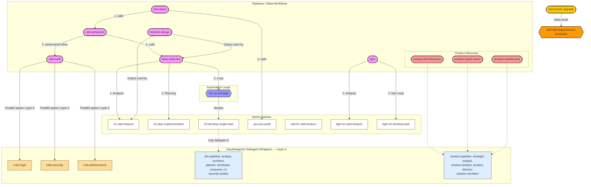
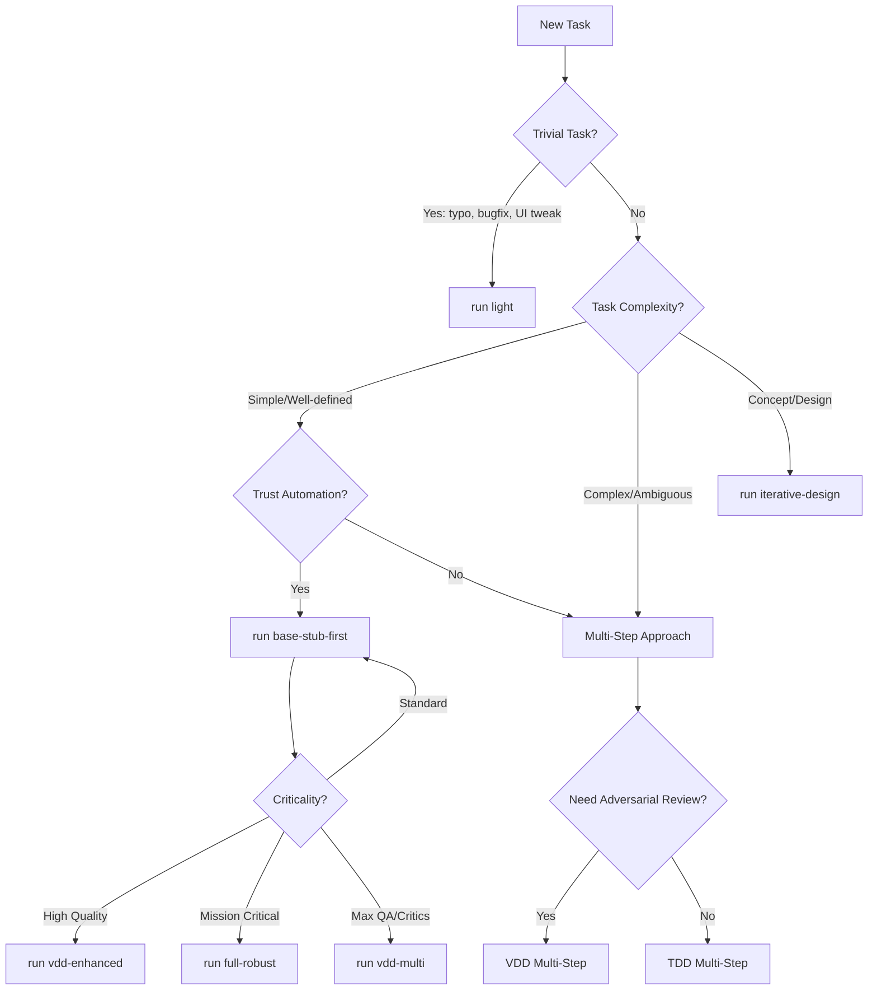
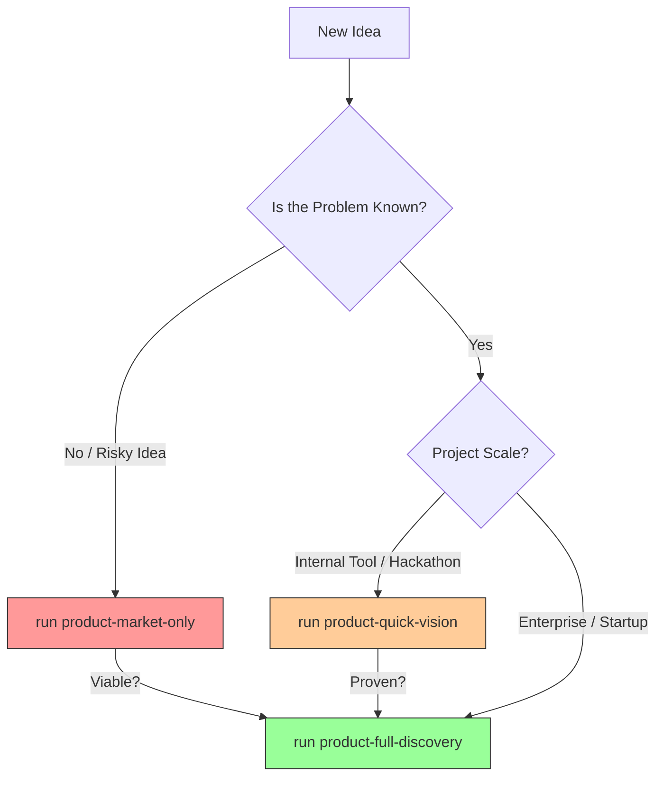

# Antigravity Workflows Manual

This document is the **Single Source of Truth** for all automation workflows in the Antigravity system. Workflows are defined in `.agent/workflows/` and can be executed by the Orchestrator to automate development processes.

## Command Convention

- Canonical form: `run <workflow-name>` (example: `run base-stub-first`).
- Slash form: `/workflow-name` is an alias for direct interactive calls.
- Nested orchestration form inside workflow text: `Call /workflow-name`.

## Table of Contents

- [🚀 Workflow Categorization](#-workflow-categorization)
- [Command Convention](#command-convention)
- [1. Pipelines (Meta-Workflows)](#1-pipelines-meta-workflows)
- [2. Automation Loops](#2-automation-loops)
- [3. Atomic Actions](#3-atomic-actions)
- [4. Product Workflows](#4-product-workflows)
- [5. Framework Self-Improvement](#5-framework-self-improvement)
- [6. Agent Teams Mode (Subagent Wrappers)](#6-agent-teams-mode-subagent-wrappers)
- [❓ FAQ](#-faq)
- [🛡 Safety & Verification](#-safety--verification)
- [📋 Getting Started: Workflow Call Sequences](#-getting-started-workflow-call-sequences)
  - [Approaches Overview](#approaches-overview)
  - [TDD (Test-Driven Development) Examples](#tdd-test-driven-development-examples)
  - [VDD (Verification-Driven Development) Examples](#vdd-verification-driven-development-examples)
  - [Quick Reference: Choosing Your Approach](#quick-reference-choosing-your-approach)
  - [Choosing Product Approach (Phase 0)](#choosing-product-approach-phase-0)
  - [Summary Table](#summary-table)

---

## 🗺 Workflow System Map

Visualizing how the workflows connect and call each other.



## 🚀 Workflow Categorization

The workflows are organized into three categories:

1.  **Pipelines (Meta-Workflows)**: High-level strategies that manage the entire lifecycle of a feature (Analysis -> Arch -> Plan -> Execution). **Start here.**
2.  **Automation Loops**: Engines that iterate through lists of tasks.
3.  **Atomic Actions**: Granular steps that perform a single phase.

---

## 1. Pipelines (Meta-Workflows)
*Use these to start a big chunk of work.*

| Workflow Name | Description | Command |
| :--- | :--- | :--- |
| **Standard Feature** | **Default Choice.** Runs the full "Stub-First" pipeline: Analysis, Architecture, Planning, and then Auto-Execution loop. | `run base-stub-first` |
| **Full Robust** | The Ultimate Pipeline: Runs `VDD Enhanced` strategy (Adversarial) with **Strict TDD** (High Assurance) followed by a Security Audit. | `run full-robust` |
| **VDD Enhanced** | **Hardened Pipeline.** Stub-First Plan + **RTM Validation** + VDD Adversarial execution. | `run vdd-enhanced` |
| **VDD Multi-Adversarial** | **Parallel** execution of 3 specialized critics (logic, security, performance) via Layer A — single `Agent` tool-use spawning `.claude/agents/critic-*` subagents in one message. Supports 5 inline flags: `--scope`, `--no-fix`, `--fail-on`, `--output`, `--diff-only`. See §6 for wrapper details and `.agent/workflows/vdd-multi.md` for full parameter reference. | `run vdd-multi [target] [flags]` or `/vdd-multi ...` |
| **Framework Upgrade** | **Meta-Workflow.** Safely upgrades the Agentic System itself (Prompts/Skills) with Audit Gates. | `run framework-upgrade` |
| **Iterative Design** | **Concept Refinement Loop.** Brainstorm -> Spec Draft -> VDD -> Human Review -> Refine. | `run iterative-design` |
| **Light Mode** | **Fast-track for trivial tasks.** Skips Architecture/Planning. Uses Analysis → Dev → Review loop. | `run light` or `/light` |

---

## 2. Automation Loops
*Use these to execute a ready-made plan.*

| Workflow Name | Description | Command |
| :--- | :--- | :--- |
| **Run Full Task** | **The Loop Engine.** Reads `../../docs/PLAN.md`, iterates through all tasks, and executes `03-develop-single-task` for each one. Stops on error. | `run 05-run-full-task` |
| **VDD Develop** | The VDD Loop Engine. Runs the Adversarial "Sarcasmotron" loop for tasks. | `run vdd-03-develop` |

---

## 3. Atomic Actions
*Use these for granular control or manual overrides.*

| Workflow Name | Description | Command |
| :--- | :--- | :--- |
| **Start Feature** | Analysis Phase only (creates TASK). | `run 01-start-feature` |
| **Plan Impl** | Planning Phase only (creates PLAN). | `run 02-plan-implementation` |
| **Develop Task** | Executes a **single** task from the plan (No loop). | `run 03-develop-single-task` |
| **Update Docs** | Updates documentation artifacts. | `run 04-update-docs` |
| **Security Audit** | runs the security auditor agent. | `run security-audit` |
| **Light Start** | Light Mode Analysis Phase only (creates TASK with `[LIGHT]` tag). | `run light-01-start-feature` |
| **Light Develop** | Light Mode Dev → Review loop (skips Plan). | `run light-02-develop-task` |

---

## 4. Product Workflows
*Use these to define WHAT to build (Before coding).*

| Workflow Name | Description | Command |
| :--- | :--- | :--- |
| **Product Full Discovery** | **Enterprise Mode.** Full chain: Strategy (`p01`) -> Vision (`p02`) -> Director Gate (`p03`) -> Solution (`p04`) -> Handoff. | `run product-full-discovery` |
| **Product Quick Vision** | **Hackathon Mode.** Skips Market Research. Vision (`p02`) -> Director Gate (`p03`) -> Handoff. | `run product-quick-vision` |
| **Product Market Only** | **Validation Mode.** Runs Strategy (`p01`) only. No Handoff. Useful for checking idea viability. | `run product-market-only` |

---

## ❓ FAQ

### Q: Why did `01-04` not loop through all tasks?
A: Because `03-develop-single-task` is designed to be **atomic**. It performs one cycle of "Code -> Review -> Fix". It does **not** contain logic to read a list and iterate. To run the full list, you must use a **Pipeline** (like `base-stub-first`) which calls the **Automation Loop** (`05-run-full-task`).

### Q: How does `Run Full Task` work?
A: It parses `../../docs/PLAN.md`. For each entry (e.g., "Task 1.1"), it:
1.  Calls `03-develop-single-task` with that specific task ID.
2.  Waits for success.
3.  Moves to the next task.
4.  Verification is handled inside `03` (Developer <-> Reviewer loop).

---

## 🛡 Safety & Verification

All **Standard** automation workflows include **Mandatory Verification Loops** and **Safety Limits**:
1.  **Verification**: Every artifact (TASK, Architecture, Plan, Code) is checked by a specialized Reviewer Agent.
2.  **Retry Limit**: If a Reviewer rejects an artifact, the Doer gets **2 attempts** to fix it. If it fails a 3rd time, the workflow stops to request User intervention.

---

## 📋 Getting Started: Workflow Call Sequences

This section provides practical examples of how to execute workflows from start to finish.

### Approaches Overview

| Approach | Description | Best For |
| :--- | :--- | :--- |
| **One-Step (Pipeline)** | Single command runs entire lifecycle | Quick starts, trusted automation |
| **Multi-Step (Manual)** | Step-by-step execution with full control | Learning, debugging, critical projects |

---

### TDD (Test-Driven Development) Examples

#### One-Step Approach (Pipeline)

```bash
# Single command to run the entire Stub-First pipeline
run base-stub-first
```

**What happens automatically**:
1. Analysis → TASK created and reviewed
2. Architecture → ARCHITECTURE.md updated and reviewed
3. Planning → PLAN.md created and reviewed
4. Development Loop → All tasks executed with Developer ↔ Reviewer cycles

✅ **Pros**:
- Minimal user intervention required
- Fast for well-defined tasks
- Consistent execution every time

❌ **Cons**:
- Less visibility into intermediate steps
- Harder to pause and adjust mid-process
- May waste cycles if initial analysis is wrong

---

#### Multi-Step Approach (Manual Control)

```bash
# Step 1: Analysis Phase
run 01-start-feature
# → Review ../../docs/TASK.md before proceeding

# Step 2: Architecture Phase (if needed)
# → Manually update ../../docs/ARCHITECTURE.md or verify it's current

# Step 3: Planning Phase
run 02-plan-implementation
# → Review ../../docs/PLAN.md before proceeding

# Step 4: Execute a single task
run 03-develop-single-task
# → Repeat for each task, or use the loop:

# Step 4 (Alternative): Execute all tasks automatically
run 05-run-full-task

# Step 5: Update documentation
run 04-update-docs
```

✅ **Pros**:
- Full control at every stage
- Can pause, review, and adjust between phases
- Better for learning the system
- Easier to debug failures

❌ **Cons**:
- More commands to remember
- Requires more user attention
- Slower overall execution

---

### VDD (Verification-Driven Development) Examples

#### One-Step Approach (Pipeline)

```bash
# Option A: VDD-Enhanced (Stub-First + Adversarial)
run vdd-enhanced

# Option B: Full Robust (VDD-Enhanced + Security Audit)
run full-robust
```

**What happens automatically**:
1. Full `base-stub-first` pipeline executes
2. Adversarial "Sarcasmotron" reviews all code
3. (Full Robust only) Security audit runs
4. Final documentation update

✅ **Pros**:
- Maximum code quality assurance
- Adversarial review catches hidden issues
- Security audit for production-ready code

❌ **Cons**:
- Takes longer due to multiple review cycles
- May be overkill for simple changes
- Sarcasmotron can be overly critical

---

#### Multi-Step Approach (Manual Control)

```bash
# Step 1: VDD Analysis Phase (with Chainlink Decomposition)
run vdd-01-start-feature
# → Review ../../docs/TASK.md (structured as Epics → Issues)

# Step 2: VDD Planning Phase (Beads Decomposition)
run vdd-02-plan
# → Review ../../docs/PLAN.md (structured as Epics → Issues → Sub-issues)

# Step 3: VDD Development with Adversarial Loop
run vdd-03-develop
# → Each task goes through Builder → Verification → Sarcasmotron Roast

# Step 4 (Optional): Run adversarial refinement on entire codebase
run vdd-adversarial

# Step 5 (Optional): Security audit
run security-audit

# Step 6: Update documentation
run 04-update-docs
```

✅ **Pros**:
- Granular control over VDD phases
- Can skip adversarial/security for low-risk changes
- Better understanding of what each phase does

❌ **Cons**:
- More complex than TDD multi-step
- Requires understanding of VDD concepts
- Easy to skip important verification steps

---

### Quick Reference: Choosing Your Approach



### Choosing Product Approach (Phase 0)



### Summary Table

| Scenario | Recommended Command |
| :--- | :--- |
| Quick feature, trusted automation | `run base-stub-first` |
| Learning the system | TDD Multi-Step (`01` → `02` → `03/05` → `04`) |
| High-quality production code | `run vdd-enhanced` |
| Maximum code quality (3 parallel critics) | `run vdd-multi <target>` |
| Scoped parallel critique (one area only) | `/vdd-multi <target> --scope=security` |
| CI / pre-merge review bot | `/vdd-multi --diff-only --no-fix --fail-on=high --output=docs/reviews/pr-<N>.md` |
| Security-critical feature | `run full-robust` |
| Debugging a specific phase | Run that phase's atomic workflow |
| Just need analysis | `run 01-start-feature` or `run vdd-01-start-feature` |
| **Trivial task (typo, bugfix)** | `run light` or `/light` |

---

## 5. Framework Self-Improvement
*Use these to safely upgrade the Agentic System itself.*

| Workflow Name | Description | Command |
| :--- | :--- | :--- |
| **Framework Upgrade** | **Meta-Workflow.** Safely upgrades Prompts, Skills, and System Logic. Includes **Meta-Audit** gates using `skill-self-improvement-verificator` to prevent regression. | `run framework-upgrade` |

**Safety Protocol:**
1. **Analysis Gate:** Checks `docs/TASK.md` for proper TIER usage and documentation updates.
2. **Planning Gate:** Checks `docs/PLAN.md` for atomicity and rollback steps.
3. **Execution Guard:** Changes are applied with the Self-Improvement Verificator active.
4. **Rollback:** Automatic backup of core files to `.agent/archive/` before changes.

### ✅ Recommended Strategy
For critical system updates, follow this **Hybrid Verification Loop**:
1. **Draft Spec:** Use `skill-self-improvement-verificator` (Analysis Mode) to draft `docs/TASK.md`.
2. **Manual Verification (CRITICAL):** Manually review the spec and plan. Do not rely solely on automation.
3. **Execution:** Once verified, execute using the `run framework-upgrade` workflow (for system) or `run vdd-enhanced` (for strict implementation).

---

## 6. Agent Teams Mode (Subagent Wrappers)

**Since v3.10.0 (Wave 1).** Workflows run through the Orchestrator can spawn Claude Code native subagents defined as thin wrappers in [`.claude/agents/`](../../.claude/agents/). Each wrapper is ~13 lines: frontmatter (`name`, `description`, `tools`, `model`) + one-line SOT pointer + 1–3 subagent-specific adaptations. Methodology lives in `System/Agents/*.md` or `.agent/skills/*/SKILL.md` — wrappers do not duplicate.

### Current catalog (16 wrappers)

| Tier | Count | Model | Wrappers |
| :--- | :--- | :--- | :--- |
| **Adversarial Critics** (Wave 1) | 3 | opus | `critic-logic`, `critic-security`, `critic-performance` |
| **Dev-Pipeline Builders** (Wave 2) | 3 | sonnet | `analyst`, `architect`, `developer` |
| **Dev-Pipeline Reviewers** (Wave 2) | 4 | opus | `task-reviewer`, `architecture-reviewer`, `plan-reviewer`, `code-reviewer` |
| **Dev-Pipeline Specialists** (Wave 2) | 2 | opus | `planner`, `security-auditor` |
| **Product-Pipeline Builders** (Wave 3) | 3 | sonnet | `strategic-analyst`, `product-analyst`, `solution-architect` |
| **Product-Pipeline Gatekeeper** (Wave 3) | 1 | opus | `product-director` |

**Split**: 10 Opus (verifiers + rigor-heavy roles) + 6 Sonnet (builders). See [docs/ARCHITECTURE.md](../../docs/ARCHITECTURE.md) §5.1 for the full table with tools per wrapper and the Model policy rationale.

### Two spawn layers

- **Layer A — parallel `Agent` tool-use** (implemented, default). Orchestrator issues N parallel `Agent` calls in **one message**; each teammate runs synchronously and returns a result via `tool_result`. Used by `/vdd-multi`. Proven twice under smoke tests (Sonnet and Opus baselines).
- **Layer B — native `TeamCreate` / `SendMessage`** (runtime probed v3.13.0; full workflow deferred). For scenarios requiring inter-teammate messaging mid-work. Probe confirmed core tools work but documented blocking gotchas in [docs/KNOWN_ISSUES.md](../../docs/KNOWN_ISSUES.md) — most notably `TeamDelete` fails to clean up after `shutdown_approved`. Reopens when a concrete peer-debate use case justifies the extra complexity.

### `/vdd-multi` parameter reference (v3.13.0)

| Flag | Values | Default | Effect |
| :--- | :--- | :--- | :--- |
| `--scope=<list>` | `logic`, `security`, `performance`, `all` (comma-separated) | `all` | Run only the selected critic(s). |
| `--no-fix` | (boolean) | off | Skip Phase 3 iterative fix loop — report-only mode. |
| `--fail-on=<sev>` | `critical`, `high`, `medium`, `low`, `none` | `none` | Emit PASS/FAIL verdict when any finding ≥ threshold. |
| `--output=<path>` | file path | none | Write merged report to file instead of inline. |
| `--diff-only` | (boolean) | auto-on if no target | Bound review to `git diff` vs `main`. |

Full reference: [`.agent/workflows/vdd-multi.md`](../../.agent/workflows/vdd-multi.md).

### Out-of-scope wrappers

Orchestrator roles are NOT wrapped (remain as main-agent role-switching personas, per Claude Code native Teams limitation: no nested teams):
- `01_orchestrator.md` (dev-pipeline orchestrator)
- `p00_product_orchestrator_prompt.md` (product-pipeline orchestrator)

---
