# PLAN 118 — The security-audit scan reports for each tool whether it ran, reports npm advisories at every severity, and scans the working tree for secrets

**TASK:** [docs/TASK.md](TASK.md) (revision 7) · **Covers:** R1–R7 · **Acceptance:** A1–A13.

**Revision:** 5: fix round 2 of stage 2 (D17 to D19); revision 4 per fix round 1
(`docs/reviews/framework-audit-118.md`).

<!-- contract:sequence -->

## Sequencing rule

Eleven clusters, then the retro and the restart notice. No `docs/tasks/task-118-*.md` file is
written: `/framework-upgrade` keeps its steps in this PLAN, on the precedent of PLAN 111 to
PLAN 116.

- A writes the seven staged files of TASK R7.1 as byte copies of their base files. Nothing else
  reads them yet.
- B is Phase 1 (stub creation): the new interfaces as stubs in the staged code, and the new
  tests in the staged test modules. The tests fail against the stubs (Red).
- C is Phase 2 (logic implementation): the logic replaces the stubs, and every test passes against
  the staged code (Green).
- D runs the base-fail run and the mutation runs.
- E lands the documents and records that land before stage 3 (TASK R7.7). It shares no file with
  A to D.
- F writes the stage-3 patch. G runs every gate before stage 2.
- H is stage 2. I is §4.5 and stage 3, the last edit of the change. Only the retro's records follow
  it.
- J is stage 4. The retro follows J, and K closes the run.
- No command of this run runs `git stash`, `git reset --hard`, `git clean` or `git checkout`. No
  copy of a repository file is written outside version control. A test fixture's own temporary
  directory is outside that rule.

| Order | Cluster | Files | Covers |
| :--- | :--- | :--- | :--- |
| A | Staged copies | the seven staged names | R7.1, R7.2 |
| B | Stubs and tests (Red) | staged code and staged test modules | R1–R4, R7.4 |
| C | Logic (Green) | staged code | R1–R4 |
| D | Base-fail and mutation runs | the audit record | R7.5, A13 |
| E | Documents and records | `SKILL.md` §2, routers, example, changelogs, WI-42 | R5, R6.2, R6.3, R7.11 |
| F | The stage-3 patch | `docs/reviews/framework-audit-118-stage3.diff` | R7.6, R7.8 |
| G | Gates before stage 2 | the audit record | A10 (base) |
| H | Stage 2 | the audit record | R7.9, R7.10 |
| I | §4.5 and stage 3 | the files of the patch | R6.1, R7.6, A10 |
| J | Stage 4 | the audit record | R7.8, R7.9 |
| K | Restart notice | the final message | `framework-upgrade` §4.3 |

<!-- contract:coverage -->

### Coverage

| Use case | Steps |
| :--- | :--- |
| UC-1 an audit without the external tools | B2, C3, C4 (TC-E1, TC-E11, TC-E12); E2 |
| UC-2 a CI gate with every tool installed | B2, C3, C4 (TC-E3, TC-E8, TC-E16) |
| UC-3 a moderate npm advisory | B2, C1 (TC-D1, TC-D2) |
| UC-4 an uncommitted secret | B2, C2 (TC-E7) |

| Requirement | Steps |
| :--- | :--- |
| R1 | B1, B2, C2, C3 |
| R2 | B1, B2, C3 |
| R3 | B1, B2, C1 |
| R4 | B1, B2, C2 |
| R5 | E1, E2, E3; R5.7 holds by the absence of a CI edit in the declared paths |
| R6 | B1 (header, `__version__`), E4, E5, F1, B2 and B3 (docstrings); R6.4 is this run's audit record |
| R7 | A2, A3, B4, C4, D1, F1, F2, H1, I1, I2, J1 |

| Acceptance | Steps |
| :--- | :--- |
| A1 | TC-E1 |
| A2 | TC-E8 |
| A3 | TC-E5 |
| A4 | TC-E3 |
| A5 | TC-E12 |
| A6 | TC-D1, TC-D5 |
| A7 | TC-E11 |
| A8 | TC-E6, TC-E7 |
| A9 | E1, E2, TC-3b; the reviewers of H |
| A10 | G1, I2 |
| A11 | TC-E15 |
| A12 | TC-E17 |
| A13 | D1 |

## Declared paths

Edited:

- `.agent/skills/security-audit/scripts/audit/__init__.py` (by the patch in I)
- `.agent/skills/security-audit/scripts/audit/helpers.py` (by the patch in I)
- `.agent/skills/security-audit/scripts/audit/scanners.py` (by the patch in I)
- `.agent/skills/security-audit/scripts/audit/external.py` (by the patch in I)
- `.agent/skills/security-audit/scripts/run_audit.py` (by the patch in I)
- `tests/test_lockfile_audit.py` (by the patch in I)
- `tests/test_run_safety_rules.py` (by the patch in I)
- `.agent/skills/security-audit/SKILL.md` (§2 in E1; version and title by the patch in I)
- `.agent/skills/security-audit/examples/usage_example.md`
- `.claude/agents/security-auditor.md`
- `System/Agents/10_security_auditor.md`
- `.agent/workflows/security-audit.md`
- `System/Docs/SKILLS.md` (by the patch in I)
- `System/Docs/VDD.md` (by the patch in I)
- `CHANGELOG.md`
- `CHANGELOG.ru.md`
- `docs/BACKLOG.md`
- `docs/backlog/wi-42-security-audit-scans-hide-what-did-not-run.md`

Created:

- `.agent/skills/security-audit/scripts/audit/init_next.py` (removed by the patch in I)
- `.agent/skills/security-audit/scripts/audit/helpers_next.py` (removed by the patch in I)
- `.agent/skills/security-audit/scripts/audit/scanners_next.py` (removed by the patch in I)
- `.agent/skills/security-audit/scripts/audit/external_next.py` (removed by the patch in I)
- `.agent/skills/security-audit/scripts/run_audit_next.py` (removed by the patch in I)
- `tests/staged_lockfile_audit.py` (removed by the patch in I)
- `tests/staged_run_safety_rules.py` (removed by the patch in I)
- `docs/reviews/framework-audit-118-stage3.diff` (the stage-3 patch; §5 removes it, and the audit
  record holds its text and SHA-256)
- `docs/backlog/wi-49-the-history-secret-scan-runs-git-in-the-scanned-trees-repository.md`, the
  record of TASK R6.6 and D11
- `docs/backlog/wi-50-scanner-configuration-files-in-the-scanned-tree-can-silence-the-external-tools.md`,
  the record of TASK R6.6 and D14
- `docs/backlog/wi-51-residual-routes-of-the-task-118-scanner-review.md`, the record of TASK R6.6
  and D18

The run's `docs/TASK.md`, `docs/PLAN.md`, the audit record `docs/reviews/framework-audit-118.md`
and the TASK 117 archive `docs/tasks/task-117-slot-archive-bound-and-stage2-review-bound.md` are
declared by `framework-upgrade` §5. A record the retro files, and the index line it adds to
`docs/BACKLOG.md` or `docs/KNOWN_ISSUES.md`, are declared when the retro files them; §5 runs before
the retro.

**Rollback point.** Base `e1fb36200ff474957611497f1d0826c51499d31a`, clean at the start of the
run. No file outside the repository is edited, except the scratchpad files below; no package or
tool is installed. No ignored file is edited, except the run's own state under `.agent/sessions/`
and `.agent/feedback/`, and the `__pycache__/` directories that imports write. Every pytest run
passes `-p no:cacheprovider`.

- The scratchpad holds no copy of a repository file, and no script there embeds one. A script
  reads a repository file into memory and builds its output there. The files, each with the step
  after which it is deleted:
  - `fp.sh`, the tree fingerprint of `skill-parallel-orchestration` §2.4.1 — K;
  - `run_gates.sh`, the `run:` steps of the check jobs of `framework-gates.yml`, with
    `RUNNER_TEMP` set to the scratchpad. It runs no install step and no action — K;
  - `refs-living.log`, which `run_gates.sh` writes under `RUNNER_TEMP` — K;
  - `stage_driver.py`, the driver of TASK R7.3, with the modes `next` and `base` — J;
  - `bootstrap_next.py`, which registers the staged package as `audit` and runs
    `run_audit_next.py` as `__main__` (TASK R7.4). It asserts each registered module's
    `__file__`, and exits 70 on a mismatch — J;
  - `mutation_driver.py`, the mutation runs of D2 — J;
  - `gen_stage3_patch.py`, the generator of F1, which writes only the declared `.diff` — J.
- Each reviewer brief forbids writing a copy of a repository file, and gives each agent its own
  scratch name in the scratchpad.

Checks used by several steps:

- Gates: `run_gates.sh`.
- Register: `scan_register.py <file>` per edited markdown file; no `WARN` on a line that
  `git diff -U0 <base>` adds.
- Declared paths: `git status --porcelain=v1 --untracked-files=all`, each path compared with the
  lists above.

## Cluster A — staged copies (R7.1, R7.2)

- [x] A1 `framework-upgrade` §3.1 base check: `HEAD` equals the base; each edited path passes
      `git ls-files --error-unmatch`; each created path gives `git check-ignore -q` exit 1; each
      path matches `[A-Za-z0-9._/-]+` with no `.git` or `..` segment.
- [x] A2 Each staged file is a byte copy of its base file:

  | Base file | Staged name |
  | :--- | :--- |
  | `…/scripts/audit/__init__.py` | `…/scripts/audit/init_next.py` |
  | `…/scripts/audit/helpers.py` | `…/scripts/audit/helpers_next.py` |
  | `…/scripts/audit/scanners.py` | `…/scripts/audit/scanners_next.py` |
  | `…/scripts/audit/external.py` | `…/scripts/audit/external_next.py` |
  | `…/scripts/run_audit.py` | `…/scripts/run_audit_next.py` |
  | `tests/test_lockfile_audit.py` | `tests/staged_lockfile_audit.py` |
  | `tests/test_run_safety_rules.py` | `tests/staged_run_safety_rules.py` |

  Postcondition: each pair has one SHA-256.
- [x] A3 `stage_driver.py --mode next` runs both staged test modules against the copies, and
      every base case passes. `--mode base` gives the same counts. Mode `next` asserts the checks
      of TASK R7.4, and that no base file of `helpers`, `scanners` or `external` is loaded under
      the package name or as `audit.*`.

## Cluster B — stubs and tests, Red (R1–R4, R7.4)

`[STUB CREATION]`. Each interface below lands in the staged code with a docstring and a stub body.

- [x] B1 Interfaces. Each stub keeps the base behaviour that a base case needs, and returns a fixed
      value for the new part:
  - `helpers_next.py`: `TOOL_TIMEOUT = 600`; `run_tool(cmd, cwd, slot, where=".") -> dict`, a stub
    that returns a fixed `not_installed` record. `run_command` stays until C2 removes it.
  - `external_next.py`: `run_external_tools(project_path, types, fail_on=None) -> list`, a stub
    whose body is `return []`; `external_section(records) -> dict`, a stub that returns
    `{"status": "NOT_RUN", "tools": records}`; `find_git_entry(root, stop=None) -> str | None`, a
    stub that returns `None`. The real one returns `"dir"`, `"file"`, `"link"`, `"other"` or
    `None` (TASK R4.2).
  - `scanners_next.py`: `_npm_audit_counts(audit_data) -> dict`, a stub that returns the six
    counts at 0; `_npm_audit_findings` keeps its list return. The `audited` key is C1's.
  - `run_audit_next.py`: the header reads `v3.12` (TASK R6.1); `run_full_scan` gains
    `fail_on=None` and keeps the base body; `exit_code(report, fail_on) -> int`, a stub that
    returns 0; `main(argv=None)` keeps the base body.
  - `init_next.py`: `__version__ = "3.12"`, and `find_git_entry` and `external_section` exported.
  - `run_audit_next.py` imports from `audit` only the names that `init_next.py` exports, and
    `config`.
- [x] B2 The new tests of TASK §7 go into `tests/staged_lockfile_audit.py`:
  - the module gains `RUN_AUDIT_PATH` and `RUN_AUDIT_CMD` (TASK R7.4), read at call time;
  - `_load()` keeps its rule and also returns the package and the helpers module;
  - TC-E1 to TC-E17 and TC-D1 to TC-D7, TC-D1 in place of TC-L23;
  - the cases of the base that patch `external.run_command` patch `external.run_tool`; each
    keeps its assertions. The fake takes `(cmd, cwd=None, slot=None, where=".", **_kw)` and
    returns a tool record of status `ran` and exit code 0;
  - the docstring lists the new ids (TASK R6.5).
- [x] B3 TC-3b goes into `tests/staged_run_safety_rules.py`: the three blocks of E2 in
      `POINTERS`, and the `security-audit` row of `System/Docs/SKILLS.md` at v3.12. The docstring
      names TASK 118 and TC-3b (TASK R6.5).
- [x] B4 `stage_driver.py --mode next`. Expected, and the audit record holds the counts:
  - every new case of B2 fails or errors against the stubs;
  - of the moved base cases, TC-L7 and TC-Y1 fail, because the stub of `run_external_tools`
    starts no tool. TC-L8, TC-L9c, TC-Y2 and TC-Y3 pass: each asserts an empty list;
  - TC-3b fails until E2 and the patch of I;
  - every other base case passes.

## Cluster C — logic, Green (R1–R4)

`[LOGIC IMPLEMENTATION]`. Each step replaces stubs in the staged code.

- [x] C1 `scanners_next.py` (R3): the severity map of R3.1, the `unknown` count of R3.2,
      `npm_audit_counts` (R3.3), the `audited` key (R3.4), the status of R3.5, the sort of R3.6.
- [x] C2 `helpers_next.py` and `external_next.py` (R1, R4):
  - `run_tool` with the statuses it can set, and the tool's stdout and stderr on descriptor 2
    (R1.9);
  - each slot of R1.2 in the base's order, the fallback rule of R1.5, the `not_run` records of
    R1.6;
  - `--fail`, `--exit-code 1` and `--audit-level` from `fail_on` (R2.10);
  - `secrets-tree` and `secrets-history` of R4;
  - `external_section` of R1.7.
- [x] C3 `run_audit_next.py` (R1.4, R1.8, R2):
  - the external layer with no detected type;
  - the summary of R2.1 to R2.5, counted before the cut;
  - `exit_code` of R2.6 and R2.7, and the stderr lines of R2.8;
  - `overall_status` of R2.9;
  - `--output summary` of R1.8 and R3.7, and one JSON document on stdout.
- [x] C4 `stage_driver.py --mode next`, with the checks of A3: every case of both staged modules
      passes, TC-3b excepted until E2 and I. Python 3.11 and the main version both run it, when 3.11 is installed;
      otherwise the audit record states `3.11: NOT RUN (<reason>)`.

## Cluster D — base-fail and mutation runs (R7.5, A13)

- [x] D1 `stage_driver.py --mode base`. Expected, exactly:
  - every new case of B2, B3, FR1.1 and FR2.1 fails or errors against the base code;
  - the six moved cases TC-L7, TC-L8, TC-L9c and TC-Y1 to TC-Y3 error: the base `external`
    module has no `run_tool`;
  - no other case fails or errors.

  A new case that passes is listed in the audit record with its reason.
- [x] D2 `mutation_driver.py`. It reads the staged files into memory and records their SHA-256.
      For each mutation it writes the mutated text into the staged file, runs the named case in a
      fresh subprocess of `stage_driver.py --mode next` with `PYTHONDONTWRITEBYTECODE=1`, and
      writes the original back. A `finally` block writes every original back and compares the
      SHA-256; a mismatch means STOP.

  | Mutation | Staged file | Case that must fail |
  | :--- | :--- | :--- |
  | `exit_code` ignores `scan_complete` | `run_audit_next.py` | TC-E1, TC-E11 |
  | the critical-and-high filter of the base returns | `scanners_next.py` | TC-D1 |
  | the summary is counted after the cut | `run_audit_next.py` | TC-E17 |
  | `secrets-tree` without `--no-git` | `external_next.py` | TC-E7 |
  | the tool's stdout on descriptor 1 | `helpers_next.py` | TC-E8 |
  | a trufflehog fallback for `secrets-history` | `external_next.py` | TC-E5 |
  | `exit_code` ignores `tool_exits` | `run_audit_next.py` | TC-E3 |
  | `find_git_entry` follows a `.git` link | `external_next.py` | TC-E6 |
  | only a `.git` directory starts git mode | `external_next.py` | TC-E6 |
  | the deps sort is removed | `scanners_next.py` | TC-D7 |
  | an info-only advisory reads below high | `scanners_next.py` | TC-D6 |
  | a lockfile copy error is not caught | `scanners_next.py` | TC-D8 |
  | a killed tool records `ran` | `helpers_next.py` | TC-E18 |
  | `printable` escapes nothing | `helpers_next.py` | TC-E19 |
  | a bare repository with a link reads as no repository | `external_next.py` | TC-E6 |
  | `printable` leaves Zl and Zp | `helpers_next.py` | TC-E19b |
  | an unreadable `.git` reads `not_applicable` | `external_next.py` | TC-E6 |

  The audit record holds each outcome.

## Cluster E — documents and records (R5, R6.2, R6.3, R7.11)

- [x] E1 `.agent/skills/security-audit/SKILL.md` §2 (R5.1 to R5.4). The version and title stay
      until I. The section gains:
  - the slot table and the deps bullets of R3;
  - the external-tools bullets: `--no-git`, the history slot, `--fail`, `--exit-code 1`,
    `--audit-level`;
  - the toolset, the install commands and the CVE line of R5.3;
  - the exit codes and the summary keys.
- [x] E2 One new block each (R5.5), outside every pinned block:
  - `.claude/agents/security-auditor.md`, after the `scan_status` bullet;
  - `System/Agents/10_security_auditor.md`, after the `scan_status` bullet of Step 4;
  - `.agent/workflows/security-audit.md`, step 2, after the "If you cannot execute it" item.
- [x] E3 `.agent/skills/security-audit/examples/usage_example.md` (R5.6): the summary output of
      R2.4 and R1.8.
- [x] E4 `CHANGELOG.md` and `CHANGELOG.ru.md`: entry v3.40.0 with each item of R6.2.
- [x] E5 WI-42: `status: done`, `resolved_at: 2026-10-09`, `resolved_by: TASK 118`, and a
      resolution blockquote; its line in `docs/BACKLOG.md` moves under `## Closed` and says `done`.
      Its body stays byte for byte (`known-issues-format`).
- [x] E6 Register check of each file of E1 to E5.

## Cluster F — the stage-3 patch (R7.6, R7.8)

- [x] F1 `gen_stage3_patch.py` writes `docs/reviews/framework-audit-118-stage3.diff` and no other
      file. It builds each new text in memory:
  - the seven final paths of TASK R7.1 take the text of their staged files;
  - the seven staged files are deleted;
  - `SKILL.md` frontmatter `version: 3.12` and title `# Security Audit v3.12`;
  - the `security-audit` row of `System/Docs/SKILLS.md`: `v3.12`, and the per-tool scan status;
  - `System/Docs/VDD.md`: `` `security-audit` skill (v3.12) ``.
- [x] F2 `git apply --check` of the patch passes. The patched `SKILL.md`, `SKILLS.md` and `VDD.md`,
      built in memory, pass `TestVersionMirrors` and TC-3b in memory.

## Cluster G — gates before stage 2

- [x] G1 Gates, each with its pass criterion. The audit record holds the counts.
  - `run_gates.sh`: every step exits 0. `tests/run_tests.py` runs the base code here (TASK R7.7);
  - `python3 -m pytest -p no:cacheprovider .agent/skills/security-audit/tests/`: exit 0, on the
    base code;
  - `stage_driver.py --mode next`: only the `SKILLS.md` subtest of TC-3b fails;
  - the register check and the declared-paths check: no finding.

## Cluster H — stage 2 (R7.9, R7.10)

- [x] H1 A `code-reviewer` and a `security-auditor` check the staged code, the staged tests, the
      patch and this TASK at one fingerprint. The brief supplies the fingerprint and the SHA-256 of
      the patch and of each staged file. Each reviewer quotes them; the orchestrator recomputes the
      fingerprint at each return. Both must pass. The bound is 3 rounds (`stage2-review-retry`).
  - The security auditor's brief states that `run_audit.py` on disk is the base scanner: it exits
    0 with a tool missing, and names a missing tool on stderr only. It states the `scan_status`
    mapping of TASK R5.5, because the agent's definition may have loaded before E2. The audit
    record notes which wrapper text the reviewers read.
  - A rejected review or a `FAIL`: a fix round writes its test first, edits the staged or declared
    files, and runs C4, D1, D2, F1, F2 and G1 again. The reviewers re-check the changed parts.
  - An `INCOMPLETE` security audit: `security-audit` §6.2, one re-run of the unfinished part, then
    the operator decides. The question also asks whether the decision covers stage 4 for the same
    part and the same cause, in the terms of TASK R7.10.
  - A round whose findings are all LOW routes of a class an earlier round fixed: the proposal of
    `framework-upgrade` §3 step 4, stage 2.
  - When the operator stops the run before stage 3, TASK R7.11 applies.

## Fix round 1 of stage 2 (D11 to D16)

- [x] FR1.1 Tests first, in the staged modules:
  - TC-D6 (info only), TC-D7 (two lockfiles), TC-D8;
  - TC-E6: records for a `.git` file, a parent `.git` and a bare repository; an unreadable
    directory;
  - TC-E10 (a named entry), TC-E13 (the reason suffix, the copy failure), TC-E14 (count lines);
  - TC-E18, TC-E19; TC-3b's three blocks with the D13 sentence.
- [x] FR1.2 Staged code: `killed` (D13); `LockfileCopyError` and its reason (D16); `printable`
      (D16, R1.10); the bare repository and the unreadable `.git` of R4.2 (D15); `MAX_FINDINGS`.
- [x] FR1.3 Documents: `security-audit` §2 (R5.2, R5.4, R5.8), the three router blocks (R5.5),
      the changelogs (R6.2), WI-42's blockquote, WI-49 and WI-50 with their index lines (R6.6).
- [x] FR1.4 C4, D1, D2, F1, F2 and G1 again; the reviewers of H re-check the changed parts.

## Fix round 2 of stage 2 (D17 to D19)

- [x] FR2.1 Tests first: TC-E6 (`bare-link`; each declined record), TC-E19b; TC-3b's three blocks
      with the "no report" sentence; the docstring note of the subprocess cases.
- [x] FR2.2 Staged code: `printable` with Zl, Zp and `\U` (R1.10); `bare-link` (D19); a wrapped
      docstring.
- [x] FR2.3 Documents: §2 (R1.10's scope, `bare-link`, the toolset line), the router blocks
      (R5.5), the changelogs (A14's scope), WI-42's blockquote, WI-51 and its index line (R6.6).
- [x] FR2.4 C4, D1, D2, F1, F2 and G1 again; round 3 of H re-checks the changed parts. Round 3 is
      the last of `stage2-review-retry`.

## Cluster I — §4.5 and stage 3 (R6.1, R7.6)

- [x] I1 Stage 3:
  1. `framework-upgrade` §4.5: `check_positional_refs.py --targets-changed`, first without
     `--fix`, then with it. The audit record lists every file a repair touched. A repair of a file
     of the patch regenerates the patch (F1, F2), and H's reviewers see the regenerated part.
  2. The audit record holds the patch text in a `~~~~diff` fence, and the SHA-256 of the patch and
     of each staged file. Each equals the value H's reviewers quoted, unless a repair of step 1
     changed it and the reviewers saw it. Another difference means STOP: the patch returns to H.
  3. The audit record holds the SHA-256 and mode of every file the patch touches.
  4. `git apply --whitespace=nowarn` of the patch. A non-zero exit means STOP and report; the apply
     is atomic, so nothing was applied.
  5. Postcondition: each final path of TASK R7.1 hashes to its staged file's recorded value, the
     staged files are gone, and `git apply --check -R` passes. A failed postcondition takes the
     restore of the first Failure bullet.
- [x] I2 The gates of stage 3:
  - `python3 tests/run_tests.py`; `run_gates.sh`, the pytest list of CI and the living-corpus
    resolver step included; the declared-paths check;
  - `python3 -m pytest -p no:cacheprovider .agent/skills/security-audit/tests/`;
  - `validate_skill.py` on `security-audit`;
  - `check_positional_refs.py --targets-changed` without `--fix`. A `REFERENT_MOVED` or
    `REFERENT_ABSENT` that the patch causes is a failed gate.

**Failure** (TASK R7.8):

- A failed gate of I2, or a J1 review that is rejected or `FAIL`: `git apply -R --whitespace=nowarn`
  of the same patch restores every file of I, the staged files included. TASK R7.11 applies, and
  the operator decides what follows.
- An `INCOMPLETE` J1 security audit as the only failure: the same restore. Then:
  - a part with no re-run yet in this run: `security-audit` §6.2 re-runs it on the restored tree
    with the recorded patch. On a pass, I1 is applied again with every step, I2 runs, and J1 runs
    again. A re-run that does not pass goes to the operator;
  - when three conditions hold, the operator's decision of H applies if it covers stage 4 (TASK
    R7.10):
    1. the unfinished part is the scan, which had its re-run at H for the same cause;
    2. J1's code review passed;
    3. the security audit's manual part ran to completion with no CRITICAL or HIGH finding.

    I1 is then applied again with every step and the same SHA-256, and I2 runs. The audit record
    quotes the decision, and J1 is not repeated;
  - otherwise the operator decides after the restore.
- After a restore, each file's SHA-256 and mode equal those of I1 step 3. A non-zero exit of
  `git apply -R`, or a mismatch, means STOP and report; §5 is the fallback, on the operator's
  message only.

## Cluster J — stage 4 (R7.8, R7.9)

- [x] J1 A `code-reviewer` and a `security-auditor` check the applied patch on the new
      fingerprint. The audit record holds both verdicts. After J1 passes, or after the second
      branch of the Failure rule's `INCOMPLETE` bullet completes, the scratch files that end at J
      are deleted, and the audit record lists them.

## Retro

`framework-upgrade` §6: `run-feedback` §7, with the run id `framework-upgrade-wi-42-scan-status`
that §0's claim took. Candidates already known: pip-audit's target (TASK §8), yarn's exit (TASK
§10).

## Cluster K — restart notice

- [x] K1 The final message tells the operator to restart the session: the prompts of the
      `security-auditor` role changed (`framework-upgrade` §4.3). The scratch files that end at K
      are deleted.

## Schedule

<!-- contract:schedule -->

```json
{
  "schema": "plan-schedule/v1",
  "tasks": [
    {"id": "118.A", "title": "Staged copies", "stage": "Build", "est": 1, "deps": [], "status": "done"},
    {"id": "118.B", "title": "Stubs and tests", "stage": "Build", "est": 4, "deps": ["118.A"], "status": "done"},
    {"id": "118.C", "title": "Logic", "stage": "Build", "est": 4, "deps": ["118.B"], "status": "done"},
    {"id": "118.D", "title": "Base-fail and mutations", "stage": "Build", "est": 1, "deps": ["118.C"], "status": "done"},
    {"id": "118.E", "title": "Documents and records", "stage": "Build", "est": 2, "deps": ["118.A"], "status": "done"},
    {"id": "118.F", "title": "Stage-3 patch", "stage": "Build", "est": 1, "deps": ["118.C", "118.E"], "status": "done"},
    {"id": "118.G", "title": "Gates", "stage": "Closure", "est": 1, "deps": ["118.D", "118.F"], "status": "done"},
    {"id": "118.H", "title": "Stage 2", "stage": "Closure", "est": 2, "deps": ["118.G"], "status": "done"},
    {"id": "118.I", "title": "Stage 3", "stage": "Closure", "est": 1, "deps": ["118.H"], "status": "done"},
    {"id": "118.J", "title": "Stage 4", "stage": "Closure", "est": 2, "deps": ["118.I"], "status": "done"},
    {"id": "118.R", "title": "Retro", "stage": "Closure", "est": 1, "deps": ["118.J"], "status": "done"},
    {"id": "118.K", "title": "Restart", "stage": "Closure", "est": 1, "deps": ["118.R"], "status": "done"}
  ]
}
```

<!-- generated:plan-gantt-start -->

**Plan chart.** Each bar starts when its last dependency ends and lasts its estimate; the axis counts estimate hours from the start, not dates.

```mermaid
%%{init: {"look": "classic", "themeVariables": {"doneTaskBkgColor": "#C8E6C9", "doneTaskBorderColor": "#2E7D32", "activeTaskBkgColor": "#FFF3C4", "activeTaskBorderColor": "#F9A825", "taskBkgColor": "#FFFFFF", "taskBorderColor": "#9E9E9E", "critBkgColor": "#FFFFFF", "critBorderColor": "#C62828", "taskTextColor": "#212121", "taskTextDarkColor": "#212121"}, "gantt": {"barHeight": 16, "barGap": 4, "topPadding": 50, "fontSize": 12, "sectionFontSize": 12, "numberSectionStyles": 2, "useWidth": 900, "leftPadding": 140, "rightPadding": 164}, "themeCSS": ".grid .tick line { stroke-opacity: 0.25; } .activeText0.taskTextOutsideRight, .activeText1.taskTextOutsideRight, .activeText2.taskTextOutsideRight, .activeText3.taskTextOutsideRight, .activeCritText0.taskTextOutsideRight, .activeCritText1.taskTextOutsideRight, .activeCritText2.taskTextOutsideRight, .activeCritText3.taskTextOutsideRight, .doneText0.taskTextOutsideRight, .doneText1.taskTextOutsideRight, .doneText2.taskTextOutsideRight, .doneText3.taskTextOutsideRight, .doneCritText0.taskTextOutsideRight, .doneCritText1.taskTextOutsideRight, .doneCritText2.taskTextOutsideRight, .doneCritText3.taskTextOutsideRight, .activeText0.taskTextOutsideLeft, .activeText1.taskTextOutsideLeft, .activeText2.taskTextOutsideLeft, .activeText3.taskTextOutsideLeft, .activeCritText0.taskTextOutsideLeft, .activeCritText1.taskTextOutsideLeft, .activeCritText2.taskTextOutsideLeft, .activeCritText3.taskTextOutsideLeft, .doneText0.taskTextOutsideLeft, .doneText1.taskTextOutsideLeft, .doneText2.taskTextOutsideLeft, .doneText3.taskTextOutsideLeft, .doneCritText0.taskTextOutsideLeft, .doneCritText1.taskTextOutsideLeft, .doneCritText2.taskTextOutsideLeft, .doneCritText3.taskTextOutsideLeft { fill: #ffffff !important; mix-blend-mode: difference; }"}}%%
gantt
  accTitle: Plan chart
  accDescr: Each bar starts when its last dependency ends and lasts its estimate, the axis counts estimate hours from the start, not dates.
  dateFormat x
  axisFormat %Q
  tickInterval 2millisecond
  todayMarker off
  section Build
    118.A Staged copies:done, crit, t118xA, 0, 1ms
    118.B Stubs and tests:done, crit, t118xB, 1, 4ms
    118.E Documents and records:done, t118xE, 1, 2ms
    118.C Logic:done, crit, t118xC, 5, 4ms
    118.D Base-fail and mutations:done, crit, t118xD, 9, 1ms
    118.F Stage-3 patch:done, t118xF, 9, 1ms
  section Closure
    118.G Gates:done, crit, t118xG, 10, 1ms
    118.H Stage 2:done, crit, t118xH, 11, 2ms
    118.I Stage 3:done, crit, t118xI, 13, 1ms
    118.J Stage 4:done, crit, t118xJ, 14, 2ms
    118.R Retro:done, crit, t118xR, 16, 1ms
    118.K Restart:done, crit, t118xK, 17, 1ms
```



Legend: green fill — done · red border — critical path.

Ready to start: none.

Critical path — 18 h by estimates, 10 of 10 tasks done, 0 h remaining: 118.A → 118.B → 118.C → 118.D → 118.G → 118.H → 118.I → 118.J → 118.R → 118.K. Also at zero slack: 118.F.

<!-- generated:plan-gantt-end -->
