# PLAN 116 — The file mode refuses a directory that resolves outside and takes markdown files under docs/ and archive slots only, both modes write through the checked descriptor, and three git commands are denied

**TASK:** [docs/TASK.md](TASK.md) (revision 19) · **Covers:** R1–R8 · **Acceptance:** A1–A11.

**Revision:** 14. Mode B rounds 1 and 2 applied; stage-2 fix rounds 1 and 2; cluster K takes R7,
WI-46, after operator decisions D13 and D14; both Mode B rounds of D14's count applied. Cluster L
takes R8.1 to R8.5 and the R7 changes of TASK revisions 10 to 14, after stage-2 round 4, operator decisions
D15, D16 and D18, and the agent's D17. Mode B rounds 1 and 2 of D18's count applied. Cluster M
takes R8.6, R8.7 and the round-5 test gaps of TASK revisions 15 to 17, after stage-2 round 5,
operator decision D19 and the agent's D21. Mode B round 3 of D18's count applied. Cluster N is
the fix round of stage-2 round 6, under G1's rule: TASK revision 18 and operator decision D22.
Cluster O is the round of tests and documents after stage-2 round 7: TASK revision 19 and
operator decision D23 (`docs/reviews/framework-audit-116.md`).

<!-- contract:sequence -->

## Sequencing rule

Fourteen clusters, then the retro and the restart. No `docs/tasks/task-116-*.md` file is written:
`/framework-upgrade` keeps its steps in this PLAN, on the precedent of PLAN 111 to PLAN 115.

- A is the copy `rebase_links_next.py`: first a byte copy with no new behaviour, then the
  patch's tests fail against it, then the check of R1.1 lands in it.
- K takes R7 in both copies, after A: `slot_links_next.py` is a byte copy first. TC-F1 to TC-F6
  land in `test_rebase_links.py` and pass at the base; TC-G16 to TC-G22 fail against the copies
  before R7 lands. E and F run again after K, and so does G, as a new round of stage 2.
- L takes R8 and the R7 changes of TASK revision 14 in both copies, after K. The new cases come
  first, in the generator; each case of a new check fails against the copies. Then
  `fix_round5.py` writes the code. E, F and G run again after L; G is stage-2 round 5, on the
  whole patch.
- M takes R8.6, R8.7 and the round-5 test gaps in `rebase_links_next.py`, after L. The cases
  come first, in the generator; TC-G30 fails against L's copy. Then `fix_round6.py` writes the
  code. E, F and G run again after M; G is stage-2 round 6, on the whole patch. The schedule
  holds M in task `116.L`.
- N is the fix round of stage-2 round 6 (D22), after M: the new sub-cases of TC-G30 come first,
  then `fix_round7.py`. E, F and G run again after N; G is stage-2 round 7. The schedule holds N
  in task `116.L` too.
- O follows stage-2 round 7 (D23): test text and documents only, no change of code. E and F run
  again, and G's reviewers re-check the changed parts, as G1's rule says.
- B, C and D land before stage 3 (TASK R6.2). They share no file with A or E. D closes WI-40 after
  A has the guard (TASK R6.7 covers a restore).
- E writes the stage-3 patch. F runs every gate and the base-fail run of TASK R6.5.
- G is stage 2. H is §4.5 and stage 3: `git apply` of the reviewed patch, the last edit of the
  change. Only the retro's records follow it.
- I is stage 4 and the probe of TASK R4.7. The retro follows I, and J closes the run.
- TASK R6.6 governs every command on this repository: none runs `git stash`, `git reset --hard`,
  `git clean` or `git checkout`, and no copy of a repository file is written outside version
  control. A test fixture's own temporary repository is outside that rule. The probe of I2 runs
  `git stash list`, which only reads, as TASK R4.7 requires.

| Order | Cluster | Files | Covers |
| :--- | :--- | :--- | :--- |
| A | The guard under a new name | `.agent/tools/rebase_links_next.py` | R1 |
| K | Both modes write through the checked descriptor | both copies, `test_rebase_links.py` | R7 |
| L | Markdown under `docs/` and archive slots only; the descriptor's own path | both copies, `test_rebase_links.py`, documents of R5.3, R5.4, R5.6 | R7.1–R7.5, R8.1–R8.5 |
| M | The path options and the rewritten link; the round-5 test gaps | `rebase_links_next.py`, documents of R5.3, R5.4, R5.6 | R8.6, R8.7 |
| N | The path parts and the whole text of R8.7; the round-6 test gaps | `rebase_links_next.py`, documents of R5.3, R5.4 | R8.7 |
| O | The round-7 test gaps, the refused moves, WI-47 | the generator's test text, documents of R5.4, R5.6 | R5.4, R5.6, R8.7 |
| B | The Step 8 text | `.agent/skills/skill-archive-task/SKILL.md` | R2.1, R2.2, R5.2 |
| C | Six old slot links | four documents of R3 | R3 |
| D | Documents and records | `framework-upgrade.md`, `ARCHITECTURE.md`, changelogs, backlog | R4.5, R5.3–R5.6 |
| E | The stage-3 patch | `docs/reviews/framework-audit-116-stage3.diff` | R6.1, R6.4 |
| F | Gates and the base-fail run | the audit record | R6.5, A7 |
| G | Stage 2 | the audit record | R6.3, A8 |
| H | §4.5 and stage 3 | the files of the patch | R6.1, R5.7, A1, A6 |
| I | Stage 4 and the probe | the audit record | R4.7, A8, A9 |
| J | Restart | the final message | `framework-upgrade` §4.3 |

<!-- contract:coverage -->

### Coverage

| Use case | Steps |
| :--- | :--- |
| UC-1 archive in a plain tree | A4, F1, H2 |
| UC-2 an operand through a link | A2–A4, K2–K4, L1–L4, F2, H2 (TC-G13 to TC-G23, TC-G27) |
| UC-3 `INBOUND` records | B1, C2 |
| UC-4 the agent writes `git stash` | E1, H2 (TC-S9), I2; the alternative, D1 |
| UC-5 the operator stashes | D1 |
| UC-6 a chosen slot map or operand | L1–L4, M1–M4, F2, H2 (TC-G28 to TC-G30) |

| Requirement | Steps |
| :--- | :--- |
| R1.1–R1.5 | A1–A4; the copy-over in H1 |
| R2.1, R2.2 | B1 |
| R2.3–R2.6 | E1 (TC-S7, TC-S7b, TC-S7c, TC-S7d), F2 |
| R3.1–R3.8 | C1, C2 |
| R4.1–R4.4, R4.6 | E1, F2, H1, H2 |
| R4.5 | D1 |
| R4.7 | I2 |
| R5.1 | E1, H2 |
| R5.2 | B0, B1, B2 |
| R5.3, R5.4, R5.6 | D2–D4, K5, L5, M5, N5, O5 |
| R5.5 | D5 |
| R5.7 | F1, E2, H2 |
| R6.1–R6.6 | E1, E2, F2, G1, H1, I1 |
| R6.7 | the Failure paragraph of H, I2 |
| R7.1–R7.6 | K1–K5, L1–L5; the copy-over in H1 |
| R8.1–R8.5 | L1–L5; the copy-over in H1 |
| R8.6, R8.7 | M1–M5, N1–N5; the copy-over in H1 |

## Declared paths

Edited:

- `.agent/tools/rebase_links.py` (by the patch in H)
- `.agent/tools/slot_links.py` (by the patch in H)
- `.agent/tools/test_rebase_links.py` (TC-F1 to TC-F6; R8.4)
- `.agent/skills/skill-archive-task/SKILL.md`
- `.agent/skills/skill-safe-commands/SKILL.md` (by the patch in H)
- `.agent/workflows/framework-upgrade.md`
- `.claude/settings.json` (by the patch in H)
- `tests/test_committed_settings.py` (by the patch in H)
- `tests/test_script_guards.py` (by the patch in H)
- `docs/ARCHITECTURE.md`
- `docs/reviews/framework-audit-101.md`
- `docs/tasks/task-061-02-workflow-impl.md`
- `System/scripts/installer/.AGENTS.md`
- `CHANGELOG.md`
- `CHANGELOG.ru.md`
- `docs/BACKLOG.md`
- `docs/backlog/wi-40-rebase-links-py-writes-through-a-linked-parent-directory.md`
- `docs/backlog/wi-43-review-follow-ups-of-the-inbound-slot-link-mode.md`
- `docs/backlog/wi-44-three-slot-links-older-than-step-8-point-at-the-current-task.md`
- `docs/backlog/wi-45-no-deny-rule-for-the-git-commands-that-discard-the-uncommitted-work-of-a-run.md`

Created:

- `.agent/tools/rebase_links_next.py` (removed by the patch in H)
- `.agent/tools/slot_links_next.py` (removed by the patch in H)
- `docs/reviews/framework-audit-116-stage3.diff` (the stage-3 patch; §5 removes it, and the audit
  record holds its text and SHA-256)
- `docs/backlog/wi-46-rebase-links-py-opens-a-checked-path-again-to-write-it.md`, the record of
  TASK R5.6, title `rebase_links.py opens a checked path again to write it`
- `docs/backlog/wi-47-rebase-links-py-can-still-write-a-chosen-slug-into-a-slot-link.md`, the
  record of TASK R5.6 and D23

The run's `docs/TASK.md`, `docs/PLAN.md`, the audit record `docs/reviews/framework-audit-116.md`
and the TASK 115 archive pair are declared by `framework-upgrade` §5. A record the retro files,
and the index line it adds to `docs/BACKLOG.md` or `docs/KNOWN_ISSUES.md`, are declared when the
retro files them; §5 runs before the retro.

**Rollback point.** Base `c8aba597ed06545a8fc0933238aaa4510f059db2`, clean at the start of the
run. No file outside the repository is edited, except the scratchpad files below; no package is
installed. No ignored file is edited, except the run's own state under `.agent/sessions/` and
`.agent/feedback/`, the `__pycache__/` directories that imports write, and `tests/.scratch/`, which
the tests use through `tests/_scratch.py`. Every pytest run passes `-p no:cacheprovider`.

- The scratchpad holds no copy of a repository file, and no script there embeds one: a script
  reads a repository file into memory and builds its output there. The files, each with the step
  after which it is deleted:
  - `fp.sh`, the tree fingerprint of `skill-parallel-orchestration` §2.4.1 — J;
  - `run_gates.sh`, the `run:` steps of the check jobs of `framework-gates.yml`, with `RUNNER_TEMP`
    set to the scratchpad. It runs no install step and no action; a missing dependency is
    reported, not installed — J;
  - `refs-living.log`, which `run_gates.sh` writes under `RUNNER_TEMP` — J;
  - `regcheck.py`, the register scan of a file, its `WARN` lines matched to the lines that
    `git diff -U0 <base>` adds — J;
  - `copy_runner.py`, which loads `rebase_links_next.py` as `rebase_links` into `sys.modules` and
    runs `test_rebase_links.py` in the same process — I1;
  - `copies_driver.py`, which loads both copies as `rebase_links` and `slot_links` into
    `sys.modules` and runs `test_slot_links.py`, `test_archive_protocol.py` and
    `test_rebase_links.py` in the same process, with `-p no:cacheprovider` — I1;
  - `mutation_driver.py`, the mutation runs of A4, K4, L4 and M4 — I1;
  - `gen_stage3_patch.py`, the generator of E1, which holds the test text of A2, K2, L1 and M1 and
    writes only the declared `.diff` — I1;
  - `basefail_driver.py`, the driver of A2, K2, L1, L3, M1, M3 and F2 — I1;
  - `fix_round5.py`, which writes the code of L2 into the two copies and R8.4 into
    `test_rebase_links.py`, each edit an exact replacement made in memory — I1;
  - `docs_l5.py`, which writes the four documents of L5, each edit an exact replacement made in
    memory — I1;
  - `fix_round6.py` and `docs_m5.py`, the same for M2 and M5; `fix_round7.py` and `docs_n5.py`,
    the same for N2 and N5 — I1.

  `plan_rev8.py`, which wrote revision 8 of this PLAN, was deleted after Mode B round 1 of D18's
  count (m1).
- Each reviewer brief forbids writing a copy of a repository file.

Fallback follows `framework-upgrade` §5. A test fixture lives in a temporary directory that the
test creates and removes.

- Gates: `run_gates.sh`.
- Register: `regcheck.py <file>` per edited markdown file.
- Declared paths: `git status --porcelain=v1 --untracked-files=all`, each path compared with the
  lists above.

**Mutations.** A mutation is written in place in one of the two copies, `rebase_links_next.py`
or `slot_links_next.py`, and only by `mutation_driver.py`. The driver reads both copies into
memory and records their SHA-256. For each mutation of the tables of A4, K4, L4, M4, N4 and O4 it writes the
mutated text, runs the case against the copies, and writes the original text back. A `finally`
block writes both original texts back again and compares their SHA-256 once, at the end. A
mismatch means STOP. A mutant drops its check at every site where R7 makes it: at the read and
at the re-check before the write. A row of L4 that mutates a test, not a copy, changes the patched
test text in memory only. Each mutant of TC-F1 to TC-F6 runs in a fresh subprocess of
`copy_runner.py`, within the one command of the driver. The run prints the file it loaded as
`rebase_links` and the SHA-256 of the mutated text. A case that fails by an error, not by an
assertion, is marked so in the run.

**Test text before the patch.** At A2, A4, K2, K4, L1, L3, L4, M1, M3 and M4 the drivers do not
read the patch: from L1 on the `.diff` of round 4 is on disk, and it is out of date.
`basefail_driver.py --copy-only` and `mutation_driver.py` take the text of the TC-G cases from the
generator, build the patched text of `tests/test_script_guards.py` in memory, and load it as a
module from memory. For the row of TC-S7d, `mutation_driver.py` builds the patched
`tests/test_committed_settings.py` the same way. The drivers set the module's `REBASE` and `SLOT`
to the copies; each case reads both paths at call time. The drivers write no test text to the tree
or to the scratchpad. `copy_runner.py` and the mutants of TC-F1 to TC-F6 run `test_rebase_links.py`
with the copy loaded as `rebase_links`.

## Cluster A — the guard under a new name (R1)

- [x] A1 `.agent/tools/rebase_links_next.py`: a byte copy of `rebase_links.py`. Postcondition: its
      SHA-256 equals the base file's, and `copy_runner.py` reports 44 passed.
- [x] A2 The text of TC-G13 and TC-G14 (TASK §8), as cases of `TestRebaseLinksGuard`, in the
      generator of E1. `basefail_driver.py --copy-only` runs both against the copy in a temporary
      root: TC-G13 fails and TC-G14 passes.
- [x] A3 R1.1 in the copy: in `_refuse_operand`, after every check of TASK 112 R4.1, the operand's
      directory by real path must lie inside the working directory by real path; the reason of
      TASK R1.1. R1.4: the docstring states it.
- [x] A4 The run of A2 again: both pass. `copy_runner.py`: 44 passed. A diff check: the copy
      differs from the base only in `_refuse_operand` and its docstring. `mutation_driver.py`:
      - removing the check of A3 fails TC-G13;
      - refusing every operand whose directory path holds a link fails TC-G14.

      After K, the checks of K4 replace those of A4: the diff check names the functions of K4,
      and `copy_runner.py` counts TC-F1 to TC-F6 too. After K, the rows "no real-path check" and
      "the lexically normalised directory" survive by design, since R7.2's directory check
      refuses the same operands. The two rows that drop both checks are examined in their stead,
      and the driver reports the two single-layer rows as expected survivors.

## Cluster K — both modes write through the checked descriptor (R7, WI-46)

- [x] K0 `framework-upgrade` §3.1 for the new paths: `git ls-files --error-unmatch` passes for
      `.agent/tools/slot_links.py` and `.agent/tools/test_rebase_links.py`;
      `git check-ignore -q -- .agent/tools/slot_links_next.py` exits 1, and the file is absent.
- [x] K1 `.agent/tools/slot_links_next.py`: a byte copy of `slot_links.py`. Postcondition: its
      SHA-256 equals the base file's, and `copies_driver.py` passes all three suites.
- [x] K2 Tests first:
  - TC-F1 to TC-F6 in `test_rebase_links.py`: they pass at the base, and with `copy_runner.py`;
  - the text of TC-G16 to TC-G22 in the generator of E1; `basefail_driver.py --copy-only` runs
    them against the copies: each fails.
- [x] K3 R7 in the copies: the file mode of `rebase_links_next.py` (R7.1 to R7.3, R7.5) and
      `_write_file` of `slot_links_next.py` (R7.4), with the reasons of TASK R7.2 and R7.3.
      `_refuse_operand` stays as A left it, so the mutants of A4 still apply.
- [x] K4 Green and mutations:
  - every case of `TestRebaseLinksGuard` and TC-G19 pass against the copies;
  - `copy_runner.py` passes, 44 cases and TC-F1 to TC-F6; `copies_driver.py` passes;
  - a diff check: `rebase_links_next.py` differs from its base only in `_refuse_operand`, `_main`
    and the new helpers of R7; `slot_links_next.py` only in `_write_file` and its helper;
  - `mutation_driver.py`: dropping each check fails its case. The check is dropped at every site:

    | Check dropped | Case |
    | :--- | :--- |
    | the identity with the real path | TC-G16 (its reason) |
    | `O_NOFOLLOW`, at both opens | TC-G17 (the inside sub-case) |
    | the link count | TC-G18 |
    | the check of `_write_file` | TC-G19 |
    | the re-check before the write | TC-G20 |
    | the comparison with the read descriptor | TC-G21 |
    | the platform check | TC-G22 |
    | no newline translation: the mutant decodes `\r\n` to `\n` before the rebase | TC-F1 |
    | the encoding: the mutant encodes as `latin-1`; TC-F2 plants `é` | TC-F2 |
    | the `UnicodeDecodeError` | TC-F3 |
    | no write in a dry run | TC-F4 |
    | no write of an unchanged text (not examined where TC-F5 is skipped) | TC-F5 |
    | the truncate | TC-F6 |
- [x] K5 The records and documents of R7 (TASK R5.3, R5.4, R5.6):
  - WI-46 is `done`, with `resolved_at`, `resolved_by: TASK 116` and a resolution blockquote; its
    index line moves to `## Closed` in `docs/BACKLOG.md`;
  - WI-40's blockquote names WI-46 as closed by R7;
  - `ARCHITECTURE.md` and both changelogs state R7.

## Cluster L — markdown under `docs/` and archive slots only; the descriptor's own path (R8, R7 of TASK revisions 10 to 14)

- [x] L1 Tests first, in the generator of E1 (TASK §8, revision 14):
  - TC-G23 to TC-G29 in `TestRebaseLinksGuard`, and the three sub-cases of TC-G19;
  - the reasons of TC-G17, TC-G18 and TC-G20;
  - TC-S7d as `test_s7d_a_comment_continues_no_line`, which calls `_archive_commands(text)`;
  - the docstrings of both test classes, and the two comments that said R1.1 runs last;
  - `basefail_driver.py --copy-only` against the copies of K: TC-G24, TC-G27, TC-G28, TC-G29 and
    TC-G19 fail. TC-G23, TC-G25 and TC-G26 pass, since K already holds their checks; L4 shows that
    each one fails when its check is dropped.
- [x] L2 `fix_round5.py` writes R8.1 to R8.3 and R8.5, and the changes of R7.2 to R7.4, into the two
      copies, and R8.4 into `test_rebase_links.py`. It writes exactly these three files, each once.
- [x] L3 Green:
  - every case of `TestRebaseLinksGuard` and TC-G19 passes against the copies, by
    `basefail_driver.py --copy-only`;
  - `copy_runner.py` passes, 50 cases; `copies_driver.py` passes;
  - a diff check: `rebase_links_next.py` differs from its base only in the `stat` import, the two
    constants after `KNOWN_SLOTS`, `_refuse_operand`, the helpers of R7 and `_main`;
    `slot_links_next.py` only in `_write_file` and `_descriptor_path`.
- [x] L4 Mutations: each row fails its case. The rows of A4 and K4 run again, matched against
      the code that L2 writes. Of A4, the two single-layer rows survive by design (A4), and the
      row "R1.1 moved first" also runs TC-G2's firmlink case on darwin.

  | Mutant | Case |
  | :--- | :--- |
  | the directory check of R7.2 dropped | TC-G23 |
  | the directory check of R7.2 made on the real path, not the descriptor's path | TC-G27 |
  | the directory check of R7.4 dropped | TC-G19, the `move` sub-case |
  | the directory check of R7.4 made on the real path | TC-G19, the `three` sub-case |
  | the truncate after the write, as K wrote it | TC-G24 |
  | `O_NONBLOCK` dropped at both opens | TC-G25 |
  | no close in `_open_checked` after a failed check | TC-G26 |
  | no close in `_main` | TC-G26 |
  | an unknown slot given the form of `docs/TASK.md` | TC-G28 |
  | the archive check dropped | TC-G28 |
  | the markdown check of R8.2 dropped | TC-G29, `docs/tasks/t.py` |
  | the `docs/` check of R8.2 dropped | TC-G29, `CLAUDE.md` |
  | the swap of TC-G19's hook made a no-op (the test text; the check of round 4's m1) | TC-G19 |
  | `_archive_commands` with the base's loop, which joins the lines before it skips comments (the test text) | TC-S7d |
- [x] L5 The documents of TASK R5.3, R5.4 and R5.6, revision 14, written by `docs_l5.py`:
  - `ARCHITECTURE.md` states R8, with `docs/`, and says which mode checks the descriptor where;
  - both changelogs state R8 and each changed result of R7.5. Each line of body text is within 100
    characters; a heading is exempt;
  - WI-46's blockquote names the descriptor's own path and TC-G23 to TC-G27.

## Cluster M — the path options and the rewritten link (R8.6, R8.7; TASK revisions 15 and 16)

- [x] M1 Tests first, in the generator of E1:
  - TC-G30, with its eight sub-cases: seven refused, and the link that a rewrite must keep;
  - the round-5 gaps: TC-G22's reason; TC-G25's first operand; the hooks of TC-G26, TC-G27 and
    TC-G19, asserted fired; TC-G28's error with the pair, and two slugs outside the grammar;
    TC-G29's four operands;
  - `basefail_driver.py --copy-only` against L's copy: TC-G30 fails, and every other case passes.
- [x] M2 `fix_round6.py` writes R8.6, R8.7 and the help texts into `rebase_links_next.py`, and no
      other file. `slot_links_next.py` stays as L left it.
- [x] M3 Green: the guard cases pass against the copies, by `basefail_driver.py --copy-only`;
      `copy_runner.py` 50 and `copies_driver.py` pass. A diff check: the copy differs from L's text
      only in `_adds_characters`, its constant, `_main` and `_file_mode`.
- [x] M4 Mutations: the rows of A4, K4 and L4 run again, and each of these fails its case:

  | Mutant | Case |
  | :--- | :--- |
  | each operand read and written before the next is opened | TC-G25 |
  | the two checks of R8.2 in the other order | TC-G29, `notes.txt` |
  | the `docs/` check of R8.2 on the operand as written | TC-G29, `docs/../CLAUDE.md` |
  | an archive form without the slug grammar | TC-G28 |
  | the `--repo-root` check of R8.6 dropped | TC-G30 |
  | the `--from` and `--to` check of R8.6 dropped | TC-G30 |
  | R8.7 dropped | TC-G30, `docs/x y` |
  | R8.7 counts only whitespace and brackets | TC-G30, `docs/a:b` |
  | R8.7 refuses every such character | TC-G30, the kept link |
  | a dry run skips R8.7 | TC-G30, `docs/x y` with `--dry-run` |
- [x] M5 `docs_m5.py` writes the documents of TASK R5.3, R5.4 and R5.6: `ARCHITECTURE.md` and both
      changelogs state R8.6 and R8.7, and WI-46 names the option that landed. No `WARN` on an
      added line; no body line over 100 characters.

## Cluster N — the path parts and the whole text of R8.7 (the fix round of stage-2 round 6, D22)

- [x] N1 Tests first, in the generator of E1: TC-G30 gains the seven sub-cases of TASK §8, revision
      18, and its ambiguous rebase runs alone. `basefail_driver.py --copy-only` against M's copy:
      TC-G30 fails, by the sub-cases of path parts and of the whole text; every other case passes.
- [x] N2 `fix_round7.py` writes `_adds_parts` and the two checks into `rebase_links_next.py`, and
      no other file.
- [x] N3 Green: the guard cases pass against the copies, by `basefail_driver.py --copy-only`;
      `copy_runner.py` 50 and `copies_driver.py` pass.
- [x] N4 Mutations: the rows of A4, K4, L4 and M4 run again, and each of these fails its case:

  | Mutant | Case |
  | :--- | :--- |
  | R8.6 without the normalised form | TC-G30, `--to docs/../../w` |
  | the safe set takes `)` | TC-G30, `docs/a)b` |
  | R8.7 compares sets of characters | TC-G30, `<x y.md>` |
  | the count checks `REWRITTEN` records only | TC-G30, the ambiguous rebase |
  | the check of path parts dropped | TC-G30, `docs/plain-words` |
  | no part of the archive name allowed | TC-G28, the pairs of the right form |
  | the check of the whole text dropped | TC-G30, `href="x.md"` |
- [x] N5 `docs_n5.py` writes `ARCHITECTURE.md` and both changelogs: each states the check of path
      parts. No `WARN` on an added line; no body line over 100 characters.

## Cluster O — the round-7 test gaps, the refused moves and WI-47 (D23)

- [x] O1 Tests first, in the generator of E1: TC-G30 gains an ambiguous rebase with
      `--from docs/plain-words`, and a dry run of the check of path parts and of the whole text.
      Against N's copy all 23 guard cases pass: the code is unchanged, and O4 shows each new
      sub-case fails when its check is weakened.
- [x] O4 Mutations: the rows of A4 to N4 run again, and each of these fails its case:

  | Mutant | Case |
  | :--- | :--- |
  | the check of path parts on `REWRITTEN` records only | TC-G30, the ambiguous `docs/plain-words` |
  | a dry run skips the check of path parts | TC-G30, `docs/plain-words` with `--dry-run` |
  | a dry run skips the check of the whole text | TC-G30, `href="x.md"` with `--dry-run` |
- [x] O5 Documents and record: both changelogs and `ARCHITECTURE.md` state the check of the whole
      text and the refused moves; WI-47 is filed by the `known-issues-format` recipe, and its
      index line is in `docs/BACKLOG.md`. No `WARN` on an added line; no body line over 100
      characters.

## Cluster B — the Step 8 text (R2.1, R2.2, R5.2)

- [x] B0 Before any skill edit: `analyze_gaps.py` of `skill-enhancer` and `validate_skill.py` on
      `skill-archive-task` and `skill-safe-commands`. The audit record holds the gaps and
      advisories.
- [x] B1 `skill-archive-task` 2.4: the exit-code item of Step 8 and the last sentence of Example
      Flow item 11 take the text of TASK §10.2. No fence changes; TC-S7 passes as at the base.
- [x] B2 `validate_skill.py` exits 0 for `skill-archive-task`, and `analyze_gaps.py` reports no gap
      beyond B0's.

## Cluster C — six old slot links (R3)

- [x] C1 The six edits of TASK R3.1 to R3.4, R3.6 and R3.7. A diff check: each file differs from
      the base only in the named links.
- [x] C2 The dry run of TASK §13 item 5: exactly the two records of R3.5, 3 slot links in archived
      documents, exit 3; the tree fingerprint is the same before and after.

## Cluster D — documents and records (R4.5, R5.3–R5.6)

- [x] D1 `framework-upgrade` §5 rule 6 takes the text of TASK §10.4.
      `tests/test_git_rollback_contract.py` passes.
- [x] D2 `docs/ARCHITECTURE.md`: the sentence on `rebase_links.py` and `init_skill.py` states R1.1;
      the paragraph on the committed `settings.json` states the deny list and R4.6.
- [x] D3 `CHANGELOG.md` and `CHANGELOG.ru.md`: v3.39.0, with the six rules of TASK §10.1 for an
      existing install to copy.
- [x] D4 The records of TASK R5.6:
  - WI-40, WI-44 and WI-45 are `done`, each with its resolution blockquote;
  - WI-46 is filed by the `known-issues-format` recipe, and WI-40's blockquote names it;
  - WI-43 stays open, with a blockquote above its unchanged body;
  - `docs/BACKLOG.md` moves three index lines to `## Closed` and adds WI-46.
- [x] D5 R5.5: `System/Docs/SKILLS.md`, `ORCHESTRATOR.md` and `WORKFLOWS.md` state neither the
      versions nor the behaviour that change. The audit record holds the check; no file is edited.

## Cluster E — the stage-3 patch (R6.1, R6.4)

- [x] E1 `gen_stage3_patch.py` writes `docs/reviews/framework-audit-116-stage3.diff` and no other
      file. It builds each new text from the current text, read into memory. Its sections:
  - `rebase_links.py` takes the text of `rebase_links_next.py`, and `slot_links.py` the text of
    `slot_links_next.py`; both copies are deleted;
  - `.claude/settings.json`: the deny list of TASK §10.1;
  - `tests/test_committed_settings.py`:
    - TC-S6, renamed `test_s6_settings_hold_env_allow_deny_and_the_base_hook_only`, with the
      docstrings of TASK R6.1;
    - TC-S7: the checks of R2.3 and R2.4. The `--task` and `--plan` names are matched by the name
      patterns of `PAIRS` of the `archive_move` module that TC-S7 already loads, so
      `task-112-112.md` passes;
    - TC-S7b, TC-S7c and TC-S7d in `TestArchiving`;
    - TC-S8: the reviewed table, with the row of TASK §10.5;
    - TC-S9 in a class `TestDenyList`: `test_s9_denied_commands_match_a_rule`,
      `test_s9_other_commands_match_none`, `test_s9_archive_commands_match_none`. Each reads the
      list as `permissions.get("deny", [])`;
    - the docstring of `_approves`, which states that a ` *` after a space matches only with an
      argument (TASK R6.1);
  - `tests/test_script_guards.py`: the docstrings, the reasons of TC-G1 and TC-G2, and these cases
    with the module paths `REBASE` and `SLOT`:
    - `TestRebaseLinksGuard`: `test_g13_a_directory_that_resolves_outside`,
      `test_g14_a_directory_link_that_resolves_inside`,
      `test_g15_a_parent_segment_after_a_directory_link`,
      `test_g16_a_directory_swapped_around_the_open`, `test_g17_a_file_swapped_for_a_link`,
      `test_g18_a_second_hard_link_before_the_open`,
      `test_g20_a_second_hard_link_before_the_write`, `test_g21_a_file_replaced_after_the_read`,
      `test_g22_a_platform_with_no_o_nofollow`,
      `test_g23_a_directory_moved_out_and_linked_back`,
      `test_g24_a_failed_write_leaves_a_prefix_of_the_new_text`, `test_g25_a_fifo_operand`,
      `test_g26_no_descriptor_stays_open`, `test_g27_three_swaps_around_the_identity_check`,
      `test_g28_a_slot_map_of_another_form`,
      `test_g29_an_operand_that_is_not_markdown_under_docs`,
      `test_g30_options_and_rewritten_links_stay_in_the_tree`;
    - `TestInboundGuard`: `test_g19_a_directory_swapped_around_the_inbound_open`, with its three
      sub-cases;
  - `skill-safe-commands`: version 1.4 → 1.5, and the table cell of TASK §10.5, revision 17.
- [x] E2 `git apply --check` of the patch passes. The patched text of `skill-safe-commands`, built
      in memory, goes to `scan_register.py` through stdin, with the options of `regcheck.py`. Each
      `WARN` is matched to the lines the patch adds: no `WARN` on such a line but the base
      `cell_width` `WARN` of the command cell.

## Cluster F — gates and the base-fail run (R6.5)

- [x] F1 The tool tests; the curated suite; `run_gates.sh`; `regcheck.py` per edited markdown file
      (R5.7); the declared-paths check. The audit record holds the counts.
- [x] F2 `basefail_driver.py`, one prompted command that never calls `tests/run_tests.py`:
  - record the SHA-256 of the two test files;
  - `git apply --include=tests/test_committed_settings.py --include=tests/test_script_guards.py`
    of the patch;
  - run both modules, counting failures and errors together. Exactly these 19 fail:
    - in `test_script_guards.TestRebaseLinksGuard`: TC-G13, TC-G15 to TC-G18, TC-G20 to TC-G25
      and TC-G27 to TC-G30, by the method names of E1. TC-G25 fails by its timeout of 30
      seconds; TC-G14 and TC-G26 pass;
    - `test_script_guards.TestInboundGuard.test_g19_a_directory_swapped_around_the_inbound_open`;
    - `test_committed_settings.TestHooks.test_s6_settings_hold_env_allow_deny_and_the_base_hook_only`;
    - `test_committed_settings.TestEveryVendor.test_s8_table_is_the_reviewed_table`;
    - `test_committed_settings.TestDenyList.test_s9_denied_commands_match_a_rule`.

    No other case fails or errors; TC-S7, TC-S7b, TC-S7c and TC-S7d pass;
  - with `_settings` replaced in memory by the base settings plus the deny list of TASK §10.1,
    TC-S6 and TC-S9 pass;
  - with the checks of R2.3 and R2.4 replaced in memory by checks that accept everything, TC-S7b
    and TC-S7c fail;
  - run `TestRebaseLinksGuard` and TC-G19 with `REBASE` and `SLOT` set to the copies: every case
    passes;
  - run `copies_driver.py` as a subprocess of the same command: the in-process cases of its three
    suites pass. Its subprocess cases run against the base until stage 3 (TASK R6.5);
  - in a `finally` block: `git apply -R` with the same options, then the SHA-256 comparison. A
    mismatch means STOP.

  The audit record holds the run.

## Cluster G — stage 2

- [x] G1 A code reviewer and a security auditor check A to E, K, L, M, N and the whole patch.
      The code of N returned to stage 1, so this round, stage-2 round 7, reviews the patch in full.
      After O, the reviewers of round 7 re-check its changed parts. The
      brief supplies the tree fingerprint and the SHA-256 of the patch, of `rebase_links_next.py`
      and of `slot_links_next.py`, and gives each agent its own scratch name. Each reviewer quotes
      the values, and the orchestrator recomputes the fingerprint at each return
      (`skill-parallel-orchestration` §2.4.1). Both must pass.
  - A rejected review or a `FAIL`: a fix round writes its test first and edits the declared files.
    It runs again:
    - A4 to O4, E1 and E2 for a change of either copy. The same for a change of the text of a
      TC-G, TC-F or TC-S7d case; E1 and E2 for any other change of the patch's content;
    - B2 for a change of `skill-archive-task`; C1 and C2 for a change of C's files; D1 for a
      change of `framework-upgrade.md`; K2's runs and K4's TC-F rows for a change of
      `test_rebase_links.py`;
    - F1 and F2.

    The reviewer re-checks the changed parts.
  - An `INCOMPLETE` security audit: `security-audit` §6.2, one re-run of the unfinished part, then
    the operator decides.
  - When the operator stops the run before stage 3, TASK R6.7 applies: the audit lists the pending
    passages, and WI-40, WI-45 and WI-46 return to `open`.

## Cluster H — §4.5 and stage 3

- [x] H1 Stage 3:
  1. `framework-upgrade` §4.5: `check_positional_refs.py --targets-changed`, first without
     `--fix`, then with it. The audit record lists every file a repair touched. A repair runs F1
     again. A repair of a file of the patch regenerates the patch (E1, E2) and runs F2 again; G's
     reviewers see the regenerated part.
  2. The audit record holds the patch text in a `~~~~diff` fence, and the SHA-256 of the patch, of
     `rebase_links_next.py` and of `slot_links_next.py`. Each equals the value G's reviewers
     quoted, unless a repair of step 1 changed it and the reviewers saw it. Another difference
     means STOP: the patch returns to G.
  3. The audit record holds the SHA-256 and mode of every file the patch touches.
  4. `git apply --whitespace=nowarn` of the patch. A non-zero exit means STOP and report; the
     apply is atomic, so nothing was applied.
  5. Postcondition: `rebase_links.py` and `slot_links.py` hash to the recorded values of their
     copies, both copies are gone, and `git apply --check -R` passes. A failed postcondition takes
     the restore of the first bullet of the Failure paragraph.

  A re-apply repeats every step of H1.
- [x] H2 The gates of stage 3:
  - the tool tests, the curated suite, `run_gates.sh` and the declared-paths check;
  - `validate_skill.py` and `analyze_gaps.py` on `skill-safe-commands`, against B0;
  - `regcheck.py .agent/skills/skill-safe-commands/SKILL.md`: no `WARN` on an added line but the
    base `cell_width` `WARN` of the command cell;
  - `check_positional_refs.py --targets-changed` without `--fix`. A `REFERENT_MOVED` or
    `REFERENT_ABSENT` that the patch causes is a failed gate: the patch is reversed, regenerated
    with the repair, and returns to G. This rule takes precedence over the Failure paragraph;
  - the dry run of TASK §13 item 5 between two fingerprints: the two records of R3.5, 3 slot links
    in archived documents, exit 3, and the same fingerprint.

**Failure.** Triggers and their paths:

- A failed gate of H2, or an I1 review that is rejected or `FAIL`: `git apply -R --whitespace=nowarn`
  of the same patch restores every file of H, both copies included. TASK R6.7 applies, and the
  operator decides what follows.
- An `INCOMPLETE` I1 security audit as the only failure: the same restore, then `security-audit`
  §6.2 re-runs the unfinished part on the restored tree with the recorded patch. On a pass, H1 is
  applied again with every step, H2 runs, and I1 runs again. A re-run that does not pass takes the
  path of the first bullet. R6.7's record edits apply only if stage 3 stays restored.
- A record that returns to `open` (R6.7, I2) takes four edits: `status: open`, `resolved_at` and
  `resolved_by` removed, the resolution blockquote removed, and the index line moved back above
  `## Closed`. An edit of I2 is TASK R4.7's exception to "only the retro's records follow".
- After a restore, each file's SHA-256 and mode equal those of H1 step 3. A non-zero exit of
  `git apply -R`, or a mismatch, means STOP and report; §5 is the fallback, on the operator's
  message only.

## Cluster I — stage 4 and the probe

- [x] I1 A code reviewer and a security auditor check the applied patch on the new fingerprint.
      The audit record holds both verdicts. After I1 passes, the scratch files of the inventory
      that end at I1 are deleted, and the audit record lists them.
- [x] I2 The probe of TASK R4.7:
  - `git status --porcelain -- README.md` prints nothing; otherwise the probe is skipped and the
    run STOPs;
  - the tree fingerprint, then the three probes, then the fingerprint again: equal;
  - the audit record holds the three outcomes;
  - a probe with another outcome: WI-45 returns to `open` with the four edits of the Failure
    paragraph, and the operator decides. The deny list stays.

## Retro

`run-feedback` §7 after I2, claim `framework-upgrade-archive-hardening-and-git-deny-rules` taken in
§0: the one retro question, then collect, triage and file, then `release`.

## Cluster J — restart

- [x] J1 The final message tells the operator to restart the session: a TIER 0 skill and the
      committed permission rules changed (`framework-upgrade` §4.3).

## Schedule

<!-- contract:schedule -->

```json
{
  "schema": "plan-schedule/v1",
  "tasks": [
    {"id": "116.A", "title": "Guard under a new name", "stage": "Build", "est": 2, "deps": [], "status": "done"},
    {"id": "116.B", "title": "Step 8 text", "stage": "Build", "est": 1, "deps": [], "status": "done"},
    {"id": "116.C", "title": "Six old slot links", "stage": "Build", "est": 1, "deps": [], "status": "done"},
    {"id": "116.D", "title": "Documents and records", "stage": "Build", "est": 2, "deps": ["116.A", "116.B", "116.C"], "status": "done"},
    {"id": "116.K", "title": "Checked descriptor", "stage": "Build", "est": 3, "deps": ["116.A"], "status": "done"},
    {"id": "116.L", "title": "Markdown, slots, options", "stage": "Build", "est": 7, "deps": ["116.D", "116.K"], "status": "done"},
    {"id": "116.E", "title": "Stage-3 patch", "stage": "Build", "est": 2, "deps": ["116.A", "116.K", "116.L"], "status": "done"},
    {"id": "116.F", "title": "Gates and base-fail", "stage": "Closure", "est": 1, "deps": ["116.D", "116.E", "116.L"], "status": "done"},
    {"id": "116.G", "title": "Stage 2", "stage": "Closure", "est": 2, "deps": ["116.F"], "status": "done"},
    {"id": "116.H", "title": "Stage 3", "stage": "Closure", "est": 1, "deps": ["116.G"], "status": "done"},
    {"id": "116.I", "title": "Stage 4 and probe", "stage": "Closure", "est": 2, "deps": ["116.H"], "status": "done"},
    {"id": "116.R", "title": "Retro", "stage": "Closure", "est": 1, "deps": ["116.I"], "status": "done"},
    {"id": "116.J", "title": "Restart", "stage": "Closure", "est": 1, "deps": ["116.R"], "status": "done"}
  ]
}
```

<!-- generated:plan-gantt-start -->

**Plan chart.** Each bar starts when its last dependency ends and lasts its estimate; the axis counts estimate hours from the start, not dates.

```mermaid
%%{init: {"look": "classic", "themeVariables": {"doneTaskBkgColor": "#C8E6C9", "doneTaskBorderColor": "#2E7D32", "activeTaskBkgColor": "#FFF3C4", "activeTaskBorderColor": "#F9A825", "taskBkgColor": "#FFFFFF", "taskBorderColor": "#9E9E9E", "critBkgColor": "#FFFFFF", "critBorderColor": "#C62828", "taskTextColor": "#212121", "taskTextDarkColor": "#212121"}, "gantt": {"barHeight": 16, "barGap": 4, "topPadding": 50, "fontSize": 12, "sectionFontSize": 12, "numberSectionStyles": 2, "useWidth": 900, "leftPadding": 140, "rightPadding": 184}, "themeCSS": ".grid .tick line { stroke-opacity: 0.25; } .activeText0.taskTextOutsideRight, .activeText1.taskTextOutsideRight, .activeText2.taskTextOutsideRight, .activeText3.taskTextOutsideRight, .activeCritText0.taskTextOutsideRight, .activeCritText1.taskTextOutsideRight, .activeCritText2.taskTextOutsideRight, .activeCritText3.taskTextOutsideRight, .doneText0.taskTextOutsideRight, .doneText1.taskTextOutsideRight, .doneText2.taskTextOutsideRight, .doneText3.taskTextOutsideRight, .doneCritText0.taskTextOutsideRight, .doneCritText1.taskTextOutsideRight, .doneCritText2.taskTextOutsideRight, .doneCritText3.taskTextOutsideRight, .activeText0.taskTextOutsideLeft, .activeText1.taskTextOutsideLeft, .activeText2.taskTextOutsideLeft, .activeText3.taskTextOutsideLeft, .activeCritText0.taskTextOutsideLeft, .activeCritText1.taskTextOutsideLeft, .activeCritText2.taskTextOutsideLeft, .activeCritText3.taskTextOutsideLeft, .doneText0.taskTextOutsideLeft, .doneText1.taskTextOutsideLeft, .doneText2.taskTextOutsideLeft, .doneText3.taskTextOutsideLeft, .doneCritText0.taskTextOutsideLeft, .doneCritText1.taskTextOutsideLeft, .doneCritText2.taskTextOutsideLeft, .doneCritText3.taskTextOutsideLeft { fill: #ffffff !important; mix-blend-mode: difference; }"}}%%
gantt
  accTitle: Plan chart
  accDescr: Each bar starts when its last dependency ends and lasts its estimate, the axis counts estimate hours from the start, not dates.
  dateFormat x
  axisFormat %Q
  tickInterval 5millisecond
  todayMarker off
  section Build
    116.A Guard under a new name:done, crit, t116xA, 0, 2ms
    116.B Step 8 text:done, t116xB, 0, 1ms
    116.C Six old slot links:done, t116xC, 0, 1ms
    116.D Documents and records:done, t116xD, 2, 2ms
    116.K Checked descriptor:done, crit, t116xK, 2, 3ms
    116.L Markdown, slots, options:done, crit, t116xL, 5, 7ms
    116.E Stage-3 patch:done, crit, t116xE, 12, 2ms
  section Closure
    116.F Gates and base-fail:done, crit, t116xF, 14, 1ms
    116.G Stage 2:done, crit, t116xG, 15, 2ms
    116.H Stage 3:done, crit, t116xH, 17, 1ms
    116.I Stage 4 and probe:done, crit, t116xI, 18, 2ms
    116.R Retro:done, crit, t116xR, 20, 1ms
    116.J Restart:done, crit, t116xJ, 21, 1ms
```



Legend: green fill — done · red border — critical path.

Ready to start: none.

Critical path — 22 h by estimates, 10 of 10 tasks done, 0 h remaining: 116.A → 116.K → 116.L → 116.E → 116.F → 116.G → 116.H → 116.I → 116.R → 116.J.

<!-- generated:plan-gantt-end -->
