# PLAN 111 — Checks that cover what they claim: a framework-only allow list, pinned actions, a full fingerprint, every lockfile

**TASK:** [docs/TASK.md](TASK.md) (revision 14) · **Covers:** R2–R7 · **Acceptance:** A1, A3–A9.

**Revision:** 12. Fix round 8 applies review round 8. Fix round 7 applied review round 7. Fix round 6 applied review round 6. Fix round 5 applied review round 5, and B7 keeps the test runners' bare forms
(TASK R2.7, D14). Fix round 4 applied the review of cluster I, and B6 dropped seven wildcard rules
(TASK D13). Cluster I adds the retro items (TASK R7, D12). The hook cluster left after three
review rounds; R1 moved to WI-34 (TASK D11).
Plan audit rounds 1 and 2 applied (`docs/reviews/framework-audit-111.md`).

## Sequencing rule

Eight clusters. In each code cluster the test module comes first. Its **base-fail** case fails on
the base tree before the fix, and the audit records that run (TASK A1).

- B, C, D and E share no file with each other.
- B edits `skill-safe-commands`, a TIER 0 skill, under the bypass recorded in the audit §0.
- F runs after B to E; it edits versions and records only.
- G runs every gate after F, then the review.
- H runs after the operator's commit, never during the run (TASK R2.3, D5).
- I runs after G; a focused review of I closes the run before the commit.
- The hook cluster A was removed when R1 moved to WI-34 (TASK D11).

| Order | Cluster | Files | Covers |
| :--- | :--- | :--- | :--- |
| B | The settings | `tests/test_committed_settings.py`, `.claude/settings.json`, `.gitignore`, `skill-safe-commands`, the READMEs, `GEMINI.md`, `AGENTS.md` | R2.1, R2.2, R2.4–R2.7 |
| C | The actions | `tests/test_ci_action_pins.py`, `framework-gates.yml`, `dependabot.yml`, `RELEASE_CHECKLIST.md` | R3 |
| D | The fingerprint | `tests/test_tree_fingerprint.py`, §2.4.1, `vdd-multi.md`, the auditor wrapper | R4 |
| E | The lockfile audit | `tests/test_lockfile_audit.py`, `helpers.py`, `scanners.py`, `external.py` | R5 |
| F | Records | versions, `security-audit` `SKILL.md`, changelogs, ARCHITECTURE, WI-31 | R6 |
| G | Gates and review | the audit | A7, A8 |
| H | After the commit | the operator's `.claude/settings.local.json` | R2.3 |
| I | Retro items | `framework-upgrade.md`, `security-audit` §6.2 and its pointers, a pin | R7 |

**Declared paths (A8, `framework-upgrade` §2.2).** Edited:

- `.claude/settings.json`
- `.gitignore`
- `.github/workflows/framework-gates.yml`
- `.agent/skills/skill-safe-commands/SKILL.md`
- `.agent/skills/skill-parallel-orchestration/SKILL.md`
- `.agent/workflows/vdd-multi.md`
- `.claude/agents/security-auditor.md`
- `.agent/skills/security-audit/SKILL.md`
- `.agent/skills/security-audit/scripts/run_audit.py`
- `.agent/skills/security-audit/scripts/audit/__init__.py`
- `.agent/skills/security-audit/scripts/audit/helpers.py`
- `.agent/skills/security-audit/scripts/audit/scanners.py`
- `.agent/skills/security-audit/scripts/audit/external.py`
- `System/Docs/SKILLS.md`
- `System/Docs/WORKFLOWS.md` (I)
- `System/Docs/VDD.md`
- `System/Docs/RELEASE_CHECKLIST.md`
- `docs/ARCHITECTURE.md`
- `README.md`
- `README.ru.md`
- `docs/backlog/wi-31-anchored-allow-rules-sha-pinned-actions-a-full-fingerprint-and-a-nested-lockfile-audit.md`
- `docs/BACKLOG.md`
- `CHANGELOG.md`
- `CHANGELOG.ru.md`
- `tests/run_tests.py`
- `.agent/workflows/framework-upgrade.md` (I)
- `GEMINI.md` (B7)
- `AGENTS.md` (B7)
- `.agent/workflows/security-audit.md` (I)
- `.agent/workflows/full-robust.md` (I)
- `System/Agents/10_security_auditor.md` (I)

Created:

- `.github/dependabot.yml`
- `docs/backlog/wi-34-anchor-hook-for-relative-path-allow-rules-in-a-nested-checkout.md`
- `docs/backlog/wi-35-safe-command-patterns-that-still-admit-a-write-or-a-program.md` (B6)
- `tests/test_committed_settings.py`
- `tests/test_ci_action_pins.py`
- `tests/test_tree_fingerprint.py`
- `tests/test_lockfile_audit.py`
- `tests/test_run_safety_rules.py` (I)

The run's `docs/TASK.md`, `docs/PLAN.md`, the audit `docs/reviews/framework-audit-111.md` and the
TASK 110 archive pair are declared by `framework-upgrade` §5. H edits
`.claude/settings.local.json` after the commit; no declared path covers it, because §5 runs before
the commit.

**Rollback point.** Base `3a6e07ed53a3e8c25ea0c64a44708ee1b251cfa5`, clean at the start of the run.
No file outside the repository is edited during the run. No ignored file is edited, except the run's
own state under `.agent/sessions/` and `.agent/feedback/` (§3.1). Fallback follows
`framework-upgrade` §5. H is undone as H1 states.

**Writing during a round.** The caller computes the fingerprint after its last write to the audit,
and writes nothing under the work tree until the round returns (TASK R4.3).

**Tests.** Each new module is a `unittest.TestCase` module with no pytest fixture, because
`CURATED_UNITTEST_MODULES` loads only those.

**Commands.**

- New modules: `PYTHONPATH=. python3 -m pytest -q -p no:cacheprovider tests/test_<module>.py`.
- Curated suite: `PYTHONPATH=. python3 tests/run_tests.py`.
- Gates: every step of `.github/workflows/framework-gates.yml`, run locally.
- Register: `python3 .agent/skills/artifact-formalizer/scripts/scan_register.py <file>` per edited
  markdown file, against its base text.

## Cluster B — the settings (R2.1, R2.2, R2.4–R2.7)

- [x] B1 Test first: `tests/test_committed_settings.py` with TC-S1, TC-S3, TC-S4 and TC-S5. TC-S1
      fails on the base tree.
- [x] B2 `.claude/settings.json`: the allow list of Appendix A, no `additionalDirectories`, no
      `PreToolUse` block. Key order, the `env` block and the base PostToolUse hook stay.
- [x] B5 `skill-safe-commands` §Pattern Matching Rules: `find` dropped, the whole-command rule,
      and the enforcement note deferring the hook to WI-34; version 1.3.
- [x] B3 `.gitignore`: `.claude/settings.local.json`.
- [x] B4 `tests/test_mermaid_wiring.py` TC-06 still passes: the lint and `plan_gantt.py --check`
      rules stay.
- [x] B6 Fix round 4 (TASK R2.7, D13): seven wildcard `git` and `tree` rules leave the settings
      and Appendix A. TC-S3 forbids them, TC-S6 pins the hooks block, and TC-S7 pins the archive
      commands. `skill-safe-commands` states the read forms; WI-35 is filed.
- [x] B7 Fix round 5 (TASK R2.7, D14): six test-runner rules leave; TC-S6 pins the settings keys;
      TC-S7 reads every shell block; TC-S8 pins `skill-safe-commands`, the READMEs' lists,
      `GEMINI.md` and `AGENTS.md`. WI-35 gains the older classes of review round 5.

## Cluster C — the actions (R3)

- [x] C1 Test first: `tests/test_ci_action_pins.py` with TC-P1 to TC-P3; TC-P1 fails on the base.
- [x] C2 `framework-gates.yml`: 13 `uses:` lines pinned to the commits of TASK §1 with their tags.
- [x] C3 `.github/dependabot.yml`: `github-actions`, directory `/`, monthly.
- [x] C4 `RELEASE_CHECKLIST.md` §5: how a pin changes.

## Cluster D — the fingerprint (R4)

- [x] D1 Test first: `tests/test_tree_fingerprint.py` with TC-F1 to TC-F5. It reads the first
      `sh` block of §2.4.1 and runs it with `bash` in a temporary repository. Git runs with
      `GIT_CONFIG_GLOBAL=/dev/null`, `GIT_CONFIG_NOSYSTEM=1` and an explicit author, so the
      operator's signing or diff drivers do not apply. TC-F1 fails on the base formula.
- [x] D2 §2.4.1: the formula of R4.1; the run location and coverage of R4.2; the caller-output
      rule of R4.3; the excuse sentence of R4.5 removed. Version 3.11.
- [x] D3 `vdd-multi.md` step 1.0 and `.claude/agents/security-auditor.md` quote the formula.
      `tests/test_frozen_tree_contract.py`, which pins both files, still passes.

## Cluster E — the lockfile audit (R5)

- [x] E1 Test first: `tests/test_lockfile_audit.py`, a fake `npm` on `PATH`. TC-L1 to TC-L6 drive
      `scan_dependencies`. The plan adds TC-L7 to TC-L10 for R5.4 and R5.5:
      - TC-L7 — only `sub/package-lock.json`, types `[]`: `run_external_tools` runs
        `npm audit --package-lock-only` in `sub/`;
      - TC-L8 — no lockfile, types `["javascript"]`: `run_external_tools` runs no `npm audit`;
      - TC-L9 — a root `yarn.lock`, types `["javascript"]`: `run_external_tools` runs
        `yarn audit` at the root;
      - TC-L10 — a root `package.json` without a lockfile: `scan_dependencies` reports the
        missing lockfile and runs no `npm`.

      TC-L7 to TC-L9 replace `run_command` with a recorder, so no tool runs. TC-L5's timeout
      case patches `subprocess.run` to raise `TimeoutExpired`; its `npm` absent case sets `PATH`
      to an empty directory. TC-L1 and TC-L7 fail on the base tree.
- [x] E2 `helpers.py`: `find_npm_lockfiles(root)`, one per directory, `SKIP_DIRS`, no links.
- [x] E3 `scanners.py` `scan_dependencies`: one audit per listed directory, 60 s each, findings
      naming the lockfile, `info` on an unfinished audit, no audit without a lockfile (R5.2,
      R5.3, R5.5).
- [x] E4 `external.py`: `npm audit --package-lock-only` per listed directory; no `npm audit`
      without a lockfile; `yarn audit` as at the base (R5.4, R5.5).
- [x] E5 `.agent/skills/security-audit/tests/test_smoke.py` still passes.

## Cluster F — records (R6)

- [x] F1 The `security-audit` version 3.10 in the six places R6.1 lists; A3 and D2 set the
      other two versions. `test_disclosure_rule.py` TC-04 passes.
- [x] F2 `security-audit` `SKILL.md`: the npm audit of every lockfile (R6.2).
- [x] F3 Both changelogs v3.36.0 with the two migration items (R6.3).
- [x] F4 ARCHITECTURE (R6.4); the READMEs' Antigravity lists change in B7. This is the
      architecture update of `framework-upgrade` §2.1: the committed settings narrow.
- [x] F5 The five modules join `CURATED_UNITTEST_MODULES` (R6.6). The audit records each
      module's test count from `PYTHONPATH=. python3 tests/run_tests.py -v`; a count of 0 fails
      F5.
- [x] F6 WI-31 `done` and its index line under `## Closed` (R6.5).

## Cluster G — gates and review (A7, A8)

- [x] G1 Every gate of `framework-gates.yml`; `validate_skill.py` on the three edited skills;
      `scan_register.py` on the edited markdown.
- [x] G2 Review on a frozen tree: one code reviewer with the plain exhaustive prompt and one
      security auditor (CLAUDE.md, Self-Improvement Mode). Both hold Bash; in rounds 1 to 3 the brief
      asked each to run the hook on inputs of its own (TASK D7). A fix round reports its replay
      (`developer-guidelines` §6.4).
- [x] G2.1 Review round 1: code review REJECTED (3 BLOCKING), security audit FAIL (2 HIGH).
- [x] G2.2 Fix round 1 on the closed list CR-1 to CR-12 and SEC-1 to SEC-13 (TASK D8):
      - the hook, in revision 6 numbering: R1.5 to R1.9 and R1.12; tests on four roots,
        TC-H27 to TC-H36; 20 mutants of
        the hook, each killed;
      - the settings: R2.6, Appendix A of 59 rules, TC-S5;
      - the scanner: R5.2 to R5.7; TC-L11 to TC-L15; 14 mutants of the scanner, each killed;
      - CI: no persisted checkout credentials, a Dependabot cooldown;
      - §2.4.1 coverage gaps, `skill-safe-commands`, the changelogs and WI-31.
- [x] G2.3 Review round 2 on the closed list, with the hook bypass hunt: code review REJECTED
      (CR2-1 HIGH), security audit FAIL (SEC2-1 HIGH). No stored corpus applies to these
      instruments (`developer-guidelines` §6.4).
- [x] G2.4 Fix round 2 on the closed list CR2-1 to CR2-4 and SEC2-1 to SEC2-7 (TASK D9, D10):
      - the hook recognises safe shapes (TASK R1 revision 7); 51 mutants, each killed;
      - the scanner: a vulnerability field that is no map, TC-L16 to TC-L20; 21 mutants, each
        killed;
      - `skill-safe-commands` drops `find` for every vendor; the hook's descriptions follow R1.
- [x] G2.5 Review round 3: code review REJECTED (CR3-3, CR3-4 HIGH, new bypasses of the
      redesigned hook); security audit INCOMPLETE (its bypass hunt stopped). No stored corpus
      applies (`developer-guidelines` §6.4).
- [x] G2.6 The operator deferred the hook to WI-34 (TASK D11). Cluster A, `anchor_cwd.py` and its
      test are removed; the `PreToolUse` block leaves `.claude/settings.json`; the reviewed R2 to
      R6 stay. R2's narrowing of the committed allow list carries its own review record.
- [x] G3 `check_positional_refs.py --targets-changed --fix` (§4.5), then G1 again.
- [x] G4 `git status` against the declared paths.
- [ ] G4.1 The operator commits.
- [ ] G5 Tell the operator to restart the session (`framework-upgrade` §4.3):
      `skill-safe-commands` is a TIER 0 skill, and it loads at session start.

## Cluster I — retro items (TASK R7, D12)

- [x] I1 `framework-upgrade` §3 step 4: a hook or an allow rule is built on a fixture root and
      registered last (R7.1).
- [x] I2 `security-audit` §6.2 and its pointers (R7.2).
- [x] I3 `tests/test_run_safety_rules.py` pins both; it joins `CURATED_UNITTEST_MODULES` (A9).
- [x] I4 Gates again; review round 4 of I: code review CHANGES REQUESTED (CRI-1 to CRI-9),
      security audit FAIL (SECI-8 HIGH, in R2's settings).
- [x] I5 Fix round 4 on the closed list CRI-1 to CRI-9 and SECI-1 to SECI-8 (TASK D13); 19 text
      and settings mutants, each killed.
- [x] I6 Gates again; review round 5: code review REJECTED (CR5-1 to CR5-21), security audit
      FAIL (SECI5-1 HIGH, the test-runner rules).
- [x] I7 Fix round 5 on the closed lists CR5-1 to CR5-21 and SECI5-1 to SECI5-12 (TASK D14).
- [x] I8 Gates again; review round 6: code review REJECTED (CR6-1 MAJOR, 14 MINOR), security
      audit PASS (SECI6-1 to SECI6-6, none blocking).
- [x] I9 Fix round 6 on the closed lists CR6-1 to CR6-15 and SECI6-1 to SECI6-6.
- [x] I10 Gates again; review round 7: code review APPROVED with 12 MINOR, security audit PASS
      with 3 LOW.
- [x] I11 Fix round 7 on CR7-1, CR7-2, CR7-7 and SECI7-1 to SECI7-3; the other MINOR items go to
      WI-35 (operator).
- [x] I12 Gates again; review round 8: code review APPROVED, security audit PASS (SECR8-1 and
      SECR8-2 MEDIUM).
- [x] I13 Fix round 8 on SECR8-1 to SECR8-5 and the code review's minor items (operator).
- [x] I14 Gates again; review round 9: code review APPROVED, security audit PASS. Its LOW and
      minor wording items go to WI-35.

## Cluster H — after the commit (R2.3)

- [ ] H1 With the operator's go-ahead: append the 33 rules and 2 directories of the base file to
      `.claude/settings.local.json`, without duplicates. An audit addendum, committed by the
      operator, records the counts (33 rules, 2 directories, the number added). It also records
      the positions in the base list of the entries H1 added, and whether H1 created the
      `additionalDirectories` key. It records no rule text. The undo removes exactly
      those entries, and the key when H1 created it.
- H2 deferred to WI-34 with the hook (TASK D11): its live probe needs the hook.

## Coverage

| Use case | Clusters |
| :--- | :--- |
| UC-3 | B |
| UC-4 | C |
| UC-5 | D |
| UC-6 | E |

| Acceptance | Items |
| :--- | :--- |
| A1 | B1, C1, D1, E1 |
| A3 | B1, B2, B5, B6, B7 |
| A4 | C1, C2, C3 |
| A5 | D1, D2, D3 |
| A6 | E1–E4, with TC-L7 to TC-L10 |
| A7 | G1 |
| A8 | G1, G4 |
| A9 | I3, I5, I7 |

## Schedule

<!-- contract:schedule -->

```json
{
  "schema": "plan-schedule/v1",
  "tasks": [
    {"id": "111.2", "title": "The settings", "stage": "Checks", "est": 1, "deps": [], "status": "done"},
    {"id": "111.3", "title": "The actions", "stage": "Checks", "est": 1, "deps": [], "status": "done"},
    {"id": "111.4", "title": "The fingerprint", "stage": "Checks", "est": 1, "deps": [], "status": "done"},
    {"id": "111.5", "title": "The lockfile audit", "stage": "Checks", "est": 2, "deps": [], "status": "done"},
    {"id": "111.6", "title": "Records", "stage": "Closure", "est": 2, "deps": ["111.2", "111.3", "111.4", "111.5"], "status": "done"},
    {"id": "111.7", "title": "Gates and review", "stage": "Closure", "est": 3, "deps": ["111.6"], "status": "done"},
    {"id": "111.8", "title": "Local settings sync", "stage": "Closure", "est": 1, "deps": ["111.9"], "status": "not-started"},
    {"id": "111.9", "title": "Retro items", "stage": "Closure", "est": 2, "deps": ["111.7"], "status": "done"}
  ]
}
```

<!-- generated:plan-gantt-start -->

**Plan chart.** Each bar starts when its last dependency ends and lasts its estimate; the axis counts estimate hours from the start, not dates.

```mermaid
%%{init: {"look": "classic", "themeVariables": {"doneTaskBkgColor": "#C8E6C9", "doneTaskBorderColor": "#2E7D32", "activeTaskBkgColor": "#FFF3C4", "activeTaskBorderColor": "#F9A825", "taskBkgColor": "#FFFFFF", "taskBorderColor": "#9E9E9E", "critBkgColor": "#FFFFFF", "critBorderColor": "#C62828", "taskTextColor": "#212121", "taskTextDarkColor": "#212121"}, "gantt": {"barHeight": 16, "barGap": 4, "topPadding": 50, "fontSize": 12, "sectionFontSize": 12, "numberSectionStyles": 2, "useWidth": 900, "leftPadding": 140, "rightPadding": 250}, "themeCSS": ".grid .tick line { stroke-opacity: 0.25; } .activeText0.taskTextOutsideRight, .activeText1.taskTextOutsideRight, .activeText2.taskTextOutsideRight, .activeText3.taskTextOutsideRight, .activeCritText0.taskTextOutsideRight, .activeCritText1.taskTextOutsideRight, .activeCritText2.taskTextOutsideRight, .activeCritText3.taskTextOutsideRight, .doneText0.taskTextOutsideRight, .doneText1.taskTextOutsideRight, .doneText2.taskTextOutsideRight, .doneText3.taskTextOutsideRight, .doneCritText0.taskTextOutsideRight, .doneCritText1.taskTextOutsideRight, .doneCritText2.taskTextOutsideRight, .doneCritText3.taskTextOutsideRight, .activeText0.taskTextOutsideLeft, .activeText1.taskTextOutsideLeft, .activeText2.taskTextOutsideLeft, .activeText3.taskTextOutsideLeft, .activeCritText0.taskTextOutsideLeft, .activeCritText1.taskTextOutsideLeft, .activeCritText2.taskTextOutsideLeft, .activeCritText3.taskTextOutsideLeft, .doneText0.taskTextOutsideLeft, .doneText1.taskTextOutsideLeft, .doneText2.taskTextOutsideLeft, .doneText3.taskTextOutsideLeft, .doneCritText0.taskTextOutsideLeft, .doneCritText1.taskTextOutsideLeft, .doneCritText2.taskTextOutsideLeft, .doneCritText3.taskTextOutsideLeft { fill: #ffffff !important; mix-blend-mode: difference; }"}}%%
gantt
  accTitle: Plan chart
  accDescr: Each bar starts when its last dependency ends and lasts its estimate, the axis counts estimate hours from the start, not dates.
  dateFormat x
  axisFormat %Q
  tickInterval 2millisecond
  todayMarker off
  section Checks
    111.2 The settings:done, t111x2, 0, 1ms
    111.3 The actions:done, t111x3, 0, 1ms
    111.4 The fingerprint:done, t111x4, 0, 1ms
    111.5 The lockfile audit:done, crit, t111x5, 0, 2ms
  section Closure
    111.6 Records:done, crit, t111x6, 2, 2ms
    111.7 Gates and review:done, crit, t111x7, 4, 3ms
    111.9 Retro items:done, crit, t111x9, 7, 2ms
    111.8 Local settings sync:crit, t111x8, 9, 1ms
```



Legend: green fill — done · white fill — not started · red border — critical path.

Ready to start — every dependency done:

- **111.8** Local settings sync — 1 h, critical path

Critical path — 10 h by estimates, 4 of 5 tasks done, 1 h remaining: 111.5 → 111.6 → 111.7 → 111.9 → 111.8.

<!-- generated:plan-gantt-end -->
