# PLAN 110 — Figure-instrument follow-ups, the renderer supply chain, plan status and fix-round rules

**TASK:** [docs/TASK.md](../tasks/task-110-figure-instrument-follow-ups.md) (revision 11) · **Covers:** R1–R11 · **Acceptance:** A1–A13 ·
**Revision:** 8, cluster I for the retro items of TASK R11 (D12) with its review fixes. Plan audit rounds 1 and 2 applied (`docs/reviews/framework-audit-110.md`).

## Sequencing rule

Eleven clusters. In each code cluster the tests come first and fail on the base code, or under
their mutation (TASK A4); the fix follows.

- `mermaid_model.py` is edited by A1, A2 and B, in that order.
- `selftest_figure_evals.py` is edited by A3, then by E.
- D re-renders every reference after A2, B, C and F, which edit reference text or instruments.
  Before D, each of them states whether it changed a mermaid fence.
- E grades the campaign after A1, A2, A3, B and D. E and A2.5 run again after any later edit of
  `grade_figures.py`, `fidelity.py`, `lint_mermaid.py` or `mermaid_model.py` (P2-07).
- `test_render_check.py` is edited by B1, then by C1.
- F and G share no file with clusters A to E. I edits F's `tests/test_mermaid_wiring.py` after H.
- Every test-first step runs its new tests on the base code and records that they fail, or that
  its mutation makes them fail (P2-09).

| Order | Cluster | Files | Covers |
| :--- | :--- | :--- | :--- |
| A1 | Scanner | `mermaid_model.py` scan, `test_commonmark_scan.py` | R4, R5 |
| A2 | Lint and model | `mermaid_model.py` hazard and joins, `lint_mermaid.py`, two references | R2, R3 |
| A3 | Grader | `grade_figures.py`, `selftest_figure_evals.py` | R6.1, R6.2 |
| B | The lifeline gate | `svg_geometry.py`, `mermaid_model.py` names, references, N7, tests | R1.1–R1.4 |
| C | Renderer supply chain | v10 lockfile, `setup_renderers.sh`, `render_check.py`, browser table, RF-21 | R7 |
| F | Plan status | template, planning skills, three workflows, wiring tests | R8 |
| D | Fixtures | the render-evidence fixtures, `expected.json` | R1.5, A5, A6 |
| E | Campaign regrade | campaign report files, `AMENDMENTS.md` | R6.3, R9.4, A9 |
| G | Fix-round rules | `developer-guidelines`, `code-review-checklist`, a pin | R9.1–R9.3 |
| H | Records, gates, review | versions, changelogs, `System/Docs`, ARCHITECTURE, WIs, audit | R10, A3, A12, A13 |
| I | Retro items | three workflows, `security-audit`, `core-principles`, mermaid `SKILL.md`, two pins | R11 |

**Declared paths (A12, `framework-upgrade` §2.2).** Edited:

- `.agent/skills/mermaid-authoring-guidelines/SKILL.md`
- `.agent/skills/mermaid-authoring-guidelines/scripts/mermaid_model.py`
- `.agent/skills/mermaid-authoring-guidelines/scripts/lint_mermaid.py`
- `.agent/skills/mermaid-authoring-guidelines/scripts/svg_geometry.py`
- `.agent/skills/mermaid-authoring-guidelines/scripts/render_check.py`
- `.agent/skills/mermaid-authoring-guidelines/scripts/setup_renderers.sh`
- `.agent/skills/mermaid-authoring-guidelines/scripts/plan_gantt.py`
- `.agent/skills/mermaid-authoring-guidelines/scripts/tests/test_lint_mermaid.py`
- `.agent/skills/mermaid-authoring-guidelines/scripts/tests/test_svg_geometry.py`
- `.agent/skills/mermaid-authoring-guidelines/scripts/tests/test_render_check.py`
- `.agent/skills/mermaid-authoring-guidelines/scripts/tests/test_setup_renderers.py`
- `.agent/skills/mermaid-authoring-guidelines/scripts/tests/test_plan_gantt.py`
- `.agent/skills/mermaid-authoring-guidelines/scripts/tests/fixtures/expected.json`
- `.agent/skills/mermaid-authoring-guidelines/scripts/tests/fixtures/paired-examples-geometry.json`
- `.agent/skills/mermaid-authoring-guidelines/scripts/tests/fixtures/references-geometry.json`
- `.agent/skills/mermaid-authoring-guidelines/scripts/tests/fixtures/plan-example-geometry.json`
- `.agent/skills/mermaid-authoring-guidelines/assets/renderers/v10/package.json`
- `.agent/skills/mermaid-authoring-guidelines/assets/renderers/v10/package-lock.json`
- `.agent/skills/mermaid-authoring-guidelines/references/sequence.md`
- `.agent/skills/mermaid-authoring-guidelines/references/review-checklist.md`
- `.agent/skills/mermaid-authoring-guidelines/references/other-kinds.md`
- `.agent/skills/mermaid-authoring-guidelines/references/ascii.md`
- `.agent/skills/mermaid-authoring-guidelines/references/paired-examples.md`
- `.agent/skills/mermaid-authoring-guidelines/references/renderer-facts.md`
- `.agent/skills/mermaid-authoring-guidelines/references/gantt.md`
- `.agent/skills/mermaid-authoring-guidelines/evals/grade_figures.py`
- `.agent/skills/mermaid-authoring-guidelines/evals/selftest_figure_evals.py`
- `.agent/skills/mermaid-authoring-guidelines/evals/AMENDMENTS.md`
- `.agent/skills/mermaid-authoring-guidelines/evals/corpus/2026-10-opus55-xhigh-r1/report.json`
- `.agent/skills/mermaid-authoring-guidelines/evals/corpus/2026-10-opus55-xhigh-r1/benchmark.json`
- `.agent/skills/mermaid-authoring-guidelines/evals/corpus/2026-10-opus55-xhigh-r1/benchmark.md`
- `.agent/skills/skill-planning-format/SKILL.md`
- `.agent/skills/skill-planning-format/assets/templates/plan_md_template.md`
- `.agent/skills/skill-planning-format/examples/PLAN_EXAMPLE.md`
- `.agent/skills/plan-review-checklist/SKILL.md`
- `.agent/skills/developer-guidelines/SKILL.md`
- `.agent/skills/code-review-checklist/SKILL.md`
- `.agent/workflows/03-develop-single-task.md`
- `.agent/workflows/vdd-03-develop.md`
- `.agent/workflows/vdd-05-run-full-task.md`
- `tests/test_mermaid_wiring.py`
- `tests/run_tests.py`
- `System/Docs/WORKFLOWS.md`
- `System/Docs/SKILLS.md`
- `docs/ARCHITECTURE.md`
- `docs/backlog/wi-32-lint-and-scanner-follow-ups-from-task-108-reviews.md`
- `docs/backlog/wi-30-renderer-supply-chain-v10-lockfile-mermaid-cli-request-filter-browser-hash.md`
- `docs/backlog/wi-22-plan-status-tokens-for-the-generated-plan-chart.md`
- `docs/backlog/wi-27-fix-loops-hand-off-a-differential-replay-of-the-stored-corpus.md`
- `docs/BACKLOG.md`
- `CHANGELOG.md`
- `CHANGELOG.ru.md`
- `.agent/workflows/01-start-feature.md` (I)
- `.agent/workflows/security-audit.md` (I)
- `.agent/workflows/vdd-adversarial.md` (I)
- `.agent/skills/security-audit/SKILL.md` (I)
- `.agent/skills/core-principles/SKILL.md` (I)
- `System/Docs/VDD.md` (I)
- `System/Agents/10_security_auditor.md` (I)
- `.agent/skills/run-feedback/SKILL.md` (I)
- `.agent/workflows/vdd-multi.md` (I)
- `.claude/agents/security-auditor.md` (I)

Created:

- `.agent/skills/mermaid-authoring-guidelines/scripts/tests/test_commonmark_scan.py`
- `.agent/skills/mermaid-authoring-guidelines/scripts/tests/fixtures/fx-seq-own.mmd`
- `.agent/skills/mermaid-authoring-guidelines/scripts/tests/fixtures/fx-seq-own-v10.svg`
- `.agent/skills/mermaid-authoring-guidelines/scripts/tests/fixtures/fx-seq-own-v11.svg`
- `.agent/skills/mermaid-authoring-guidelines/assets/renderers/browsers.json`
- `tests/test_fix_round_rules.py`
- `tests/test_disclosure_rule.py` (I)

The audit `docs/reviews/framework-audit-110.md` holds every audit and review round of this run,
as for TASK 109. The run's `docs/TASK.md`, `docs/PLAN.md`, the audit and the TASK 109 archive
pair are declared by §5.

**Conditional paths (P1, P4).** E1 compares, byte for byte, every `grading.json` of the campaign
and `references/eval-results.md` as the base grader and the new grader write them. Each file that
differs is added to the edited list in a PLAN revision before E2 writes it. `GRADER_VERSION`
stays `grade_figures/3`: the report schema does not change, and the grader's sha256 records the
fix.

**Base instruments (P2-06).** A replay needs the base instruments. They come from the base commit:
`git archive 6ae772b .agent/skills/mermaid-authoring-guidelines | tar -x -C <scratchpad>/base`,
the whole skill, so the base grader imports the base lint and geometry. No worktree is made.
`framework-upgrade` §3.1 forbids copies outside version control; this extraction is a read-only
input that the base commit rebuilds at any time, not a copy of the run's work. The audit records
it as a deviation.

**Rollback point.** Base `6ae772bea1c7ce702bc161f9046e875a599d69cc`, clean at the start of the
run. No file outside the repository is edited except in the session scratchpad. npm runs with
`--cache <scratchpad>/npm-cache`, so it writes nothing to `~/.npm` (P2-05). The render home
of every render in this run is a scratch directory outside every git work tree. The default
render home is left as it is; installing the new v10 there is the operator's step after the
commit, and D10's changelog line says so. Fallback follows `framework-upgrade` §5.

**Commands.**

- Skill suite: `python3 -m pytest -q scripts/tests` in the skill directory.
- Eval selftest: `python3 evals/selftest_figure_evals.py` in the skill directory.
- Curated suite: `PYTHONPATH=. python3 tests/run_tests.py`.
- Loop contract: `python3 System/scripts/check_loop_contract.py`.
- Scratch render home: `MERMAID_RENDER_HOME=<scratchpad>/rh-110`, set up by the repository's
  `setup_renderers.sh` after C. The skill suite runs with it from C8 on, and
  `TestWithInstalledRenderers` records 0 skips (P2-02). Without it, the default home is refused
  after C5 and that class skips.

## Cluster A1 — scanner (R4, R5)

- [x] A1.1 `test_commonmark_scan.py`, three parts:
      - one test per branch of TASK §1, item 5;
      - a time bound for the staircase of 500 items (0.5 s) and for 4000 markers with 4000 blank
        lines (0.25 s), each the best of two runs: margins of 11 and 22 over the prototype;
      - the digest of the scan output over 2000 seeded documents, computed with the base scanner.
- [x] A1.2 Run it on the base code: the time bounds fail; the branch and digest tests pass.
- [x] A1.3 `mermaid_model.py`: `_Line.find` reuse; the blank-line walk with the quote positions;
      `_quote_strip` loses its unused `limit`; `_list_item` loses its indent check, which the only
      caller already makes (R5.2).
- [x] A1.4 Run the module: it passes. Run each mutation 5 and 6 of TASK A4: the matching test
      fails. Run the differential of A8 over 30,000 documents against the base scanner. Time both
      shapes at the input and at twice the input; the audit records the ratios (A8 growth, P2-03).
      The digest generator uses only `random.Random(SEED)`, so every Python version draws the
      same documents (P2-14).

## Cluster A2 — lint and model (R2, R3)

- [x] A2.1 Tests first (`test_lint_mermaid.py`): MA-SYN-09 in `RULE_IDS`, `ERROR_RULES` and the
      example table; `timeline TD`, `timeline LR` and `timeline` with a word fail; `timeline`
      alone passes. The two merge-then-turn forms count a join; a fan-out trunk, a single turning
      path and a corner with no arrowhead below do not. Run them on the base code: they fail.
- [x] A2.2 `mermaid_model.py`: hazard `timeline-header`; `_turns_down` and the fourth join form.
- [x] A2.3 `lint_mermaid.py`: MA-SYN-09, with its bad and good examples.
- [x] A2.4 `references/other-kinds.md` §7 and `references/ascii.md` §5.2. No mermaid fence changes.
- [x] A2.5 Replay (R9.4): lint findings over `references/*.md` and the 66 campaign answers, base
      against new; every moved finding in the audit.

## Cluster A3 — grader (R6.1, R6.2)

- [x] A3.1 Selftest rows first: a `text` fence on a list marker is linted by Q16; `_FENCE_LINE`
      on a line of 100,000 marker characters ends within 1 s. Run on the base grader: they fail.
- [x] A3.2 `grade_figures.py`: `_FENCE_LINE` with list and blockquote markers.
- [x] A3.3 The selftest: every row passes but TC-ME-22 to TC-ME-24, which wait for E.

## Cluster B — the lifeline gate (R1.1–R1.4)

- [x] B1 Tests first:
      - `test_svg_geometry.py` reads the new fixture `fx-seq-own`, rendered in 10.9.8 and
        11.17.2. A 33-character neighbour message → `fail`. A skip → `warn`. A self-message → no
        own-end finding. Two participants → measured. Metrics without the own-end key, as the
        campaign stores them → the base verdicts (P8);
      - `test_render_check.py`: `RENDER_CHECK_NAMES` equals `GATE_CHECKS`, which holds the name.
- [x] B2 `svg_geometry.py`: own-end crossings, the `own` key, from two lifelines on; the split
      severity in `evaluate`; the name in `GATE_CHECKS`.
- [x] B3 `mermaid_model.py`: `RENDER_CHECK_NAMES`.
- [x] B4 N7 marker and paragraph, and its row in `paired-examples.md` §6; `sequence.md` §3;
      `review-checklist.md` FIG-9; `SKILL.md`. Every other negative that fails the gate in a D1
      render gets the same marker change (P2-08). No other mermaid fence changes.

## Cluster C — renderer supply chain (R7)

- [x] C1 Tests first:
      - `test_setup_renderers.py`: the browser cases of TASK A7;
      - the recorded-hash case runs on a temporary copy of the skill tree with its own table;
      - the existing tests set `MERMAID_RENDER_BROWSER_SHA256`;
      - `PUPPETEER["v10"]` = 25.12.0, and a test pins the override;
      - `test_render_check.py`: the three install-stamp refusals.
- [x] C2 `assets/renderers/v10/package.json`: `"puppeteer": "25.12.0"` in `overrides`, and the
      `engines.node` floor of v11, which the setup reads per tag (P2-13); rebuild
      `package-lock.json` with `npm install --package-lock-only --ignore-scripts`.
- [x] C3 `npm audit --package-lock-only --audit-level=high` for v10, v11 and v12: exit 0.
- [x] C4 `assets/renderers/browsers.json`; `setup_renderers.sh`: the tree hash of R7.3, the stamp
      of R7.7, the dry-run report, the header of R7.8.
- [x] C5 `render_check.py`: the stamp checks of R7.7 in `install_problem`.
- [x] C6 `renderer-facts.md`: RF-21 types and upstream status; the v10 override and its effect.
- [x] C7 The upstream report text, handed to the operator outside the repository (review round 2).
- [x] C8 Set up the scratch render home with the repository's script; v10 and v11 install, each
      with its stamp.

## Cluster F — plan status (R8)

- [x] F1 Tests first (`tests/test_mermaid_wiring.py`, `test_plan_gantt.py`):
      - the template and example blocks hold `"status": "not-started"`;
      - the status steps of R8.2 and the skips of R8.3 in the three workflows;
      - the `plan-review-checklist` item of R8.4;
      - unique step numbers in `vdd-03` and `vdd-05`;
      - every `update_state.py` command in `.agent/workflows/` passes `--mode`, `--task`,
        `--status` and `--summary`. A command is a line in a fence, or an inline code span, that
        runs `update_state.py` with at least one flag; a span with an ellipsis and a bare name in
        prose are not commands (P2-01);
      - `SURFACES` pins the three workflows; `TestPlannerSurfaces` follows the new phrases.
- [x] F2 Template, `skill-planning-format` §2.1, `PLAN_EXAMPLE.md`, `gantt.md`, the `plan_gantt.py`
      docstring: status written. `gantt.md` keeps its mermaid fences.
- [x] F3 `03-develop-single-task.md`, `vdd-03-develop.md`, `vdd-05-run-full-task.md`: the status
      steps; `--summary` in vdd-05 Step 4; one number per step. vdd-05 Step 4 sets `done` only
      after a merge; on its failure path the status stays `in-progress` (P2-10). vdd-03 Step 3 keeps its number,
      which `vdd-05` and `test_frozen_tree_contract.py` cite. No line enters or leaves a
      loop-contract window with a bound (TASK R8.2).
- [x] F4 `plan-review-checklist` §6: the status check.
- [x] F5 Loop contract: 25 loops, 0 errors, 0 warnings.

## Cluster D — fixtures (R1.5, A5, A6)

- [x] D1 With the scratch render home, before any fixture changes: render every `references/*.md`
      in v10 and compare the metrics with the base fixtures, the R1 keys aside (A6).
- [x] D2 `render_check.py references/paired-examples.md --fixture <new file>` and the same for the
      other references; each new file replaces the committed one.
      `test_plan_gantt.py --regenerate-geometry <scratch dir>` for the plan example (P10).
- [x] D3 `expected.json`: the sequence metrics and verdicts of `fx-seq-long` and `fx-seq-skip`.
- [x] D4 Replay (R9.4): metrics and findings of every render, base against new, each change
      explained. The audit records the external figures of P17.
- [x] D5 `test_paired_examples`, `test_svg_geometry` and `test_plan_gantt` pass. D runs again after
      any later edit of `render_check.py`, `svg_geometry.py` or `measure_text.mjs` (P16).

## Cluster E — campaign regrade (R6.3, R9.4, A9)

- [x] E1 Grade the campaign into the scratchpad with the base grader and with the new one.
      Compare every verdict, every `grading.json` byte for byte and `eval-results.md` (P1, P4).
- [x] E2 A PLAN revision declares each file that differs; then the new files are written. When
      the regrade moves the scores that `SKILL.md` quotes (0.61 against 0.33), E2 updates that
      quote (P2-11).
- [x] E3 `AMENDMENTS.md`: one deviation entry for the grader fix, the lint changes and the gate,
      each with its effect. The gate is not measured on the campaign (TASK R9.4).
- [x] E4 The eval selftest passes every row.

## Cluster G — fix-round rules (R9.1–R9.3)

- [x] G1 Test first: `tests/test_fix_round_rules.py` pins the two rules and their terms in
      `developer-guidelines` and the two checks in `code-review-checklist`; listed in
      `CURATED_UNITTEST_MODULES`.
- [x] G2 `developer-guidelines`: differential replay, its terms, and the closed list.
- [x] G3 `code-review-checklist`: both checks.

## Cluster H — records, gates, review (R10, A3, A12, A13)

- [x] H1 Versions of TASK R10.2; both changelogs v3.35.0 with the setup line of D10;
      `System/Docs/WORKFLOWS.md` and `SKILLS.md`; ARCHITECTURE §10.1 row for `browsers.json`
      (P2-12), §10.6 row, §10.7, §10.8.
- [x] H2 Each A4 mutation alone, then reverted; the audit records the outcomes, and `git diff`
      shows each revert byte-identical to the state before it (P2-16).
- [x] H3 Every gate of `framework-gates.yml` locally; `validate_skill.py` on the five skills;
      `scan_register.py` on the edited markdown; the greps of A13.
- [x] H4 Review on a frozen tree: one code reviewer with the plain exhaustive prompt and one
      security auditor. The fix round reports its replay (R9.1); round 2 counts its regressions
      (TASK R10.4). Both rounds go into the audit.
- [x] H5 After the last fix: `check_positional_refs.py --targets-changed --fix` (§4.5) and H3 again.
- [x] H6 WI-32 and WI-22 close; WI-27 and WI-30 by TASK R10.3 and R10.4.
- [x] H7 `git status` against the declared paths. The operator commits.

## Cluster I — retro items (R11, D12)

The operator chose three retro items and asked to fix them in this run. I runs after H; H3, H5
and H7 run again after it, and a focused review covers I.

- [x] I1 `test_mermaid_wiring` reads every workflow, a `##` or `###` heading starting a list; it
      fails on `01-start-feature`, `security-audit` and `vdd-adversarial`. The three are
      renumbered in place, and the loop contract still reports 25 loops, 0 errors (R11.1).
- [x] I2 `security-audit` §6.1 and its §7 row. Pointers in `core-principles` §5, step 4 of the
      `security-audit` workflow, Step 3 of the auditor prompt, `run-feedback`, the output routing
      of `vdd-multi` and the `security-auditor` wrapper. Versions 3.9, 1.1 and 1.6;
      `System/Docs/SKILLS.md` and `VDD.md`. RF-21's rule and WI-30's acceptance speak of the
      advisory. `tests/test_disclosure_rule.py` pins them and joins `CURATED_UNITTEST_MODULES`
      (R11.2).
- [x] I3 The mermaid `SKILL.md` at most 2900 words: two Red Flags that repeat Step 4, and the
      negative-fence grading that `references/review-checklist.md` §3 states under "Evidence
      labels", become pointers; two rows leave the examples teaser (R11.3).
- [x] I4 H3, H5 and H7 again; the focused review; the audit and the changelogs record I.

## Coverage

| Use case | Clusters |
| :--- | :--- |
| UC-1 | B, D |
| UC-2, UC-3 | A2 |
| UC-4 | A1 |
| UC-5 | C |
| UC-6 | F |
| UC-7 | G, H4 |

| Acceptance | Items |
| :--- | :--- |
| A1 | A1.4, A2.1, B1, C1, D5 |
| A2 | A3.3, E4 |
| A3 | F5, H3 |
| A4 | A1.2, A1.4, A2.1, A3.1, B1, H2 |
| A5 | D2, D5 |
| A6 | C3, D1 |
| A7 | C1 |
| A8 | A1.4 (30,000 documents) |
| A9 | E1–E4 |
| A10 | F1, with the status cases of `test_plan_gantt` |
| A11 | A2.5, D4, E1 |
| A12 | H3, H7 |
| A13 | F1, G1, H3, I1–I4 |

## Schedule

<!-- contract:schedule -->

```json
{
  "schema": "plan-schedule/v1",
  "tasks": [
    {"id": "110.1", "title": "Scanner", "stage": "Instruments", "est": 3, "deps": [], "status": "done"},
    {"id": "110.2", "title": "Lint and model", "stage": "Instruments", "est": 3, "deps": ["110.1"], "status": "done"},
    {"id": "110.3", "title": "Grader", "stage": "Instruments", "est": 2, "deps": [], "status": "done"},
    {"id": "110.4", "title": "Lifeline gate", "stage": "Instruments", "est": 3, "deps": ["110.2"], "status": "done"},
    {"id": "110.5", "title": "Renderer supply chain", "stage": "Instruments", "est": 4, "deps": ["110.4"], "status": "done"},
    {"id": "110.6", "title": "Plan status", "stage": "Workflows", "est": 3, "deps": [], "status": "done"},
    {"id": "110.7", "title": "Fixtures re-rendered", "stage": "Evidence", "est": 2, "deps": ["110.2", "110.4", "110.5", "110.6"], "status": "done"},
    {"id": "110.8", "title": "Campaign regrade", "stage": "Evidence", "est": 2, "deps": ["110.1", "110.3", "110.7"], "status": "done"},
    {"id": "110.9", "title": "Fix-round rules", "stage": "Workflows", "est": 1, "deps": [], "status": "done"},
    {"id": "110.10", "title": "Records, gates, review", "stage": "Closure", "est": 4, "deps": ["110.8", "110.9"], "status": "done"},
    {"id": "110.11", "title": "Retro items", "stage": "Closure", "est": 2, "deps": ["110.10"], "status": "done"}
  ]
}
```

<!-- generated:plan-gantt-start -->

**Plan chart.** Each bar starts when its last dependency ends and lasts its estimate; the axis counts estimate hours from the start, not dates.

```mermaid
%%{init: {"look": "classic", "themeVariables": {"doneTaskBkgColor": "#C8E6C9", "doneTaskBorderColor": "#2E7D32", "activeTaskBkgColor": "#FFF3C4", "activeTaskBorderColor": "#F9A825", "taskBkgColor": "#FFFFFF", "taskBorderColor": "#9E9E9E", "critBkgColor": "#FFFFFF", "critBorderColor": "#C62828", "taskTextColor": "#212121", "taskTextDarkColor": "#212121"}, "gantt": {"barHeight": 16, "barGap": 4, "topPadding": 50, "fontSize": 12, "sectionFontSize": 12, "numberSectionStyles": 2, "useWidth": 900, "leftPadding": 140, "rightPadding": 233}, "themeCSS": ".grid .tick line { stroke-opacity: 0.25; } .activeText0.taskTextOutsideRight, .activeText1.taskTextOutsideRight, .activeText2.taskTextOutsideRight, .activeText3.taskTextOutsideRight, .activeCritText0.taskTextOutsideRight, .activeCritText1.taskTextOutsideRight, .activeCritText2.taskTextOutsideRight, .activeCritText3.taskTextOutsideRight, .doneText0.taskTextOutsideRight, .doneText1.taskTextOutsideRight, .doneText2.taskTextOutsideRight, .doneText3.taskTextOutsideRight, .doneCritText0.taskTextOutsideRight, .doneCritText1.taskTextOutsideRight, .doneCritText2.taskTextOutsideRight, .doneCritText3.taskTextOutsideRight, .activeText0.taskTextOutsideLeft, .activeText1.taskTextOutsideLeft, .activeText2.taskTextOutsideLeft, .activeText3.taskTextOutsideLeft, .activeCritText0.taskTextOutsideLeft, .activeCritText1.taskTextOutsideLeft, .activeCritText2.taskTextOutsideLeft, .activeCritText3.taskTextOutsideLeft, .doneText0.taskTextOutsideLeft, .doneText1.taskTextOutsideLeft, .doneText2.taskTextOutsideLeft, .doneText3.taskTextOutsideLeft, .doneCritText0.taskTextOutsideLeft, .doneCritText1.taskTextOutsideLeft, .doneCritText2.taskTextOutsideLeft, .doneCritText3.taskTextOutsideLeft { fill: #ffffff !important; mix-blend-mode: difference; }"}}%%
gantt
  accTitle: Plan chart
  accDescr: Each bar starts when its last dependency ends and lasts its estimate, the axis counts estimate hours from the start, not dates.
  dateFormat x
  axisFormat %Q
  tickInterval 5millisecond
  todayMarker off
  section Instruments
    110.1 Scanner:done, crit, t110x1, 0, 3ms
    110.3 Grader:done, t110x3, 0, 2ms
    110.2 Lint and model:done, crit, t110x2, 3, 3ms
    110.4 Lifeline gate:done, crit, t110x4, 6, 3ms
    110.5 Renderer supply chain:done, crit, t110x5, 9, 4ms
  section Workflows
    110.6 Plan status:done, t110x6, 0, 3ms
    110.9 Fix-round rules:done, t110x9, 0, 1ms
  section Evidence
    110.7 Fixtures re-rendered:done, crit, t110x7, 13, 2ms
    110.8 Campaign regrade:done, crit, t110x8, 15, 2ms
  section Closure
    110.10 Records, gates, review:done, crit, t110x10, 17, 4ms
    110.11 Retro items:done, crit, t110x11, 21, 2ms
```



Legend: green fill — done · red border — critical path.

Ready to start: none.

Critical path — 23 h by estimates, 8 of 8 tasks done, 0 h remaining: 110.1 → 110.2 → 110.4 → 110.5 → 110.7 → 110.8 → 110.10 → 110.11.

<!-- generated:plan-gantt-end -->
