# PLAN 112 — Safe commands that admit no write: an archive script and closed patterns

**TASK:** [docs/TASK.md](../tasks/task-112-safe-commands-that-admit-no-write.md) (revision 4) · **Covers:** R1–R8 · **Acceptance:** A1–A8.

**Revision:** 5. Plan audit rounds 1 to 3 applied; executed, all steps done (`docs/reviews/framework-audit-112.md`).

## Sequencing rule

Ten clusters. In each code cluster the test module comes first. Its **base-fail** case fails on
the base tree before the fix, and the audit record holds that run (TASK A1).

- A, B, C, D and E share no file with each other.
- C edits `skill-safe-commands`, a TIER 0 skill, under the bypass of audit §0.
- C lands only edits that narrow: `Bash(file *)` and the `mkdir` wildcards leave, and so do the
  patterns of R3.1, R3.2 and R3.4. Nothing names `archive_move.py` before H (TASK R1.7).
- E2 rewrites `framework-upgrade` §3 step 4. From E2 on, the new text governs this run, G to I.
- F edits versions and records only, after A to E.
- G runs every gate, writes the stage-3 patch, and runs stage 2 of step 4.
- H is stage 3: `git apply` of the reviewed patch, the last edit of the change. Only the retro's
  records follow it.
- I is stage 4: the focused review of the applied patch on the new fingerprint.
- J tells the operator to restart the session (`framework-upgrade` §4.3).

| Order | Cluster | Files | Covers |
| :--- | :--- | :--- | :--- |
| A | The archive script | `tests/test_archive_move.py`, `.agent/tools/archive_move.py` | R1.1–R1.4, R1.7 |
| B | Script guards | `tests/test_script_guards.py`, the two `_next` copies, `.agent/tools/test_rebase_links.py` | R4.1–R4.3 |
| C | Narrowed patterns and settings | `tests/test_committed_settings.py`, `.claude/settings.json`, `skill-safe-commands`, READMEs | R2.2–R2.4, R3, R6.1 |
| D | Related checks | `tests/test_lockfile_audit.py`, `external.py`, `tests/test_tool_runner.py`, `tool_runner.py`, `schemas.py`, `ORCHESTRATOR.md` | R5.1, R5.3 |
| E | Step 4 and wording | `tests/test_run_safety_rules.py`, `framework-upgrade.md`, `full-robust.md`, the auditor wrapper, wrapped files | R5.2, R6.3, R7 |
| F | Records | `security-audit` 3.11, changelogs, ARCHITECTURE, ledger | R8.1–R8.3, R8.5, R8.6 |
| G | Gates, patch, stage 2 | the audit record, the stage-3 patch | A1, A7, A8 |
| H | Stage 3 | the files of the patch | R1.5–R1.7, R2.1, R4.3, R4.4, R6.2, R6.4, R6.5, R8.4 |
| I | Stage 4 | the audit record | R2.1 |
| J | Restart | the final message | `framework-upgrade` §4.3 |

### Coverage

| Use case | Steps |
| :--- | :--- |
| UC-1 archive | A1–A3, H |
| UC-2 bad operand | A1, A3 |
| UC-3 read command | C1, C3 |
| UC-4 link rebase | B1–B5, H |
| UC-5 audit | D1, D2 |

| Requirement | Steps |
| :--- | :--- |
| R1.1–R1.4, R1.7 | A1–A3; the vendor entries of R1.7 in H |
| R1.5, R1.6 | H (`skill-archive-task`, `artifact-management`) |
| R2.1 | H; I1 |
| R2.2–R2.4 | C2 |
| R3.1–R3.5, R3.7 | C1, C3 |
| R3.6 | C4; the archive entry in H |
| R4.1–R4.3 | B1–B5; the copy-over in H |
| R4.4, R6.4 | H (`tests/run_tests.py`) |
| R5.1 | D1, D2 |
| R5.2 | E1, E5 |
| R5.3 | D3, D4, F3 |
| R6.1 | C1 |
| R6.2, R6.5 | G3, H |
| R6.3 | E1 |
| R7.1–R7.3 | E1–E4 |
| R7.4 | E6, G1, H2 |
| R8.1 | C3 (1.4), F1 (3.11), H (2.1, 1.5, 2.5, 1.3) |
| R8.2, R8.3 | F2, F3 |
| R8.4 | H |
| R8.5, R8.6 | F4 |

**Declared paths (A8, `framework-upgrade` §2.2).** Edited:

- `.claude/settings.json`
- `.agent/skills/skill-safe-commands/SKILL.md`
- `.agent/skills/skill-archive-task/SKILL.md`
- `.agent/skills/artifact-management/SKILL.md`
- `.agent/skills/skill-creator/SKILL.md`
- `.agent/skills/skill-creator/scripts/init_skill.py`
- `.agent/skills/skill-phase-context/SKILL.md`
- `.agent/tools/rebase_links.py`
- `.agent/tools/test_rebase_links.py`
- `.agent/tools/schemas.py`
- `.agent/skills/security-audit/SKILL.md`
- `.agent/skills/security-audit/scripts/run_audit.py`
- `.agent/skills/security-audit/scripts/audit/__init__.py`
- `.agent/skills/security-audit/scripts/audit/external.py`
- `.agent/workflows/framework-upgrade.md`
- `.agent/workflows/full-robust.md`
- `.agent/workflows/security-audit.md`
- `.claude/agents/security-auditor.md`
- `System/Agents/10_security_auditor.md`
- `System/scripts/tool_runner.py`
- `System/Docs/ORCHESTRATOR.md`
- `System/Docs/SKILLS.md`
- `System/Docs/VDD.md`
- `System/Docs/SKILL_TIERS.md`
- `docs/ARCHITECTURE.md`
- `README.md`
- `README.ru.md`
- `AGENTS.md`
- `GEMINI.md`
- `CHANGELOG.md`
- `CHANGELOG.ru.md`
- `docs/BACKLOG.md`
- `docs/backlog/wi-35-safe-command-patterns-that-still-admit-a-write-or-a-program.md`
- `tests/test_committed_settings.py`
- `tests/test_run_safety_rules.py`
- `tests/test_lockfile_audit.py`
- `tests/test_tool_runner.py`
- `tests/run_tests.py`

Created:

- `.agent/tools/archive_move.py`
- `.agent/tools/rebase_links_next.py` (removed by the patch in H)
- `.agent/skills/skill-creator/scripts/init_skill_next.py` (removed by the patch in H)
- `tests/test_archive_move.py`
- `tests/test_script_guards.py`
- `docs/backlog/wi-36-command-substitution-inside-an-allow-approved-command.md`
- `docs/backlog/wi-37-external-scanners-that-run-the-scanned-projects-code.md`
- `docs/reviews/framework-audit-112-stage3.diff` (the stage-3 patch; §5 removes it, and the audit
  record holds its text and SHA-256)

The run's `docs/TASK.md`, `docs/PLAN.md`, the audit record `docs/reviews/framework-audit-112.md`
and the TASK 111 archive pair are declared by `framework-upgrade` §5. A record the retro files is
declared when the retro files it; §5 runs before the retro.

**Rollback point.** Base `eb7248f8027e64cb10aaa20511a4f7b519151117`, clean at the start of the run.
No file outside the repository is edited during the run. No ignored file is edited, except the
run's own state under `.agent/sessions/` and `.agent/feedback/` (§3.1). Two helper scripts live in
the scratchpad: the narrowing check of C2 and the patch generator of G2. Neither holds a copy of a
repository file. The generator holds the new text of the patch's hunks and writes only the declared
`.diff`. Fallback follows `framework-upgrade` §5. A test fixture lives in a
temporary directory that the test creates and removes.

**Tests.** Each new module is a `unittest.TestCase` module with no pytest fixture, because
`CURATED_UNITTEST_MODULES` loads only those. A script under test runs as a subprocess with `cwd`
set to the `realpath` of a temporary root; TC-A11 and TC-A13 call `main(argv)` in-process.

**Commands.**

- New modules: `PYTHONPATH=. python3 -m pytest -q -p no:cacheprovider tests/test_<module>.py`.
- Curated suite: `PYTHONPATH=. python3 tests/run_tests.py`.
- Gates: every step of `.github/workflows/framework-gates.yml`, run locally.
- Register: `python3 .agent/skills/artifact-formalizer/scripts/scan_register.py <file>` per edited
  markdown file, against its base text.
- Declared paths: `git status --porcelain=v1 --untracked-files=all`, each path compared with the
  lists above.

## Cluster A — the archive script (R1.1–R1.4, R1.7)

- [x] A1 Test first: `tests/test_archive_move.py` with TC-A1 to TC-A13. TC-A1 fails on the base
      tree: the script is absent.
- [x] A2 Stub: `.agent/tools/archive_move.py` with `main(argv)`, the operand check of R1.1 and
      exit 2 for every call. TC-A8 passes on the stub; the audit record holds the run.
- [x] A3 Logic: the pair check; the descriptor-based directory and link checks of R1.3; the move
      with its copy fallback and its undo on a failed unlink; the JSON output. TC-A1 to TC-A13
      pass. `archive_move.py` is written at its final name (TASK R1.7).

## Cluster B — script guards (R4.1–R4.3)

- [x] B1 Test first: `tests/test_script_guards.py` with TC-G1 to TC-G6. The module names each
      script by a path constant. With the constants on `rebase_links.py` and `init_skill.py`, TC-G1
      and TC-G4 fail on the base tree; the audit record holds that run.
- [x] B2 `.agent/tools/rebase_links_next.py`: a copy of `rebase_links.py` with the guard of R4.1 in
      `_main`, before any file is read. `rebase_file()` is unchanged.
- [x] B3 `.agent/skills/skill-creator/scripts/init_skill_next.py`: a copy of `init_skill.py` with
      the guard of R4.2 in `create_skill`, before any directory is made. `skill_utils.py` is not
      edited: the registered hook's `validate_skill.py` imports it.
- [x] B4 The constants point at the two `_next` copies; TC-G1 to TC-G6 pass.
- [x] B5 `.agent/tools/test_rebase_links.py`: the CLI tests run with the temporary root as the
      working directory. The module passes against `rebase_links.py`, and once more against
      `rebase_links_next.py` loaded under the name `rebase_links`; the audit record holds both
      runs.

## Cluster C — narrowed patterns and settings (R2.2–R2.4, R3, R6.1)

- [x] C1 Test first: `tests/test_committed_settings.py`:
  - TC-S8 gains the accept and reject cases of TASK §4.1, except the `archive_move.py` accept
    case, which H adds;
  - the whole pattern block, the whole table, the info-word sequences of R6.1, table and pattern
    coverage, and the Antigravity list of R3.6 without its archive entry;
  - `_shell_blocks` reads backtick and tilde fences with any info string;
  - TC-S3 gains the command-name set of TASK TC-S3 plus `mv`, which the patch removes;
  - `FRAMEWORK_ALLOW_RULES` loses `Bash(file *)` and the three `mkdir` wildcards, and gains the
    three exact `mkdir` rules.

  The new cases fail on the base skill and settings; the audit record holds the run.
- [x] C2 Narrowing check, then `.claude/settings.json`: `Bash(file *)` leaves; three exact `mkdir`
      rules replace the wildcards. A check script in the scratchpad prints the four results of
      step 4 into the audit record:
  - for each new allow rule, the base rule that covers it;
  - each base `deny` and `ask` rule, and whether it is still present (the base has none);
  - every other key compared with the base;
  - no module that the hook's scripts import is added or changed: `validate_skill.py`,
    `skill_utils.py` and the files of `.claude/hooks/` match the base, and no new file in
    `skill-creator/scripts/` bears a name they import (`skill_utils` or a standard-library name).
    `init_skill_next.py` is listed as present and imported by none.
- [x] C3 `skill-safe-commands`: R3.1 to R3.5 and R3.7, except the archive pattern of R3.3 and the
      archive row of R3.5, which the patch adds; the `mv` row and pattern leave; version 1.4.
- [x] C4 The Antigravity list of R3.6, without `python3 .agent/tools/archive_move.py`, in the
      skill, `README.md` and `README.ru.md`; the note on the matcher in the skill.

## Cluster D — related checks (R5.1, R5.3)

- [x] D1 Test first: `tests/test_lockfile_audit.py` TC-Y1 to TC-Y3; TC-Y1 replaces TC-L9 and
      TC-Y3 renames TC-L9b. TC-Y1 fails on the base.
- [x] D2 `external.py`: `yarn audit` in a temporary copy of `yarn.lock` and `package.json`.
- [x] D3 Test first: `tests/test_tool_runner.py` TC-T1 and TC-T2. TC-T1 fails on the base.
- [x] D4 `tool_runner.py`: the command set of R5.3; the error text names it. `ORCHESTRATOR.md` and
      the `run_tests` description of `schemas.py` list the same set.

## Cluster E — step 4 and wording (R5.2, R6.3, R7)

- [x] E1 Test first: `tests/test_run_safety_rules.py`:
  - step 4 runs to the end of §3;
  - each pointer is the whole paragraph or list item that holds it;
  - the new step 4, the new wrapper lead and the new `full-robust` gate (R5.2).

  The step-4, pointer and gate cases fail on the base text.
- [x] E2 `framework-upgrade.md` §3 step 4: R7.1.
- [x] E3 `.claude/agents/security-auditor.md`: the bold lead of R7.2.
- [x] E4 R7.3: the long prose lines of `security-audit/SKILL.md`, `security-audit.md` and
      `10_security_auditor.md` wrapped at 100.
- [x] E5 `full-robust.md` §3: the gate of R5.2.
- [x] E6 R7.4: the audit record holds the SHA-256 of the TASK 111 archive pair as archived in §1.

## Cluster F — records (R8.1–R8.3, R8.5, R8.6)

- [x] F1 `security-audit` 3.11 in front matter, H1, `__init__.py`, `run_audit.py`, `SKILLS.md` and
      `VDD.md`. The other versions of R8.1 move with their files in C3 and H.
- [x] F2 `CHANGELOG.md` and `CHANGELOG.ru.md`: v3.37.0 with the two migration items of R8.2.
- [x] F3 `docs/ARCHITECTURE.md`: R8.3, and the `run_tests` row of R5.3.
- [x] F4 WI-35 `done`; WI-36 and WI-37 filed `open` per `known-issues-format`; index lines in
      `docs/BACKLOG.md`.

## Cluster G — gates, the stage-3 patch, stage 2

- [x] G1 The curated suite; `tests/test_archive_move.py` and `tests/test_script_guards.py` by name;
      every gate of `framework-gates.yml`; `scan_register.py` per edited markdown file; the
      declared-paths check; the archive-pair hashes of E6. The audit record holds the counts.
- [x] G2 The stage-3 patch `docs/reviews/framework-audit-112-stage3.diff`, written by a generator
      that writes no other file. `git apply --check` passes. It holds the whole H edit:
  - `.claude/settings.json`: `Bash(python3 .agent/tools/archive_move.py *)` after
    `Bash(cargo test)`; the two `mv` rules removed;
  - `tests/test_committed_settings.py`: Appendix A whole; TC-S7 of R6.2; `NOT_COMMITTED` removed;
    the archive row, pattern, accept case and Antigravity entry pinned; `mv` out of the TC-S3
    command-name set; the new fence info-word sequence of `skill-archive-task`;
  - `skill-safe-commands`: the archive row, pattern and Antigravity entry; `README.md` and
    `README.ru.md`: the Antigravity entry;
  - `skill-archive-task` R1.5, version 2.1; `artifact-management` R1.6, version 1.5;
  - `AGENTS.md`, `GEMINI.md`, `System/Docs/SKILL_TIERS.md`, `skill-phase-context` (1.3): R8.4;
  - `rebase_links.py` and `init_skill.py` replaced by the text of their `_next` copies; both
    copies deleted; the constants of `tests/test_script_guards.py` on the originals;
  - `skill-creator` `SKILL.md`: the Script Contract states that `--path` lies inside the working
    directory and that the script runs from the project root; version 2.5;
  - `tests/run_tests.py`: the registration text of R4.4, verbatim.
- [x] G3 Base-fail of H's tests: `git apply --include=tests/test_committed_settings.py` of the
      patch. The expected failures are TC-S1, TC-S3 (`mv` left the set), TC-S7, the archive cases
      of TC-S8 and the fence pin of `skill-archive-task`; any other failure is a finding. Then
      `git apply -R` of the same part. The audit record holds the run.
- [x] G4 Stage 2: a code reviewer and a security auditor check A to F, the patch and the
      registration `Bash(python3 .agent/tools/archive_move.py *)`. Both must pass.
  - A rejected review or a `FAIL`: a fix round edits the declared files, G1 to G3 run again, and
    the reviewer re-checks the changed parts.
  - An `INCOMPLETE` security audit: `security-audit` §6.2, one re-run of the unfinished part, then
    the operator decides.
  - After G6, the audit record holds the patch's text in a fence opened with `~~~~diff`, and its
    SHA-256; the stored text hashes to the same value.
- [x] G5 `framework-upgrade` §4.5. First `check_positional_refs.py --targets-changed` without
      `--fix`; then with `--fix`. The audit record lists every file a repair touched.
  - A repair of a file in the patch regenerates the patch; G4's reviewers see the regenerated
    part, and the audit record holds the new text and SHA-256.
  - When the dry run lists a reference in the TASK 111 archive pair, G5 rebuilds the pair after
    the repair: `git show <base>:docs/TASK.md` and `git show <base>:docs/PLAN.md`, then the two
    `rebase_links.py` commands that the audit record quotes in §1. The hashes of E6 must match
    (TASK R7.4); a mismatch stops the run for the operator.
- [x] G6 G1 again when G5 repaired a file; `git apply --check` of the patch again.

## Cluster H — stage 3, the registration edit

- [x] H1 Before the edit, the patch's SHA-256 equals the one the audit record holds, and the audit
      record holds the SHA-256 and mode of every file the patch touches. Then
      `git apply --whitespace=nowarn docs/reviews/framework-audit-112-stage3.diff`; the explicit
      option overrides an `apply.whitespace` setting of the operator's.
- [x] H2 The curated suite, every gate, the declared-paths check, the archive-pair hashes, and
      `check_positional_refs.py --targets-changed` without `--fix`. The audit record holds the
      counts. A `REFERENT_MOVED` or `REFERENT_ABSENT` that the patch causes is a failed gate: the
      patch is reversed, regenerated with the repair, and returns to G4. A hit inside the patch
      text that the audit record stores is not one the patch causes.

**Failure.** `git apply -R --whitespace=nowarn` of the same patch restores every file of H, the two
`_next` copies included. Each file's SHA-256 and mode then equal those H1 recorded; a mismatch
means STOP and report, and §5 is the fallback. The audit record holds the patch, which is the
stage-3 diff. Triggers:

- a failed gate of H2, or a stage-4 review that does not pass: the operator decides what follows;
- an `INCOMPLETE` stage-4 security audit as the only failure: `security-audit` §6.2 re-runs it on
  the restored tree with the recorded patch; a pass re-applies the same patch, and I1 runs again.

The records of C and F describe the state after H. While H stands reversed, the run reports that
state, and the operator decides; nothing is committed.

## Cluster I — stage 4

- [x] I1 A code reviewer and a security auditor check the applied patch on the new fingerprint.
      The audit record holds both verdicts.

## Cluster J — restart

- [x] J1 The final message tells the operator to restart the session: two TIER 0 skills and the
      committed settings changed (`framework-upgrade` §4.3).

## Retro

`run-feedback` §7 after I1: the claim taken in §0, the one retro question, then `release`.

## Schedule

<!-- contract:schedule -->

```json
{
  "schema": "plan-schedule/v1",
  "tasks": [
    {"id": "112.A", "title": "The archive script", "stage": "Build", "est": 2, "deps": [], "status": "done"},
    {"id": "112.B", "title": "Script guards", "stage": "Build", "est": 2, "deps": [], "status": "done"},
    {"id": "112.C", "title": "Narrowed patterns", "stage": "Build", "est": 2, "deps": [], "status": "done"},
    {"id": "112.D", "title": "Related checks", "stage": "Build", "est": 1, "deps": [], "status": "done"},
    {"id": "112.E", "title": "Step 4 and wording", "stage": "Build", "est": 2, "deps": [], "status": "done"},
    {"id": "112.F", "title": "Records", "stage": "Closure", "est": 1, "deps": ["112.A", "112.B", "112.C", "112.D", "112.E"], "status": "done"},
    {"id": "112.G", "title": "Gates, patch, stage 2", "stage": "Closure", "est": 3, "deps": ["112.F"], "status": "done"},
    {"id": "112.H", "title": "Stage 3", "stage": "Closure", "est": 1, "deps": ["112.G"], "status": "done"},
    {"id": "112.I", "title": "Stage 4", "stage": "Closure", "est": 1, "deps": ["112.H"], "status": "done"},
    {"id": "112.J", "title": "Restart", "stage": "Closure", "est": 1, "deps": ["112.I"], "status": "done"}
  ]
}
```

<!-- generated:plan-gantt-start -->

**Plan chart.** Each bar starts when its last dependency ends and lasts its estimate; the axis counts estimate hours from the start, not dates.

```mermaid
%%{init: {"look": "classic", "themeVariables": {"doneTaskBkgColor": "#C8E6C9", "doneTaskBorderColor": "#2E7D32", "activeTaskBkgColor": "#FFF3C4", "activeTaskBorderColor": "#F9A825", "taskBkgColor": "#FFFFFF", "taskBorderColor": "#9E9E9E", "critBkgColor": "#FFFFFF", "critBorderColor": "#C62828", "taskTextColor": "#212121", "taskTextDarkColor": "#212121"}, "gantt": {"barHeight": 16, "barGap": 4, "topPadding": 50, "fontSize": 12, "sectionFontSize": 12, "numberSectionStyles": 2, "useWidth": 900, "leftPadding": 140, "rightPadding": 164}, "themeCSS": ".grid .tick line { stroke-opacity: 0.25; } .activeText0.taskTextOutsideRight, .activeText1.taskTextOutsideRight, .activeText2.taskTextOutsideRight, .activeText3.taskTextOutsideRight, .activeCritText0.taskTextOutsideRight, .activeCritText1.taskTextOutsideRight, .activeCritText2.taskTextOutsideRight, .activeCritText3.taskTextOutsideRight, .doneText0.taskTextOutsideRight, .doneText1.taskTextOutsideRight, .doneText2.taskTextOutsideRight, .doneText3.taskTextOutsideRight, .doneCritText0.taskTextOutsideRight, .doneCritText1.taskTextOutsideRight, .doneCritText2.taskTextOutsideRight, .doneCritText3.taskTextOutsideRight, .activeText0.taskTextOutsideLeft, .activeText1.taskTextOutsideLeft, .activeText2.taskTextOutsideLeft, .activeText3.taskTextOutsideLeft, .activeCritText0.taskTextOutsideLeft, .activeCritText1.taskTextOutsideLeft, .activeCritText2.taskTextOutsideLeft, .activeCritText3.taskTextOutsideLeft, .doneText0.taskTextOutsideLeft, .doneText1.taskTextOutsideLeft, .doneText2.taskTextOutsideLeft, .doneText3.taskTextOutsideLeft, .doneCritText0.taskTextOutsideLeft, .doneCritText1.taskTextOutsideLeft, .doneCritText2.taskTextOutsideLeft, .doneCritText3.taskTextOutsideLeft { fill: #ffffff !important; mix-blend-mode: difference; }"}}%%
gantt
  accTitle: Plan chart
  accDescr: Each bar starts when its last dependency ends and lasts its estimate, the axis counts estimate hours from the start, not dates.
  dateFormat x
  axisFormat %Q
  tickInterval 1millisecond
  todayMarker off
  section Build
    112.A The archive script:done, crit, t112xA, 0, 2ms
    112.B Script guards:done, t112xB, 0, 2ms
    112.C Narrowed patterns:done, t112xC, 0, 2ms
    112.D Related checks:done, t112xD, 0, 1ms
    112.E Step 4 and wording:done, t112xE, 0, 2ms
  section Closure
    112.F Records:done, crit, t112xF, 2, 1ms
    112.G Gates, patch, stage 2:done, crit, t112xG, 3, 3ms
    112.H Stage 3:done, crit, t112xH, 6, 1ms
    112.I Stage 4:done, crit, t112xI, 7, 1ms
    112.J Restart:done, crit, t112xJ, 8, 1ms
```



Legend: green fill — done · red border — critical path.

Ready to start: none.

Critical path — 9 h by estimates, 6 of 6 tasks done, 0 h remaining: 112.A → 112.F → 112.G → 112.H → 112.I → 112.J. Also at zero slack: 112.B, 112.C, 112.E.

<!-- generated:plan-gantt-end -->
