# PLAN 115 — Links into the TASK and PLAN slots are re-targeted on archive

**TASK:** [docs/TASK.md](../tasks/task-115-inbound-slot-links-retargeted-on-archive.md) (revision 7) · **Covers:** R1–R12, §7 · **Acceptance:** A1–A5.

**Revision:** 5. Mode B rounds 1 and 2 applied; stage-2 fix rounds 1 and 2 added to F4
(`docs/reviews/framework-audit-115.md`).

<!-- contract:sequence -->

## Sequencing rule

Nine clusters and the retro. Clusters A and C start with a stub, then their test module: the
**base-fail** cases fail before the logic lands, and the audit record holds that run (TASK A1).
B is a copy of `rebase_links.py` with the dispatch, and it has no stub.

- A1 is the stub of `slot_links.py`. B1 follows it at once: the dispatch needs only the stub's
  `main`. A2 to A6 then run with the dispatch present.
- C depends on A: `retarget_inbound_slot_links()` calls `retarget_inbound()`. D shares no file with
  A, B or C.
- No listed script imports `slot_links.py` before G, and none imports `archive_protocol.py` at
  all. The dispatch of `rebase_links_next.py` reaches `slot_links.py`, and no allow rule matches
  that name (TASK §7.1).
- D edits `artifact-management`, a TIER 0 skill, under the bypass of audit §0.
- D writes the non-fenced text of `skill-archive-task` Step 8. The two fenced blocks of TASK §10.2
  land in G (TASK §7.2).
- E edits documents, the CI pytest list, versions and records, after A to D.
- F runs every gate, writes the stage-3 patch, runs stage 2 of step 4 and runs §4.5.
- G is stage 3: `git apply` of the reviewed patch, the last edit of the change. Only the retro's
  records follow it.
- H is stage 4: the focused review of the applied patch and of `slot_links.py` on the new
  fingerprint. The retro follows H, and I closes the run.
- No `docs/tasks/task-115-*.md` file is written: `/framework-upgrade` keeps its steps in this PLAN,
  on the precedent of PLAN 111 and PLAN 112 (audit 112, Mode B round 1, finding 18).

| Order | Cluster | Files | Covers |
| :--- | :--- | :--- | :--- |
| A | The inbound module | `.agent/tools/slot_links.py`, `.agent/tools/test_slot_links.py` | R1.3–R1.7, R2, R3, R4, R5, R6, R7 |
| B | The dispatch under a new name | `.agent/tools/rebase_links_next.py` | R1.1, R1.2 |
| C | The protocol mirror | `.agent/tools/archive_protocol.py`, `.agent/tools/test_archive_protocol.py` | R9 |
| D | Protocol, template and rollback text | four skills, two agent prompts, the TASK template, `framework-upgrade.md` | R8 (but §10.2), R10, R11, R12.4, R12.5, R12.9, R12.11 |
| E | Documents and records | `docs/ARCHITECTURE.md`, `ORCHESTRATOR.md`, `SKILLS.md`, `WORKFLOWS.md`, `framework-gates.yml`, changelogs, WI-38, `docs/BACKLOG.md` | R12.1–R12.3, R12.6–R12.8, R12.10 |
| F | Gates, patch, stage 2, §4.5 | the audit record, the stage-3 patch | A1, A2, A5, §7.3 |
| G | Stage 3 | the files of the patch | R1.1, R1.2, R8.4, R8.8, §7.2, A3, A4 |
| H | Stage 4 | the audit record | §7.3, §13.6 |
| I | Restart | the final message | `framework-upgrade` §4.3 |

<!-- contract:coverage -->

### Coverage

| Use case | Steps |
| :--- | :--- |
| UC-1 archive | A1–A6, B1, D1, G1, G2 (TC-G10) |
| UC-2 unknown base | A2, A4 (TC-10), C2 (`base_revision`), D1 (R8.5), D2, D3 |
| UC-3 refused file | A2, A4 (TC-11), G2 (TC-G8, TC-G9) |
| UC-4 dry run | A2, A4 (TC-12, TC-20), G2 (TASK §13.5) |
| UC-5 mirror | C0–C3 |

| Requirement | Steps |
| :--- | :--- |
| R1.1, R1.2 | B1, A6, F3; the copy-over in G1; TC-G11 in G2 |
| R1.3–R1.7 | A1, A2, A4 |
| R2, R3, R4 | A2, A3, A5 |
| R5, R6, R7 | A2, A4, A5 |
| R8.1–R8.3, R8.5–R8.7 | D1 |
| R8.4, R8.8 | D1 (prose); G1 (the two fenced blocks) |
| R9 | C0–C3 |
| R10 | D2–D4 |
| R11 | D5 |
| R12.1–R12.3, R12.6–R12.8, R12.10 | E1–E7 |
| R12.4, R12.5, R12.9, R12.11 | D0, D6, D7, D8, G2 |
| §7 | F2, F3, F6, G1, H1 |

## Declared paths

Edited:

- `.agent/tools/archive_protocol.py`
- `.agent/tools/test_archive_protocol.py`
- `.agent/tools/rebase_links.py` (by the patch in G)
- `.agent/skills/skill-archive-task/SKILL.md`
- `.agent/skills/requirements-analysis/SKILL.md`
- `.agent/skills/requirements-analysis/assets/task_template.md`
- `.agent/skills/skill-task-model/SKILL.md`
- `.agent/skills/artifact-management/SKILL.md`
- `.agent/skills/skill-planning-format/SKILL.md` (fix round 1)
- `.agent/skills/skill-planning-format/examples/TASK_EXAMPLE.md` (fix round 1)
- `.agent/workflows/framework-upgrade.md`
- `System/Agents/00_agent_development.md`
- `System/Agents/02_analyst_prompt.md`
- `System/Docs/ORCHESTRATOR.md`
- `System/Docs/SKILLS.md`
- `System/Docs/WORKFLOWS.md`
- `docs/ARCHITECTURE.md`
- `docs/_TASK_template.md`
- `docs/BACKLOG.md`
- `docs/backlog/wi-38-inbound-slot-links-not-retargeted-on-archive.md`
- `.github/workflows/framework-gates.yml`
- `CHANGELOG.md`
- `CHANGELOG.ru.md`
- `tests/test_committed_settings.py` (by the patch in G)
- `tests/test_script_guards.py` (by the patch in G)

Created:

- `.agent/tools/slot_links.py`
- `.agent/tools/test_slot_links.py`
- `.agent/tools/rebase_links_next.py` (removed by the patch in G)
- `docs/reviews/framework-audit-115-stage3.diff` (the stage-3 patch; §5 removes it, and the audit
  record holds its text and SHA-256)

The run's `docs/TASK.md`, `docs/PLAN.md`, the audit record `docs/reviews/framework-audit-115.md`
and the TASK 114 archive `docs/tasks/task-114-subtask-classified-by-h1.md` are declared by
`framework-upgrade` §5. A record the retro files is declared when the retro files it; §5 runs
before the retro.

**Rollback point.** Base `fc534769f2f946488c89a7fa48179b76f9c8750a`, clean at the start of the
run. No file outside the repository is edited during the run. No ignored file is edited, except
the run's own state under `.agent/sessions/` and `.agent/feedback/` (§3.1).

- Before §3.1 the scratchpad was cleared of every copy of a repository file, of every measurement
  script and of the draft of this PLAN; the audit record lists the deletions.
- What remains, each with the step after which it is deleted once its text is in the tree:
  - `draft/test_slot_links.py` — A2;
  - `draft/rebase_links_next.py`, a dispatch shim — B1;
  - `draft/slot_links_core.py` — A3;
  - `draft/slot_links.py` — A4;
  - `draft/archive_protocol_additions.py` — C2;
  - `draft/changelog-entries.md` — E6;
  - `draft/inbound_guard_tests.py`, the TC-G8 to TC-G11 text the generator reads — G1;
  - `gen_stage3_patch.py`, the generator of F2, which writes only the declared `.diff` — G1;
  - the F3 driver, written in F3 — G1;
  - `mutation_driver.py`, the driver of A5, which writes only `slot_links.py` and restores it — G1.
- None of them is a copy of a repository file. Each reviewer brief forbids writing one.
- Imports write bytecode into ignored `__pycache__/` directories; that is the one ignored path the
  run writes besides its own state.

Fallback follows `framework-upgrade` §5. A test fixture lives in a temporary directory that the
test creates and removes.

**Tests.** `test_slot_links.py` is a pytest module in `.agent/tools/`, like `test_task_id_tool.py`;
the CI pytest list names it (E5). It sets the git environment of TASK §8 with
`monkeypatch.setenv` and passes `env` to its own subprocess calls; no module-level code changes
`os.environ`. A script under test runs as a subprocess with `cwd` set to the `realpath` of a
temporary root; TC-0, TC-18, TC-22 and TC-23 run in-process. TC-G8 to TC-G11 are `unittest.TestCase`
cases in `tests/test_script_guards.py`, which `CURATED_UNITTEST_MODULES` loads.

**Mutations.** A mutation run is one Python driver. It holds the file's original text in memory
only, records its SHA-256, writes the mutation in place and runs the cases. In a `finally` block it
restores the text and compares the SHA-256, whatever the cases returned; a mismatch means STOP.
No mutation runs on a scratch copy.

**Commands.**

- New module: `cd .agent/tools && python3 -m pytest -q -p no:cacheprovider test_slot_links.py`.
- Tool tests: `cd .agent/tools && python3 -m pytest -q -p no:cacheprovider`.
- Curated suite: `PYTHONPATH=. python3 tests/run_tests.py`.
- Gates: every step of `.github/workflows/framework-gates.yml`, run locally.
- Register: `python3 .agent/skills/artifact-formalizer/scripts/scan_register.py <file>` per edited
  markdown file, against its base text.
- Declared paths: `git status --porcelain=v1 --untracked-files=all`, each path compared with the
  lists above.

## Cluster A — the inbound module (R1.3–R1.7, R2, R3, R4, R5, R6, R7)

- [x] A1 `.agent/tools/slot_links.py` with the names and the `InboundResult` fields of R1.7:
      `InboundError`, `InboundRecord`, `InboundResult`, `retarget_inbound` and `main`. The last two
      raise `NotImplementedError`. The module imports. B1 runs next.
- [x] A2 `.agent/tools/test_slot_links.py`: TC-0 to TC-24 of TASK §8, `REBASE` on
      `rebase_links_next.py`. Every case asserts the exit code it expects or a completed
      `InboundResult`, TC-6, TC-19 and TC-21 included. Base-fail run with the stub and the
      dispatch present: TC-0 passes, and every other case fails. TC-0 fails at `fc53476` only
      because the module is absent there. The audit record holds the counts per kind.
- [x] A3 The logic of R2, R3 and R4, and what their cases assert:
  - the operands of R1.4 and R1.5, and R6.2's resolution of the revision;
  - the R3.3 reads, exit codes 0 and 3, and the R7.2 fields;
  - a plain read and write, and the text output of `main`.
  TC-1 to TC-8, TC-15, TC-16, TC-19 and TC-24 pass.
- [x] A4 The rest: R1.6, R5, R6.1, R6.3 to R6.7, exit codes 1 and 2, `--json` and the stderr
      object. Every remaining case passes.
- [x] A5 `test_slot_links.py` passes whole. The mutations named by the TC mutation clauses each
      fail a case (Mutations above); the audit record holds the runs.
- [x] A6 `test_rebase_links.py` passes with `rebase_links_next.py` loaded under the name
      `rebase_links`: an inline `python3 -c` sets `sys.modules['rebase_links']` and calls
      `pytest.main`, and writes no file. The audit record holds the run.

## Cluster B — the dispatch under a new name (R1.1, R1.2)

- [x] B1 `.agent/tools/rebase_links_next.py`: a copy of `rebase_links.py`. Run as a script, it
      moved its directory to the end of `sys.path`, under `__main__` (R1.2). Fix rounds 1 and 2
      replaced that design: no `__future__` statement, the directory removed, the siblings
      loaded by explicit path (F4.1, F4.2). `_main` passes the arguments after a first
      `--inbound` to `slot_links.main`, imported in that branch only. The module docstring and the
      argparse epilog name the mode. Every other argument list behaves as at the base revision.

## Cluster C — the protocol mirror (R9)

- [x] C0 Stub: `retarget_inbound_slot_links()` raises `NotImplementedError`, imports
      `slot_links` inside its body, and `parse_task_meta()` returns `base_revision: None`.
- [x] C1 `test_archive_protocol.py`: TC-25 and the `base_revision` cases. The new cases fail, and
      every existing case passes.
- [x] C2 `parse_task_meta()` reads `base_revision`, and the positional slug rule skips a hash
      (R9.1); `archive_task()` returns it (R9.2); `retarget_inbound_slot_links()` (R9.3). The
      module docstring names Step 8, and the `archive_task()` docstring drops "6-step".
- [x] C3 `test_archive_protocol.py` passes.

## Cluster D — protocol, template and rollback text (R8 but §10.2, R10, R11, R12.4, R12.5, R12.9, R12.11)

- [x] D0 `analyze_gaps.py` of `skill-enhancer` on the four skills before any edit; the audit
      record holds the gaps.
- [x] D1 `skill-archive-task` 2.3: the description and Step 2's `{base_revision}`. Step 8's prose
      names the command. The IMPORTANT box, Edge Cases, Safe Commands and Safety Boundaries. The
      Example Flow's `{old-base}`, its Step 8 item, and "Step 5", "Step 5.5" and "Step 7" in place
      of "step 7", "step 8" and "step 10". Two anchors, `<!-- stage3:step8-command -->` and
      `<!-- stage3:flow-step8-command -->`, mark where G puts the fenced blocks. No new fence
      (TASK §7.1); TC-S7 still passes.
- [x] D2 `requirements-analysis` 1.4: the Base revision bullet of the template, after the Slug.
- [x] D3 `docs/_TASK_template.md`: the same bullet. `02_analyst_prompt.md`: Step 2, Content
      Requirements item 1 and the archive checklist item.
- [x] D4 `skill-task-model` 1.2: §2, the Meta Information bullet, names the Base revision.
- [x] D5 `framework-upgrade.md` §1 and §5.1 (R11). From D5 on, the new §5.1 governs this run's own
      fallback; this run has no Step 8 rewrites. `test_git_rollback_contract.py` and
      `test_run_safety_rules.py` pass.
- [x] D6 `00_agent_development.md` §Global Artifact Rules names Step 8.
- [x] D7 `artifact-management` 1.6 (TIER 0, `[BYPASS_TIER_PROTECTION]`): the two step enumerations
      name Step 8.
- [x] D8 `validate_skill.py` exits 0 and `analyze_gaps.py` adds no gap for the four edited skills;
      `skill-safe-commands` is unchanged (R12.11).

## Cluster E — documents and records (R12.1–R12.3, R12.6–R12.8, R12.10)

- [x] E1 `docs/ARCHITECTURE.md`: the archiving paragraph names `--inbound` and its write guard.
- [x] E2 `System/Docs/ORCHESTRATOR.md`: steps 1–8, the new function, the two new modules.
- [x] E3 `System/Docs/SKILLS.md`: the `skill-archive-task` row. The `security-audit` row, which
      `test_run_safety_rules.py` pins, stays.
- [x] E4 `System/Docs/WORKFLOWS.md`: the declared kinds of the `/framework-upgrade` rollback. The
      Security Audit row, which `test_run_safety_rules.py` pins, stays.
- [x] E5 `framework-gates.yml`: the pytest list names `.agent/tools/test_slot_links.py`.
- [x] E6 `CHANGELOG.md` and `CHANGELOG.ru.md`: v3.38.0.
- [x] E7 WI-38 closed: frontmatter, resolution blockquote, the index line under `## Closed`.

## Cluster F — gates, the stage-3 patch, stage 2, §4.5

- [x] F1 The tool tests; the curated suite; every gate of `framework-gates.yml`;
      `scan_register.py` per edited markdown file; the declared-paths check. The audit record
      holds the counts.
- [x] F2 The stage-3 patch `docs/reviews/framework-audit-115-stage3.diff`, written by a generator
      that writes no other file. `git apply --check` passes. It holds the whole G edit (TASK §7.2):
  - `rebase_links.py` replaced by the text of `rebase_links_next.py`; the copy deleted;
  - the two fenced blocks of TASK §10.2 in `skill-archive-task`;
  - `ARCHIVE_FENCES` of TASK §10.3 and the `ARCHIVE_COMMANDS` entry in
    `tests/test_committed_settings.py`;
  - TC-G8 to TC-G12 in `tests/test_script_guards.py`;
  - `REBASE` of `test_slot_links.py` on `rebase_links.py`.
- [x] F3 Base-fail of G's tests, as one Python driver run with no other command between its parts:
  - record the SHA-256 of the two test files;
  - `git apply --include=tests/test_committed_settings.py --include=tests/test_script_guards.py`
    of the patch;
  - `PYTHONPATH=tests python3 -m unittest test_committed_settings test_script_guards`. The
    expected failures are the fence pin and the `--inbound` prefix of TC-S7, and TC-G8 to TC-G12.
    Each occurs, and no other case fails;
  - the patch's `TestInboundGuard` in-process, with `REBASE` set to `rebase_links_next.py`: every
    case passes;
  - in a `finally` block, whatever the runs returned: `git apply -R` with the same options, then
    the SHA-256 comparison. A mismatch means STOP.
  The audit record holds the run.
- [x] F4 Stage 2: a code reviewer and a security auditor check A to E and the patch. Both must
      pass.
  - A rejected review or a `FAIL`: a fix round writes its test first and edits the declared files.
    It re-runs D8 for a changed skill, A5 and A6 for changed code, and F1 to F3. The reviewer
    re-checks the changed parts.
  - An `INCOMPLETE` security audit: `security-audit` §6.2, one re-run of the unfinished part, then
    the operator decides.
- [x] F4.1 Fix round 1 (TASK revision 6; operator decisions D10 and D11):
  - FR1-1 Tests first, red on the current code: TC-26 to TC-41, the TC-21 and TC-12 additions,
    and the `base_revision` cases of R9.1 in `test_archive_protocol.py`.
  - FR1-2 `slot_links.py`: R1.6, R2.1, R2.2, R3.3.6, R4.3, R4.7, R5.1–R5.4, R6.6, R7.
  - FR1-3 `rebase_links_next.py`: R1.2 without the `__future__` statement.
  - FR1-4 `archive_protocol.py`: R9.1.
  - FR1-5 The skill and documents: R8.2, R8.3, R8.5, R8.8, R8.9, R10.5, R12.2.
  - FR1-6 The generator's TC-G11 and TC-G12; the patch regenerated.
  - FR1-7 D8 for the changed skills, A5 and A6 for the changed code, F1 to F3. The reviewers
    re-check the changed parts.
- [x] F4.2 Fix round 2 (TASK revision 7):
  - tests first;
  - the siblings loaded by explicit path, the directory removed from `sys.path` (code review N1,
    security M1 residual), and the review's items 2–9, 11, 13, 15, 16;
  - D8, A5, A6 and F1 to F3 again; the reviewers re-check the changed parts.
- [x] F5 `framework-upgrade` §4.5: `check_positional_refs.py --targets-changed` without `--fix`,
      then with it. The audit record lists every file a repair touched. A repair of a file in the
      patch regenerates the patch; F4's reviewers see the regenerated part.
- [x] F6 F1 again when F5 repaired a file, and F3 again when a test part of the patch changed;
      `git apply --check` of the patch again. The audit record then holds the patch's text in a
      fence opened with `~~~~diff`, and the SHA-256 of the patch, of `slot_links.py` and of
      `rebase_links_next.py` (TASK §7.3).

## Cluster G — stage 3, the registration edit

- [x] G1 Before the edit, the three SHA-256 values equal those of F6, and the audit record holds
      the SHA-256 and mode of every file the patch touches. Then
      `git apply --whitespace=nowarn docs/reviews/framework-audit-115-stage3.diff`. Postcondition:
      `rebase_links.py` hashes to F6's value for `rebase_links_next.py`, and
      `git apply --check -R` of the patch passes. A re-apply repeats every check of G1.
- [x] G2 The gates of stage 3:
  - the tool tests, the curated suite, every gate and the declared-paths check;
  - `validate_skill.py` and `analyze_gaps.py` on `skill-archive-task`, against D0;
  - `check_positional_refs.py --targets-changed` without `--fix`. A `REFERENT_MOVED` or
    `REFERENT_ABSENT` that the patch causes is a failed gate: the patch is reversed, regenerated
    with the repair, and returns to F4. A hit inside the patch text that the audit record stores is
    not one the patch causes;
  - the TASK §13.5 dry run, with the tree fingerprint computed before and after it.
  The audit record holds the counts. The resolver rule of this step takes precedence over the
  Failure paragraph below.

**Failure.** `git apply -R --whitespace=nowarn` of the same patch restores every file of G,
`rebase_links_next.py` included. Each file's SHA-256 and mode then equal those G1 recorded; a
mismatch means STOP and report, and §5 is the fallback. Triggers:

- a failed gate of G2, or a stage-4 review that does not pass: the operator decides what follows;
- an `INCOMPLETE` stage-4 security audit as the only failure: `security-audit` §6.2 re-runs it on
  the restored tree with the recorded patch; a pass re-applies the same patch, and H1 runs again.

The records of D and E describe the state after G. While G stands reversed, the run reports that
state, and the operator decides; nothing is committed.

## Cluster H — stage 4

- [x] H1 A code reviewer and a security auditor check the applied patch and `slot_links.py` on the
      new fingerprint. The audit record holds both verdicts.

## Retro

`run-feedback` §7 after H1, claim `framework-upgrade-inbound-slot-links-retargeted-on-archive`
taken in §0: the one retro question, then collect, triage and file, then `release`.

## Cluster I — restart

- [x] I1 The final message, after the retro, tells the operator to restart the session: a TIER 0
      skill and two agent prompts changed (`framework-upgrade` §4.3).

## Schedule

`115.A-stub` is step A1; `115.A-logic` is steps A2 to A6.

<!-- contract:schedule -->

```json
{
  "schema": "plan-schedule/v1",
  "tasks": [
    {"id": "115.A-stub", "title": "Inbound module stub", "stage": "Build", "est": 1, "deps": [], "status": "done"},
    {"id": "115.B", "title": "Dispatch under a new name", "stage": "Build", "est": 1, "deps": ["115.A-stub"], "status": "done"},
    {"id": "115.A-logic", "title": "Tests and logic", "stage": "Build", "est": 5, "deps": ["115.B"], "status": "done"},
    {"id": "115.C", "title": "The protocol mirror", "stage": "Build", "est": 2, "deps": ["115.A-logic"], "status": "done"},
    {"id": "115.D", "title": "Protocol and template text", "stage": "Build", "est": 2, "deps": [], "status": "done"},
    {"id": "115.E", "title": "Documents and records", "stage": "Closure", "est": 1, "deps": ["115.A-logic", "115.C", "115.D"], "status": "done"},
    {"id": "115.F", "title": "Gates, patch, stage 2", "stage": "Closure", "est": 4, "deps": ["115.E"], "status": "done"},
    {"id": "115.G", "title": "Stage 3", "stage": "Closure", "est": 1, "deps": ["115.F"], "status": "done"},
    {"id": "115.H", "title": "Stage 4", "stage": "Closure", "est": 2, "deps": ["115.G"], "status": "done"},
    {"id": "115.R", "title": "Retro", "stage": "Closure", "est": 1, "deps": ["115.H"], "status": "done"},
    {"id": "115.I", "title": "Restart", "stage": "Closure", "est": 1, "deps": ["115.R"], "status": "done"}
  ]
}
```

<!-- generated:plan-gantt-start -->

**Plan chart.** Each bar starts when its last dependency ends and lasts its estimate; the axis counts estimate hours from the start, not dates.

```mermaid
%%{init: {"look": "classic", "themeVariables": {"doneTaskBkgColor": "#C8E6C9", "doneTaskBorderColor": "#2E7D32", "activeTaskBkgColor": "#FFF3C4", "activeTaskBorderColor": "#F9A825", "taskBkgColor": "#FFFFFF", "taskBorderColor": "#9E9E9E", "critBkgColor": "#FFFFFF", "critBorderColor": "#C62828", "taskTextColor": "#212121", "taskTextDarkColor": "#212121"}, "gantt": {"barHeight": 16, "barGap": 4, "topPadding": 50, "fontSize": 12, "sectionFontSize": 12, "numberSectionStyles": 2, "useWidth": 900, "leftPadding": 140, "rightPadding": 164}, "themeCSS": ".grid .tick line { stroke-opacity: 0.25; } .activeText0.taskTextOutsideRight, .activeText1.taskTextOutsideRight, .activeText2.taskTextOutsideRight, .activeText3.taskTextOutsideRight, .activeCritText0.taskTextOutsideRight, .activeCritText1.taskTextOutsideRight, .activeCritText2.taskTextOutsideRight, .activeCritText3.taskTextOutsideRight, .doneText0.taskTextOutsideRight, .doneText1.taskTextOutsideRight, .doneText2.taskTextOutsideRight, .doneText3.taskTextOutsideRight, .doneCritText0.taskTextOutsideRight, .doneCritText1.taskTextOutsideRight, .doneCritText2.taskTextOutsideRight, .doneCritText3.taskTextOutsideRight, .activeText0.taskTextOutsideLeft, .activeText1.taskTextOutsideLeft, .activeText2.taskTextOutsideLeft, .activeText3.taskTextOutsideLeft, .activeCritText0.taskTextOutsideLeft, .activeCritText1.taskTextOutsideLeft, .activeCritText2.taskTextOutsideLeft, .activeCritText3.taskTextOutsideLeft, .doneText0.taskTextOutsideLeft, .doneText1.taskTextOutsideLeft, .doneText2.taskTextOutsideLeft, .doneText3.taskTextOutsideLeft, .doneCritText0.taskTextOutsideLeft, .doneCritText1.taskTextOutsideLeft, .doneCritText2.taskTextOutsideLeft, .doneCritText3.taskTextOutsideLeft { fill: #ffffff !important; mix-blend-mode: difference; }"}}%%
gantt
  accTitle: Plan chart
  accDescr: Each bar starts when its last dependency ends and lasts its estimate, the axis counts estimate hours from the start, not dates.
  dateFormat x
  axisFormat %Q
  tickInterval 2millisecond
  todayMarker off
  section Build
    115.A-stub Inbound module stub:done, crit, t115xAxstub, 0, 1ms
    115.D Protocol and template text:done, t115xD, 0, 2ms
    115.B Dispatch under a new name:done, crit, t115xB, 1, 1ms
    115.A-logic Tests and logic:done, crit, t115xAxlogic, 2, 5ms
    115.C The protocol mirror:done, crit, t115xC, 7, 2ms
  section Closure
    115.E Documents and records:done, crit, t115xE, 9, 1ms
    115.F Gates, patch, stage 2:done, crit, t115xF, 10, 4ms
    115.G Stage 3:done, crit, t115xG, 14, 1ms
    115.H Stage 4:done, crit, t115xH, 15, 2ms
    115.R Retro:done, crit, t115xR, 17, 1ms
    115.I Restart:done, crit, t115xI, 18, 1ms
```



Legend: green fill — done · red border — critical path.

Ready to start: none.

Critical path — 19 h by estimates, 10 of 10 tasks done, 0 h remaining: 115.A-stub → 115.B → 115.A-logic → 115.C → 115.E → 115.F → 115.G → 115.H → 115.R → 115.I.

<!-- generated:plan-gantt-end -->
