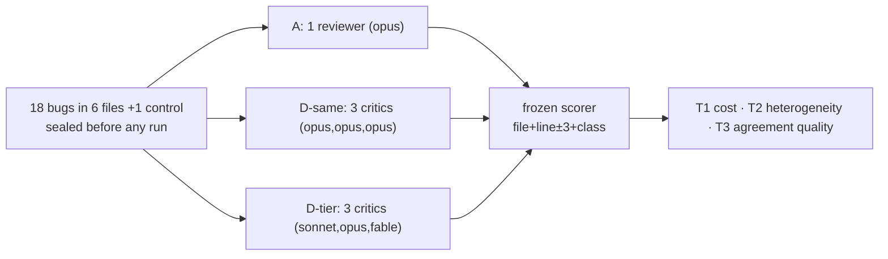

[Русская версия](README.ru.md) | [English version](README.md)

# Tier-diverse mini-experiment: do critics on different model tiers earn their keep?

> This directory is the complete, reproducible artifact set of **pre-registered** experiment 078
> — the empirical validation of the R3c tier-diverse escalation shipped in v3.20.7.
> (Technical report: [`docs/reviews/tier-diverse-experiment-078.md`](../../../docs/reviews/tier-diverse-experiment-078.md) · machine metrics: [`analysis.json`](analysis.json) · sibling experiment: [`../ab-corpus/`](../ab-corpus/).)
> Run date: 2026-06-10 · 147 agents · 2.35M tokens · ~17 minutes.

**Contents:**
[1. What this test is](#1-what-this-test-is) ·
[2. Why we ran it](#2-why-we-ran-it) ·
[3. How it works](#3-how-it-works) ·
[4. Results](#4-results) ·
[5. Three verdicts](#5-three-verdicts) ·
[6. Interpretation](#6-plain-language-interpretation) ·
[7. Limitations](#7-limitations) ·
[8. What it means for the framework](#8-what-it-means-for-the-framework) ·
[9. How to reproduce](#9-how-to-reproduce) ·
[10. Artifact map](#10-artifact-map)

---

## 1. What this test is

A focused follow-up to the main A/B experiment ([`../ab-corpus/`](../ab-corpus/)). Same seeded-bug method,
same pre-registration discipline (answer key hash-sealed before the first run, scoring rules frozen
before any data), but one narrow question with three arms instead of five.

Experiment 075 found that a committee of three critics **on the same model** doesn't earn its 3.25× cost:
it beat the best single reviewer by only +5.6pp recall, below the +10pp bar. The framework's response (R3c)
was a bet: critics on **different model tiers** are more independent, so a tier-diverse committee should find
more — and their *agreement* should be more trustworthy, earning a severity bump. This experiment tests that bet.

## 2. Why we ran it

R3c shipped in v3.20.7 as an explicit **pilot** — a documented config (`/vdd-multi --models=...`) plus a new
escalation rule (tier-diverse same-mechanism agreement earns +1 for CRITICAL/HIGH). The escalation rests
entirely on one unproven assumption: that cross-tier agreement is *better evidence* than same-tier agreement.
Theory supports partial independence within a model family (arXiv:2506.07962/2601.12307), but theory is not
this framework's pipeline on this framework's bugs. Shipping an escalation rule that inflates severity on a
false premise would manufacture false positives at scale. So the pilot had to be validated before being trusted.

Three things hung on the result: whether to keep the tier-diverse `+1` escalation, whether the `--models`
config is worth recommending at all, and whether model heterogeneity is the lever that finally makes committees
pay (the open thread from experiment 075).

## 3. How it works

Same four mechanisms as the main experiment ([`../ab-corpus/README.md` §3](../ab-corpus/README.md)): seeded bugs
with a sealed key, fresh context per run, a frozen scorer, and clean controls. Differences:

- **Fresh corpus** (the 075 corpus is burned — its arms have seen it). New domain (data-pipeline modules:
  CSV ingest, rate limiter, email queue, inventory, graph traversal, session store) so nothing carries over.
  6 seeded files + 1 control, **18 bugs** (6 logic / 6 security / 6 performance; 6 CRITICAL / 6 HIGH / 6 MEDIUM).
- **Three arms**, one variable each:

| Arm | What it is | Isolates |
|---|---|---|
| **A** | single reviewer, plain prompt, `opus` | the 075 best-value baseline |
| **D-same** | `/vdd-multi`, 3 critics all on `opus` | reproduces the same-model committee on the new corpus |
| **D-tier** | `/vdd-multi --models=logic:sonnet,security:opus,performance:fable` | three distinct tiers — the R3c config |

- **Three pre-registered rules** (fixed before any run):
  - **T1** — does the tier-diverse committee earn its cost vs the single reviewer? `recall(D-tier) − recall(A) ≥ +10pp` **and** FP/file no worse.
  - **T2** — does heterogeneity add over a same-model committee? `recall(D-tier) − recall(D-same) >` pooled run variance.
  - **T3** — is cross-tier *agreement* more truthful than same-tier? Compare **overlap precision**: of the same-location overlaps each committee produces, what fraction land on a real bug. **This is the metric the escalation bets on.**



## 4. Results

| Arm | recall μ (N=3) | var | pooled | FP/file | FP on controls (Σ3) | bikeshed % | overlap precision | tokens | time |
|---|---|---|---|---|---|---|---|---|---|
| **A** | 0.870 | 0.0048 | 0.944 | **5.14** | 14 | 17.6% | — | 464k | 1.1 min |
| **D-same** | 0.963 | 0.0007 | **1.000** | 7.95 | 18 | 7.2% | **0.726** (122/168) | 888k | 6.5 min |
| **D-tier** | **0.981** | 0.0007 | **1.000** | 10.05 | 27 | 7.3% | 0.664 (154/232) | 996k | 9.6 min |

Both committees found all 18 bugs pooled; the single reviewer missed only `g5-SEC` (log injection, the subtlest one).

```
Recall (mean over 3 reps; ████ = found out of 18)
A      ██████████████████████████░░░░  0.870   ← single opus
D-same █████████████████████████████░  0.963   ← 3× opus
D-tier █████████████████████████████▉  0.981   ← sonnet/opus/fable

False positives per file (lower = better)
A      ███████████████░              5.14   ← cleanest
D-same ███████████████████████░      7.95
D-tier ██████████████████████████████ 10.05  ← most noise

Overlap precision — are agreeing critics actually right? (higher = better)
D-same ████████████████████████████▉  0.726   ← same-tier agreement
D-tier ██████████████████████████░░░  0.664   ← cross-tier agreement IS WORSE
```

### Token accounting

Harness counters (raw in `results/wallclock.log`):

| Arm | Agents | Tokens | Tokens per found bug* | Wall-clock |
|---|---|---|---|---|
| A | 21 | 463,510 | ~27k | 1.1 min |
| D-same | 63 | 888,189 | ~49k | 6.5 min |
| D-tier | 63 | 996,215 | ~55k | 9.6 min |
| **Σ** | **147** | **2,347,914** | — | **~17 min** |

\* arm tokens / bugs found pooled. The committees pay ~2× per bug vs the single reviewer.

**Input/output split** (recovered from agent transcripts, 1,140 API calls; raw: `results/token_split.json`):

| Arm | Input | Output | Cache write | Cache read |
|---|---|---|---|---|
| A | 371,016 | 24,226 | 779,644 | 1,269,908 |
| D-same | 3,716 | 134,477 | 989,030 | 4,530,668 |
| D-tier | 4,559 | **340,811** | 1,224,926 | 4,458,404 |
| **Σ** | 379,291 | 499,514 | 2,993,600 | 10,258,980 |

Two observations: (1) the committee arms have almost-zero fresh input — each critic re-reads the same wrapper +
SKILL files, which are served from cache (4.5M cache reads at ~0.1× billing), so prompt caching is what keeps the
committee affordable. (2) D-tier emitted **2.5× the output** of D-same (340k vs 134k) — the `fable` performance
critic's verbose reasoning, the same cost driver seen in experiment 075. That verbosity buys +1.9pp recall and
*more, lower-quality* overlaps.

## 5. Three verdicts

| # | Question | Rule | Result | Verdict |
|---|---|---|---|---|
| **T1** | Tier-diverse committee earns its cost vs single? | recall ≥ +10pp **and** FP no worse | +11.1pp recall (clears the bar 075 failed!), **but FP 10.05 > 5.14** | ❌ **FAILS the conjunction** — wins recall by reporting more, not aiming better |
| **T2** | Heterogeneity adds over same-model committee? | Δrecall > run variance | +1.9pp (both already 100% pooled) | ⚠️ **technically yes, trivially** — a sliver of mean recall at +2.1 FP/file |
| **T3** | Is cross-tier *agreement* more truthful? | overlap precision | 0.664 < 0.726 | ❌ **NO — the decisive negative.** Cross-tier agreement is *less* precise |

## 6. Plain-language interpretation

- **The escalation premise failed.** R3c's `+1` exists because cross-tier agreement was *assumed* to be stronger
  evidence. The data says the opposite: tier-diverse critics produced **more** overlaps (232 vs 168) but a
  **smaller fraction were real** (66% vs 73%). More agreement, lower quality. Escalating severity on it would
  amplify false positives, not surface more real criticals.
- **But the config is genuinely useful.** D-tier reached the highest recall (0.981, 100% pooled) and cleared the
  +10pp recall bar that the same-model committee couldn't — on *this* corpus even D-same got +9.3pp (vs +5.6pp in
  075), because corpus-2's bugs are more semantic (the regex floor is ~0 here, vs 4/8 security in corpus-1).
- **The committee wins by volume, not aim.** Going A → D-same → D-tier, recall rises (0.87 → 0.96 → 0.98) but so
  does noise (FP/file 5.1 → 8.0 → 10.1). The extra bugs come bundled with extra false positives — the committee
  shouts more, and some of the shouting is right.
- **fable is the expensive verbose one, again.** D-tier's only structural difference from D-same is the model mix,
  and its 2.5× output is almost entirely the fable performance critic. It bought +1.9pp recall and worse precision.

## 7. Limitations

1. **Tier↔domain confound:** logic=sonnet (lowest), security=opus, performance=fable (highest) — recall blends
   tier with which domain got which model. The T3 overlap-precision result is more robust (it measures agreement
   quality across all overlaps), but the recall deltas are confounded.
2. **Same-vendor family only:** these are Claude tiers (partial independence by design). The gradation table's
   *cross-vendor* row (quasi-independent critics) is **untested** — it needs vendor adapters (roadmap item 6).
   T3's negative is evidence against the *tier* bet, not necessarily the *vendor* bet.
3. **Corpus-dependent lift:** committee value scales with how non-pattern the bugs are. Corpus-2 is more semantic
   than corpus-1, which is why committees helped more here.
4. **N=3, one corpus, deterministic merge in the scorer.** Low power; verdicts use pooled run variance, not
   significance tests (pre-registered that way).

## 8. What it means for the framework

A split verdict, recorded for the operator (changes are a separate cycle — experiment = evidence, not edits):

| R3c component | Verdict | Recommendation |
|---|---|---|
| `--models` config (tier-diverse spawn) | **useful** — highest recall, 100% pooled | keep as a coverage/recall opt-in |
| tier-diverse **+1 escalation** on agreement | **not supported** (T3 failed) | **demote** — treat tier-diverse same-mechanism overlaps as `corroborated`, not escalated, until stronger (ideally cross-vendor) evidence |

This is the VDD discipline working as designed: R3c shipped explicitly as a pilot, the validation ran, and the
data says demote. The genuine open question — whether *cross-vendor* critics (truly independent) earn the
escalation — stays blocked on item 6.

## 9. How to reproduce

Same recipe as [`../ab-corpus/README.md` §9](../ab-corpus/README.md), with a 3-arm shape:

1. **Write a fresh corpus** (never reuse a sealed one). 6 seeded files + 1 control, one bug per class per file,
   stratified by severity. Think like a saboteur: an unused header-index map, a `>` that should be `>=`, a raw
   `\r\n` header concat, a missing visited-guard in BFS.
2. **Anchor + seal:** unique substrings into `build_ground_truth.py` → `python3 build_ground_truth.py` →
   `ground_truth.json` + `seal.json`. Lines are anchor-derived; the build asserts the 6/6/6 stratification.
3. **Regex floor:** `run_audit.py files/ --output json` → `scan_floor.json` (here it found ~nothing — the bugs
   are semantic, which makes the committee comparison meaningful instead of regex-saturated).
4. **Run three arms:** A single `opus`; D-same three `opus` critics; D-tier `--models=logic:sonnet,security:opus,performance:fable`.
   Fresh agent per (file × run). Each critic gets the v3.20.5 evidence block (`tests: NOT RUN`). Verify
   `CLAUDE_CODE_SUBAGENT_MODEL` is unset — it silently flattens the tiers (and the framework downgrades to R3a when it sees it).
5. **Score:** `python3 analyze.py` → recall/FP/overlap-precision + the T1/T2/T3 verdicts. Never edit the scorer post-run.

Budget: ~147 agents, ~2.35M tokens, ~17 min. The two committee arms dominate; the single-reviewer arm is ~⅕ the cost.

## 10. Artifact map

| Artifact | What it is |
|---|---|
| `files/g1…g6_*.py` | 6 modules with 18 seeded bugs (roles in `.AGENTS.md`) |
| `files/ctrl_aggregate.py` | clean control (false-positive floor) |
| `ground_truth.json` | sealed key: file/line/class/severity of every bug |
| `seal.json` | sha256 seal of corpus + key, UTC-stamped (predates the first run) |
| `build_ground_truth.py` | key generator (anchor-derived lines) + 6/6/6 stratification self-check |
| `scan_floor.json` / `scan_summary.txt` | regex floor (≈ empty — bugs are semantic) |
| `analyze.py` | frozen scorer: matching, recall/FP/overlap-precision, T1/T2/T3 |
| `analysis.json` | full machine output of the scorer |
| `results/A/*.json` | 21 single-reviewer reports |
| `results/Dsame/<file>__r<k>/{logic,security,performance}.json` | 63 same-model critic reports |
| `results/Dtier/<file>__r<k>/{logic,security,performance}.json` | 63 tier-diverse critic reports |
| `results/wallclock.log` | per-arm timings and token totals |
| `results/token_split.json` | per-arm input/output/cache split (from agent transcripts) |

> ⚠️ **The corpus is sealed.** Any edit to `files/*` or `ground_truth.json` voids the seal: change → rebuild via
> `build_ground_truth.py` (new seal) → **discard all previous runs**. Cross-seal comparisons are invalid.
