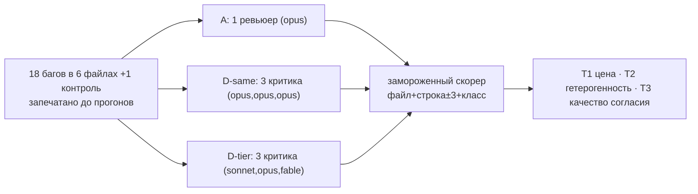

[Русская версия](README.ru.md) | [English version](README.md)

# Tier-diverse мини-эксперимент: окупают ли себя критики на разных тирах моделей?

> Каталог — полный, воспроизводимый набор артефактов **pre-registered** эксперимента 078,
> эмпирической проверки tier-diverse эскалации R3c, отгруженной в v3.20.7.
> (Технический отчёт: [`docs/reviews/tier-diverse-experiment-078.md`](../../../docs/reviews/tier-diverse-experiment-078.md) · машинные метрики: [`analysis.json`](analysis.json) · родственный эксперимент: [`../ab-corpus/`](../ab-corpus/).)
> Дата прогона: 2026-06-10 · 147 агентов · 2.35M токенов · ~17 минут.

**Содержание:**
[1. Что это за тест](#1-что-это-за-тест) ·
[2. Зачем делали](#2-зачем-делали) ·
[3. Принцип работы](#3-принцип-работы) ·
[4. Результаты](#4-результаты) ·
[5. Три вердикта](#5-три-вердикта) ·
[6. Расшифровка](#6-расшифровка-доступным-языком) ·
[7. Ограничения](#7-ограничения) ·
[8. Что это значит для фреймворка](#8-что-это-значит-для-фреймворка) ·
[9. Как повторить](#9-как-повторить) ·
[10. Карта артефактов](#10-карта-артефактов)

---

## 1. Что это за тест

Узкий follow-up к основному A/B-эксперименту ([`../ab-corpus/`](../ab-corpus/)). Тот же метод посеянных
багов, та же дисциплина pre-registration (ключ с ответами запечатан хешами до первого прогона, правила
скоринга заморожены до данных), но один точечный вопрос и три арма вместо пяти.

Эксперимент 075 показал: комитет из трёх критиков **на одной модели** не отбивает свою цену 3.25× —
он обогнал лучшего одиночного ревьюера всего на +5.6pp recall, ниже барьера +10pp. Ответом фреймворка
(R3c) стала ставка: критики на **разных тирах моделей** более независимы, поэтому tier-diverse комитет
должен находить больше, а их *согласие* — быть более достоверным и заслуживать повышения severity.
Этот эксперимент проверяет ставку.

## 2. Зачем делали

R3c отгрузили в v3.20.7 явным **пилотом** — задокументированный конфиг (`/vdd-multi --models=...`) плюс
новое правило эскалации (согласие tier-diverse критиков по одному механизму даёт +1 для CRITICAL/HIGH).
Эскалация целиком стоит на одном недоказанном допущении: что кросс-тирное согласие — *лучшее
доказательство*, чем одно-тирное. Теория поддерживает частичную независимость внутри семейства моделей
(arXiv:2506.07962/2601.12307), но теория — это не пайплайн этого фреймворка на его багах. Отгрузить
правило эскалации, раздувающее severity на ложной посылке, — значит штамповать ложные срабатывания в
масштабе. Поэтому пилот требовалось проверить, прежде чем ему доверять.

От результата зависели три вещи: оставлять ли tier-diverse `+1` эскалацию, стоит ли вообще рекомендовать
конфиг `--models` и является ли гетерогенность моделей тем рычагом, который наконец окупает комитеты
(открытый хвост из эксперимента 075).

## 3. Принцип работы

Те же четыре механизма, что в основном эксперименте ([`../ab-corpus/README.ru.md` §3](../ab-corpus/README.ru.md)):
посеянные баги с запечатанным ключом, свежий контекст на прогон, замороженный скорер, чистые контроли.
Отличия:

- **Свежий корпус** (корпус 075 сожжён — его армы его видели). Новая предметная область (модули
  data-pipeline: CSV-ингест, rate limiter, очередь писем, склад, обход графа, хранилище сессий), чтобы
  ничего не переносилось. 6 файлов с багами + 1 контроль, **18 багов** (6 logic / 6 security / 6 performance;
  6 CRITICAL / 6 HIGH / 6 MEDIUM).
- **Три арма**, по одной переменной на каждое сравнение:

| Арм | Что это | Что изолирует |
|---|---|---|
| **A** | один ревьюер, простой промпт, `opus` | бейзлайн «лучшее соотношение цены» из 075 |
| **D-same** | `/vdd-multi`, 3 критика все на `opus` | воспроизводит комитет одной модели на новом корпусе |
| **D-tier** | `/vdd-multi --models=logic:sonnet,security:opus,performance:fable` | три разных тира — конфиг R3c |

- **Три pre-registered правила** (зафиксированы до прогонов):
  - **T1** — окупает ли tier-diverse комитет цену против одиночки? `recall(D-tier) − recall(A) ≥ +10pp` **и** FP/файл не хуже.
  - **T2** — добавляет ли гетерогенность над комитетом одной модели? `recall(D-tier) − recall(D-same) >` дисперсии повторов.
  - **T3** — достовернее ли *согласие* кросс-тирных критиков, чем одно-тирных? Сравнить **точность пересечений**: из совпадений по локации, что делает каждый комитет, какая доля попадает в реальный баг. **Это та метрика, на которую ставит эскалация.**



## 4. Результаты

| Арм | recall μ (N=3) | var | pooled | FP/файл | FP на контролях (Σ3) | шум-стиль % | точность пересечений | токены | время |
|---|---|---|---|---|---|---|---|---|---|
| **A** | 0.870 | 0.0048 | 0.944 | **5.14** | 14 | 17.6% | — | 464k | 1.1 мин |
| **D-same** | 0.963 | 0.0007 | **1.000** | 7.95 | 18 | 7.2% | **0.726** (122/168) | 888k | 6.5 мин |
| **D-tier** | **0.981** | 0.0007 | **1.000** | 10.05 | 27 | 7.3% | 0.664 (154/232) | 996k | 9.6 мин |

Оба комитета нашли все 18 багов pooled; одиночка пропустил только `g5-SEC` (log injection, самый тонкий).

```
Recall (среднее по 3 повторам; ████ = найдено из 18)
A      ██████████████████████████░░░░  0.870   ← один opus
D-same █████████████████████████████░  0.963   ← 3× opus
D-tier █████████████████████████████▉  0.981   ← sonnet/opus/fable

Ложные срабатывания на файл (меньше = лучше)
A      ███████████████░              5.14   ← чище всех
D-same ███████████████████████░      7.95
D-tier ██████████████████████████████ 10.05  ← больше всего шума

Точность пересечений — а правы ли согласные критики? (больше = лучше)
D-same ████████████████████████████▉  0.726   ← одно-тирное согласие
D-tier ██████████████████████████░░░  0.664   ← кросс-тирное согласие ХУЖЕ
```

### Статистика токенов

Счётчики harness (сырьё в `results/wallclock.log`):

| Арм | Агентов | Токены | Токенов на найденный баг* | Wall-clock |
|---|---|---|---|---|
| A | 21 | 463 510 | ~27k | 1.1 мин |
| D-same | 63 | 888 189 | ~49k | 6.5 мин |
| D-tier | 63 | 996 215 | ~55k | 9.6 мин |
| **Σ** | **147** | **2 347 914** | — | **~17 мин** |

\* токены арма / багов найдено pooled. Комитеты платят за баг ~2× против одиночки.

**Разбивка вход/выход** (восстановлена из транскриптов агентов, 1140 API-вызовов; сырьё: `results/token_split.json`):

| Арм | Вход | Выход | Кеш-запись | Кеш-чтение |
|---|---|---|---|---|
| A | 371 016 | 24 226 | 779 644 | 1 269 908 |
| D-same | 3 716 | 134 477 | 989 030 | 4 530 668 |
| D-tier | 4 559 | **340 811** | 1 224 926 | 4 458 404 |
| **Σ** | 379 291 | 499 514 | 2 993 600 | 10 258 980 |

Два наблюдения: (1) у комитет-армов почти нулевой свежий вход — каждый критик перечитывает одни и те же
обёртку + SKILL-файлы, которые отдаются из кеша (4.5M кеш-чтений по ~0.1× тарифа), так что именно кеширование
промптов держит комитет доступным по цене. (2) D-tier выдал **в 2.5× больше выхода**, чем D-same (340k против
134k) — многословные рассуждения performance-критика на `fable`, тот же драйвер цены, что в эксперименте 075.
Эта многословность купила +1.9pp recall и *больше, но менее качественных* пересечений.

## 5. Три вердикта

| # | Вопрос | Правило | Результат | Вердикт |
|---|---|---|---|---|
| **T1** | Окупает ли tier-diverse комитет цену против одиночки? | recall ≥ +10pp **и** FP не хуже | +11.1pp recall (берёт барьер, который 075 провалил!), **но FP 10.05 > 5.14** | ❌ **ПРОВАЛ конъюнкции** — выигрывает recall объёмом, а не прицелом |
| **T2** | Добавляет ли гетерогенность над комитетом одной модели? | Δrecall > дисперсии | +1.9pp (оба уже 100% pooled) | ⚠️ **формально да, тривиально** — крупица recall ценой +2.1 FP/файл |
| **T3** | Достовернее ли *согласие* кросс-тирных критиков? | точность пересечений | 0.664 < 0.726 | ❌ **НЕТ — решающий негатив.** Кросс-тирное согласие *менее* точно |

## 6. Расшифровка доступным языком

- **Посылка эскалации провалилась.** R3c-`+1` существует потому, что кросс-тирное согласие *предполагалось*
  более сильным доказательством. Данные говорят обратное: tier-diverse критики дали **больше** пересечений
  (232 против 168), но **меньшая доля оказалась реальной** (66% против 73%). Больше согласия — ниже качество.
  Повышать severity на этом — раздувать ложные срабатывания, а не находить больше реальных криталов.
- **Но конфиг реально полезен.** D-tier взял наивысший recall (0.981, 100% pooled) и перешёл барьер +10pp,
  который комитет одной модели не смог — на *этом* корпусе даже D-same дал +9.3pp (против +5.6pp в 075),
  потому что баги корпуса-2 более семантические (регексный пол здесь ~0 против 4/8 security в корпусе-1).
- **Комитет выигрывает объёмом, не прицелом.** По цепочке A → D-same → D-tier recall растёт (0.87 → 0.96 → 0.98),
  но и шум тоже (FP/файл 5.1 → 8.0 → 10.1). Лишние баги идут в комплекте с лишними ложными находками —
  комитет громче кричит, и часть крика по делу.
- **fable снова дорогой и многословный.** Единственное структурное отличие D-tier от D-same — набор моделей,
  и его 2.5× выхода почти целиком — fable performance-критик. Это купило +1.9pp recall и худшую точность.

## 7. Ограничения

1. **Конфаунд тир↔домен:** logic=sonnet (низший), security=opus, performance=fable (высший) — recall смешивает
   тир с тем, какому домену какая модель досталась. Результат T3 (точность пересечений) устойчивее (он меряет
   качество согласия по всем пересечениям), но дельты recall конфаундированы.
2. **Только одно семейство вендора:** это тиры Claude (частичная независимость по дизайну). *Кросс-вендорная*
   строка таблицы градации (квази-независимые критики) **не проверена** — нужны адаптеры вендоров (item 6).
   Негатив T3 — свидетельство против ставки на *тир*, не обязательно против ставки на *вендора*.
3. **Зависимость от корпуса:** ценность комитета растёт с тем, насколько баги непаттерновые. Корпус-2
   семантичнее корпуса-1, поэтому комитеты здесь помогли сильнее.
4. **N=3, один корпус, детерминированное слияние в скорере.** Низкая мощность; вердикты на дисперсии повторов,
   не на p-value (так зафиксировано).

## 8. Что это значит для фреймворка

Раздельный вердикт, зафиксирован для оператора (правки — отдельный цикл; эксперимент = доказательство, не правки):

| Компонент R3c | Вердикт | Рекомендация |
|---|---|---|
| конфиг `--models` (tier-diverse спавн) | **полезен** — наивысший recall, 100% pooled | оставить как opt-in для полноты/покрытия |
| tier-diverse **+1 эскалация** на согласии | **не подтверждена** (T3 провалена) | **понизить** — трактовать tier-diverse согласие по одному механизму как `corroborated`, не эскалировать, до более сильных (в идеале кросс-вендорных) данных |

Это VDD-дисциплина в действии: R3c отгрузили явным пилотом, проверка прошла, данные говорят «понизить».
Настоящий открытый вопрос — окупают ли эскалацию *кросс-вендорные* критики (по-настоящему независимые) —
остаётся заблокирован на item 6.

## 9. Как повторить

Рецепт тот же, что в [`../ab-corpus/README.ru.md` §9](../ab-corpus/README.ru.md), но в форме 3 армов:

1. **Напишите свежий корпус** (запечатанный не переиспользуют). 6 файлов с багами + 1 контроль, по одному багу
   на класс в файл, со стратификацией по серьёзности. Думайте как вредитель: неиспользуемая карта индексов
   заголовка, `>` вместо `>=`, сырая конкатенация заголовка через `\r\n`, отсутствие visited-guard в BFS.
2. **Якоря + печать:** уникальные подстроки в `build_ground_truth.py` → `python3 build_ground_truth.py` →
   `ground_truth.json` + `seal.json`. Строки находятся по якорям; сборка ассертит стратификацию 6/6/6.
3. **Регексный пол:** `run_audit.py files/ --output json` → `scan_floor.json` (здесь он не нашёл почти ничего —
   баги семантические, что делает сравнение комитетов осмысленным, а не насыщенным регексами).
4. **Прогоните три арма:** A одиночный `opus`; D-same три `opus` критика; D-tier `--models=logic:sonnet,security:opus,performance:fable`.
   Свежий агент на каждую пару (файл × прогон). Каждый критик получает evidence-блок v3.20.5 (`tests: NOT RUN`).
   Проверьте, что `CLAUDE_CODE_SUBAGENT_MODEL` не установлен — он молча сплющивает тиры (и фреймворк понижает до R3a, когда его видит).
5. **Посчитайте:** `python3 analyze.py` → recall/FP/точность-пересечений + вердикты T1/T2/T3. Скорер после прогона не правят.

Бюджет: ~147 агентов, ~2.35M токенов, ~17 мин. Два комитет-арма доминируют; одиночка — ~⅕ цены.

## 10. Карта артефактов

| Артефакт | Что это |
|---|---|
| `files/g1…g6_*.py` | 6 модулей с 18 посеянными багами (роли в `.AGENTS.md`) |
| `files/ctrl_aggregate.py` | чистый контроль (фон ложных срабатываний) |
| `ground_truth.json` | запечатанный ключ: файл/строка/класс/серьёзность каждого бага |
| `seal.json` | sha256-печать корпуса и ключа + UTC-время (до первого прогона) |
| `build_ground_truth.py` | генератор ключа (строки по якорям) + self-check стратификации 6/6/6 |
| `scan_floor.json` / `scan_summary.txt` | регексный пол (≈ пусто — баги семантические) |
| `analyze.py` | замороженный скорер: сопоставление, recall/FP/точность-пересечений, T1/T2/T3 |
| `analysis.json` | полный машинный вывод скорера |
| `results/A/*.json` | 21 отчёт одиночного ревьюера |
| `results/Dsame/<файл>__r<k>/{logic,security,performance}.json` | 63 отчёта критиков одной модели |
| `results/Dtier/<файл>__r<k>/{logic,security,performance}.json` | 63 отчёта tier-diverse критиков |
| `results/wallclock.log` | тайминги и токены каждого арма |
| `results/token_split.json` | разбивка вход/выход/кеш по армам (из транскриптов агентов) |

> ⚠️ **Корпус запечатан.** Любая правка `files/*` или `ground_truth.json` обесценивает печать: изменить →
> пересобрать `build_ground_truth.py` (новый seal) → **выбросить все прежние прогоны**. Cross-seal сравнения невалидны.
