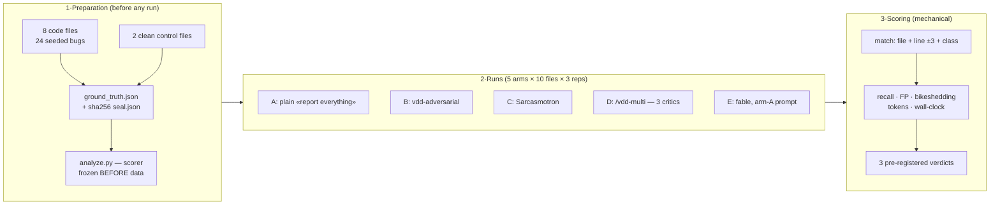

[Русская версия](README.ru.md) | [English version](README.md)

# A/B experiment: does an "angry critic" actually find more bugs?

> This directory is the complete, reproducible artifact set of **pre-registered** experiment 075
> (protocol: audit-067, Appendix A · technical report: [`docs/reviews/ab-experiment-075.md`](../../../docs/reviews/ab-experiment-075.md) · machine metrics: [`analysis.json`](analysis.json)).
> Run date: 2026-06-10 · 240 agents · 5.49M tokens · ~37 minutes.

**Contents:**
[1. What this test is](#1-what-this-test-is) ·
[2. Why we ran it](#2-why-we-ran-it) ·
[3. How it works](#3-how-it-works) ·
[4. Results](#4-results) ·
[5. Three verdicts](#5-three-verdicts-per-the-pre-fixed-rules) ·
[6. Interpretation](#6-plain-language-interpretation) ·
[7. Limitations](#7-limitations-declared-before-the-run) ·
[8. What the framework did](#8-what-the-framework-did-with-these-findings) ·
[9. How to reproduce](#9-how-to-reproduce) ·
[10. Artifact map](#10-artifact-map)

---

## 1. What this test is

A controlled benchmark of code-review strategies using the **seeded-bug** method — the same
methodology OpenAI used to validate CriticGPT (arXiv:2407.00215). Take code with a known number
of defects planted at known coordinates, hand it to several competing review strategies, and
count: who found how many, who invented how much noise, and what it cost.

Two things separate it from "we ran it and eyeballed the output". First, the answer key is
hash-sealed before the first run — nobody can peek at it or patch it after the fact. Second,
the survival rules for each strategy were fixed before any data existed. That is
pre-registration, a clinical-research standard applied to an engineering question: first you
write down "sarcasm stays only if its recall gain exceeds run variance AND its false-positive
rate is no worse", then you run. Interpreting the results reduces to plugging numbers into
inequalities. No room for "well, the committee felt stronger overall".

Five strategies ("arms"): a plain polite prompt, an adversarial critic, a sarcastic critic,
a committee of three specialized critics, and a single reviewer on a higher-tier model.
10 files, 3 repetitions, 240 agents, 5.5 million tokens.

## 2. Why we ran it

The framework is built around an adversarial-review culture. It ships an "angry critic" skill
(`vdd-adversarial`, K1), a sarcastic variant (`vdd-sarcastic`, K2 — the Sarcasmotron persona),
and the `/vdd-multi` workflow that unleashes three critics on the code in parallel. For years
all of this rested on two beliefs:

1. An angry reviewer finds more bugs than a polite one — "hostility punches through the model's trained politeness".
2. Three parallel critics find more than one strong reviewer — each has its own specialty.

The verification-stack audit (task 067) checked both beliefs against the literature and found
zero studies supporting them. It found the opposite: vendors now train sycophancy out of their
models (GPT-5, Opus 4.5/4.6 system cards), harsh judge prompts inflate false positives
(arXiv:2603.00539), and critics running on the same base model err in a correlated way — when
same-model pairs are wrong, they pick the same wrong answer ~60% of the time (arXiv:2506.07962).
But literature means other people's tasks and other people's prompts. Deciding the fate of our
own tools required numbers from our own pipeline.

Three decisions hung on the outcome: whether to delete `vdd-sarcastic` (roadmap item 5),
whether `/vdd-multi` stays the default review path (item 7/R3c), and whether investing in
model-heterogeneous critics is worth it. The stakes are real money: the committee burns 3.25×
tokens on every review.

## 3. How it works

The experiment stands on four mechanisms.

**Seeded bugs with a sealed key.** Eight realistic modules (~150 lines each: auth, payments,
file upload, cache, reports, search, queue worker, config) were hand-planted with 3 defects
apiece — one logic, one security, one performance. 24 total, severity-stratified: 8 CRITICAL,
8 HIGH, 8 MEDIUM. Each bug's coordinates (file, line, class, severity) live in
`ground_truth.json`; sha256 hashes of the corpus and the key are recorded in `seal.json` with
a UTC timestamp **before** the first agent ever ran. Two known-clean files complete the corpus —
they measure the noise floor: how many "problems" a reviewer reports where none exist.

**Variable isolation through arms.** Each comparison differs by exactly one variable, so a
metric delta reads as the effect of that variable:

| Comparison | What it isolates |
|---|---|
| B vs A | the adversarial methodology itself (same model, same prompt scaffold) |
| C vs B | sarcasm layered on top of adversarial (rule 1) |
| D vs best of A/E | a 3-specialist committee vs a single reviewer (rule 2) |
| E vs A | model tier under an identical prompt (fable vs opus) |

Arms A–D run on one model (opus — the tier pinned in the critic wrappers), arm E on fable.
Fresh context for every run, zero information flow between runs.

**Repetitions and two recall metrics.** Every arm passes every file three times (N=3): LLM
review is nondeterministic, and a single run is a lottery ticket. Mean recall shows the typical
run; pooled recall ("found in at least one of three") shows the strategy's ceiling. The variance
across the three repetitions is the very yardstick rule 1 uses to judge the recall gain.

**Mechanical scoring.** A finding counts if file, bug class, and line (±3 tolerance) all match:
reviewers often cite a neighboring line, the tolerance covers that, while the class-match
requirement stops a logic finding from "claiming" a security bug seeded two lines away. The
`analyze.py` scorer was written and frozen before the first result existed; the verdicts are
literally numbers plugged into three pre-written inequalities. Rule 2's +10pp threshold is a
practical-significance bar: a smaller gain cannot justify triple cost even on paper.

### Pipeline diagram



What was seeded (examples): an inverted session-expiry check, SQL injection via f-string,
`pickle.loads` on Redis bytes, an infinite retry caused by a counter reset inside the loop,
a cache with no eviction, a blocking `time.sleep` inside an async loop. Full per-file roles
are in `.AGENTS.md`, coordinates in `ground_truth.json`.

## 4. Results

| Arm | What it is | Recall (mean) | Pooled | FP/file | Style noise | Tokens | Time |
|---|---|---|---|---|---|---|---|
| **A** | plain "report everything, with confidence+severity" | **0.931** | 0.958 | 7.37 | 13.0% | 691k | 3.3 min |
| **B** | vdd-adversarial (neutral-hostile) | 0.861 | 0.917 | 6.20 | **3.9%** | 750k | 3.9 min |
| **C** | vdd-sarcastic (full Sarcasmotron) | 0.903 | 0.958 | **5.03** | 7.0% | 818k | 3.0 min |
| **D** | `/vdd-multi` — 3 parallel critics | **0.986** | **1.000** | 9.63 | 6.9% | 2,243k | 15.9 min |
| **E** | fable (one tier up), arm-A prompt | 0.917 | 0.917 | 10.33 | 19.5% | 990k | 10.8 min |

**Recall** — share of the 24 seeded bugs found. **Pooled** — found in at least one of 3 reps.
**FP/file** — findings outside the key (see the caveat in §7). **Style noise** — share of purely
stylistic nitpicks.

### Infographic

```
Recall (mean over 3 reps; ████ = found out of 24)
A  ████████████████████████████░░  0.931   ← plain prompt
B  ██████████████████████████░░░░  0.861   ← angry
C  ███████████████████████████░░░  0.903   ← sarcastic
D  ██████████████████████████████  0.986   ← 3 critics (pooled: 24/24)
E  ████████████████████████████░░  0.917   ← fable

False positives per file (lower = better)
C  ███████████████░          5.03   ← most precise
B  ███████████████████       6.20
A  ██████████████████████    7.37
D  █████████████████████████████   9.63
E  ███████████████████████████████ 10.33

Cost (thousands of tokens per full corpus pass)
A  █████████          691
B  ██████████         750
C  ███████████        818
E  █████████████      990
D  ██████████████████████████████  2,243   ← 3.25× arm A
```

### Token accounting: preparation and runs

Run numbers are exact (harness counters per workflow; raw lines in `results/wallclock.log`).

| Arm | Agents | Tokens | Per run | Budget share | Tokens per found bug* | Wall-clock | Tool calls |
|---|---|---|---|---|---|---|---|
| A | 30 | 690,818 | ~23k | 12.6% | ~30k | 3.3 min | 64 |
| B | 30 | 750,369 | ~25k | 13.7% | ~34k | 3.9 min | 95 |
| C | 30 | 818,433 | ~27k | 14.9% | ~36k | 3.0 min | 133 |
| E | 30 | 990,322 | ~33k | 18.0% | ~45k | 10.8 min | 97 |
| D | 120 | 2,243,187 | ~75k per (file×rep) | 40.8% | ~93k | 15.9 min | 483 |
| **Σ runs** | **240** | **5,493,129** | — | 100% | — | **36.9 min** | **872** |

\* arm tokens / bugs found at least once (pooled): cost per unit of value. The committee (D)
pays triple per bug versus the single reviewer (93k vs A's 30k) — the same story rule 2 tells,
just written as an expense report.

**Input/output breakdown** (recovered from the agents' jsonl transcripts — the usage block of
every API call; raw data: `results/token_split.json`):

| Arm | Input | Output | Cache write | Cache read | API calls |
|---|---|---|---|---|---|
| A | 529,996 | 60,197 | 1,099,605 | 1,599,795 | 158 |
| B | 794,900 | 52,392 | 1,274,889 | 1,997,480 | 190 |
| C | 1,059,832 | 74,249 | 1,572,341 | 2,657,761 | 236 |
| E | 804,030 | **515,041** | 2,538,757 | 5,380,245 | 341 |
| D | 1,310,646 | 445,157 | 3,673,714 | 9,625,685 | 999 |
| **Σ** | **4,499,404** | **1,147,036** | **10,159,306** | **21,260,966** | **1,924** |

Three observations:
- The harness counter in the main table ≈ input+output; the transcript-derived sum (5,646,440)
  differs by ~2.8% — the two counters are built slightly differently; transcripts are the
  primary source.
- Cache reads are billed at roughly 0.1× input rate, so the full API footprint including cache
  (37.1M tokens) costs not much more than the "bare" 5.6M. Without prompt caching this
  experiment would have been several times more expensive.
- fable (E) produced 515k output tokens — 8.5× arm A on the same files and the same prompt.
  Its cost driver is verbosity of reasoning, not input context. The same fact explains its
  3× wall-clock.

**Preparation** (corpus, key generator, scorer, regex floor) was orchestrator work in the main
session — the harness has no separate meter for it. The measurable part: the final artifacts
weigh ~60 KB ≈ **~15k tokens of net output** (corpus 33.6 KB ≈ 8k + tooling/key 26.7 KB ≈ 6k);
full preparation cost including drafts and reasoning is roughly 3–5× that — **on the order of
50–75k tokens**, i.e. ~1% of the run cost. Budget-planning takeaway: in a seeded-bug benchmark
the arms eat nearly everything — trim arm count and repetitions, never corpus quality.

## 5. Three verdicts (per the pre-fixed rules)

| # | Question | Rule (fixed before runs) | Result | Verdict |
|---|---|---|---|---|
| 1 | Is sarcasm (C) better than neutral-hostile (B)? | recall(C)−recall(B) > run variance **and** FP(C) ≤ FP(B) | +4.2pp, FP better | ✅ **SURVIVES** → `vdd-sarcastic` stays as an opt-in skin |
| 2 | Do three critics (D) repay 3× the cost vs the best single? | recall(D)−recall(best of A,E) ≥ **+10pp** with FP no worse | +5.6pp, FP worse, 3.25× cost | ❌ **NOT REPAID** → default = one strong reviewer; `/vdd-multi` for CI gates and max coverage |
| 3 | Is the "angry" prompt (B) better than the plain one (A)? | same as rule 1 | **−6.9pp** recall | ❌ **FAILS** → hostility taxes recall instead of boosting it |

## 6. Plain-language interpretation

- **The committee (D) is the most complete; the plain prompt (A) is the best value.** Three
  critics found everything (24/24, including the only catch of the no-eviction cache bug,
  f4-PER) but cost 3.25× and produced more noise. The plain prompt got 93% at a third of the price.
- **Hostility doesn't help finding — it helps staying quiet.** Arm B found the *least* of all,
  yet posted record-low style noise (3.9%) and fewer false positives. The adversarial skill is
  a **precision filter**, not a recall booster.
- **Sarcasm is the best version of hostility, and still not the best strategy.** C beat B
  (+4.2pp, best FP of all) — it passed formal rule 1. But the full recall ordering is
  **D > A > E > C > B**: both hostile skins sit below the plain polite "report everything".
- **A bigger model ≠ more bugs.** fable (E) on the same prompt: perfectly stable (3 reps,
  identical result), but recall below opus-A, more noise, 3× slower.
- **Everyone found the security bugs.** All 5 arms scored 8/8 on security and 8/8 on CRITICAL —
  classic patterns (injections, pickle, yaml.load) get caught by any approach. All differentiation
  between arms lives in the performance class. Half the security bugs are caught by plain regex
  (`run_audit.py`, see `scan_floor.json`) — one more argument for the two-layer audit model
  (deterministic floor + semantic pass, item 10).
- **Even on clean code, reviewers "find" 6–10 problems.** That is the background noise of any
  LLM review (see §7) — and the empirical case for the framework's bikeshedding filter and
  severity gates.

## 7. Limitations (declared before the run)

1. "FP" means "not in the seeded key", not "definitely wrong" — some findings are real but
   unseeded improvements (the classic caveat of CriticGPT-style seeded-bug methodology).
2. The bugs were seeded by the same model family that reviewed them (controls: key sealed
   before start, reviewers see only the code).
3. N=3 repetitions is too few for statistical significance; the rules operate on run variance,
   not p-values (fixed that way in the pre-registration).
4. The corpus's security class is "saturated" (the bugs are too classic) — this corpus says
   little about security-review deltas.
5. Arm D's report merging was done deterministically by script per Phase-2 rules (no recall
   impact: scoring uses the post-dedup union either way).

## 8. What the framework did with these findings

- `vdd-sarcastic` — **kept** as an opt-in stylistic skin (rule 1), disclaimer updated.
- `vdd-adversarial` (K1) — repositioned: a **precision tool** (lowest noise/FP); for
  recall-critical passes the plain exhaustive prompt is recommended (rule 3).
- `/vdd-multi` — repositioned: a **coverage and CI-gating tool**, not the default (rule 2).
  The remaining lever to repay the committee's cost is model-heterogeneous critics
  (roadmap 7/R3c).

## 9. How to reproduce

Not with this corpus — the arms have "seen" it, and any edit to `files/` voids the seal.
For a fresh round:

1. **Write the corpus.** 8–10 modules of 150–400 lines, clean at first. Then plant defects by
   hand — one per class per file, severity-stratified. Think like a saboteur with code-review
   experience: an inverted comparison, a reset counter, an f-string inside a SQL query. A bug
   must look like an honest mistake, not like a "bug here" signpost. Add 2 clean controls.
2. **Register anchors.** For every bug, put a unique substring of its line into the `BUGS`
   list inside `build_ground_truth.py`. Never count line numbers by hand: they shift after any
   edit; the script derives them from anchors and fails the build with an assert if the
   stratification doesn't add up.
3. **Seal it**: `python3 build_ground_truth.py` → `ground_truth.json` + `seal.json`.
   From that second on, `files/` is frozen.
4. **Record the regex floor**: `run_audit.py <corpus> --output json` → `scan_floor.json`.
   It shows what share of the key a deterministic scanner catches with no LLM at all — and
   gives the "scanner vs brains" attribution for the committee arm.
5. **Run the arms.** A fresh agent per (file × repetition) pair; one model within a comparison;
   arm prompts frozen before the start (ours live in the session-075 workflow scripts: A/E —
   neutral exhaustive, B/C — with the skills loaded, D — per `vdd-multi` Phase 1 with the
   evidence block). Before starting, verify `CLAUDE_CODE_SUBAGENT_MODEL` is unset — that
   variable silently overrides model pins.
6. **Score**: `python3 analyze.py`. The scorer is never edited after the first run — a new
   scoring idea means a new experiment, not a retroactive fix.

Budget for the 5-arm configuration: ~240 agents, ~5.5M tokens, about an hour with parallel
dispatch. A trimmed version (3 arms, N=3, no committee) costs a third of that and still answers
rules 1 and 3.

## 10. Artifact map

| Artifact | What it is |
|---|---|
| `files/f1…f8_*.py` | 8 modules with 24 seeded bugs (roles in `.AGENTS.md`) |
| `files/c1…c2_*.py` | 2 clean controls (false-positive floor) |
| `ground_truth.json` | Sealed key: file/line/class/severity of every bug |
| `seal.json` | sha256 seal of corpus + key, UTC-stamped (predates the first run) |
| `build_ground_truth.py` | Key generator (anchor-derived lines, never hand-counted) + stratification self-check |
| `scan_floor.json` / `scan_summary.txt` | The "regex floor": what run_audit.py finds without any LLM (4/8 security bugs) |
| `analyze.py` | Frozen scorer: matching, metrics, the mechanics of the three verdicts |
| `analysis.json` | Full machine output of the scorer (per-run splits, verdicts) |
| `results/{A,B,C,E}/*.json` | 120 single-reviewer reports (per file and repetition) |
| `results/D/<file>__r<k>/{logic,security,performance}.json` | 90 arm-D critic reports |
| `results/wallclock.log` | Per-arm timings and token totals |
| `results/token_split.json` | Per-arm input/output/cache split (aggregated from agent-transcript usage blocks) |

> ⚠️ **The corpus is sealed.** Any edit to `files/*` or `ground_truth.json` voids the seal:
> the procedure is change → rebuild via `build_ground_truth.py` (new seal) → **discard all
> previous runs**. Comparing arms across different seals is invalid.
