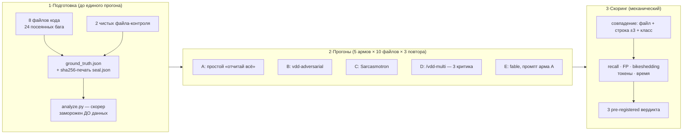

[Русская версия](README.ru.md) | [English version](README.md)

# A/B-эксперимент: помогает ли «злой критик» находить баги?

> Каталог — полный, воспроизводимый набор артефактов **pre-registered** эксперимента 075
> (протокол: audit-067, Appendix A · технический отчёт EN: [`docs/reviews/ab-experiment-075.md`](../../../docs/reviews/ab-experiment-075.md) · машинные метрики: [`analysis.json`](analysis.json)).
> Дата прогона: 2026-06-10 · 240 агентов · 5.49M токенов · ~37 минут.

**Содержание:**
[1. Что это за тест](#1-что-это-за-тест) ·
[2. Зачем делали](#2-зачем-делали) ·
[3. Принцип работы](#3-принцип-работы) ·
[4. Результаты](#4-результаты) ·
[5. Три вердикта](#5-три-вердикта-по-заранее-зафиксированным-правилам) ·
[6. Расшифровка](#6-расшифровка-доступным-языком) ·
[7. Ограничения](#7-ограничения-заявлены-до-прогона) ·
[8. Что сделал фреймворк](#8-что-фреймворк-сделал-с-этими-выводами) ·
[9. Как повторить](#9-как-повторить-эксперимент) ·
[10. Карта артефактов](#10-карта-артефактов)

---

## 1. Что это за тест

Контролируемый бенчмарк стратегий код-ревью методом **посеянных багов** — та же методология,
которой OpenAI валидировала CriticGPT (arXiv:2407.00215). Берём код, в котором заранее спрятано
известное число дефектов с известными координатами, отдаём его на ревью нескольким конкурирующим
стратегиям и считаем: кто сколько нашёл, сколько насочинял лишнего и во что это обошлось.

От обычного «прогнали и посмотрели» его отличают две вещи. Первая — ключ с ответами запечатан
хешами до первого прогона, подсмотреть или поправить его задним числом нельзя. Вторая —
правила «какая стратегия выживает» зафиксированы до получения данных. Это pre-registration,
стандарт клинических исследований, перенесённый на инженерный вопрос: сначала письменно
«сарказм оставляем, только если recall выше на величину больше дисперсии И ложных срабатываний
не больше», потом запуск. Интерпретация результатов сводится к подстановке чисел в неравенства.
Никакого «ну, в целом-то комитет себя показал».

Пять стратегий («армов»): простой вежливый промпт, злой критик, саркастичный критик, комитет
из трёх специализированных критиков, одиночка на модели классом выше. 10 файлов, 3 повтора,
240 агентов, 5.5 миллиона токенов.

## 2. Зачем делали

Фреймворк построен на культуре adversarial-ревью. В нём живут скилл «злого критика»
(`vdd-adversarial`, K1), его саркастичная версия (`vdd-sarcastic`, K2 — персонаж Sarcasmotron)
и воркфлоу `/vdd-multi`, который спускает на код трёх критиков параллельно. Всё это годами
держалось на двух убеждениях:

1. Злой ревьюер находит больше багов, чем вежливый, — «злость пробивает выученную вежливость модели».
2. Три параллельных критика находят больше, чем один сильный ревьюер, — у каждого своя специализация.

Аудит верификационного стека (задача 067) проверил оба убеждения по литературе и не нашёл
ни одного исследования в их пользу. Нашёл обратное: вендоры уже вытренировывают сикофантию
из моделей (системные карты GPT-5, Opus 4.5/4.6), жёсткие судейские промпты завышают долю
ложных находок (arXiv:2603.00539), а критики на одной базовой модели ошибаются коррелированно —
при ошибке пары одной модели выбирают один и тот же неверный ответ в ~60% случаев
(arXiv:2506.07962). Но литература — это чужие задачи и чужие промпты. Для решения о судьбе
своих инструментов нужны были числа со своего пайплайна.

От результата зависели три решения: удалять ли `vdd-sarcastic` (item 5 роадмапа), оставлять ли
`/vdd-multi` дефолтным путём ревью (item 7/R3c) и вкладываться ли в гетерогенность моделей
критиков. Цена вопроса ощутимая: комитет жжёт 3.25× токенов на каждое ревью.

## 3. Принцип работы

Эксперимент стоит на четырёх механизмах.

**Посеянные баги с запечатанным ключом.** В 8 реалистичных модулей (~150 строк каждый:
аутентификация, платежи, загрузка файлов, кеш, отчёты, поиск, воркер очереди, конфиг) руками
внесено по 3 дефекта — один логический, один security, один производительности. Итого 24,
стратифицировано по серьёзности: 8 CRITICAL, 8 HIGH, 8 MEDIUM. Координаты каждого (файл,
строка, класс, серьёзность) лежат в `ground_truth.json`; sha256-хеши корпуса и ключа записаны
в `seal.json` с UTC-меткой **до** первого запуска агентов. Плюс два заведомо чистых файла —
они меряют фон: сколько «проблем» ревьюер найдёт там, где их нет.

**Изоляция переменных через армы.** Каждое сравнение отличается ровно одной переменной,
поэтому разность метрик читается как эффект этой переменной:

| Сравнение | Что изолирует |
|---|---|
| B vs A | adversarial-методология как таковая (та же модель, тот же промпт-каркас) |
| C vs B | сарказм поверх adversarial (правило 1) |
| D vs лучший из A/E | комитет из 3 специалистов против одиночки (правило 2) |
| E vs A | класс модели при идентичном промпте (fable против opus) |

Армы A–D гоняются на одной модели (opus — та, что запинена в обёртках критиков), арм E — на
fable. Свежий контекст на каждый прогон, между прогонами никакого обмена информацией.

**Повторы и две метрики полноты.** Каждый арм проходит каждый файл трижды (N=3): LLM-ревью
недетерминировано, одиночный прогон — лотерея. Средний recall показывает типичный прогон;
pooled («найдено хотя бы в одном из трёх») — потолок стратегии. Дисперсия трёх повторов —
та самая линейка, с которой правило 1 сравнивает прибавку recall.

**Механический скоринг.** Находка засчитывается при совпадении файла, класса бага и строки
с допуском ±3: ревьюеры часто цитируют соседнюю строку, допуск это покрывает, а требование
совпадения класса не даёт логической находке «закрыть» соседний security-баг. Скрипт
`analyze.py` написан и заморожен до появления первого результата; вердикты — подстановка чисел
в три заранее записанных неравенства. Порог правила 2 (+10 процентных пунктов) — порог
практической значимости: меньшая прибавка не окупает тройную цену даже на бумаге.

### Схема пайплайна



Что именно посеяно (примеры): инвертированная проверка истечения сессии, SQL-инъекция через
f-string, `pickle.loads` из Redis, бесконечный retry из-за сброса счётчика внутри цикла, кеш
без вытеснения, блокирующий `time.sleep` в async-цикле. Полный список с ролями — в `.AGENTS.md`,
координаты — в `ground_truth.json`.

## 4. Результаты

| Арм | Что это | Recall (ср.) | Pooled | FP/файл | Шум-стиль | Токены | Время |
|---|---|---|---|---|---|---|---|
| **A** | простой «отчитай всё, с confidence+severity» | **0.931** | 0.958 | 7.37 | 13.0% | 691k | 3.3 мин |
| **B** | vdd-adversarial (нейтрально-злой) | 0.861 | 0.917 | 6.20 | **3.9%** | 750k | 3.9 мин |
| **C** | vdd-sarcastic (полный Sarcasmotron) | 0.903 | 0.958 | **5.03** | 7.0% | 818k | 3.0 мин |
| **D** | `/vdd-multi` — 3 параллельных критика | **0.986** | **1.000** | 9.63 | 6.9% | 2 243k | 15.9 мин |
| **E** | fable (модель уровнем выше), промпт A | 0.917 | 0.917 | 10.33 | 19.5% | 990k | 10.8 мин |

**Recall** — доля найденных посеянных багов (из 24). **Pooled** — найдено хотя бы в одном из
3 повторов. **FP/файл** — находки мимо ключа (см. оговорку в §7). **Шум-стиль** — доля чисто
стилистических придирок.

### Инфографика

```
Recall (средний по 3 повторам; ████ = найденные из 24)
A  ████████████████████████████░░  0.931   ← простой промпт
B  ██████████████████████████░░░░  0.861   ← злой
C  ███████████████████████████░░░  0.903   ← саркастичный
D  ██████████████████████████████  0.986   ← 3 критика (pooled: 24/24)
E  ████████████████████████████░░  0.917   ← fable

Ложные срабатывания на файл (меньше = лучше)
C  ███████████████░          5.03   ← самый точный
B  ███████████████████       6.20
A  ██████████████████████    7.37
D  █████████████████████████████   9.63
E  ███████████████████████████████ 10.33

Цена (тысячи токенов на полный проход корпуса)
A  █████████          691
B  ██████████         750
C  ███████████        818
E  █████████████      990
D  ██████████████████████████████  2 243   ← 3.25× арма A
```

### Статистика токенов: подготовка и проведение

Прогонные числа — точные (счётчики harness по каждому workflow, сырьё в `results/wallclock.log`).

| Арм | Агентов | Токены | На один прогон | Доля бюджета | Токенов на найденный баг* | Wall-clock | Tool-вызовов |
|---|---|---|---|---|---|---|---|
| A | 30 | 690 818 | ~23k | 12.6% | ~30k | 3.3 мин | 64 |
| B | 30 | 750 369 | ~25k | 13.7% | ~34k | 3.9 мин | 95 |
| C | 30 | 818 433 | ~27k | 14.9% | ~36k | 3.0 мин | 133 |
| E | 30 | 990 322 | ~33k | 18.0% | ~45k | 10.8 мин | 97 |
| D | 120 | 2 243 187 | ~75k на (файл×повтор) | 40.8% | ~93k | 15.9 мин | 483 |
| **Σ прогоны** | **240** | **5 493 129** | — | 100% | — | **36.9 мин** | **872** |

\* токены арма / число багов, найденных хотя бы раз (pooled): затраты на единицу пользы.
Комитет (D) платит за баг втрое дороже одиночки (93k против 30k у A) — это та же история,
что и вердикт правила 2, только в расходной ведомости.

**Разбивка вход/выход** (восстановлена из jsonl-транскриптов агентов — usage-блок каждого
API-вызова; сырьё: `results/token_split.json`):

| Арм | Вход | Выход | Кеш-запись | Кеш-чтение | API-вызовов |
|---|---|---|---|---|---|
| A | 529 996 | 60 197 | 1 099 605 | 1 599 795 | 158 |
| B | 794 900 | 52 392 | 1 274 889 | 1 997 480 | 190 |
| C | 1 059 832 | 74 249 | 1 572 341 | 2 657 761 | 236 |
| E | 804 030 | **515 041** | 2 538 757 | 5 380 245 | 341 |
| D | 1 310 646 | 445 157 | 3 673 714 | 9 625 685 | 999 |
| **Σ** | **4 499 404** | **1 147 036** | **10 159 306** | **21 260 966** | **1 924** |

Три наблюдения по разбивке:
- Счётчик harness из основной таблицы ≈ вход+выход; транскриптная сумма (5 646 440) расходится
  с ним на ~2.8% — счётчики устроены чуть по-разному, транскрипты первичнее.
- Кеш-чтение тарифицируется примерно в 0.1× от входа, так что полный API-футпринт с кешем
  (37.1M токенов) по деньгам недалеко ушёл от «голых» 5.6M. Без кеша эксперимент стоил бы
  в разы дороже.
- fable (E) выдал 515k выходных токенов — в 8.5 раза больше арма A на тех же файлах и том же
  промпте. Его цена — не входной контекст, а многословность рассуждений. Это же объясняет его
  wall-clock ×3.

**Подготовка** (корпус, генератор ключа, скорер, сканерный пол) делалась оркестратором в
основной сессии — harness её отдельным счётчиком не меряет. Измеримая часть: итоговые
артефакты весят ~60 КБ ≈ **~15k токенов чистого выхода** (корпус 33.6 КБ ≈ 8k + тулинг/ключ
26.7 КБ ≈ 6k); полная стоимость подготовки с черновиками и рассуждениями оценочно в 3–5 раз
выше — **порядка 50–75k токенов**, то есть ~1% от стоимости прогонов. Вывод для планирования
бюджета: в seeded-bug бенчмарке почти всё съедают армы, экономить имеет смысл на числе армов
и повторов, а не на качестве корпуса.

## 5. Три вердикта (по заранее зафиксированным правилам)

| # | Вопрос | Правило (зафиксировано до прогонов) | Результат | Вердикт |
|---|---|---|---|---|
| 1 | Сарказм (C) лучше нейтрально-злого (B)? | recall(C)−recall(B) > дисперсия повторов **и** FP(C) ≤ FP(B) | +4.2pp, FP лучше | ✅ **ВЫЖИВАЕТ** → `vdd-sarcastic` остаётся opt-in скином |
| 2 | Три критика (D) окупают 3× цену против лучшего одиночки? | recall(D)−recall(лучшего из A,E) ≥ **+10pp** при FP не хуже | +5.6pp, FP хуже, цена 3.25× | ❌ **НЕ ОКУПАЮТ** → дефолт = один сильный ревьюер; `/vdd-multi` — для CI-гейтов и максимального покрытия |
| 3 | «Злой» промпт (B) лучше простого (A)? | как правило 1 | **−6.9pp** recall | ❌ **ПРОВАЛ** → злость — налог на полноту, а не усилитель |

## 6. Расшифровка доступным языком

- **Самый полный — комитет (D), самый выгодный — простой промпт (A).** Комитет из трёх
  критиков нашёл всё (24/24, в т.ч. единственный взял баг «кеш без вытеснения» — f4-PER),
  но стоит 3.25× и шумит сильнее. Простой промпт взял 93% за треть цены.
- **Злость не помогает находить — она помогает молчать.** Арм B нашёл *меньше всех*, зато
  у него рекордно мало стилистического шума (3.9%) и меньше ложных находок. Adversarial-скилл —
  это **фильтр точности**, а не «дожималка» полноты.
- **Сарказм — лучшая версия злости, но не лучшая стратегия.** C обогнал B (+4.2pp, точнее всех
  по FP) — формальное правило 1 он прошёл. Но полный порядок recall: **D > A > E > C > B** —
  оба «злых» скина уступают простому вежливому «отчитай всё».
- **Модель покрупнее ≠ больше багов.** fable (E) на том же промпте: идеально стабилен
  (3 повтора — одинаковый результат), но recall ниже opus-A, шума больше, в 3 раза медленнее.
- **Security-баги нашли все.** Все 5 армов взяли 8/8 security и 8/8 CRITICAL — классические
  паттерны (инъекции, pickle, yaml.load) ловятся любым способом. Вся разница армов — в классе
  performance. Половина security-багов вообще ловится регексами (`run_audit.py`, см.
  `scan_floor.json`) — ещё один аргумент за двухслойную модель аудита (детерминированный пол +
  семантический проход, item 10).
- **Даже на чистом коде ревьюеры «находят» 6–10 проблем.** Это фон любого LLM-ревью
  (см. §7) — и эмпирическое обоснование bikeshedding-фильтра и severity-гейтов фреймворка.

## 7. Ограничения (заявлены до прогона)

1. «FP» = «не входит в посеянный ключ», а не «однозначно неправильно» — часть находок это
   реальные, но не посеянные улучшения (классическая оговорка seeded-bug методологии CriticGPT).
2. Баги сеяла та же семья моделей, что и ревьюила (контроль: печать ключа до старта, ревьюеры
   видят только код).
3. N=3 повтора — мало для статистической значимости; правила оперируют дисперсией повторов,
   не p-value (так и было зафиксировано).
4. Security-класс корпуса «насыщен» (слишком классические баги) — о дельтах security-ревью
   этот корпус говорит мало.
5. Слияние отчётов арма D выполнено детерминированно скриптом по правилам Phase 2 (на recall
   не влияет: считается объединение после дедупликации).

## 8. Что фреймворк сделал с этими выводами

- `vdd-sarcastic` — **сохранён** как opt-in стилистический скин (правило 1), дисклеймер обновлён.
- `vdd-adversarial` (K1) — перепозиционирован: **инструмент точности** (минимум шума/FP), для
  recall-критичных проходов рекомендован простой exhaustive-промпт (правило 3).
- `/vdd-multi` — перепозиционирован: **инструмент покрытия и CI-гейтов**, не дефолт (правило 2).
  Оставшийся рычаг «отбить» цену комитета — гетерогенность моделей критиков (roadmap 7/R3c).

## 9. Как повторить эксперимент

С этим корпусом — уже никак: армы его «видели», а любая правка `files/` обесценивает печать.
Для нового раунда процедура такая:

1. **Напишите корпус.** 8–10 модулей по 150–400 строк, сначала чистых. Потом внесите дефекты
   руками — по одному на класс в файл, со стратификацией по серьёзности. Думайте как вредитель
   с опытом код-ревью: инвертированное сравнение, сброшенный счётчик, f-string в SQL-запросе.
   Баг должен выглядеть как честная ошибка, не как подпись «здесь баг». Добавьте 2 чистых
   контроля.
2. **Заведите якоря.** Для каждого бага — уникальная подстрока его строки в список `BUGS`
   внутри `build_ground_truth.py`. Номера строк руками не считают: после любой правки файла
   они съезжают, скрипт находит их по якорям сам и валит сборку ассертом, если стратификация
   не сошлась.
3. **Запечатайте**: `python3 build_ground_truth.py` → `ground_truth.json` + `seal.json`.
   С этой секунды `files/` заморожены.
4. **Снимите регексный пол**: `run_audit.py <корпус> --output json` → `scan_floor.json`.
   Это покажет, какую долю ключа берёт детерминированный сканер без LLM, — и даст атрибуцию
   «сканер vs мозги» для комитета.
5. **Прогоните армы.** Свежий агент на каждую пару (файл × повтор); одна модель внутри
   сравнения; промпты армов фиксируются до старта (наши лежат в workflow-скриптах сессии 075:
   A/E — нейтральный exhaustive, B/C — со скиллами, D — по `vdd-multi` Phase 1 с
   evidence-блоком). Перед стартом проверьте, что `CLAUDE_CODE_SUBAGENT_MODEL` не установлен —
   эта переменная молча перекрывает пины моделей.
6. **Посчитайте**: `python3 analyze.py`. Скорер после первого прогона не редактируют —
   новая идея скоринга означает новый эксперимент, не «поправим задним числом».

Бюджет для конфигурации из 5 армов: ~240 агентов, ~5.5M токенов, около часа с параллельным
диспатчем. Урезанная версия (3 арма, N=3, без комитета) обходится втрое дешевле и всё ещё
отвечает на вопросы правил 1 и 3.

## 10. Карта артефактов

| Артефакт | Что это |
|---|---|
| `files/f1…f8_*.py` | 8 модулей с 24 посеянными багами (роли — в `.AGENTS.md`) |
| `files/c1…c2_*.py` | 2 чистых контроля (фон ложных срабатываний) |
| `ground_truth.json` | Запечатанный ключ: файл/строка/класс/серьёзность каждого бага |
| `seal.json` | sha256-печать корпуса и ключа + UTC-время (до первого прогона) |
| `build_ground_truth.py` | Генератор ключа (строки находит по якорям, не вручную) + self-check стратификации |
| `scan_floor.json` / `scan_summary.txt` | «Регексный пол»: что находит run_audit.py без LLM (4/8 security-багов) |
| `analyze.py` | Замороженный скорер: сопоставление, метрики, механика трёх вердиктов |
| `analysis.json` | Полный машинный вывод скорера (per-run разбивки, вердикты) |
| `results/{A,B,C,E}/*.json` | 120 отчётов одиночных ревьюеров (по файлу и повтору) |
| `results/D/<файл>__r<k>/{logic,security,performance}.json` | 90 отчётов критиков арма D |
| `results/wallclock.log` | Тайминги и токены каждого арма |
| `results/token_split.json` | Разбивка вход/выход/кеш по армам (агрегат usage-блоков из транскриптов агентов) |

> ⚠️ **Корпус запечатан.** Любая правка `files/*` или `ground_truth.json` обесценивает печать:
> процедура — изменить → пересобрать `build_ground_truth.py` (новый seal) → **выбросить все
> прежние прогоны**. Сравнивать армы между разными печатями нельзя.
